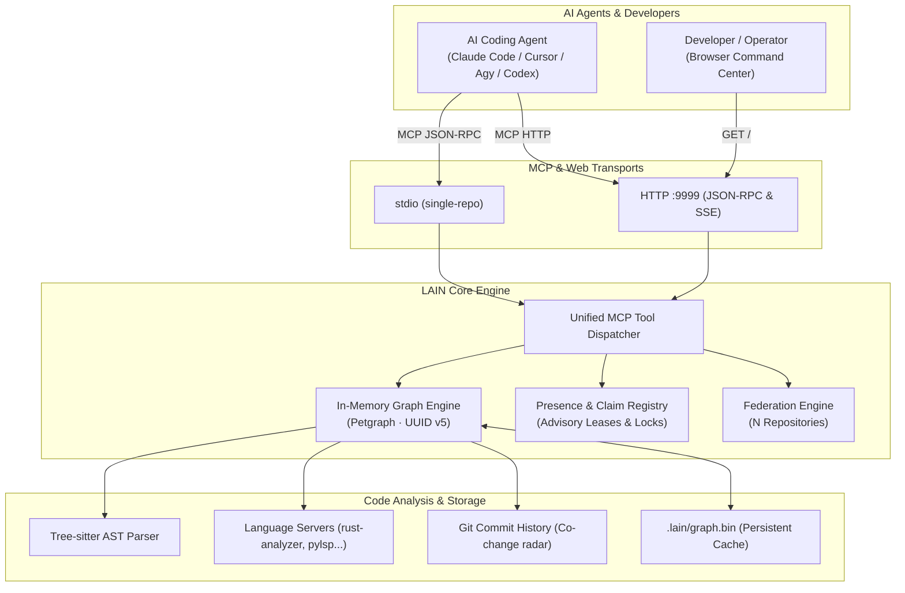

# LAIN-mcp

[](https://github.com/spuentesp/lain/actions/workflows/ci.yml)
[](https://safeskill.dev/scan/spuentesp-lain)
[](https://scorecard.dev/viewer/?uri=github.com/spuentesp/lain)
[](https://www.bestpractices.dev/projects/14660)
[](Cargo.toml)
[](https://github.com/spuentesp/lain/releases/latest)
[](docs/VERIFICATION.md)

> **Structural Code Intelligence & Multi-Agent Coordination for AI Assistants.**
> Give your coding agents an in-memory graph brain instead of making them guess from flat text.

---

## What is LAIN?

**LAIN** is a persistent, high-performance code intelligence and coordination engine built specifically for AI coding agents (Claude Code, Cursor, Copilot, Codex, Agy, Cline, Windsurf, etc.) over the **Model Context Protocol (MCP)**.

Instead of treating code as unstructured flat text or relying on fuzzy keyword searches, LAIN indexes your codebase into an in-memory, typed structural property graph (using Tree-sitter, language servers, and Git commit history). It then exposes a rich suite of deterministic MCP tools that allow AI agents to navigate, reason about, and modify complex codebases without hallucinations, blind edits, or context-window waste.

---

## See it run


- **Instant Answers**: Federation overview, repo health, and call graphs answered in milliseconds.
- **Hot Reload**: Edit `repos.yaml` or `workspaces.yaml`; the server updates live without dropping a single active MCP session.
- **Interactive Tool Console**: Exercise any MCP tool directly from the web browser; *Copy as cURL* gives agents and operators instant reproducibility.

> [!NOTE]
> The demo is kept as a single GIF so it plays inline without storing duplicate video encodings in the repository.

---

## How it fits together



1. **Indexing & Parsing**: LAIN scans your code using Tree-sitter and language servers (LSPs), extracting functions, classes, imports, and references into a property graph.
2. **Persistent Graph Store**: The graph is serialized into `.lain/graph.bin` using deterministically derived UUID v5 identifiers for instant reloads.
3. **Temporal Mining**: LAIN analyzes git commit logs to build a *co-change coupling radar* (identifying modules that evolve together even without explicit imports).
4. **Advisory Presence**: In-memory and on-disk occupancy registries track agent sessions and file claims, preventing overlapping edits in real time.
5. **Universal MCP Delivery**: Exposes standardized tools over stdio or HTTP so any MCP-compatible agent can query the graph directly.

---

## What can AI Agents ask LAIN?

LAIN provides specialized MCP tools categorized by capability:

### 1. Blast Radius & Dependency Tracing
- **`get_blast_radius`** — Downstream impact analysis: every function, type, and file affected by changing a symbol.
- **`get_call_chain`** — Shortest path between two functions in the call graph.
- **`trace_dependency`** — All upstream dependencies (callees, imports, types) of a target symbol.
- **`get_coupling_radar`** — Files that frequently change together based on Git commit co-occurrence.

### 2. Architectural Discovery & Navigation
- **`find_anchors`** — Identifies the core architectural pillars (most-called, most-stable symbols).
- **`list_entry_points`** — Discovers `main()`, HTTP routes, and event handlers.
- **`get_context_depth`** — Measures abstraction distance from public entry points.
- **`explore_architecture`** — High-level hierarchical module and package tree.

### 3. Multi-Agent Coordination ("Multiplayer Mode")
- **`register_agent` / `heartbeat`** — Registers an agent session and keeps advisory leases fresh.
- **`claim_files` / `release_files`** — Claims or releases files and symbol ranges before editing.
- **`detect_overlap`** — Analyzes overlapping symbol changes between git branches or concurrent sessions.
- **`list_active_agents` / `who_am_i`** — Discovers other active agents and reports session identity.

### 4. Search & Deep Graph Queries
- **`semantic_search`** *(requires ONNX model — see [Setting Up Semantic Search](#setting-up-semantic-search-optional))* — Concept-based code search using local ONNX embeddings with hybrid BM25/stemmed ranking.
- **`query_graph`** — Composable JSON ops pipeline (`find`, `connect`, `filter`, `semantic_filter`, `sort`, `limit`).
- **`explain_symbol`** — Complete structural dossier for a symbol (signature, callers, docstring, location).

### 5. Multi-Repo Federation
- **`list_repos` / `get_repo_info`** — Status, health, and size of all repos registered in `repos.yaml`.
- **`get_federation_health`** — Aggregate health counts, total node/edge counts, and a rough memory estimate across the federation.
- **`get_cross_repo_blast_radius`** — Cross-repository impact analysis when modifying a shared symbol.
- **`get_cross_repo_blast_radius_for_repo`** — Same as `get_cross_repo_blast_radius`, but the caller disambiguates the target repo by `repo_id` instead of by symbol resolution.
- **`search_org`** — Organization-wide symbol and code search across all registered repositories.

### 6. Code Health & Refactoring
- **`find_dead_code`** — Detects unreachable functions and unused symbols (excluding traits and tests).
- **`suggest_refactor_targets`** — Identifies brittle code (high-coupling, low-stability candidates).
- **`get_agent_strategy`** — Retrieves operational guidelines and strategic instructions for agents.
- **`get_world_state`** — Summarizes active sessions, file claims, and graph freshness in a single compact call.

---

## TL;DR — Install in 30 Seconds

```bash
# Install (interactive — adds `lain` to PATH)
curl -fsSL https://raw.githubusercontent.com/spuentesp/lain/main/install.sh | bash

# Reload your shell, then verify
source ~/.zshrc   # or ~/.bashrc
lain --version
```

See [QUICKSTART.md](docs/QUICKSTART.md) for Homebrew, manual builds, non-interactive flags, and ONNX model setups.

---

## Connecting Your AI Agent

### Claude Code
```bash
claude mcp add lain -- lain mcp
```

### Cursor / Windsurf
Add to your MCP configuration (`cursor settings > Features > MCP` or `mcp.json`):
```json
{
  "mcpServers": {
    "lain": {
      "command": "lain",
      "args": ["mcp"]
    }
  }
}
```

### Multi-Repo Server Mode (HTTP)
Run LAIN as a shared service across multiple repositories:
```bash
lain server --config ./repos.yaml --transport http --port 9999
```
Access the **Command Center UI** in your browser at `http://localhost:9999`.

---

## Command Center Dashboard

When `lain server` runs with `--transport http`, it serves the Command Center dashboard at `GET /`. It is a self-contained single-page application (SPA) that talks back to the running server over the same MCP JSON-RPC protocol.


- **Overview** — Real-time node/edge stats, memory footprint, and federation health.
- **Graph** — Interactive D3 force-directed visualizer of workspaces and symbol dependencies.
- **Repos** — Repository table showing health, path, and node/edge statistics.
- **Query** — Interactive query runner for `query_graph` traversals.
- **Tools** — Form-based MCP tool runner with auto-generated *Copy as cURL* snippets for quick testing.


---

## The CLI Commands

LAIN exposes the following CLI commands:

| Command | Purpose |
|---------|---------|
| `lain server` | Start the MCP server (the headline). Reads `repos.yaml`, serves MCP tools + the Command Center dashboard. Hot-reloads the config when it changes. |
| `lain mcp` | Single-repo MCP server on stdio. Walks up from cwd for `.git` — the stable "drop in a clone and run" entrypoint. No `repos.yaml` required. |
| `lain setup` | Guided onboarding: detects the repository and languages, optionally installs the semantic model, configures one MCP client (`--agent claude-code` shells to `claude mcp add`; `--agent generic` writes `.mcp.json`), and verifies the result with a real MCP round trip. `--dry-run` and `--print-config` change nothing. |
| `lain workspaces` | Manage `workspaces.yaml`. Create, list, show, activate (`use`), forget named groups of repos. |
| `lain repos` | Manage `repos.yaml`. Add, list, remove a repo entry. |
| `lain query` | Run a `query_graph` ops-array against the project's persisted graph. |
| `lain oneshot` | One-shot MCP query: boots a transient `lain mcp` server, sends a single `tools/call`, prints the result as a table, and exits. For "just grep the symbols without keeping a server alive". |
| `lain init` | Scaffold a `repos.yaml` for the current directory. Walks up for `.git`, then writes a minimal config pointing at the discovered workspace. |
| `lain ask` | Single-user LLM-assisted query (uses `semantic_search` when an embedding model is loaded; falls back to lexical heuristics via `explain_symbol`). |
| `lain hooks` | Agent pre-edit hook entry point: `claim` / `release` files, `overlap-check` for commit-time symbol overlap, `lock` / `unlock` for the zero-daemon filesystem-fallback layer. |
| `lain doctor` | Read-only repository diagnosis. Reports binary identity, persisted graph freshness, structural and optional semantic capability states, installation paths, and an MCP initialize/tools-list probe. Use `--json` for the versioned machine-readable report and `--workspace PATH` outside the target clone. Exit codes are 0 ready, 1 usable but degraded, and 2 unusable. |
| `lain capabilities` | Print the four canonical capability states and repository freshness. Add `--json` for agent-readable output. |
| `lain status` | Print aggregate repository, index, and MCP readiness. Add `--json` for the versioned status object. |
| `lain schema` | Emit the canonical tool-surface schema dump (`dump [--out PATH]` defaults to `./docs/tool-schema.json`). Pair with `make schema && git diff --exit-code docs/tool-schema.json` in CI to fail on schema drift. |
| `scripts/demo.sh` | Capability demonstration and benchmark. Boots a real server against a synthetic repo whose call graph is known by construction, checks lain's answers against that ground truth (not merely that it answered), then benchmarks the same tools against this repo at ~3.5k nodes. `--quick` skips the build and benchmark phases; `--json FILE` writes machine-readable results; `--force-build` overrides `--quick` / `--no-build`; `--allow-stale` skips the binary-freshness check. Exits non-zero if any check fails (or if the binary is older than any source file and `--allow-stale` was not passed). |

---

## Hot Reload

`lain server` monitors `repos.yaml` and `workspaces.yaml` and automatically updates its federation state when they change—without restarting the process or dropping active agent connections. Both manual file edits and CLI commands (`lain repos add ...`) communicate over a local Unix socket (`~/.local/lain/run/<repos-stem>.sock`) to rebuild the index diff atomically.

See [`docs/hot-reload.md`](docs/hot-reload.md) for full operational details.

---

## Documentation Index

| Doc | What's in it |
|---|---|
| **[`docs/QUICKSTART.md`](docs/QUICKSTART.md)** | Step-by-step 5-minute setup and quickstart |
| **[`docs/USER_MANUAL.md`](docs/USER_MANUAL.md)** | Comprehensive operator and agent manual |
| **[`docs/ARCHITECTURE.md`](docs/ARCHITECTURE.md)** | System design, graph layering, and technical rationale |
| **[`docs/TECHNICAL.md`](docs/TECHNICAL.md)** | Deep dive into internal modules and data structures |
| **[`docs/FEDERATION.md`](docs/FEDERATION.md)** | Multi-repo setup, org search, and cross-repo intelligence |
| **[`docs/REPOS_YAML.md`](docs/REPOS_YAML.md)** | Schema and options for `repos.yaml` |
| **[`docs/multiplayer.md`](docs/multiplayer.md)** | Multi-agent coordination, claims, and advisory locks |
| **[`docs/hooks.md`](docs/hooks.md)** | Git and editor pre-edit hook configuration |
| **[`docs/query-language.md`](docs/query-language.md)** | Syntax and operations reference for `query_graph` |
| **[`docs/quickstart-tools.md`](docs/quickstart-tools.md)** | Complete reference guide for all MCP tools |
| **[`docs/command-center.md`](docs/command-center.md)** | Features and usage of the web Command Center |
| **[`docs/INDEX.md`](docs/INDEX.md)** | Full documentation sitemap |

---

## Requirements & Optional Semantic Search

| Requirement | Details |
|---|---|
| **Rust** (build only) | 1.75 or newer |
| **Git** | Required for co-change coupling analysis |
| **ONNX Model** | Optional — required only for `semantic_search` |

### Setting Up Semantic Search (Optional)

For `semantic_search`, download an ONNX embedding model (or run `install.sh --download-model`):

```bash
mkdir -p .lain/models

# BAAI/bge-small-en-v1.5 (recommended — 384d, ~120MB)
curl -L https://huggingface.co/BAAI/bge-small-en-v1.5/resolve/main/onnx/model.onnx \
  -o .lain/models/model.onnx
curl -L https://huggingface.co/BAAI/bge-small-en-v1.5/resolve/main/tokenizer.json \
  -o .lain/models/tokenizer.json

export LAIN_EMBEDDING_MODEL=$PWD/.lain/models/model.onnx
```

For BGE-style asymmetric retrieval (optimized for short natural-language queries), configure the prefix in `.lain/tuning.toml`:

```toml
query_prefix = "Represent this sentence for searching relevant passages: "
```

*Note: If no embedding model is configured, `semantic_search` is filtered out of `tools/list` automatically so agents are never presented with an unusable tool. All graph, blast radius, navigation, and coordination tools function without an ONNX model.*

---

## MCP Transport Modes

| Mode | Command | Use Case |
|---|---|---|
| `stdio` | `lain mcp` or `lain server --transport stdio` | Claude Code, Cursor, MCP clients |
| `http` | `lain server --transport http --port 9999` | Command Center dashboard + curl-driven JSON-RPC |

---

## Troubleshooting

- **First-time setup issues?** See [QUICKSTART.md § First aid](docs/QUICKSTART.md#first-aid).
- **Run diagnostics**: `lain doctor` reports repository and MCP readiness without changing files; `lain doctor --json` emits the same result for scripts and agents.
- **Hand-edit not picked up?** The hot-reload watcher is non-recursive and uses atomic rename. Editing the file in place (`vim repos.yaml`) triggers a notify event within ~1 s. If you moved the file across directories, save it back into the project directory.
- **Repo stuck in `indexing` / `degraded` / `unavailable`?**
  ```bash
  curl -s -X POST http://localhost:9999/mcp \
    -H 'Content-Type: application/json' \
    -d '{"jsonrpc":"2.0","method":"tools/call","params":{"name":"get_federation_health","arguments":{}},"id":1}'
  ```
  The Command Center Overview tab displays these metrics live.
- **`run_build` / `run_tests` fail with "not found"?** Editor-launched MCP servers inherit environments that lack version-manager shims (rustup, nvm, pyenv, volta, asdf). LAIN searches known install locations automatically; to configure custom managers, see [`toolchains/README.md`](toolchains/README.md).
- **Answers look stale, or a symbol "doesn't exist" that clearly does?** Check `get_health`:
  - `Build:` shows the binary version and git SHA. MCP stdio processes are spawned once by the client and outlive source rebuilds; restart your editor/client to pick up a newly built binary.
  - `Status: Degraded ⚠` indicates indexing timed out. Set `LAIN_REINDEX_TIMEOUT=600` (defaults to 300s outer, 60s per-repo) to accommodate large working trees on cold cache.
- **Two agents not seeing each other?** Verify they share the same workspace. State is persisted under `~/.local/lain/state/`, and `list_active_agents` confirms shared visibility.
- **Force re-indexing**: Call `request_reload` via MCP or touch `repos.yaml`.

---

## Regenerating the Demo Video

The hero demo recording in `docs/screenshots/` can be re-recorded after UI changes:

```bash
make record-demo
```

Or run `npm run record-demo --prefix tests/js` for the Playwright driver (and `scripts/record-spa-demo.sh` for ffmpeg encoding). For offline fixture testing, run `make record-demo-small`.

---

## License

[MIT](LICENSE) — Copyright (c) 2026 spuentesp
