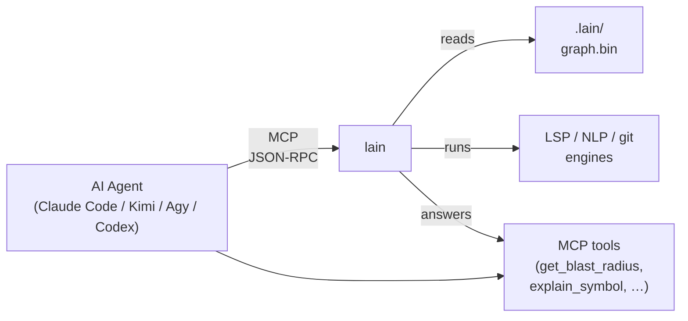
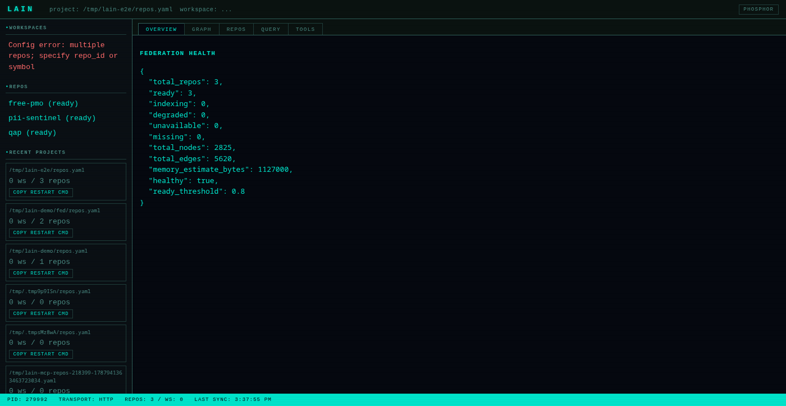
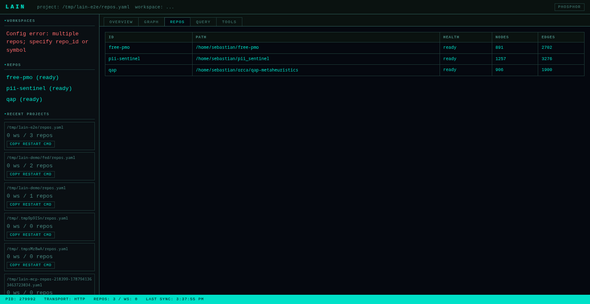

# LAIN-mcp

LAIN builds a map of how all the code in your project connects — what calls what, what depends on what, which files tend to change together. Then it lets your AI coding assistant ask questions about that map. So instead of the AI just looking at one file and guessing, it can ask "if I change this function, what else breaks?" and get a real answer. It plugs into any AI agent that supports MCP and runs in the background while you work.

## See it run


[Download MP4](docs/screenshots/spa-demo.mp4) · [Download WebM](docs/screenshots/spa-demo.webm)

- Federation overview, repo health, and the call graph — answered in well under a second.
- Edit `repos.yaml` from the Repos tab; the server hot-reloads without dropping a request.
- Try any MCP tool straight from the Tools tab; *Copy as cURL* hands the agent a shareable snippet.

> [!NOTE]
> The hero GIF is large (~4 MB) so it autoplays inline on GitHub. For sharper playback, the [MP4](docs/screenshots/spa-demo.mp4) and [WebM](docs/screenshots/spa-demo.webm) siblings sit alongside it in `docs/screenshots/`.

## How it fits together



`lain` is a long-running MCP server that indexes your code once and
keeps it fresh while you work. The agent speaks MCP (JSON-RPC over
stdio or HTTP); the server answers structural questions across one
repo (`lain mcp`) or many repos (`lain server --config repos.yaml`).

## Documentation

| Doc | What's in it |
|-----|--------------|
| **[`docs/QUICKSTART.md`](docs/QUICKSTART.md)** | Five-minute tour |
| **[`docs/USER_MANUAL.md`](docs/USER_MANUAL.md)** | Operator + agent manual |
| **[`docs/ARCHITECTURE.md`](docs/ARCHITECTURE.md)** | How and why — design rationale |
| **[`docs/TECHNICAL.md`](docs/TECHNICAL.md)** | Source-level internals |
| **[`docs/FEDERATION.md`](docs/FEDERATION.md)** | Multi-repo operating guide |
| **[`docs/REPOS_YAML.md`](docs/REPOS_YAML.md)** | `repos.yaml` schema |
| **[`docs/query-language.md`](docs/query-language.md)** | `query_graph` ops-array reference |
| **[`docs/quickstart-tools.md`](docs/quickstart-tools.md)** | All MCP tools |
| **[`docs/command-center.md`](docs/command-center.md)** | Command Center SPA |
| **[`docs/hot-reload.md`](docs/hot-reload.md)** | Config hot-reload |
| **[`docs/multiplayer.md`](docs/multiplayer.md)** | Multi-agent coordination |
| **[`docs/hooks.md`](docs/hooks.md)** | Pre-edit hooks |
| **[`docs/INDEX.md`](docs/INDEX.md)** | Docs index |

## TL;DR — install in 30 seconds

```bash
# Install (interactive — adds `lain` to PATH)
curl -fsSL https://raw.githubusercontent.com/spuentesp/lain/main/install.sh | bash

# Reload your shell, then verify
source ~/.zshrc   # or ~/.bashrc
lain --version
```

See [QUICKSTART.md](docs/QUICKSTART.md) for the full install matrix (Homebrew, build-from-source, non-interactive flags, ONNX model).

## What is Lain?

Lain is a persistent code-intelligence MCP server. The headline is
`lain server`: a long-running process that reads a `repos.yaml` config,
indexes every registered repository (locally, by clone, or by shallow
fetch), and answers structural questions across them through MCP
tools. The server also serves a Command Center dashboard at `GET /` for
humans who want to inspect the federation, edit the config, run
queries, and exercise the MCP tool surface directly.

The value over LSP-only or RAG-based approaches is cross-file
structural reasoning: agents can ask about blast radius, transitive
dependency traces, anchor identification, co-change correlation, and
contextual build failure decoration, so they reason about callers
rather than just the failing line. Written in Rust, persists across
sessions, and hot-reloads its `repos.yaml` / `workspaces.yaml` config
without a restart.

---

## The commands

After install, `lain` exposes these subcommands:

| Command | Purpose |
|---------|---------|
| `lain server` | Start the MCP server (the headline). Reads `repos.yaml`, serves MCP tools + the Command Center dashboard. Hot-reloads the config when it changes. |
| `lain mcp` | Single-repo MCP server on stdio. Walks up from cwd for `.git` — the stable "drop in a clone and run" entrypoint. No `repos.yaml` required. |
| `lain workspaces` | Manage `workspaces.yaml`. Create, list, show, activate (`use`), forget named groups of repos. |
| `lain repos` | Manage `repos.yaml`. Add, list, remove a repo entry. |
| `lain query` | Run a `query_graph` ops-array against the project's persisted graph. |
| `lain oneshot` | One-shot MCP query: boots a transient `lain mcp` server, sends a single `tools/call`, prints the result as a table, and exits. For "just grep the symbols without keeping a server alive". |
| `lain init` | Scaffold a `repos.yaml` for the current directory. Walks up for `.git`, then writes a minimal config pointing at the discovered workspace. |
| `lain ask` | Single-user LLM-assisted query (uses `semantic_search` when an embedding model is loaded; falls back to lexical heuristics via `explain_symbol`). |
| `lain hooks` | Agent pre-edit hook entry point: `claim` / `release` files, `overlap-check` for commit-time symbol overlap, `lock` / `unlock` for the zero-daemon filesystem-fallback layer. |
| `lain doctor` | "One version of truth" diagnostic. Checks binary version + git SHA, hook script presence, config/hooks dirs (reaping session files older than 30 days), presence registry, and — when `LAIN_URL`/`LAIN_SERVER_URL` is set — both server reachability **and the live MCP surface**, calling `tools/list` and failing if it errors or advertises zero tools. Exits 0 clean, 1 on a hard failure. |
| `lain schema` | Emit the canonical tool-surface schema dump (`dump [--out PATH]` defaults to `./docs/tool-schema.json`). Pair with `make schema && git diff --exit-code docs/tool-schema.json` in CI to fail on schema drift. |
| `scripts/demo.sh` | Capability demonstration and benchmark. Boots a real server against a synthetic repo whose call graph is known by construction, checks lain's answers against that ground truth (not merely that it answered), then benchmarks the same tools against this repo at ~3.5k nodes. `--quick` skips the build and benchmark phases; `--json FILE` writes machine-readable results; `--force-build` overrides `--quick` / `--no-build`; `--allow-stale` skips the binary-freshness check. Exits non-zero if any check fails (or if the binary is older than any source file and `--allow-stale` was not passed). |

The cut surface (`agents`, `hook`, `projects`, top-level `use`) is
gone — those concerns are reached through the commands above. `server`
plus the two config CLIs (`workspaces`, `repos`) cover everything the
prior surface did, scoped to a single project directory that owns a
`repos.yaml`.

This table is checked against `lain --help` by
`tests/cli_surface.rs`, so it cannot drift from the binary again.

---

## Quick Start

1. **Install** — see [QUICKSTART.md § Install](docs/QUICKSTART.md#install).
2. **Configure** — see [QUICKSTART.md § Federation (multi-repo)](docs/QUICKSTART.md#federation-multi-repo).
3. **Wire your agent** — see [QUICKSTART.md § Single-repo (recommended default)](docs/QUICKSTART.md#single-repo-recommended-default).

---

## Command Center

For a narrated tour of every tab, see [command-center.md § Tour](docs/command-center.md#tour).

When `lain server` runs with `--transport http`, it serves the Command
Center dashboard at `GET /`. It's a self-contained vanilla-JS SPA that
talks back to the running server over the same JSON-RPC endpoint the
MCP tools use. No separate API, no auth portal.



Tabs:

- **Overview** — `get_health` + `get_federation_health` in one view.
- **Graph** — D3 force-directed graph of the active workspace.
- **Repos** — per-repo table (id, path, health, node/edge counts).
- **Query** — runs `query_graph` against the federation.
- **Tools** — auto-generated MCP tool tester. Calls `tools/list`, then
  renders a form per tool by introspecting its `inputSchema`. *Copy as
  cURL* copies a `curl -X POST http://localhost:9999/mcp ...` snippet
  to the clipboard.



The status bar in the footer polls every 2 s for `get_server_status`
and `get_reload_status` so hand-edits to `repos.yaml` /
`workspaces.yaml` show up live.

See [`docs/command-center.md`](docs/command-center.md) for the full
walkthrough.

---

## Hot Reload

`lain server` watches `repos.yaml` and `workspaces.yaml` and rebuilds
its federation state when they change — no restart needed. Both the
`notify` watcher (for hand-edits) and the CLI (via `lain repos add`
or `lain workspaces create`) trigger the same `ReloadBus`.

When you run `lain repos add my-repo …`, the CLI writes the YAML
atomically (write to temp file, then `rename`), then signals the
running server over a Unix socket at
`~/.local/lain/run/<repos-stem>.sock`. The server's rebuild task
diffs the new file against the live federation and applies add / remove
operations against `FederatedIndex`. `get_reload_status` reports the
state (`idle` / `rebuilding` / `failed`); the Command Center status
bar shows it live.

See [`docs/hot-reload.md`](docs/hot-reload.md) for the full picture
(internals, observability, failure modes, caveats).

---

## Federation mode

For org-wide structural questions — "who else uses this function?",
"what depends on this service?" — run `lain server --config
./repos.yaml`. Federation mode exposes six MCP tools (`list_repos`,
`get_repo_info`, `get_federation_health`, `search_org`,
`get_cross_repo_blast_radius`,
`get_cross_repo_blast_radius_for_repo`) that answer questions
spanning repos. See [`docs/FEDERATION.md`](docs/FEDERATION.md) for the
full guide and [`docs/REPOS_YAML.md`](docs/REPOS_YAML.md) for the
config schema.

---

## Key Features

- **Federation mode** — index N repos and answer org-wide structural questions across them.
- **Command Center** — vanilla-JS SPA at `GET /` for human inspection, config editing, query running, and MCP tool testing.
- **Hot reload** — `repos.yaml` / `workspaces.yaml` changes apply without restarting the server.

### Query Language (`query_graph`)

JSON-based ops array for flexible graph traversals:

```json
{
  "ops": [
    { "op": "find", "type": "Function" },
    { "op": "connect", "edge": "Calls", "depth": { "min": 1, "max": 3 } },
    { "op": "filter", "label": "test" },
    { "op": "semantic_filter", "like": "error handling", "threshold": 0.35 },
    { "op": "limit", "count": 10 }
  ]
}
```

Available ops: `find`, `connect`, `filter`, `semantic_filter`, `group`,
`sort`, `limit`.

### Dependency Intelligence

- **`get_call_chain`** — Shortest path between two functions.
- **`get_blast_radius`** — Everything affected by a change.
- **`trace_dependency`** — What a symbol depends on.
- **`get_coupling_radar`** — Files that change together.

### Architectural Analysis

- **`find_anchors`** — Most-called, most-stable symbols (architectural pillars).
- **`list_entry_points`** — Find `main()`, route handlers, app initialization.
- **`get_context_depth`** — How far from an entry point (abstraction layers).
- **`explore_architecture`** — High-level tree of modules and files.

### Search

- **`semantic_search`** — Find code by meaning, not just names. Uses local ONNX embeddings with hybrid scoring (cosine similarity + stemmed token-overlap) and shows body excerpts in the response. BGE-small-en-v1.5 is the recommended model (better than MiniLM for technical corpora); use a query prefix to enable BGE-style asymmetric retrieval.

### Code Health

- **`find_dead_code`** — Potentially unreachable code (filters trait defaults, common names).
- **`suggest_refactor_targets`** — High-coupling, low-stability nodes.

### Project Management

A project is a directory containing `repos.yaml` (and optionally
`workspaces.yaml`). Manage it directly with the CLI:

- **`lain repos add <name> <url>`** — register a repo in `repos.yaml`.
- **`lain repos list`** — show registered repos.
- **`lain repos remove <name>`** — unregister a repo.
- **`lain workspaces create <name> --members a,b,c`** — declare a named workspace.
- **`lain workspaces list`** — show all workspaces.
- **`lain workspaces use <name>`** — activate a workspace (writes `~/.config/lain/active_workspace`).
- **`lain workspaces current`** — print the active workspace.
- **`lain workspaces forget <name>`** — remove a workspace.

## Where to go next

- Operate `lain` for a team → [USER_MANUAL.md](docs/USER_MANUAL.md)
- Federation operating guide → [FEDERATION.md](docs/FEDERATION.md)
- Full MCP tool reference → [quickstart-tools.md](docs/quickstart-tools.md)
- Command Center narrated tour → [command-center.md](docs/command-center.md)

---

## Requirements

| Requirement | Details |
|-------------|---------|
| Rust (build only) | 1.75 or newer |
| Git | Required for co-change analysis |
| ONNX Model | Optional — for `semantic_search` |

### Optional: Semantic Search

For `semantic_search` to work, you need an ONNX embedding model. The
easiest setup uses the provided install script with `--download-model`.
Otherwise, drop a model into `.lain/models/`:

```bash
mkdir -p .lain/models

# Option A: bge-small-en-v1.5 (recommended — better MTEB scores, 384d, ~120MB)
curl -L https://huggingface.co/BAAI/bge-small-en-v1.5/resolve/main/onnx/model.onnx \
  -o .lain/models/model.onnx
curl -L https://huggingface.co/BAAI/bge-small-en-v1.5/resolve/main/tokenizer.json \
  -o .lain/models/tokenizer.json

# Option B: all-MiniLM-L6-v2 (smaller, 384d, ~80MB)
curl -L https://huggingface.co/sentence-transformers/all-MiniLM-L6-v2/resolve/main/onnx/model.onnx \
  -o .lain/models/model.onnx
curl -L https://huggingface.co/sentence-transformers/all-MiniLM-L6-v2/resolve/main/tokenizer.json \
  -o .lain/models/tokenizer.json
```

Export the model path so the server picks it up:

```bash
export LAIN_EMBEDDING_MODEL=$PWD/.lain/models/model.onnx
```

For BGE-style asymmetric retrieval (better for short queries), set
the query prefix in `.lain/tuning.toml`:

```toml
query_prefix = "Represent this sentence for searching relevant passages: "
```

Without the model, `semantic_search` is filtered from `tools/list`
entirely. Other features still work. The binary drops the tool rather
than advertise one that always says "unavailable".

---

## MCP Transport Modes

| Mode | Command | Use Case |
|------|---------|----------|
| `stdio` | `--transport stdio` | Claude Code, MCP clients |
| `http` | `--transport http --port 9999` | Command Center dashboard + curl-driven MCP |

The HTTP transport is no longer combined with stdio in a single
`both` mode — start two `lain server` processes (or use the HTTP
transport and exercise tools via `curl` against `/mcp`).

---

## Troubleshooting

For first-time setup, see [QUICKSTART.md § First aid](docs/QUICKSTART.md#first-aid) before reading this section.

**Hand-edit not picked up?**

The hot-reload watcher is non-recursive and uses atomic rename.
Editing the file in place (`vim repos.yaml`) triggers a notify event
within ~1 s. If you've moved the file across directories, save it
back into the same directory.

**Repo stuck in `indexing` / `degraded` / `unavailable` / `missing`?**

```bash
# Check federation health
curl -s -X POST http://localhost:9999/mcp \
  -H 'Content-Type: application/json' \
  -d '{"jsonrpc":"2.0","method":"tools/call","params":{"name":"get_federation_health","arguments":{}},"id":1}'
```

The Command Center's Overview tab shows the same numbers in a single
view.

**Force a reload:**

```bash
curl -s -X POST http://localhost:9999/mcp \
  -H 'Content-Type: application/json' \
  -d '{"jsonrpc":"2.0","method":"tools/call","params":{"name":"request_reload","arguments":{}},"id":1}'
```

**View all available tools:**

```bash
curl -s -X POST http://localhost:9999/mcp \
  -H 'Content-Type: application/json' \
  -d '{"jsonrpc":"2.0","method":"tools/call","params":{"name":"get_agent_strategy","arguments":{}},"id":1}'
```

**`run_build` / `run_tests` fail with "not found"?**

The server inherits the environment of whatever launched it, and an
editor-launched MCP server usually has no version-manager shims on
`PATH`. lain searches the toolchain's known install locations (rustup,
nvm, pyenv, volta, mise, asdf and friends) before giving up, and the
error names every way to fix it. To teach it a manager it doesn't know,
add `program_dirs` / `program_resolver` to that toolchain's profile —
see [`toolchains/README.md`](toolchains/README.md).

**Answers look stale, or a symbol "doesn't exist" that clearly does?**

`lain mcp` blocks on the first re-index before its stdio loop comes
up, so the first tool call after `initialize` already sees a
populated graph (or `LAIN_REINDEX_TIMEOUT` was exceeded — see below).
The legacy "second call works, first doesn't" footgun is gone.

If you still see stale or missing symbols, check `get_health`:

- **`Build:`** tells you the version and git SHA of the process
  answering, and warns when a newer binary is on disk. An MCP stdio
  server is spawned once by its client and outlives every rebuild, so
  it can be older than your source tree — restart the client to pick up
  a new build.
- **`Status:`** reads `Degraded ⚠` when the last re-index failed OR
  timed out, which means "not in this graph", not "does not exist". A
  timeout banner means `LAIN_REINDEX_TIMEOUT` (default 300s) was too
  short for your working tree — raise it and restart.

**Two agents not seeing each other?**

They must share one workspace. Presence is exchanged through the state
file under `~/.local/lain/state/`, so agents on the same repo see each
other's claims even when each console spawned its own stdio server.
`list_active_agents` and `list_occupancy` are the quickest check.

---

## Regenerating the demo video

The hero recording above is checked in. Re-record it after any SPA change:

```bash
make record-demo
```

Or: `npm run record-demo --prefix tests/js` (runs only the Playwright driver;
you still need `scripts/record-spa-demo.sh` for the ffmpeg encoding pass).

For the offline (synthetic) fixture, run `make record-demo-small`.

---

## License

MIT — Copyright (c) 2026 spuentesp
