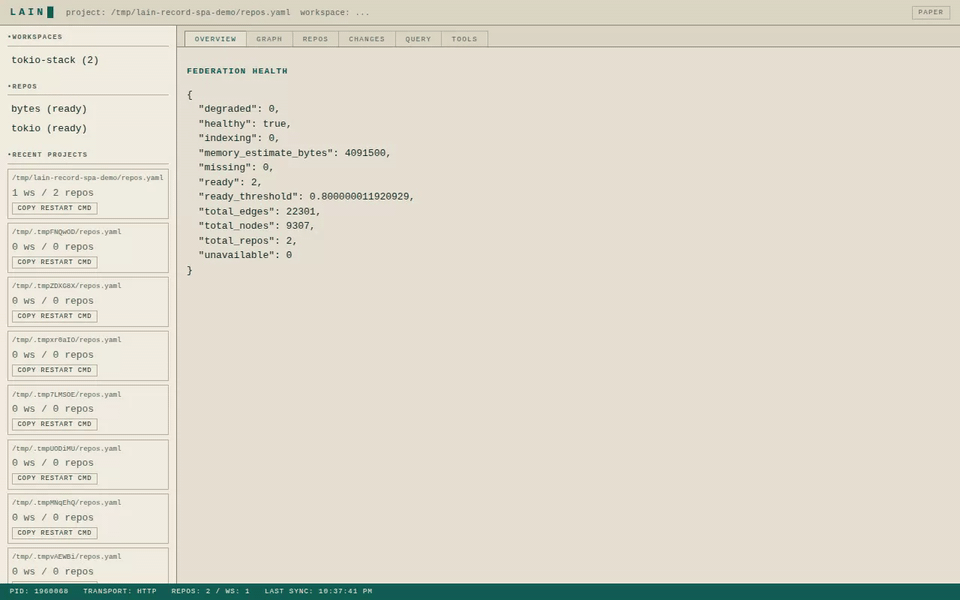
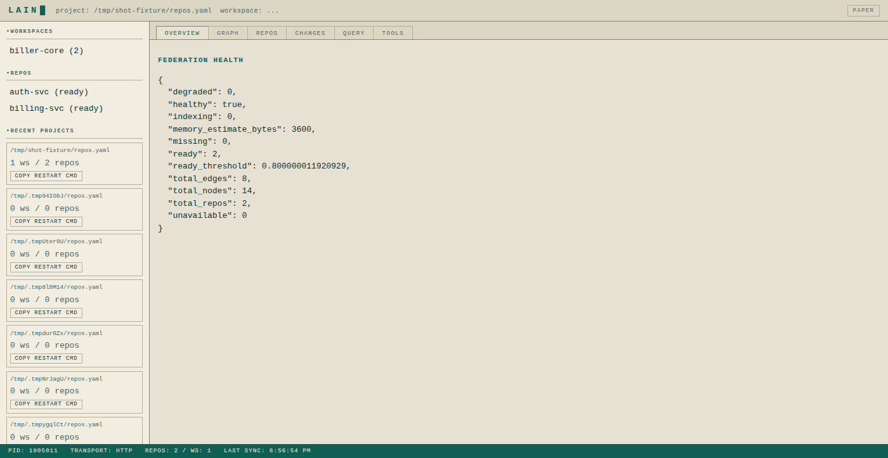
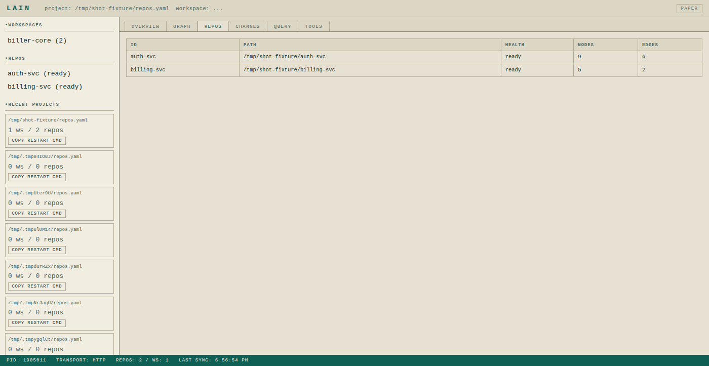

# Lain

**A code graph for coding agents.** Lain maps callers, dependencies, symbols,
and Git co-changes, then exposes them through the Model Context Protocol (MCP).
Before an agent edits a function, it can inspect what depends on it and how the
rest of the code reaches it.



The demo traces a symbol across the `bytes` and `tokio` repositories. Agents
query the same graph through MCP; the browser shows what Lain indexed and where
an answer came from.

Ask your agent:

```text
If I change validate_token, what breaks?
Show me the call chain from entry to helper_a.
Which files usually change with auth.rs?
Is another agent already editing this code?
```

Lain answers with symbol names and source paths from a local index. The index
stays on disk between runs, updates when the code changes, and can cover more
than one repository. Semantic search is optional; graph queries work without
an embedding model.

## Install

Using the release installer:

```bash
curl -fsSL https://raw.githubusercontent.com/spuentesp/lain/main/install.sh | bash
source ~/.zshrc   # or ~/.bashrc
lain --version
```

Rust 1.75 or newer is only needed when building from source. The
[quickstart](docs/QUICKSTART.md) covers non-interactive installation and the
optional local embedding model.

## Connect an agent

Run one setup command from the repository you want Lain to index:

```bash
lain setup --agent claude-code
lain setup --agent codex
lain setup --agent cursor
lain setup --agent vscode
lain setup --agent continue
```

---

## The commands

After install, `lain` exposes these subcommands:

| Command | Purpose |
|---------|---------|
| `lain server` | Start the MCP server (the headline). Reads `repos.yaml`, serves MCP tools + the Command Center dashboard. Hot-reloads the config when it changes. |
| `lain mcp` | Single-repo MCP server on stdio. Walks up from cwd for `.git` — the stable "drop in a clone and run" entrypoint. No `repos.yaml` required. |
| `lain workspaces` | Manage `workspaces.yaml`. Create, list, show, activate (`use`), forget named groups of repos. |
| `lain repos` | Manage `repos.yaml`. Add, list, remove a repo entry. |
| `lain query` | Run a `query_graph` ops-array against the project's persisted graph. |
| `lain oneshot` | One-shot MCP query: boots a transient `lain mcp` server, sends a single `tools/call`, prints the result as a table, and exits. For "just grep the symbols without keeping a server alive". |
| `lain init` | Scaffold a `repos.yaml` for the current directory. Walks up for `.git`, then writes a minimal config pointing at the discovered workspace. |
| `lain ask` | Single-user LLM-assisted query (uses `semantic_search` when an embedding model is loaded; falls back to lexical heuristics via `explain_symbol`). |
| `lain hooks` | Agent pre-edit hook entry point: `claim` / `release` files, `overlap-check` for commit-time symbol overlap, `lock` / `unlock` for the zero-daemon filesystem-fallback layer. |
| `lain doctor` | "One version of truth" diagnostic. Checks binary version + git SHA, hook script presence, config/hooks dirs (reaping session files older than 30 days), presence registry, and — when `LAIN_URL`/`LAIN_SERVER_URL` is set — both server reachability **and the live MCP surface**, calling `tools/list` and failing if it errors or advertises zero tools. Exits 0 clean, 1 on a hard failure. |
| `lain schema` | Emit the canonical tool-surface schema dump (`dump [--out PATH]` defaults to `./docs/tool-schema.json`). Pair with `make schema && git diff --exit-code docs/tool-schema.json` in CI to fail on schema drift. |
| `lain reindex` | Re-index the workspace from scratch. Backs up `<data_dir>/federated_graph.bin` to `federated_graph.bin.bak` and rebuilds every repo's per-repo graph plus the federation backend. Required after a federation schema version bump. With `--workspace <name>`, scopes the rebuild to that workspace's members. Idempotent. |
| `scripts/demo.sh` | Capability demonstration and benchmark. Boots a real server against a synthetic repo whose call graph is known by construction, checks lain's answers against that ground truth (not merely that it answered), then benchmarks the same tools against this repo at ~3.5k nodes. `--quick` skips the build and benchmark phases; `--json FILE` writes machine-readable results; `--force-build` overrides `--quick` / `--no-build`; `--allow-stale` skips the binary-freshness check. Exits non-zero if any check fails (or if the binary is older than any source file and `--allow-stale` was not passed). |

The cut surface (`agents`, `hook`, `projects`, top-level `use`) is
gone — those concerns are reached through the commands above. `server`
plus the two config CLIs (`workspaces`, `repos`) cover everything the
prior surface did, scoped to a single project directory that owns a
`repos.yaml`.

This table is checked against `lain --help` by
`tests/cli_surface.rs`, so it cannot drift from the binary again.

---

## Quick Start

1. **Install** — see [QUICKSTART.md § Install](docs/QUICKSTART.md#install).
2. **Configure** — see [QUICKSTART.md § Federation (multi-repo)](docs/QUICKSTART.md#federation-multi-repo).
3. **Wire your agent** — see [QUICKSTART.md § Single-repo (recommended default)](docs/QUICKSTART.md#single-repo-recommended-default).

---

## Command Center

For a narrated tour of every tab, see [command-center.md § Tour](docs/command-center.md#tour).

When `lain server` runs with `--transport http`, it serves the Command
Center dashboard at `GET /`. It's a self-contained vanilla-JS SPA that
talks back to the running server over the same JSON-RPC endpoint the
MCP tools use. No separate API, no auth portal.



Tabs:

- **Overview** — `get_health` + `get_federation_health` in one view.
- **Graph** — D3 force-directed graph of the active workspace.
- **Repos** — per-repo table (id, path, health, node/edge counts).
- **Query** — runs `query_graph` against the federation.
- **Tools** — auto-generated MCP tool tester. Calls `tools/list`, then
  renders a form per tool by introspecting its `inputSchema`. *Copy as
  cURL* copies a `curl -X POST http://localhost:9999/mcp ...` snippet
  to the clipboard.



The status bar in the footer polls every 2 s for `get_server_status`
and `get_reload_status` so hand-edits to `repos.yaml` /
`workspaces.yaml` show up live.

See [`docs/command-center.md`](docs/command-center.md) for the full
walkthrough.

---

## Hot Reload

`lain server` watches `repos.yaml` and `workspaces.yaml` and rebuilds
its federation state when they change — no restart needed. Both the
`notify` watcher (for hand-edits) and the CLI (via `lain repos add`
or `lain workspaces create`) trigger the same `ReloadBus`.

When you run `lain repos add my-repo …`, the CLI writes the YAML
atomically (write to temp file, then `rename`), then signals the
running server over a Unix socket at
`~/.local/lain/run/<repos-stem>.sock`. The server's rebuild task
diffs the new file against the live federation and applies add / remove
operations against `FederatedIndex`. `get_reload_status` reports the
state (`idle` / `rebuilding` / `failed`); the Command Center status
bar shows it live.

See [`docs/hot-reload.md`](docs/hot-reload.md) for the full picture
(internals, observability, failure modes, caveats).

---

## Federation mode

For org-wide structural questions — "who else uses this function?",
"what depends on this service?" — run `lain server --config
./repos.yaml`. Federation mode exposes six MCP tools (`list_repos`,
`get_repo_info`, `get_federation_health`, `search_org`,
`get_cross_repo_blast_radius`,
`get_cross_repo_blast_radius_for_repo`) that answer questions
spanning repos. See [`docs/FEDERATION.md`](docs/FEDERATION.md) for the
full guide and [`docs/REPOS_YAML.md`](docs/REPOS_YAML.md) for the
config schema.

---

## Key Features

- **Federation mode** — index N repos and answer org-wide structural questions across them.
- **Command Center** — vanilla-JS SPA at `GET /` for human inspection, config editing, query running, and MCP tool testing.
- **Hot reload** — `repos.yaml` / `workspaces.yaml` changes apply without restarting the server.

### Query Language (`query_graph`)

JSON-based ops array for flexible graph traversals:

```json
{
  "mcpServers": {
    "lain": {
      "command": "lain",
      "args": ["mcp"]
    }
  }
}
```

Restart the agent after setup. Lain walks up from the agent's working directory
to find `.git`, builds `.lain/graph.bin`, and serves the repository over stdio.
No `repos.yaml` is needed for one repository.

## First query

Ask the connected agent:

```text
Use Lain to show the blast radius of validate_token.
```

Or call the same tool from a terminal:

```bash
lain oneshot get_blast_radius validate_token
```

Use a symbol from your repository in place of `validate_token`. If the graph
isn't ready or an answer looks stale, run `lain doctor`.

## Multiple repositories

```bash
lain repos add bytes https://github.com/tokio-rs/bytes.git
lain repos add tokio https://github.com/tokio-rs/tokio.git
lain workspaces create tokio-stack --members bytes,tokio
lain server --config ./repos.yaml --transport http --port 9999
```

Open `http://localhost:9999` for the Command Center. Federation adds
organization-wide search and cross-repository blast-radius queries. The
[federation guide](docs/FEDERATION.md) covers configuration, source types, and
failure states.

## Check the graph

From a source checkout:

```bash
scripts/demo.sh --quick
```

The script creates a small repository with a known call graph, starts a real
Lain server, and compares the answers with that graph. It exits non-zero when a
check fails. A full run also records timings against this repository.

## What Lain provides

| Need | Tool or feature |
|---|---|
| See callers before changing a symbol | `get_blast_radius`, `assess_change` |
| Trace how two functions connect | `get_call_chain` |
| Find architectural entry points | `find_anchors`, `list_entry_points` |
| Search by name or meaning | `find_symbol`, `search_code` |
| Follow a symbol across repositories | `get_cross_repo_blast_radius`, `search_org` |
| Keep agents from editing the same code blindly | intents, presence, and advisory file claims |

Static analysis can't prove every dynamic call through a message bus, dependency
injection container, or reflective router. `explain_dispatch` combines static
callers with convention matches, runtime traces, and Git co-change evidence; an
empty result becomes `insufficient_evidence`, not a claim that the edit is safe.

## Documentation

| Start here | Covers |
|---|---|
| [Quickstart](docs/QUICKSTART.md) | Installation, first query, and first aid |
| [User manual](docs/USER_MANUAL.md) | CLI reference, tuning, operation, and troubleshooting |
| [Tool guide](docs/quickstart-tools.md) | MCP tools, arguments, outputs, and limits |
| [Federation](docs/FEDERATION.md) | Multi-repository configuration and queries |
| [Multiplayer](docs/multiplayer.md) | Agent presence, intents, claims, and hooks |
| [Architecture](docs/ARCHITECTURE.md) | Graph construction and design choices |
| [Documentation index](docs/INDEX.md) | Every maintained document |

## Project status

[](https://github.com/spuentesp/lain/actions/workflows/ci.yml)
[](https://safeskill.dev/scan/spuentesp-lain)
[](https://scorecard.dev/viewer/?uri=github.com/spuentesp/lain)
[](https://www.bestpractices.dev/projects/14660)
[](https://github.com/spuentesp/lain/releases/latest)
[](docs/VERIFICATION.md)

## License

[MIT](LICENSE) — Copyright (c) 2026 spuentesp
