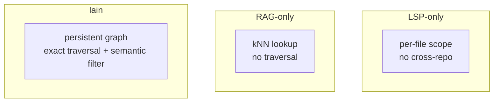
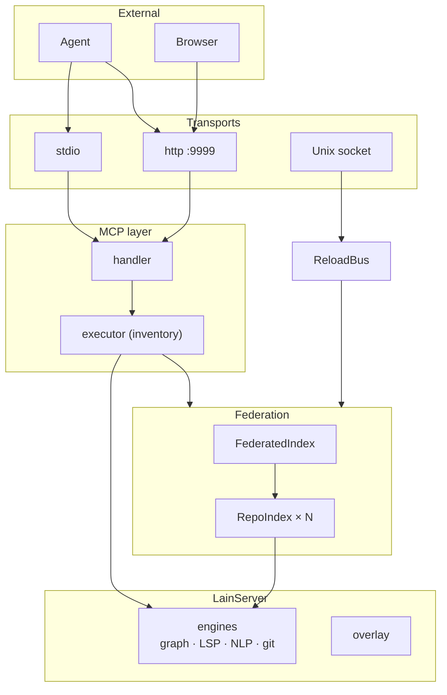
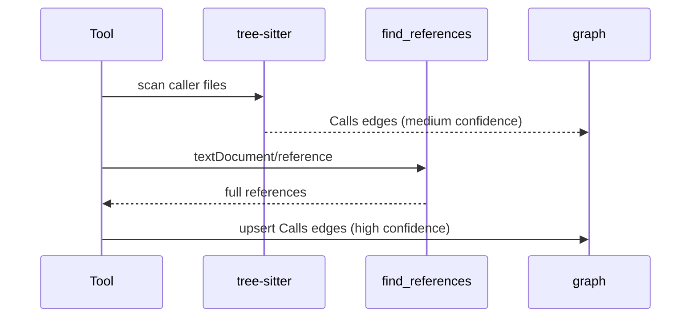
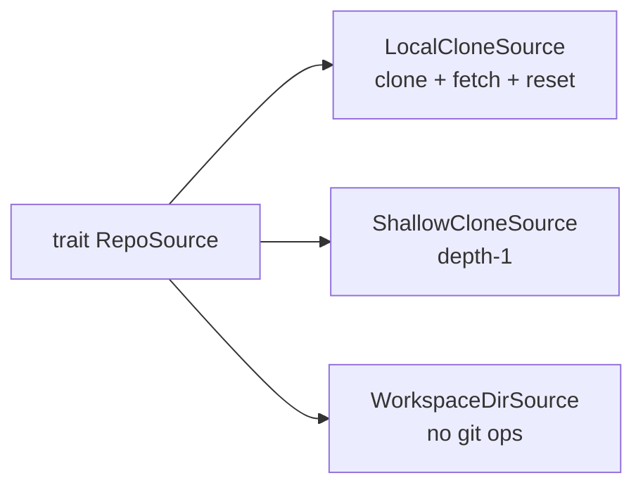
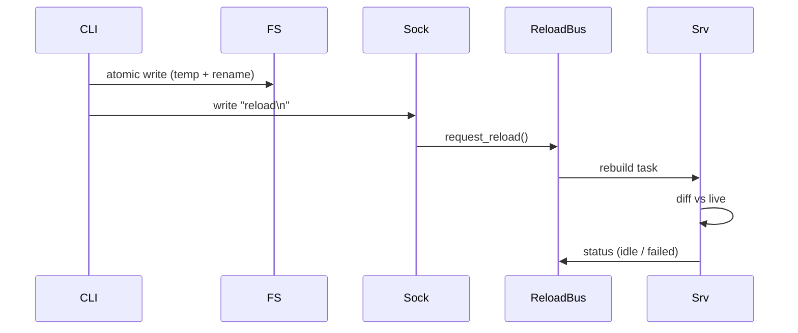
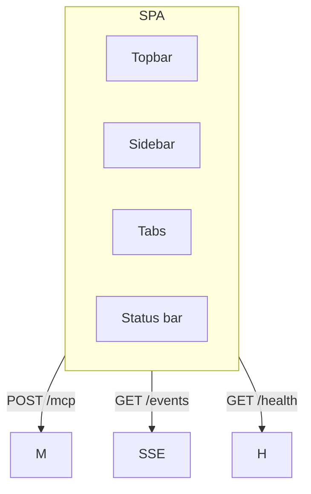
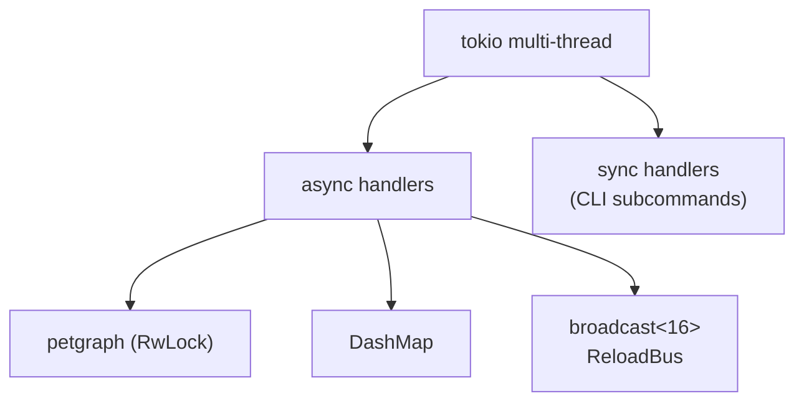

# Architecture

How `lain` is built and why each piece exists. Source-level detail
in [TECHNICAL.md](TECHNICAL.md); operating instructions in
[USER_MANUAL.md](USER_MANUAL.md).

## Why a persistent structural server, not LSP or RAG

Structural questions ("who calls this function across repos?") are
*graph queries*, not nearest-neighbour. "What does this function
semantically resemble?" *is* a kNN query. `lain` does both; the
tool choice tells the agent which question is being asked.

LSP gives file-precision; lain calls it as one *input* to its index.
RAG gives approximate search; lain uses ONNX for `semantic_filter`
only.

## System layering

- **MCP layer** — the only thing the agent sees. Free to refactor
  internally without breaking clients.
- **Federation layer** — optional. `lain mcp` goes around it through
  `LainServer::new` and shares every lower layer except the
  multi-repo orchestrator.

## Knowledge graph design

### Why a graph, not a relational store

Petgraph gives in-process BFS on a typed property graph. The
federation benchmark asserts p99 < 100 ms on 10 repos × 5k nodes —
a recursive CTE on a relational store would not meet that budget.
`GraphBackend` is a trait; `PetgraphBackend` is the only impl today;
`MemgraphBackend` is the deferred escape hatch.

### Why UUID v5 ids

Tools hand ids to other tools (`query_graph` returns nodes, you
pick one, `explain_symbol` looks it up). UUID v5 derived from
`(NodeType, FilePath, SymbolName, line_start?)` gives the same id
across runs, machines, and processes. `line_start` disambiguates
two same-named functions at different lines.

### Why percentile-normalized anchor scores

A raw `fan_in` ranking has two problems: unbounded growth across
reindexes, and the top symbol doesn't stand out. Two-pass
`calculate_anchor_scores` (`src/graph.rs`) normalizes within the
candidate set so the top symbol always scores 100. The search
formula `sim + weight × anchor` is then consistent regardless of
corpus size.

### Why the overlay exists

Without an overlay, an in-flight edit is invisible to the agent
until the next sync tick (30 s). The overlay sits *on top* of the
persistent graph — reads see `(persistent ∪ overlay)` with
overlay-precedence; writes go to overlay first; periodic sync
flushes in batches. Edits are visible the moment `notify` fires.

### `fan_in` vs `calls_in` — a deliberate footgun

`fan_in`/`fan_out` count every edge kind (including the `Contains`
edge each symbol has from its own file) — useless as "has no
callers". `calls_in`/`calls_out` count `Calls` edges only. The
correct choice depends on the question; folding them into one would
have been worse.

## Why LSP is in the loop

Tree-sitter finds *most* calls but misses trait dispatch, type
aliases, generics, macros, and re-exports. LSP `find_references`
catches all of these because the language server has done the full
type-resolution work.

The trade-off: per-language child processes, slower indexing, LSP
readiness required for high-confidence edges. When LSP isn't ready,
`Calls` edges degrade to heuristics and the tool still works with
caveats.

## Why an ONNX embedder, not a hosted model

- **Latency** — hosted round-trips on every query; local is
  sub-millisecond once loaded.
- **Privacy** — code is often sensitive.
- **Cost** — embedding a 100k-node corpus costs real money at
  hosted rates.

[ORT](https://onnxruntime.ai/) gives local CPU/GPU inference with
no Python dependency. The model isn't shipped because (a) it's
~120 MB and (b) users may want a different one.

### Why BGE over MiniLM

Better MTEB scores at the same dimension (384d) and roughly the
same size. The more subtle reason: BGE expects asymmetric retrieval
— queries carry an instruction prefix, corpus does not. The
embedder enforces this: `embed_query()` applies the prefix,
`embed()` never does. The convention was promoted to an invariant
in the API after two of three query paths had silently omitted it.

## Federation

Per-repo workers (each with its own LSP pool, petgraph, watcher)
project into one global petgraph via `project_repo()`, which re-keys
every per-repo node to `repo_id:NodeType:path:name` before it lands
globally. Result: no `File` / `Module` collisions across repos, no
central registry.

Three impls ship today, capturing the contract. Adding a fourth
(e.g. `GitWorktreeSource`) is a one-file change.

### The 1000-node blast-radius cap

Not a technical limit — petgraph handles 10⁶ fine. A response with
100k caller nodes is not actionable. When the cap is hit,
`truncated: true` is set; the caller narrows the seed or depth.
Enforced in `FederatedIndex::project_repo`, not the backend, so
the backend can answer more general queries.

## Hot reload

The alternative is "restart on every config change" — not
acceptable for a tool that answers 24/7.

Three signal sources → one bus → one rebuild task. Atomic because
partial writes must not be visible. Observable because the operator
needs to see *why* a reload failed. Cross-process because the CLI
signals the running server.

`request_reload` is also an MCP tool because hand-edits that move
the file across directories may be missed by `notify`.

## Multiplayer

Always-on in v0.5+. The cost of having it off (lost work,
conflicting edits) is greater than the cost of having it on (a
small presence registry on disk).

### Why advisory, not hard locks

A hard lock would mean "agent B cannot edit auth.rs while A holds
the lock". This is wrong — B may be editing a different line, or
adding a comment. The model is *advisory visibility*: `claim_files
(edit)` returns conflicts; `claim_files(read)` never does. Mirrors
how humans collaborate.

### Why cross-process via a state file

MCP stdio spawns one `lain mcp` per client session. Two agent
consoles on one repo = two server processes. They must share
presence. Before this, the file was only ever written and never
re-read: every claim was granted, no conflict was ever reported.
The fix is `re-read under lock` on every mutation — smallest
change that makes the coordination layer actually coordinate.

### Why attribution exists

If every agent always called `claim_files`, the attribution layer
would be unnecessary. They don't. Without attribution, in-flight
edits from a fresh-context or crashed agent are unattributed and
invisible to `list_occupancy`. The attribution layer (inotify +
`/proc/<pid>/fd` + single-agent fallback) gives those edits an
*inferred* claim with a short TTL. Wrong inferences expire;
correct ones become real claims when declared.

## MCP as the only contract

The MCP tools are the API. Nothing else is. Three consequences:

1. **Internal refactors are free.** On-disk format, embedder,
   federation structure — all can change without breaking agents.
2. **Schema must be honest.** `inputSchema` properties must be the
   actual arguments; the Command Center Tools tab is built by
   introspection.
3. **Errors must be readable.** `Missing required argument: symbol`,
   `Invalid depth: expected "<start>..<end>", got "<input>"`,
   `NotFound: symbol … not found in any repo`.

## Command Center

The SPA exists because the operator needs to *see* the federation.
MCP tools are an API; APIs are not UI.

Vanilla JS, ~1230 lines of JS (about 1.2k — `app.js` alone is 1234
lines), no build step. The aesthetic is "80s
console" (phosphor bloom, hairline borders, letterspaced uppercase
labels). Every colour lives in `theme.css` as a custom property;
both themes share one rule set.

The Tools tab is auto-generated from `tools/list`: adding a new
tool with an `inputSchema` makes it testable in the UI without JS
changes. This is the test that the input schema is honest.

## Persistence

### Why bincode for the graph

Petgraph's natural format. Fast, compact, lossless. Not
human-readable — run `lain schema dump` for the canonical tool-surface JSON, or call `describe_schema` for the node/edge schema.

### Why not SQLite

Recursive CTE on a 100k-node graph is slower than BFS on a
100k-node petgraph. The federation benchmark budget would not be
met.

### Why a separate presence state file

The graph is per-repo; presence is per-`--config`. Different
lifecycles. One file would mean re-serializing presence on every
graph mutation. The hash in the filename
(`<stem>-<hash>.json`) ensures two configs sharing a stem don't
collide.

## Concurrency

The binary is sync `main`; only `server` needs a tokio runtime.
Wrapping every subcommand in `#[tokio::main]` previously masked a
`reqwest::blocking` panic (`reqwest::blocking` builds its own
runtime; dropping a nested runtime from inside an outer `#[tokio::main]`
aborts the process).

`broadcast::channel<16>` is plenty for the typical subscriber count.
If a subscriber falls behind, `RecvError::Lagged` → "ask again on
next status poll". `parking_lot::Mutex` for short sync critical
sections; `tokio::sync::Mutex` for async-aware locks.

## Failure-mode philosophy

**Partial results over hard errors.** Federation comes up with a
`degraded` repo rather than refusing to start. Presence calls
proceed without the lock if it can't be acquired in 2 s. The tool
result contains an error message rather than a wire-protocol
failure.

A tool that occasionally loses a concurrent write is a nuisance; a
tool that can wedge an agent's tool call is a much worse failure.

Exceptions:

- **YAML parse error in `repos.yaml`** — server fails to start.
  Cost of bringing up a misconfigured federation is higher than
  the cost of refusing to start.
- **Token file write fails** — logged, call proceeds.

## Trade-offs

| Choice | Gained | Gave up |
|--------|--------|---------|
| Persistent petgraph over graph DB | In-process speed; no sidecar | Vertical scaling only |
| ONNX over hosted model | Privacy; latency; cost | Model selection is the user's problem |
| LSP for `Calls` over tree-sitter only | Type-resolution precision | Per-language child processes |
| Cross-process presence via state file | No sidecar | Lock contention shows up as p99 |
| Vanilla JS SPA over a framework | No build step; reads running server | Hand-maintained |
| `lain mcp` walks up for `.git` | "Just works" UX | Federation features unavailable |
| 1000-node blast-radius cap | Actionable responses | Deep traversals set `truncated: true` |
| Per-repo workers in federation | No name collisions | Cross-repo joins pay re-keying |
| Always-on multiplayer | Coordination for free | Small disk overhead |
| Inventory-collected tools | One-line registration | No static guarantee (mitigated by tests) |

## Deferred sub-projects

| # | Sub-project | Status |
|---|-------------|--------|
| 2 | Service Identity | No `Service` node type yet |
| 3 | IaC/schema ingestion | `Resource`/`Schema` types exist, no ingesters |
| 4 | Redundancy detection | Tokenized-signature heuristic; embedding pipeline will replace |
| 5 | Multi-tenancy | Single-tenant; `GraphBackend` leaves room for ACL |
| 6 | UI | MCP tools + Command Center; real UI is a separate project |
| 7 | Live PR overlay | File-watcher only; no PR polling |
| — | `MemgraphBackend` | Trait in place; deferred until corpus outgrows petgraph |
