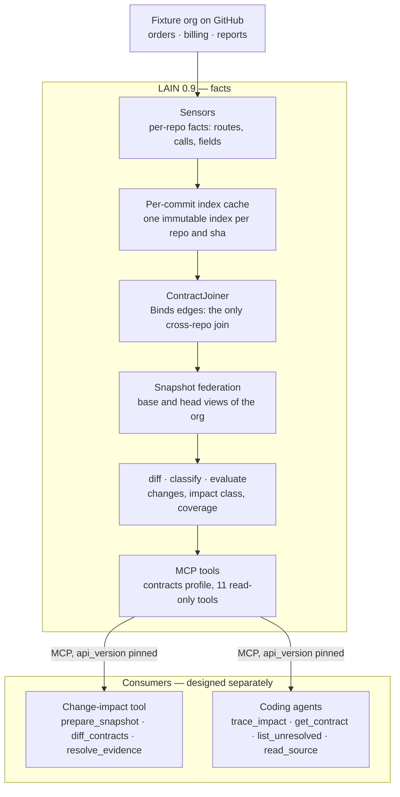
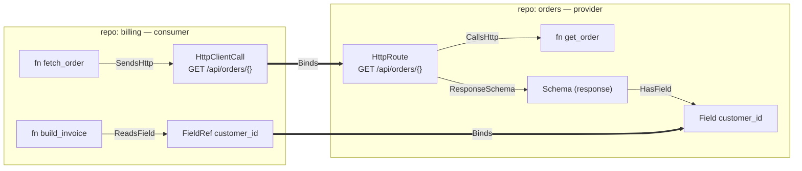
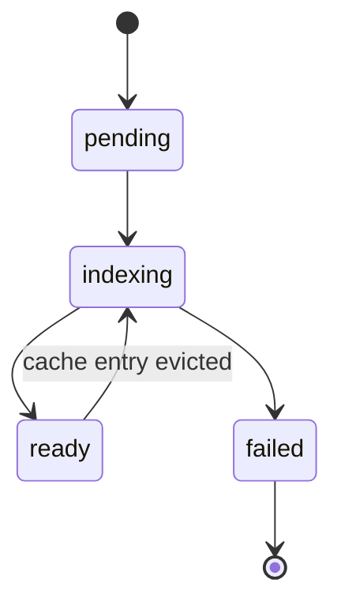
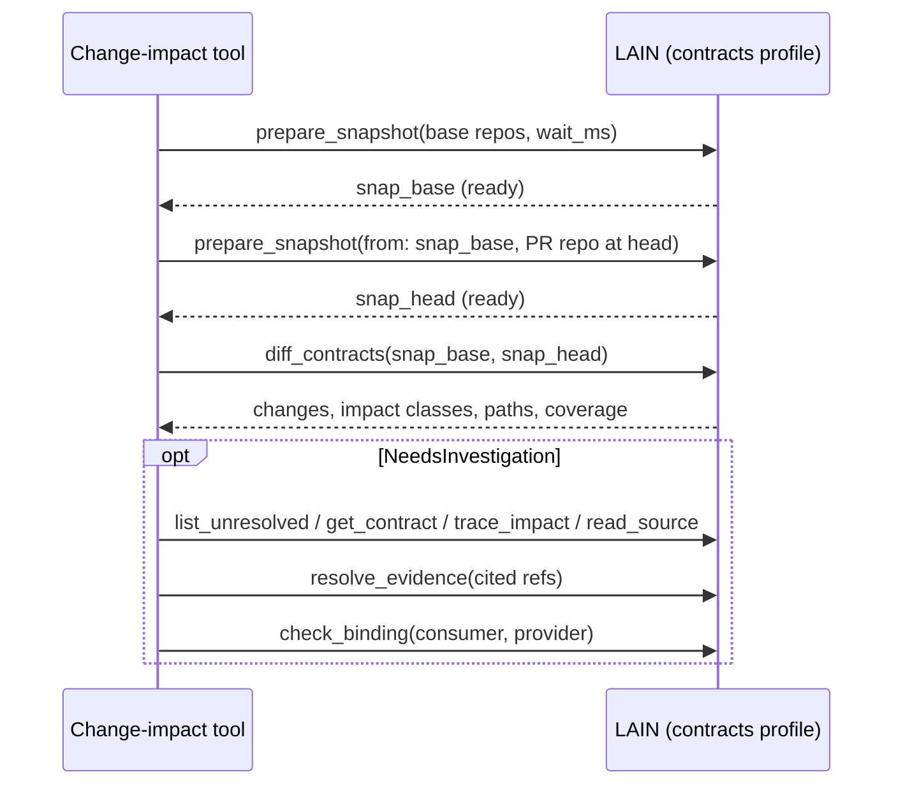

# LAIN Contract Federation — Design

Status: draft · 2026-09-28 · Target: LAIN 0.9.0 · Baseline: v0.8.0

Implementation progress is tracked in
[`CONTRACT_FEDERATION_TRACKER.md`](CONTRACT_FEDERATION_TRACKER.md).

## Summary

LAIN 0.9 adds contract-level federation and a versioned, read-only tool interface for change-impact analysis. It links HTTP consumers to providers across repositories, models request and response fields, indexes repos at pinned commits, and classifies a proposed change as Verified, NeedsInvestigation or NoKnownImpact, with an evidence path for every claim. A future change-impact tool consumes these tools; that tool is designed separately and appears here only as a basic flow.

**Problem.** A change to an endpoint or event payload can break consumers in other repositories. A repo-local coding agent cannot see them, and LAIN 0.8.0 joins repositories only through shared symbols, not through the contracts services actually talk over.

**Goals**

- Answer, for HTTP contracts: if this change lands, which code in which repositories is affected, and what proves it.
- Tie every impact claim to source locations at named commits.
- Never count a missing, stale or unindexed repository as unaffected.
- Expose all of it through a stable, versioned MCP interface that an external tool can build on without reading LAIN internals.
- Keep LAIN read-only and free of model, GitHub and findings concerns.

**Non-goals for 0.9 and the hackathon**

- The change-impact tool itself: findings storage, PR reporting, model investigation, deployment.
- Consumer-side detection for GraphQL, gRPC and WebSocket. Events are a stretch goal.
- Service discovery from Kubernetes or IaC. Service bindings come from `repos.yaml`.
- Runtime traffic as a required input. OpenTelemetry edges stay optional.

## Baseline: LAIN 0.8.0

Most of the org-level plumbing already exists. What is missing is the consumer side of contracts, field-level schemas, revision pinning and change classification. The findings below come from reading the v0.8.0 tag.

| Capability | State in 0.8.0 | Location |
| --- | --- | --- |
| Workspace, repo registry, readiness, freshness | Present | `federation/workspace.rs`, `manifest.rs`, `readiness.rs` |
| Federated identity | Present, but breaks on names containing `:` | `federation/repo_id.rs` (`GlobalId`) |
| Cross-repo symbol edges | Present: `Calls` via `CrossRepoResolver`, signature matching | `federation/cross_repo.rs`, `matching.rs` |
| HTTP providers | Present: `HttpRoute` + `CallsHttp` from code and OpenAPI | `sensors/http_sensor.rs`, `openapi_sensor.rs` |
| HTTP consumers | Missing: no client-call detection | none |
| Request and response schemas | Missing: OpenAPI parses paths and operationIds only | `sensors/openapi_sensor.rs` |
| Events | Declared only: `Topic`, `Produces`, `Consumes` are never emitted; `BusTopic` edges point at a synthetic hub | `schema.rs`, `dynamic_dispatch_sensor.rs` |
| Cross-repo impact | `Calls` only, one edge type per traversal, node list without paths | `mcp/federation_tools/federation.rs`, `graph_backend.rs` |
| Indexing at a commit | Missing: sources index the working tree or a branch tip | `federation/repo_source.rs` |
| Contract diff | Missing | none |
| MCP and command center | Present: tool registry with profiles, static command center | `mcp/`, `tools/handlers/registry_impl.rs` |
| Edge provenance | Present: `Static`, `Heuristic{detector, confidence}`, `Runtime` | `schema.rs` (`EdgeProvenance`) |

Three constraints in the current code shape the design and are handled in Foundational changes:

1. `GlobalId` is `repo:Kind:path:name:line` split on `:`, so route names such as `GET /orders/:id` produce wrong `name()` and line values.
2. `get_cross_repo_blast_radius` traverses incoming `Calls` only, and `GraphBackend::traverse` takes a single `EdgeType`.
3. `project_edges` retracts every edge sourced in the re-projected repo that the projection does not reproduce. Join edges depend on another repo's state, so that rule is order-dependent for them.

## Architecture

LAIN records facts about code and contracts and exposes them through exactly one interface: the versioned tools of the `contracts` profile. Everything that judges, reports or calls a model lives in consumers outside LAIN.



Facts flow down LAIN's pipeline and cross the boundary once, through the MCP tools; the change-impact tool and coding agents use the same tools and get the same answers.

| Concern | LAIN | Consumers |
| --- | --- | --- |
| Parsing code and specs | Yes | Never |
| Cross-repo joins | `ContractJoiner` only | Never |
| Compatibility classification and coverage | Yes, pure functions | Read it |
| Confirming a binding | Validates with `check_binding`; reads `bindings` from config | Decides, and writes config through a normal PR |
| Model calls, findings, PR reporting | None | Their own design |

**Why the boundary sits here.** LAIN is a hardened, supply-chain-audited MCP server. Keeping it read-only and free of model, GitHub and findings concerns keeps its trust surface small and its answers purely factual. It also makes the hackathon contribution explicit: a tagged range of LAIN PRs from v0.8.0 to v0.9.0, plus a separate consumer.

**Why MCP rather than a library.** LAIN already versions its tool surface and fails CI on schema drift, so the tools are a tested contract. A crate dependency would couple consumers to LAIN's internal types and to Rust.

## Domain model

Per-repo indexes hold facts about one repository. Only the federation creates edges between repositories, and it creates exactly one kind: `Binds`. That rule is what keeps joins order-independent and auditable.

**New node types**

| Node | Meaning | Emitted by |
| --- | --- | --- |
| `HttpClientCall` | One outbound HTTP call site: method, normalized template, target binding if known | `http_client_sensor` |
| `Field` | One field of a schema, flattened to a JSON path such as `customer.address.city` | `openapi_sensor`, JSON Schema and proto sensors |
| `FieldRef` | One field read in consumer code, such as `.customer_id` or `["customer_id"]` | `field_access_sensor` |

Existing `HttpRoute`, `Topic` and `Schema` nodes gain a `contract` payload.

**New edge types**

| Edge | From → to | Scope |
| --- | --- | --- |
| `SendsHttp` | caller function → `HttpClientCall` | per repo |
| `RequestSchema`, `ResponseSchema` | `HttpRoute` → `Schema` | per repo |
| `PayloadSchema` | `Topic` → `Schema` | per repo |
| `HasField` | `Schema` → `Field` | per repo |
| `ReadsField` | consumer function → `FieldRef` | per repo |
| `Binds` | consumer endpoint → provider endpoint (`HttpClientCall` → `HttpRoute`, `FieldRef` → `Field`, consumer `Topic` → producer `Topic`) | federation only |

`Produces` and `Consumes` become real edges emitted by the event sensor.

Example: one HTTP contract between two repositories, with the only two kinds of cross-repo edge.



**Contract payload**

```rust
pub struct GraphNode { /* existing fields */ #[serde(default)] pub contract: Option<ContractMeta> }
pub struct GraphEdge { /* existing fields */ #[serde(default)] pub site: Option<SourceSite> }

pub struct ContractMeta {
    pub key: ContractKey,             // repo-independent join key
    pub role: ContractRole,           // Provider | Consumer
    pub binding: Option<ServiceRef>,  // target service, when the call site reveals it
    pub field: Option<FieldMeta>,     // set on Field and FieldRef nodes
}

pub enum ContractKey {
    Http  { method: HttpMethod, template: String },            // POST /orders/{}
    Topic { broker: String, name: String },                    // kafka / orders.created
    Field { owner: Box<ContractKey>, dir: Direction, json_path: String },
}

pub enum Direction { Request, Response, Payload }

pub struct FieldMeta {
    pub ty: TypeDesc,                 // String | Integer | Number | Boolean | Object | Array(Box<TypeDesc>) | Unknown
    pub required: bool,
    pub nullable: bool,
    pub enum_values: Option<Vec<String>>,
}

pub struct SourceSite { pub path: String, pub line: u32 }
```

**Template normalization** is one pure function used by every provider and consumer sensor, so both sides produce identical keys:

1. Drop scheme, host, port, query and fragment.
2. Replace every parameter form (`:id`, `{id}`, `<int:id>`, `${x}`, f-string holes) with `{}`.
3. Collapse repeated `/`, remove a trailing `/`, keep case.
4. Prefix the service `base_path` when the binding declares one.

**Evidence** is referenced as `EvidenceRef { global_id, commit }` and rendered `repo@sha:path:line`. `GlobalId` stays revision-free; the commit comes from the snapshot the analysis ran on.

**Provenance.** `EdgeProvenance` gains `Confirmed { source }` for bindings declared by a person in the `bindings` section of `repos.yaml`. It ranks with `Static` when classifying impact, and stays distinguishable so a consumer can show which links were confirmed rather than derived.

## Foundational changes

Three changes land before any contract edge exists: identity encoding, typed impact traversal, and a join pass that owns cross-repo edges. After them, every later workstream is additive.

### F1. GlobalId encoding

**Decision.** Percent-encode `%` and `:` inside the path and name segments. `GlobalId::new` encodes, `parse` requires exactly five segments, accessors decode. Ids without those characters are byte-identical to today; repo-prefix scoping keeps working because `RepoId` already forbids `:`.

**Rejected.** Another delimiter makes ids unreadable to agents. A structured id rewrites every backend key. Escaping only route names leaves the bug for any `::` name.

**Steps**

1. Route every hand-built or hand-split id (`split(':')`, `format!` constructions, `global_id_str`) through `GlobalId`.
2. Replace the hand-written `is_known_node_kind` list with a check against `NodeType::all()`.
3. Ship with the schema v3 bump so users run `lain reindex` once.

**Tests.** Proptest round-trip of arbitrary names including `:`, `%`, `::`. Regression: a `:id` route projects and is found by name.

### F2. Typed impact traversal

**Decision.** Keep `traverse` for existing callers. Add `traverse_impact(start, depth, cap) -> ImpactResult`, a breadth-first search driven by an exhaustive propagation table, with a predecessor map so every reached node returns its full path.

```rust
enum Propagation { Incoming, Outgoing, Stop }

fn impact_propagation(e: &EdgeType) -> Propagation {
    match e {  // exhaustive: a new EdgeType fails to compile until decided
        Calls | CallsHttp | SendsHttp | Binds | Consumes | ReadsField
        | HasField | RequestSchema | ResponseSchema | PayloadSchema => Incoming,
        Produces => Outgoing,
        Contains | Imports | CoChangedWith | Pattern | Uses | Implements | DeployedTo
        | CrossRepoSameSymbol | DynamicDispatch | BusTopic | RouteMatches | RuntimeCall => Stop,
    }
}

pub struct ImpactPath   { pub hops: Vec<(GraphEdge, GraphNode)>, pub min_confidence: f32 }
pub struct ImpactResult { pub paths: Vec<ImpactPath>, pub truncated: bool }
```

Everything except `Produces` propagates `Incoming`, because the holder of an edge is the dependent side. Traversal reports reachability; relevance is decided later by `evaluate`, so a consumer of a route that never reads a removed field is reached but not flagged.

**Rejected.** One `traverse` per edge type loses paths that alternate types. Materialized reverse edges duplicate data and double reconciliation.

**Steps**

1. Ship the table with only `Calls` set to `Incoming`.
2. Rebuild `get_cross_repo_blast_radius` on it without changing its response shape; existing tests pass untouched.
3. Each later PR flips its edge types from `Stop` together with its tests.

### F3. Join ownership

**Decision.** `Binds` edges belong to a federation-level pass, not to any repo. `FederatedIndex::rejoin_contracts()` computes the complete desired `Binds` set from all contract nodes, diffs it against the stored set, and applies adds and removes. It is idempotent and order-independent. `project_edges` reconciliation skips `EdgeType::Binds` by type.

**Runs** after loader Phase 2, after hot-reload apply, after `add_repo` and `remove_repo`, and inside `from_snapshot`, always under `projection_lock`. Cost is linear in contract endpoints; start with full recompute and scope it only if measured slow.

**Rejected.** Exempting `Binds` from reconciliation, as done for cross-repo `Calls`, leaves stale bindings. Joining inside each repo's projection depends on order. Joining at query time lets MCP and the command center diverge.

**Tests.** Projection order A,B equals B,A. Renaming a provider route rebinds without re-projecting the consumer. Removing the provider removes its bindings. Hot reload of the provider updates bindings.

The cross-repo `Calls` exemption has the same defect class; migrating it to this model is a follow-up outside 0.9.

## Contract extraction

All extraction lives in sensors that follow the existing pattern: one concern per file, `impl Sensor`, one `inventory::submit!`, walker and helpers imported from `sensors/util.rs`, regex-first like `http_sensor`. Sensors emit per-repo facts only.

### HTTP providers

`http_sensor` and `openapi_sensor` keep their current detection. Both switch to the shared template normalizer and set `ContractMeta { role: Provider, key: Http{..} }` on each `HttpRoute`.

### HTTP consumers: `http_client_sensor.rs`

| Language | Patterns in 0.9 | Priority |
| --- | --- | --- |
| TypeScript, JavaScript | `fetch`, `axios.{method}`, `axios({method, url})`, `got`, `ky` | core |
| Python | `requests.*`, `httpx.*`, `httpx.AsyncClient().*`, `aiohttp` session methods | core |
| Rust | `reqwest` `Client::{method}`, `.request(Method::X, …)` | stretch |
| Go | `http.Get`, `http.Post`, `http.NewRequest(method, url, …)`, `resty` | stretch |

Per call site:

1. Extract method and URL expression. Literals, template literals and f-strings are parsed; `BASE + "/path"` concatenation records `BASE` as an unresolved binding hint.
2. Normalize the path with the shared normalizer.
3. Resolve the enclosing function with a new `util::enclosing_symbol(graph, path, line)`: the smallest `Function` or `Method` whose line range contains the site.
4. Emit an `HttpClientCall` node with `ContractMeta { role: Consumer, key, binding }` and a `SendsHttp` edge carrying `site`.

Wrapper clients (`ordersClient.post("/orders")`) are declared in `repos.yaml` under `http_clients` and matched like direct calls. Generated clients are matched by `operationId` against provider OpenAPI operations in phase 2.

### Field-level schemas

| Source | Extraction | Priority |
| --- | --- | --- |
| OpenAPI 3.x, Swagger 2.0 | `requestBody`, `responses.*.content.*.schema`, `components.schemas` with `$ref` resolution; emits `Schema`, `RequestSchema` or `ResponseSchema`, `HasField` → `Field` | core |
| JSON Schema | `*.schema.json` plus a `schemas:` mapping in `repos.yaml` from topic or route to file | stretch |
| Protobuf | Message fields with number, type and label, extending `proto_sensor` | stretch |
| Code DTOs | Handler parameter and return types linked to `Struct` → `Property`; heuristic | phase 2 |

Nested objects flatten to JSON paths. Arrays use `[]` in the path, as in `items[].sku`. `$ref` cycles stop at the first repeat and record a `Field` of type `Object`.

### Consumer field reads: `field_access_sensor.rs`

Scope: functions holding a `SendsHttp` or `Consumes` edge, plus their direct callees (one hop). Inside that scope, detect `.name`, `["name"]`, `.get("name")`, and destructuring such as `{ name } =`. Emit a `FieldRef` node and a `ReadsField` edge with `site`. Reads through a typed generated client or DTO are `Static`; reads on untyped dicts and JSON are `Heuristic { detector: "field_access", confidence: 0.6 }`.

### Events: `event_sensor.rs` (stretch)

Kafka first: kafkajs `producer.send({topic})` and `consumer.subscribe({topic})`, confluent-kafka and aiokafka, rdkafka `FutureRecord::to` and `subscribe`, segmentio kafka-go and sarama. Topic names resolve from literals and same-file constants. The sensor emits real `Topic` nodes with `ContractKey::Topic` and `Produces` or `Consumes` edges. Where it resolves a site that `dynamic_dispatch_sensor` also matched, the precise edge replaces the heuristic `BusTopic` edge for that site. Dynamic topic names are reported as unresolved in coverage.

## Federation joins

`ContractJoiner` in `federation/cross_repo.rs` is the only code that creates cross-repo contract edges. It runs inside `rejoin_contracts()` (F3), groups endpoints by `ContractKey`, and emits `Binds` edges with explicit provenance. It never chooses between ambiguous candidates; it records all of them.

**Service bindings** are new `repos.yaml` sections, documented in `docs/REPOS_YAML.md`:

```yaml
services:
  - name: orders
    repo: orders
    hosts: [orders, orders.svc.cluster.local]
    env: [ORDERS_URL, ORDERS_BASE_URL]
    base_path: /api
http_clients:
  - call: "ordersClient.{method}"
    service: orders
bindings:            # person-confirmed links (Confirmed provenance), added by PR
  - consumer: "billing:HttpClientCall:src/orders_api.py:POST /orders/{}:41"
    provider: "orders:HttpRoute:src/api.rs:POST /orders/{}:88"
```

**HTTP join rules**

| Consumer state | Candidates | Edge written | Provenance |
| --- | --- | --- | --- |
| Confirmed in `bindings` | the named route | `Binds` | `Confirmed { source: repos.yaml }`, 1.0 |
| Host or env resolves to a service | routes with the same key in that service's repo | `Binds` | `Static`, 1.0 |
| Unbound, exactly one key match in the org | that route | `Binds` | `Heuristic { unbound_host }`, 0.6 |
| Unbound, several key matches | every match | one `Binds` each | `Heuristic { ambiguous }`, 0.3 |
| No match | none | none | listed as unresolved consumer in coverage |

**Field join.** A `FieldRef` binds to a `Field` only when the `FieldRef`'s scope function already reaches a `Binds`-ed provider whose response or payload schema contains that JSON path. Edge confidence is the lower of the contract bind and the field read. This scoping prevents a generic `.id` from matching every schema in the org.

**Topic join (stretch).** A consumer-repo `Topic` binds to every producer-repo `Topic` with the same `ContractKey::Topic`. Broker must match; a missing broker in config defaults to `kafka`.

**Invariants checked in tests**

- Every `Binds` edge connects endpoints in different repos and has `cross_repo = true`.
- Every `Binds` edge carries provenance; none is `None`.
- The joiner is a pure function of the endpoint set: the same input produces the same edge set in the same order.

## Revision-pinned analysis

A change analysis compares two immutable federated views: the org at base commits, and the same org with the PR repository at its head commit. Per-repo indexes are cached by commit, so a PR reindexes one repository and reuses every other.

| Component | Design |
| --- | --- |
| `GitRevisionSource` | `impl RepoSource`, `kind = "git_revision"`, new `SourceConfig::GitRevision { url, commit }`. `fetch` runs `git worktree add --detach` into `~/.lain/worktrees/<repo>/<sha>` from one shared clone per repo. `content_hash` returns the sha. `is_stale` is always false. |
| Index cache | Keyed by `(repo, sha, analyzer_version)` under `~/.lain/index-cache/`. Tree-sitter and sensors only, no LSP, for deterministic output. Least-recently-used eviction past a size budget. |
| `Snapshot` | `Snapshot { repos: BTreeMap<RepoId, Sha>, analyzer_version }`. Head snapshot = base snapshot with one entry replaced. |
| Ephemeral federation | `FederatedIndex::from_snapshot(&Snapshot, &IndexCache)` builds an in-memory `PetgraphBackend`, projects cached per-repo graphs, runs `rejoin_contracts`. It never touches the live index, watcher or overlay. |
| Worktree cleanup | Worktrees removed when their index is cached; `git worktree prune` on startup. |

**Base commit selection.** For a pull request: the PR repo uses the merge base with its target branch. Every other repo uses the commit its default branch pointed to when the analysis started, recorded in the snapshot. Results therefore name exact commits for every repository and can be reproduced.

**Why no LSP.** Language servers make indexing slower and dependent on local toolchains. Tree-sitter plus sensors is enough for contract facts, and the provenance on each edge already records which source produced it.

## Contract diff and compatibility

The analysis is three pure functions with deterministic output order: `diff_contracts` lists what changed, `classify` says whether each change can break a consumer, and `evaluate` combines that with impact paths and coverage into an `ImpactClass`. The rules follow the established categories used by Buf for protobuf and oasdiff for OpenAPI rather than inventing new ones.

**Surface and diff**

```rust
pub struct ContractSurface { pub contracts: BTreeMap<ContractKey, ContractDef> }
pub struct ContractDef { pub providers: Vec<GlobalId>, pub schemas: BTreeMap<Direction, SchemaDef> }

pub fn diff_contracts(base: &ContractSurface, head: &ContractSurface) -> Vec<ContractChange>;

pub enum ChangeKind {
    EndpointRemoved, EndpointAdded, MethodChanged,
    PathChanged,                                   // same handler, different key
    FieldRemoved, FieldAdded { required: bool },
    FieldTypeChanged { from: TypeDesc, to: TypeDesc },
    RequirednessChanged { now_required: bool },
    NullabilityChanged { now_nullable: bool },
    EnumValueRemoved(String), EnumValueAdded(String),
    TopicRemoved, PayloadSchemaChanged,
}
```

`diff_contracts(a, a)` is always empty. `PathChanged` is detected when a removed and an added route share the same handler `GlobalId`.

**Classification** — `classify(kind, direction) -> Compat`

| Change | Response or payload | Request |
| --- | --- | --- |
| Field removed | BreakingIfRead | Compatible |
| Field added | Compatible | Breaking if required |
| Type changed | BreakingIfRead | Breaking |
| Became nullable | BreakingIfRead | Compatible |
| Became required | Compatible | Breaking |
| Enum value added | NeedsReview | Compatible |
| Enum value removed | Compatible | Breaking |
| Endpoint or topic removed; method or path changed | Breaking | Breaking |
| Endpoint added | Compatible | Compatible |

**Evaluation** — `evaluate(change, paths, coverage) -> ImpactClass`

| Condition | Class |
| --- | --- |
| Breaking with any bound consumer, or BreakingIfRead with a path through `ReadsField` → `Binds` → `Field`, all edges `Static` or Confirmed | `Verified` |
| Same as above, but the strongest path contains a `Heuristic` edge | `NeedsInvestigation` |
| NeedsReview with any bound consumer | `NeedsInvestigation` |
| No qualifying path, coverage complete for every repo | `NoKnownImpact` |
| No qualifying path, coverage incomplete | `NeedsInvestigation` |
| Compatible | not reported |

The last two rows enforce the invariant that absence of evidence is only reported as absence when coverage is complete.

**Coverage report**, returned with every analysis:

- Repositories in the snapshot with their commits and index status, including repos that failed to index.
- Sensor counts per repository.
- Unresolved `HttpClientCall`s (no provider match) and ambiguous `Binds` groups.
- Dynamic URLs and topic names the sensors could not normalize.
- Analyzer version.

Coverage is complete for a change only when every repository indexed and no unresolved or ambiguous consumer could match the changed contract (same method, or a method the sensor could not read).

## Interface principles

The new tools are a machine interface first: a change-impact tool and coding agents call them, so every response is structured, versioned, deterministic and read-only. They ship in an opt-in profile, `LAIN_TOOL_PROFILE=contracts`, which composes with the existing profiles; the default profile stays at 18 tools or fewer.

| Principle | Rule |
| --- | --- |
| Registration | Inventory pattern and `FederationToolRegistry`; no new `dispatch_tool_call` arms. |
| Transports | stdio and the existing HTTP transport serve the same handlers and byte-identical payloads. |
| Payload | `structuredContent` validated against a published JSON Schema, plus a short text rendering for LLM agents. Output schemas are advertised in the tool definitions and dumped into `docs/tool-schema.json` under the existing drift check. |
| Versioning | Every call may pass `api_version`; every response carries `api_version` and `analyzer_version`. Additive fields do not bump the version. A breaking change bumps it, and the previous version is served for one minor release. An unsupported version is refused with `unsupported_api_version`. |
| Scope | Every analysis tool takes a `snapshot` id. `"live"` addresses the current federated index and is marked non-reproducible in the response. |
| Identity | Nodes are named by `GlobalId` (encoded per F1). Anything tied to a snapshot is an `EvidenceRef` (`repo@sha:path:line` plus the `GlobalId`). |
| Determinism | Same snapshot and analyzer version produce byte-identical `structuredContent`: collections sorted by key, no timestamps outside `meta`. |
| Size | List tools page with an opaque `cursor` (`limit` default 100, max 1,000). Traversals take `cap` and return `truncated`. |
| Safety | No tool writes to repositories, config or the live index. Snapshot preparation writes only to the worktree and index caches. |

## Snapshot lifecycle

Indexing a repository at a commit can take longer than a tool call should block, so snapshots are prepared asynchronously and addressed by a content-derived id. The same inputs always yield the same `snapshot_id`, which makes preparation idempotent and lets any consumer re-create a snapshot later.

**Identity.** `snapshot_id = sha256(sorted repo→sha pairs, analyzer_version)`, rendered as `snap_<first 16 hex>`. Refs such as `main` are resolved to shas when the snapshot is prepared and recorded in it; the id never depends on a moving ref.

**States**

| State | Meaning | Next |
| --- | --- | --- |
| `pending` | Accepted, waiting for an indexing worker | `indexing` |
| `indexing` | At least one repo is being checked out or indexed | `ready`, `failed` |
| `ready` | Every repo indexed, joins computed; analysis tools accept the id | `indexing` again only if a cache entry was evicted |
| `failed` | At least one repo could not be checked out or indexed | Terminal for this id; per-repo errors are listed |



A snapshot with a failed repo is not silently narrowed. The consumer may prepare a new snapshot without that repo; analysis on it then reports incomplete coverage for anything that repo could consume.

**Waiting.** `prepare_snapshot` and `get_snapshot` take `wait_ms` (default 0, max 60,000) and return as soon as the snapshot is `ready` or `failed`, or when the wait ends. On the HTTP transport the same call can be polled.

**Derivation.** A pull-request head is expressed as `from` another snapshot plus overrides, so only the overridden repos are indexed:

```json
{ "from": "snap_4f9a2c1e0b7d6a53", "repos": { "orders": "e4d1c09" } }
```

**Cost and retention.** Per-repo indexes are shared across snapshots through the `(repo, sha, analyzer_version)` cache. Indexing jobs are deduplicated on that key and run on a bounded worker pool (`LAIN_SNAPSHOT_WORKERS`, default 2). Snapshot records are small and kept 7 days; an evicted index is rebuilt transparently the next time its snapshot is used.

## Tool reference

Eleven read-only tools in four groups: snapshots, contract queries, change analysis, and evidence. A consumer can run a full pull-request analysis with three of them (`prepare_snapshot`, `diff_contracts`, `resolve_evidence`); the rest support investigation and agent use.

| Group | Tool | Purpose |
| --- | --- | --- |
| Snapshots | `prepare_snapshot` | Create or derive a pinned org view; optionally wait for it |
| Snapshots | `get_snapshot` | State, commits and per-repo errors of a snapshot |
| Contracts | `list_contracts` | Contracts in a snapshot, filterable by repo and kind |
| Contracts | `get_contract` | Providers, schemas, fields and bound consumers of one contract |
| Contracts | `list_unresolved` | Consumers with no provider, or with ambiguous candidates |
| Contracts | `check_binding` | Whether a proposed consumer→provider link is structurally valid |
| Analysis | `diff_contracts` | Changes between two snapshots with classification, impact and coverage |
| Analysis | `trace_impact` | Impact paths from a contract, field or symbol |
| Analysis | `get_coverage` | What a snapshot saw and what it could not resolve |
| Evidence | `resolve_evidence` | Check that refs exist at their commit and return their context |
| Evidence | `read_source` | A bounded line range of a file at a snapshot commit |

**Shared types**

```typescript
type SnapshotId = string;               // "snap_4f9a2c1e0b7d6a53" or "live"
type GlobalId   = string;               // repo:Kind:path:name:line, F1-encoded
type ContractKey = string;              // "http:POST /api/orders/{}" | "topic:kafka/orders.created"
type EvidenceRef = { id: GlobalId; commit: string; path: string; line: number };  // renders repo@sha:path:line
type Provenance  = { kind: "static" | "heuristic" | "runtime" | "confirmed"; detector?: string; confidence: number };

type Hop        = { edge: EdgeType; node: EvidenceRef; node_type: NodeType; name: string; provenance: Provenance };
type ImpactPath = { start: EvidenceRef; hops: Hop[]; min_confidence: number };

type Coverage = {
  complete: boolean;
  repos: { repo: string; commit: string; state: "indexed" | "failed" | "excluded"; sensors: Record<string, number>; error?: string }[];
  unresolved_consumers: EvidenceRef[];
  ambiguous: { consumer: EvidenceRef; candidates: EvidenceRef[] }[];
  unnormalized: EvidenceRef[];          // dynamic URLs or topic names
};

type Envelope<T> = { api_version: 1; analyzer_version: string; snapshot: SnapshotId; data: T; meta: { elapsed_ms: number } };
```

**Signatures** (inputs → `data`)

```typescript
prepare_snapshot({ repos?: Record<string, string>, from?: SnapshotId, wait_ms?: number })
  → { snapshot: SnapshotId; state: SnapshotState; repos: { repo; ref?; commit; state; error? }[] }
  // repos maps repo → ref or sha; omitted repos use each repo's default branch (or `from`'s commit)

get_snapshot({ snapshot, wait_ms? })              → same shape as prepare_snapshot

list_contracts({ snapshot, repo?, kind?: "http" | "topic", cursor?, limit? })
  → { items: { key: ContractKey; providers: EvidenceRef[]; bound_consumers: number; unresolved_consumers: number }[]; cursor? }

get_contract({ snapshot, key })
  → { key; providers: EvidenceRef[];
      schemas: { direction: "request" | "response" | "payload"; fields: { json_path; ty; required; nullable; enum_values?; ref: EvidenceRef }[] }[];
      consumers: { site: EvidenceRef; binding: Provenance; reads: { json_path; site: EvidenceRef; provenance: Provenance }[] }[] }

list_unresolved({ snapshot, repo?, cursor?, limit? })
  → { items: { consumer: EvidenceRef; key?: ContractKey; url_expr: string; binding_hint?: string;
               candidates: { provider: EvidenceRef; reason: string }[] }[]; cursor? }

check_binding({ snapshot, consumer: GlobalId, provider: GlobalId })
  → { valid: boolean; reasons: string[]; key_match: boolean; method_match: boolean }

diff_contracts({ base: SnapshotId, head: SnapshotId, repo?, min_impact?: ImpactClass, cap? })
  → { changes: { contract: ContractKey; kind: ChangeKind; direction?; field?; compat: Compat;
                 impact: ImpactClass; paths: ImpactPath[]; truncated: boolean }[];
      coverage: Coverage }

trace_impact({ snapshot, from: { key?: ContractKey; field?: string; symbol?: GlobalId }, depth?: number, min_confidence?, cap? })
  → { paths: ImpactPath[]; truncated: boolean }

get_coverage({ snapshot, key? })                 → Coverage

resolve_evidence({ snapshot, refs: string[], context_lines?: number })
  → { items: { ref: string; exists: boolean; node?: { id; node_type; name }; snippet?: string; reason?: string }[] }

read_source({ snapshot, repo, path, start: number, end: number })
  → { commit; path; start; end; text }   // at most 400 lines; path must exist in the repo at that commit
```

**Guarantees per tool**

| Tool | Guarantee |
| --- | --- |
| `prepare_snapshot` | Idempotent: the same inputs return the same id without re-indexing. Never touches the live index. |
| `diff_contracts` | Refuses snapshots that are not `ready`. Both snapshots must share `analyzer_version`. `diff(a, a)` returns no changes. Every `Verified` change has at least one path whose edges are all `static` or `confirmed`. |
| `trace_impact` | Paths ordered by `min_confidence` descending, then by length. `cap` applies to paths, not nodes. |
| `get_coverage` | `complete` is false whenever any repo failed or was excluded, or any unresolved consumer could match `key`. |
| `list_unresolved` | Lists every ambiguous candidate; never picks one. |
| `check_binding` | Pure check; it does not create the binding. Confirmed bindings enter LAIN only through the `bindings` section of `repos.yaml`. |
| `resolve_evidence` | A ref outside the snapshot's repos or commits returns `exists: false` with a reason, never an error. |
| `read_source` | Reads from the snapshot's worktree or git object store; rejects paths escaping the repo root. |

**Example: `diff_contracts` result for removing `customer_id`** (`data` only, abridged)

```json
{
  "changes": [{
    "contract": "http:GET /api/orders/{}",
    "kind": "FieldRemoved", "direction": "response", "field": "customer_id",
    "compat": "BreakingIfRead", "impact": "Verified", "truncated": false,
    "paths": [{
      "start": "orders@a1f3…:openapi.yaml:212",
      "min_confidence": 1.0,
      "hops": [
        {"edge": "Binds",      "node": "billing@9c20…:src/invoice.py:58",  "name": "customer_id"},
        {"edge": "ReadsField", "node": "billing@9c20…:src/invoice.py:52",  "name": "build_invoice"},
        {"edge": "Calls",      "node": "billing@9c20…:src/api.py:30",      "name": "get_invoice"},
        {"edge": "CallsHttp",  "node": "billing@9c20…:src/api.py:28",      "name": "GET /invoices/{}"},
        {"edge": "Binds",      "node": "reports@77be…:src/monthly.ts:19",  "name": "GET /invoices/{}"},
        {"edge": "SendsHttp",  "node": "reports@77be…:src/monthly.ts:12",  "name": "buildMonthlyReport"}
      ]
    }]
  }],
  "coverage": { "complete": true, "repos": ["…"], "unresolved_consumers": [], "ambiguous": [], "unnormalized": [] }
}
```

Provenance is omitted from the hops above for brevity; each real hop carries it.

## Errors

Errors are MCP tool results with `isError: true` and a structured body, so a consumer branches on `code`, never on message text. Absence of data is not an error: an unknown ref or an empty result is a normal answer.

```typescript
type ToolError = { code: ErrorCode; message: string; retryable: boolean; details?: Record<string, unknown> };
```

| Code | Raised when | Retryable | Consumer action |
| --- | --- | --- | --- |
| `unsupported_api_version` | `api_version` not served | no | Upgrade the client or pin an older LAIN |
| `federation_disabled` | Server runs without a federation config | no | Configure `repos.yaml` |
| `repo_not_registered` | A repo in `repos` or `read_source` is not in the federation | no | Register the repo or drop it |
| `ref_not_found` | A branch, tag or sha does not exist in the repo | no | Fix the ref; fetch if the commit is new |
| `snapshot_not_found` | Unknown id or expired record | no | Call `prepare_snapshot` again with the same inputs |
| `snapshot_not_ready` | Analysis on a `pending` or `indexing` snapshot | yes | `get_snapshot` with `wait_ms`, then retry |
| `snapshot_failed` | Analysis on a `failed` snapshot; `details` lists repo errors | no | Prepare a snapshot without the failing repo, accepting incomplete coverage |
| `analyzer_mismatch` | `diff_contracts` on snapshots with different analyzer versions | no | Re-prepare both on the current version |
| `contract_not_found` | `get_contract` or `trace_impact` on an unknown key | no | Check `list_contracts` |
| `invalid_id` | Malformed `GlobalId` or evidence ref | no | Use ids exactly as returned |
| `range_too_large` | `read_source` over 400 lines, or `limit` over 1,000 | no | Split the request |
| `path_rejected` | `read_source` path outside the repo root | no | Use repo-relative paths |
| `busy` | Worker pool saturated and `pending` queue full | yes | Back off and retry |

## Consumer integration

The change-impact tool is designed separately; this section fixes only what it can rely on from LAIN. Its findings storage, PR reporting, model use and deployment are out of scope here. The interface above is complete enough that the whole pull-request flow needs no LAIN changes beyond this document.

**Basic flow for one pull request**

1. `prepare_snapshot` with no `repos` overrides except the PR repo at its merge base → base snapshot; wait until `ready`.
2. `prepare_snapshot` with `from` = base and the PR repo at its head sha → head snapshot; wait.
3. `diff_contracts(base, head)` → changes, impact classes, paths, coverage.
4. For `NeedsInvestigation` changes: `list_unresolved`, `get_contract`, `trace_impact` and `read_source` supply everything an investigator (human or model) needs; `resolve_evidence` checks every ref it cites.
5. A proposed link is checked with `check_binding`. Once someone confirms it, the consumer adds it to `bindings` in `repos.yaml` through a normal pull request, and the next analysis treats it as `Confirmed` evidence.
6. The consumer reports the result however it chooses.



**What the consumer must not assume**

- That `NoKnownImpact` means safe outside the repos listed in coverage.
- That `live` results are reproducible.
- That ids are stable across analyzer versions; they are stable across commits for unchanged code only.
- That any LAIN tool writes; confirming bindings is always a config change the consumer makes.

## Verification

Correctness is measured against a fixture organization whose contracts and consumers are known by construction, extending LAIN's existing ground-truth demo harness. Every layer has its own tests; nothing is verified only end to end.

**Fixture organization**, built by a script as three git repositories with scripted history:

| Repo | Language | Role |
| --- | --- | --- |
| `orders` | Rust (axum) + `openapi.yaml` | Provides `GET /api/orders/{}` and `POST /api/orders` |
| `billing` | Python (FastAPI, httpx) | Consumes orders, reads `customer_id` and `total`; provides `GET /invoices/{}` |
| `reports` | TypeScript (fetch) | Consumes billing |

A ground-truth manifest lists every expected `Binds`, `ReadsField` and finding.

**Scenarios**

| # | Change or call | Expected result |
| --- | --- | --- |
| 1 | `orders` removes `customer_id` from the order response | `Verified`; path reaches `billing` and `reports` |
| 2 | `orders` adds optional `currency` to the response | No reported change |
| 3 | `billing` builds the URL from an unmapped variable | `NeedsInvestigation`; `list_unresolved` returns the call with the `orders` route as candidate |
| 4 | Snapshot excludes `reports` | `coverage.complete = false`; nothing reported as `NoKnownImpact` |
| 5 | `orders` adds an enum value to `status` | `NeedsInvestigation` via `NeedsReview` |
| 6 | `orders` renames `/api/orders/{}` to `/api/order/{}`, same handler | `PathChanged`, `Verified` for `billing` |
| 7 | `resolve_evidence` receives a forged ref | `exists: false` with a reason; no error |
| 8 | `prepare_snapshot` called twice with the same inputs | Same `snapshot_id`; no second indexing job |
| 9 | Head snapshot derived `from` base with one override | Only the overridden repo is indexed |
| 10 | Binding for scenario 3 added to `repos.yaml` `bindings` | Next analysis shows it as `Confirmed`; scenario 3 becomes `Verified` if the field is read |

**Test layers**

| Layer | Scope |
| --- | --- |
| Unit | Each extraction pattern, in the existing sensor test style; one regression case per bug |
| Property | Normalizer idempotence and provider/consumer key equality; `GlobalId` round-trip; `diff(a, a)` empty |
| Table | Every `ChangeKind` × `Direction` for `classify`; every row of `evaluate`; the propagation table |
| Federation | Join order independence; rebinding on provider rename; removal and hot reload |
| LAIN e2e | `tests/federation_contracts_e2e.rs` runs the seven scenarios through MCP |
| Ground truth | Precision and recall of `Binds` and `ReadsField` in the `--quick` demo; CI fails below the committed baseline |
| Determinism | Same snapshot pair gives byte-identical `diff_contracts` output |
| Regression | `federation_blast_radius_regression.rs` and `federation_e2e.rs` unchanged and passing |
| Interface | Golden JSON per tool validated against its published output schema; api_version negotiation; stdio/HTTP parity; one test per error code |

## Delivery plan

LAIN 0.9.0 is tagged by October 12, leaving the rest of the window before the October 30, 10:00 PT deadline for the separately designed consumer. Events and the Rust and Go client patterns ship only if the critical path is on time.

**LAIN PRs** (critical path: 1–13)

| # | PR | Depends on | Week of |
| --- | --- | --- | --- |
| 1 | Fixture organization and ground-truth manifest | none | Sep 29 |
| 2 | `GlobalId` encoding and round-trip proptest (F1) | none | Sep 29 |
| 3 | Schema v3: new types, `ContractMeta`, `SourceSite`, `Confirmed` provenance, derived kind check, migration notes | 2 | Sep 29 |
| 4 | `traverse_impact` and propagation table; blast radius migrated with unchanged tests (F2) | 3 | Sep 29 |
| 5 | Shared template normalizer and `enclosing_symbol` | 3 | Sep 29 |
| 6 | `http_client_sensor` for TypeScript and Python | 5 | Sep 29 |
| 7 | Service bindings and `bindings` config, `ContractJoiner::join_http`, `rejoin_contracts`, reconciliation exemption (F3) | 4, 6 | Sep 29 |
| 8 | OpenAPI request and response schemas, fields | 3 | Oct 6 |
| 9 | `field_access_sensor` and field join | 7, 8 | Oct 6 |
| 10 | `GitRevisionSource`, worktree cache, per-commit index cache | 3 | Oct 6 |
| 11 | `Snapshot`, `FederatedIndex::from_snapshot`, snapshot job queue; `prepare_snapshot` and `get_snapshot` | 7, 10 | Oct 6 |
| 12 | `diff_contracts`, `classify`, `evaluate`, coverage | 9, 11 | Oct 6 |
| 13 | `contracts` profile: envelope, `api_version`, error codes, remaining tools, schema dump, golden tests; tag 0.9.0 | 11, 12 | Oct 6 |
| 14 | `http_client_sensor` for Rust and Go | 6 | stretch |
| 15 | JSON Schema and proto fields, `event_sensor`, topic join | 7, 8 | stretch |

**Cut order if late:** events first, then Rust and Go clients, then `check_binding` and `read_source`. The versioned envelope, coverage reporting and `resolve_evidence` are never cut; they are what makes every other answer trustworthy to a consumer.

## Risks and open questions

| Risk | Effect | Mitigation |
| --- | --- | --- |
| Regex detection misses calls through wrappers | Missed consumers | `http_clients` config, operationId matching, unresolved counts in coverage |
| Generic field names match the wrong payload | False `Verified` | Field join only under an existing contract bind; untyped reads are heuristic |
| Impact traversal explodes on hub functions | Slow or noisy results | Depth cap, paths ranked by minimum confidence, truncation flag |
| Schema v3 forces a reindex | Upgrade friction | One `lain reindex`, documented like the v2 migration |
| Revision indexing is slow | Consumers wait on snapshots | Tree-sitter only, commit-keyed cache, derived snapshots reindex one repo, `wait_ms` long-poll |
| Interface churn after consumers exist | Broken consumers | `api_version` negotiation, one release of overlap, golden tests under the drift check |

**Open questions**

- [ ] Is 7 days the right retention for snapshot records, or should consumers be able to pin a snapshot?
- [ ] Should `diff_contracts` accept `live` as the head, for agents analyzing uncommitted edits, at the cost of reproducibility?
- [ ] Should `PathChanged` detection also use OpenAPI `operationId` when handlers differ?

**References**

- [LAIN v0.8.0 release](https://github.com/spuentesp/lain/releases/tag/v0.8.0); code references in this doc come from the v0.8.0 tag.
- [Nebius Global AI Hackathon rules](https://nebiusglobalaihackathon.devpost.com/rules)
