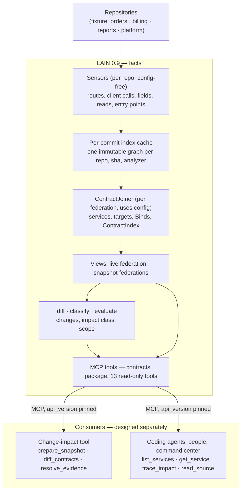
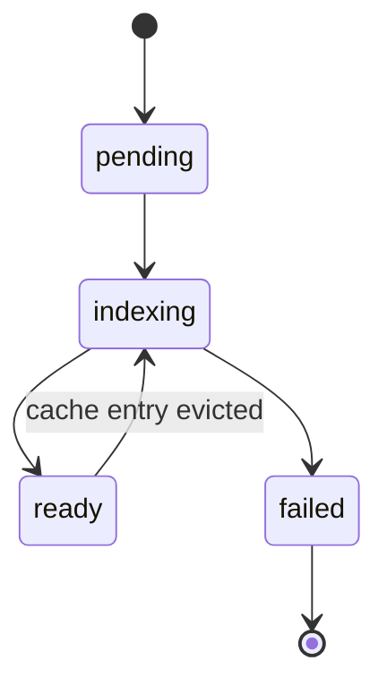

# LAIN Contract Federation — Design

Status: implementation-ready · 2026-09-28 · Target: LAIN 0.9.0 · Baseline: v0.8.0

Implementation progress is tracked in
[`CONTRACT_FEDERATION_TRACKER.md`](CONTRACT_FEDERATION_TRACKER.md).
Every code reference below was checked against the v0.8.0 tree. Paths are
relative to `src/server/` unless they start with `src/`, `tests/`,
`scripts/`, `docs/` or `.github/`.

## 1. Summary

LAIN 0.9 adds contract-level federation and a versioned, read-only tool interface for seeing how services depend on each other and what a change would affect. It links HTTP consumers to providers across services and repositories, models request and response fields, indexes repos at pinned commits, and classifies a proposed change as `Verified`, `NeedsInvestigation` or `NoKnownImpact`, with an evidence path for every claim. A future change-impact tool consumes these tools; that tool is designed separately and appears here only as a basic flow.

**Problem.** Knowledge about who depends on a service is siloed: the team that owns an endpoint rarely knows every consumer, which fields they read, or what those consumers use it for. A change to an endpoint or event payload can therefore break consumers in other repositories. A repo-local coding agent cannot see them, and LAIN 0.8.0 joins repositories only through shared symbols, not through the contracts services actually talk over.

**Vision.** Break those silos. For any service in the org, LAIN answers who uses it, what they use (endpoints and fields), and why (the consumer's own entry points that reach each call). Change impact is one question asked of that same map.

**Goals**

- Answer, for any service: who consumes it, which endpoints and fields they use, and from which of their own entry points.
- Answer, for HTTP contracts: if this change lands, which code in which repositories is affected, and what proves it. This covers provider changes and consumer changes.
- Tie every impact claim to source locations at named commits.
- Never count a missing, stale or unindexed repository as unaffected. "No known impact" always names the configured repos that could not be reviewed.
- Never call a change harmless because LAIN could not see its detail. Endpoints without a schema and consumers whose reads cannot be fully traced are reported as needing investigation, never dropped.
- Expose all of it through a stable, versioned MCP interface that an external tool can build on without reading LAIN internals.
- Keep LAIN read-only and free of model, GitHub and findings concerns.

**Non-goals for 0.9**

- The change-impact tool itself: findings storage, PR reporting, model investigation, deployment.
- Consumer-side detection for GraphQL, gRPC and WebSocket. Events are a stretch goal (PR 15).
- Service discovery from Kubernetes or IaC. Services come from `repos.yaml`.
- Runtime traffic as a required input. OpenTelemetry edges stay optional.
- Per-repo access control. 0.9 is a single trust domain (§10.7).
- Repos not listed in `repos.yaml`. LAIN cannot see them, and every scoped answer says so.
- Symbol-level cross-repo joins (`Calls`, `CrossRepoSameSymbol`) inside pinned snapshots. They stay live-only (§8.6).
- Field-level analysis for providers without a machine-readable schema. Their changes are still surfaced (§9.2, `ChangedWithoutSchema`).

## 2. Baseline: LAIN 0.8.0

| Capability | State in 0.8.0 | Location |
| --- | --- | --- |
| Repo registry, readiness, freshness | Present | `federation/federated_index.rs`, `federation/manifest.rs`, `readiness.rs` |
| Federated identity | `GlobalId` = `repo:Kind:path:name:line`, split on `:` | `federation/repo_id.rs:51`, `:134` |
| Per-repo node identity | UUIDv5 over `(namespace, type, path, name, line)` | `schema.rs:577` (`GraphNode::generate_id`) |
| Cross-repo symbol edges | `Calls` via `CrossRepoResolver`, signature matching | `federation/cross_repo.rs`, `federation/matching.rs` |
| HTTP providers | `HttpRoute` + `CallsHttp` (route → handler) from code (regex) and OpenAPI | `sensors/http_sensor.rs`, `sensors/openapi_sensor.rs` |
| OpenAPI | Paths and methods only. `operationId` is never parsed: `Operation.operation_id` has no `rename`, so it always falls back to `"method:path"` | `sensors/openapi_sensor.rs` |
| HTTP consumers, schemas, fields | Missing | — |
| Events | `Topic`, `Produces`, `Consumes` declared, never emitted | `schema.rs`, `sensors/dynamic_dispatch_sensor.rs` |
| Sensor contract | `Sensor::scan(&GraphDatabase, root, namespace)`, run in `inventory` order (undefined) after static resolve | `sensors/mod.rs:80`, `ingest/ingestion.rs:702`, `:1735` |
| Call edges | Tree-sitter name resolution; provenance `None` means `Static{TreeSitter}` | `treesitter.rs:1086`, `schema.rs:733` |
| Entry points | Only functions named `main` or `App` | `graph/mod.rs:1557` |
| Impact traversal | `traverse(start, one EdgeType, depth, direction)` | `federation/graph_backend.rs:88` |
| Projection | `project_nodes` rewrites ids to `GlobalId` and drops vanished nodes (petgraph drops their incident edges); `project_edges` retracts stale repo-owned edges except outgoing cross-repo `Calls` | `federation/federated_index.rs:451`, `:765` |
| Live refresh | Watcher re-indexes and sets `projection_stale`; a loop re-projects and relinks stale repos | `federation/repo_index.rs:864`, `src/cli/server.rs:453` |
| Persistence | bincode 2, legacy (positional) config. Federation file `LNF2` + version 2; per-repo `PATH_FORMAT_VERSION = 3`, discarded and rebuilt on mismatch | `federation/graph_backend.rs:14`, `graph/persist.rs:33` |
| Backend writes | Every `upsert_*` saves the whole graph; batch variants save once | `federation/graph_backend.rs:221` |
| Indexing | `index_one_repo(IndexRequest)` requires `&LspPool` and `&VolatileOverlay`; no way to turn LSP off | `ingest/ingestion.rs:1422` |
| MCP federation tools | `ToolDef` (flat arg-name lists, `output_schema: None`) + sync `McpToolEntry` inventory. The `FederationToolRegistry` named in `mcp/AGENTS.md` does not exist | `mcp/definitions.rs:68`, `mcp/handler.rs:616`, `:648` |
| Profiles | `Package` enum, `LAIN_TOOL_PROFILE`, `load_package`. Advertising only: every registered tool stays callable | `tools/profile.rs`, `tools/capabilities.rs:23` |
| Schema drift | `lain schema dump` → `docs/tool-schema.json`, CI job `schema-drift` | `.github/workflows/ci.yml:457` |
| Command center | Static SPA calling `/mcp` `tools/call` | `mcp/command_center/app.js:17` |
| Crates already present | `blake3`, `ignore`, `walkdir`, `git2`, `serde_yaml`, `proptest`, tree-sitter grammars for Rust, Python, JS, TS, Go | `Cargo.toml` |

## 3. Architecture

LAIN records facts about code and contracts and exposes them through exactly one interface: the versioned tools of the `contracts` package. Everything that judges, reports or calls a model lives in consumers outside LAIN.



| Concern | LAIN | Consumers |
| --- | --- | --- |
| Parsing code and specs | Sensors, per repo, never reading `repos.yaml` | Never |
| Joins between services | `ContractJoiner` only | Never |
| Classification and coverage | Pure functions | Read them |
| Confirming a binding | `check_binding` validates it and emits the YAML entry | Decide; commit it to `repos.yaml` through a normal PR |
| Model calls, findings, PR reporting | None | Their own design |

**Why sensors never read config.** The per-commit cache is keyed by `(repo, sha, analyzer_version)`. If sensor output depended on `repos.yaml`, every config edit would invalidate every cache entry. Sensors record raw facts (URL parts, env var names, receiver names); the joiner turns them into services, targets and bindings using config. A config change re-runs only the join.

**Why MCP rather than a library.** LAIN already versions its tool surface and fails CI on schema drift, so the tools are a tested contract. A crate dependency would couple consumers to LAIN's internal types and to Rust.

## 4. Domain model

### 4.1 Services

The unit of a join is a **service**. A service is declared in `repos.yaml` as a repo plus optional path prefixes, so one repo can hold several services (monorepo). A path covered by no prefix belongs to the repo's **implicit service**, named after the repo id. The joiner gives every node exactly one service from its repo-relative POSIX path (the key `graph::graph_path` produces): the longest matching prefix wins; prefixes within one repo must not overlap (config error, §7.1).

Only the federation creates edges between services, and it creates exactly one kind: `Binds`. A `Binds` edge may connect two services in the same repo (`cross_repo = false`) or in different repos (`cross_repo = true`).

### 4.2 Node and edge types (schema v3)

New `NodeType` variants: `HttpClientCall`, `Field`, `FieldRef`. Existing `HttpRoute`, `Schema` and `Topic` are reused.

| Node | Meaning | Emitted by | `name` | `path`, `line_start` |
| --- | --- | --- | --- | --- |
| `HttpRoute` | One provider endpoint declaration | `http_sensor`, `openapi_sensor` | `<METHOD> <normalized template>` | declaring file and line |
| `HttpClientCall` | One outbound call site | `http_client_sensor` | `<METHOD> <normalized template>`, or `<METHOD> <dynamic>` | call file and line |
| `Schema` | One request, response or payload body of one route | `openapi_sensor` | `<METHOD> <template> <direction>` | spec file, line of the schema |
| `Field` | One flattened field of a `Schema` | `openapi_sensor` | JSON path (§4.4) | spec file, line of the property |
| `FieldRef` | One field read from one call's response | `field_access_sensor` | JSON path | reading file and line |

| Edge | From → to | Scope | Impact propagation (§5.2) |
| --- | --- | --- | --- |
| `SendsHttp` | enclosing function → `HttpClientCall` | per repo | Incoming |
| `RequestSchema`, `ResponseSchema` | `HttpRoute` → `Schema` | per repo | Incoming |
| `PayloadSchema` | `Topic` → `Schema` (stretch) | per repo | Incoming |
| `HasField` | `Schema` → `Field` | per repo | Incoming |
| `ReadsField` | reading function → `FieldRef` | per repo | Incoming |
| `ReadsFrom` | `FieldRef` → the `HttpClientCall` whose response it reads | per repo | Stop |
| `Binds` | consumer → provider (`HttpClientCall` → `HttpRoute`, `FieldRef` → `Field`, consumer `Topic` → producer `Topic`) | federation only | Incoming |

`Produces` and `Consumes` become real edges emitted by `event_sensor` (stretch).

### 4.3 Data structures

New types derive `Serialize, Deserialize` and use **externally tagged** enums, because bincode cannot decode internally tagged or untagged enums. `#[serde(default)]` does not make bincode files backward compatible; compatibility comes only from the version bumps in §5.4.

```rust
// schema.rs — added fields and variant
pub struct GraphNode { /* existing */ pub contract: Option<ContractFact>, pub entry: Option<EntryKind> }
pub struct GraphEdge { /* existing */ pub site: Option<SourceSite>, pub detail: Option<EdgeDetail> }
pub enum EdgeProvenance { /* existing */ Confirmed { source: String } }  // "repos.yaml#bindings[<i>]"
pub struct EdgeDetail { pub route_match: Option<RouteMatch>, pub stripped_prefix: Option<String> }
pub enum RouteMatch { Exact, Pattern, PrefixStripped }

// federation/contracts/model.rs — per-repo facts written by sensors
pub enum ContractFact {
    Provider(ProviderFact),
    Consumer(ConsumerFact),
    Schema { direction: Direction },
    Field(FieldMeta),
    FieldRead(FieldReadFact),
}
pub struct ProviderFact {
    pub method: HttpMethod,
    pub template: String,              // normalized, same-file prefixes applied (§6.2)
    pub handler: Option<SymbolKey>,    // code routes; None for spec-only operations
    pub operation_id: Option<String>,  // OpenAPI operations
    pub origin: ProviderOrigin,        // Code | OpenApi
}
pub struct ConsumerFact {
    pub method: MethodSpec,            // Known(HttpMethod) | Unknown
    pub url: NormalizedUrl,
    pub via: CallVia,                  // Library { name } | Receiver { expr, fn_name }
    pub url_expr: String,              // source text of the URL argument, at most 200 chars
    pub reads_complete: bool,          // §6.5: false when the response escapes tracking
}
pub struct NormalizedUrl {
    pub host: HostPart,                // None | Literal(String) | Env(Vec<String>) | Expr(String)
    pub template: Option<String>,      // None = dynamic path
}
pub struct FieldReadFact { pub chain: JsonPath, pub exact: bool }  // exact = read on a bound identifier (§6.5)
pub struct FieldMeta { pub ty: TypeDesc, pub required: bool, pub nullable: bool, pub enum_values: Option<Vec<String>> }
pub enum TypeDesc { String, Integer, Number, Boolean, Object, Array(Box<TypeDesc>), Unknown }
pub enum HttpMethod { Get, Post, Put, Patch, Delete, Head, Options, Any }
pub enum Direction { Request, Response, Payload }
pub enum EntryKind { HttpHandler, Scheduled, Cli, Main }
pub struct SourceSite { pub path: String, pub line: u32 }
pub struct SymbolKey { pub repo: RepoId, pub path: String, pub container: Option<String>, pub name: String }

pub enum ContractKey {                 // Display / FromStr use the grammar of §4.4
    Http { method: MethodSpec, template: String },   // MethodSpec::Unknown only in consumer keys
    Topic { broker: String, name: String },
}
pub struct JsonPath(pub Vec<PathSegment>);   // Display / FromStr use the grammar of §4.4
pub enum PathSegment { Name(String), ArrayItems, MapValues }   // `name`, `[]` suffix, `{}`
pub struct ServiceName(pub String);           // validated as in §7.1
pub type EndpointId = (ServiceName, ContractKey);
```

`SymbolKey` is the line-free identity of a function. Anything that must survive edits (confirmed bindings, `PathChanged` pairing, consumer-change pairing) uses it instead of a `GlobalId`, whose last segment is a line number.

```rust
// federation/contracts/index.rs — derived per federation by rejoin_contracts, never persisted
pub struct ContractIndex {
    pub services: BTreeMap<ServiceName, ServiceInfo>,        // repo, prefixes, endpoint ids
    pub endpoints: BTreeMap<EndpointId, Endpoint>,           // EndpointId = (ServiceName, ContractKey)
    pub consumers: BTreeMap<GlobalId, ConsumerResolution>,   // service, target, bound endpoints, unresolved reason
    pub field_refs: BTreeMap<GlobalId, FieldRefResolution>,  // bound fields or unknown-field read
    pub stale_bindings: Vec<StaleBinding>,
    pub external: BTreeMap<String, u32>,                     // host → call count
    pub unnormalized: Vec<GlobalId>,
}
```

`Binds` edges live in the graph backend, for traversal and the command center; everything else the tools need lives in `ContractIndex`. One `rejoin_contracts` pass produces both, so they cannot disagree.

### 4.4 Keys and encodings

| Thing | Grammar | Example |
| --- | --- | --- |
| `ContractKey` (HTTP) | `http:<METHOD> <template>`; `METHOD` ∈ `GET POST PUT PATCH DELETE HEAD OPTIONS ANY`, plus `UNKNOWN` in consumer keys only | `http:GET /api/orders/{}` |
| `ContractKey` (topic) | `topic:<broker>/<name>` | `topic:kafka/orders.created` |
| Endpoint | `{ service, key }`, two fields in every payload | `{ "service": "orders", "key": "http:GET /api/orders/{}" }` |
| Template | `/`-separated segments: literal, `{}` (one segment) or `{**}` (one or more, last only); the root is `/` | `/api/orders/{}` |
| JSON path | segments joined by `.`; array element suffix `[]`; map value segment `{}`; `\` escapes `.`, `[`, `]`, `{`, `}` and `\` inside names | `items[].sku`, `prices.{}.amount` |
| Field id | `<ContractKey>#<direction>:<json path>`, direction `request`, `response` or `payload` | `http:GET /api/orders/{}#response:customer_id` |
| EvidenceRef text | `<repo>@<first 12 hex of sha>:<path>:<line>` | `billing@9c20d41a7b3e:src/invoice.py:58` |

### 4.5 URL normalization

One pure function, `federation/contracts/normalize.rs`, used by every provider and consumer sensor. Input: the URL argument as a sequence of parts, `Literal(String) | Hole(String)` (§6.3). Output: a `NormalizedUrl`.

1. **Host.** If the first literal contains `://`, the host is the text after it up to the next `/`, `?`, `#` or end, with userinfo and port removed, lower-cased → `HostPart::Literal`. If a hole comes before the first `/` of the path, that hole is the base, not a path parameter → `HostPart::Expr(hole)`, turned into `HostPart::Env` by §6.3 when possible. If the URL starts with `/` → `HostPart::None`.
2. **Cut.** Drop everything from the first `?` or `#` found in a literal, including later holes.
3. **Segments.** Split the rest on `/`. A segment containing any hole becomes `{}`. A literal segment in parameter syntax becomes `{}`: `:id`, `{id}`, `<id>`, `<int:id>`, `[id]`, `$id`. A wildcard segment (`*`, `*rest`, `{*rest}`, `{rest:path}`, `<path:rest>`) becomes `{**}`, which must be the last segment.
4. **Clean.** Drop empty segments (this collapses `//` and removes a trailing `/`). An empty result is `/`. Case is preserved.
5. **Dynamic.** If the path part consisted only of holes, `template = None`.

Provider templates get their prefixes (§6.2) prepended before step 3. Consumer templates are never changed by config.

Property tests: idempotence (normalizing a rendered template returns it unchanged); for every framework in the fixture, the provider declaration and the matching client call produce equal templates.

### 4.6 Provenance and confidence

| Provenance | Confidence | Counts as "certain" for `Verified` |
| --- | --- | --- |
| `Static { TreeSitter \| Lsp }`, or `None` | 1.0 | yes |
| `Confirmed { source }` | 1.0 | yes |
| `Runtime { … }` | 0.9 | no |
| `Heuristic { detector, confidence }` | as recorded | no |

A path's `min_confidence` is the minimum over its hops. Where a rule below says "capped by" another edge, the new edge's confidence is the minimum of both, and it is `Heuristic` if either is.

## 5. Foundational changes

### 5.1 F1 — GlobalId encoding (PR 2)

**Decision.** Percent-encode `%` → `%25` and `:` → `%3A` inside the path and name segments. `GlobalId::new` encodes, `parse` requires exactly five segments, accessors (`path`, `name`, `line_start`) decode. Ids without those characters are byte-identical to today; repo-prefix scoping keeps working because `RepoId` already forbids `:`.

**Steps.** (1) Route every hand-built or hand-split id through `GlobalId`: the `split(':')` calls in `federation/repo_id.rs`, the `rsplit(':')` at `repo_id.rs:280`, `global_id_str` at `federated_index.rs:33`, and every match of `rg 'split\(.:.\)|format!\("\{\}:\{' src/server/federation src/server/mcp`. (2) Replace the hand-written `is_known_node_kind` list with `NodeType::all()`. (3) Ship under the schema v3 bump (§5.4).

**Tests.** Proptest round-trip of arbitrary path and name strings including `:`, `%`, `::` and `%3A`. Regression: an `HttpRoute` named `GET /orders/:id` projects, `name()` returns it, and `resolve_node` finds it by name.

### 5.2 F2 — Typed impact traversal (PR 4)

**Decision.** Keep `GraphBackend::traverse` for existing callers. Add:

```rust
fn traverse_impact(&self, starts: &[&str], depth: u32, cap: usize, min_confidence: f32) -> Result<ImpactResult, LainError>;

pub enum Propagation { Incoming, Outgoing, Stop }
pub fn impact_propagation(e: &EdgeType) -> Propagation {
    match e {  // exhaustive: a new EdgeType fails to compile until decided
        Calls | CallsHttp | SendsHttp | Binds | Consumes | ReadsField
        | HasField | RequestSchema | ResponseSchema | PayloadSchema => Incoming,
        Produces => Outgoing,
        Contains | Imports | CoChangedWith | Pattern | Uses | Implements | DeployedTo
        | CrossRepoSameSymbol | DynamicDispatch | BusTopic | RouteMatches | RuntimeCall
        | ReadsFrom => Stop,
    }
}
pub struct ImpactHop    { pub edge: GraphEdge, pub node: GraphNode }
pub struct ImpactPath   { pub hops: Vec<ImpactHop>, pub min_confidence: f32 }
pub struct ImpactResult { pub paths: Vec<ImpactPath>, pub truncated: bool }
```

Everything except `Produces` propagates `Incoming`, because the holder of an edge is the dependent side.

**Algorithm.** Breadth-first from every node in `starts` at distance 0 (an endpoint has one start per provider node). For each dequeued node, follow edges by the table: `Incoming` follows edges whose target is the node, to their source; `Outgoing` the reverse. Each node is visited once, at its shortest distance; ties go to the predecessor with the higher `min_confidence`, then the lexicographically smaller `GlobalId`, so output is deterministic. An edge whose confidence is below `min_confidence` is not followed. A path is emitted for every visited node that has no unvisited successor or sits at `depth`. `cap` limits emitted paths; `truncated` is set when `cap` or `depth` cut the search. Paths are sorted by `min_confidence` descending, then length ascending, then the leaf's `GlobalId`.

**Steps.** (1) Ship the table with only `Calls` returning `Incoming`. (2) Rebuild `get_cross_repo_blast_radius` on it without changing its response shape; `tests/federation_blast_radius_regression.rs` passes untouched. (3) Each later PR switches its own edge types on, with a table test.

### 5.3 F3 — Join ownership (PR 7)

**Decision.** `Binds` edges and the `ContractIndex` belong to a federation-level pass. `FederatedIndex::rejoin_contracts()` computes the complete desired `Binds` set and a fresh `ContractIndex` from every projected contract node plus config, diffs the edges against the stored `Binds` set, and applies adds and removes through `upsert_edges_batch` and `remove_edges` (one disk save). It is idempotent and order-independent. `project_edges` reconciliation skips `EdgeType::Binds` by type, never by whether an edge crosses repos.

**Triggering.** `project_nodes` and `project_edges` set `contracts_dirty: AtomicBool`. `rejoin_contracts_if_dirty()` runs under `projection_lock` at the end of: the loader's Phase 2 (`federation/loader.rs`), every tick of the refresh loop that re-projected a repo (`src/cli/server.rs:453`), hot-reload apply (`reload.rs`), `add_repo`, `remove_repo`, and `from_snapshot`. Every contract tool on `live` also calls it before reading, so no query sees a half-joined state. Re-projecting a node deletes its incident `Binds` edges (petgraph), which is why every projection marks the federation dirty.

**Location.** `federation/contracts/joiner.rs` holds `ContractJoiner`; `federation/cross_repo.rs` keeps symbol edges. PR 7 updates `federation/AGENTS.md`, which says `cross_repo.rs` is the only file that joins across repos, to name both.

**Cost.** `project_graph` records the `GlobalId`s of contract nodes per repo, so the join never scans the whole graph. Routes are indexed by `(service, method, segment count)`; each consumer checks its target service's bucket, or every service's bucket when unbound. Budget: 2 s × `LAIN_PERF_BUDGET_MULTIPLIER` for a full rejoin of the tokio + bytes federation (`scripts/demo-federation-fixture.sh`).

**Tests.** Projection order A,B equals B,A (identical `Binds` set and `ContractIndex`). Renaming a provider route rebinds without re-projecting the consumer. Removing the provider repo removes its bindings. Hot reload of the provider updates bindings. A consumer whose line moved keeps its binding after the next tick.

The cross-repo `Calls` exemption has the same defect class; migrating it to this model is a follow-up outside 0.9.

### 5.4 Schema v3 and migration (PR 3)

- `FEDERATION_GRAPH_VERSION` 2 → 3 (`federation/graph_backend.rs:15`). Old files are refused with `FederationSchemaMismatch`; `lain reindex` rebuilds them, as in 0.8.
- `PATH_FORMAT_VERSION` 3 → 4 (`graph/persist.rs:33`). Per-repo graphs with the old version are discarded and rebuilt on load, as today.
- `NodeType::all()`, `EdgeType::all()` and `is_indexed()` updated; `describe_schema` picks them up.
- `CHANGELOG.md` migration note, in this order: install 0.9 → `lain reindex` → enable the package with `LAIN_TOOL_PROFILE=contracts` or `load_package contracts` → use the new tools.

## 6. Contract extraction (per repo)

### 6.1 Sensor framework changes

- `Sensor` gains `fn phase(&self) -> u8 { 0 }`, and `run_all` sorts entries by `(phase, name)` instead of relying on `inventory` order. Phase 0: `http_sensor`, `openapi_sensor` and the existing sensors. Phase 1: `http_client_sensor`, `entry_point_sensor`. Phase 2: `field_access_sensor`, which needs `SendsHttp` and `Calls`.
- `SensorCounts` and `SensorCountField` gain `http_clients`, `fields`, `field_reads` and `entry_points` (`events` in PR 15).
- `http_client_sensor` and `field_access_sensor` parse with the tree-sitter grammars already linked (Python, JavaScript, TypeScript; Rust and Go in PR 14), because regex cannot follow URL expressions or values. Both use the shared walker in `sensors/util.rs` (`scripts/check-no-duplicate-sensors.py` enforces it).
- New helper `util::enclosing_symbol(graph, path, line) -> Option<GraphNode>`: the `Function` or `Method` in `path` with the smallest `line_start..=line_end` containing `line`; on a tie, the later `line_start`.
- **Sensor output replaces itself.** `run_all` rescans the whole repo on every index, but upserts alone would leave nodes for deleted routes and calls behind. Each sensor writes through a new `GraphDatabase::replace_sensor_output(owner: SensorOwner, nodes, edges)`, which first removes every node the same owner emitted before (petgraph drops their edges), then inserts. `SensorOwner` is derived from the node: `HttpRoute` with `ProviderOrigin::Code` → `http_sensor`, with `ProviderOrigin::OpenApi` → `openapi_sensor`; `Schema` and `Field` → `openapi_sensor`; `HttpClientCall` → `http_client_sensor`; `FieldRef` → `field_access_sensor`. `entry_point_sensor` clears and resets `GraphNode.entry` on every run. This also fixes stale `HttpRoute` nodes in 0.8.
- Sensors never read `repos.yaml` (§3). Every map a sensor iterates is a `BTreeMap`, so output is deterministic; `http_sensor::get_route_patterns` switches from `HashMap`. The determinism test in §8.3 enforces this.

### 6.2 HTTP providers (PR 5, PR 8)

- `http_sensor` and `openapi_sensor` normalize through §4.5 and set `ContractFact::Provider`.
- **Method `ANY`.** `go-std` (`http.HandleFunc`) declares no verb and now emits `ANY` instead of `GET`. Flask `@app.route` without `methods` stays `GET`, which is Flask's default.
- **Router prefixes in the same file** are prepended to the route template: FastAPI `APIRouter(prefix="…")` bound to the decorator's receiver name; Flask `Blueprint(…, url_prefix="…")`; axum `.nest("/p", f())` where `f` is defined in the same file; actix `web::scope("/p")`. Cross-file mounts (`app.include_router(r, prefix=…)`, Express `app.use("/p", router)`) are covered by `route_prefixes` config (§7.1) and by prefix-tolerant matching (§7.4).
- **OpenAPI.** Fix `operationId` parsing (`#[serde(rename = "operationId")]`). Add `head` and `options` operations. Prefix every operation template with the path of the first `servers[].url` (OpenAPI 3) or `basePath` (Swagger 2) when present.
- **Service `base_path`** (config) is applied by the joiner, not the sensor, as a prefix to every provider template of that service that does not already start with it.

### 6.3 HTTP consumers: `http_client_sensor.rs` (PR 6)

**Call shapes recognized**

| Language | Shape | Method | URL |
| --- | --- | --- | --- |
| TS/JS | `fetch(url, init?)` | `init.method` if literal, else GET | arg 0 |
| TS/JS | `axios.<verb>(url, …)`, `axios(url)`, `axios({ method, url })`, `got.<verb>(url)`, `got(url, { method })`, `ky.<verb>(url)` | verb, literal `method`, or GET | as shown |
| TS/JS | `<recv>.<verb>(<arg0>, …)` where `<arg0>` is a string or template literal starting with `/` | verb | arg 0 (wrapper candidate) |
| Python | `requests.<verb>(url, …)`, `requests.request("<M>", url)`, `httpx.<verb>`, `httpx.request`, and `<client>.<verb>` where `<client>` is assigned from `httpx.Client(…)`, `httpx.AsyncClient(…)`, `requests.Session()` or `aiohttp.ClientSession()` (including `with … as <client>` and `async with`) | verb or literal arg | arg 0 or `url=` |
| Python | `<recv>.<verb>(<arg0>, …)` where `<arg0>` is a string or f-string starting with `/` | verb | arg 0 (wrapper candidate) |

`<verb>` is one of `get post put patch delete head options`, case-insensitive. A method given by a non-literal expression is `MethodSpec::Unknown`. Wrapper candidates record `CallVia::Receiver { expr, fn_name }`; the joiner keeps them only if they match `http_clients` (§7.3), and a discarded candidate is not counted anywhere. `httpx.Client(base_url=…)` contributes its `base_url` as the host part of every call on that client.

**URL expression → parts.** A string literal is one `Literal`. A template literal or f-string alternates `Literal` and `Hole`. `a + b` gives the parts of `a` then `b`. `urljoin(base, "/p")` and `new URL("/p", base)` give the parts of `base` then `"/p"`. An identifier is resolved **once**, to its assignment, when it has a single module-level or same-function assignment in the same file; otherwise it stays a `Hole`.

**Host resolution (config-free).** A hole before the path whose resolved expression is `os.environ["X"]`, `os.environ.get("X", …)`, `os.getenv("X", …)`, `settings.X`, `config.X`, `process.env.X` or `process.env["X"]` becomes `HostPart::Env(["X"])`. Anything else stays `HostPart::Expr(text)`.

**Emitted per call site.** An `HttpClientCall` node (§4.2) with `ContractFact::Consumer`, and a `SendsHttp` edge from `enclosing_symbol` carrying `site`. A call outside any function is attached to its `File` node.

### 6.4 OpenAPI schemas and fields (PR 8)

- **Bodies.** For each operation: `requestBody.content` with media type `application/json` or `*/*+json` → `Schema{Request}`; the union of every `2xx` response's JSON schema → `Schema{Response}`; `parameters` with `in: query` → request fields under the reserved first segment `$query` (`$query.limit`); a body property whose name starts with `$` is escaped as `\$`. Path parameters are part of the template. Header parameters and error responses are not modeled in 0.9.
- **Flattening.** Properties recurse (`customer.address.city`); arrays add `[]` (`items[].sku`); `additionalProperties: <schema>` adds a `{}` segment; `allOf` merges properties, with required as the union; `oneOf` and `anyOf` include every branch's fields with `required = false`, and a field whose branches disagree on type becomes `Unknown`. `$ref` resolves within the file (`#/components/schemas/…`, `#/definitions/…`). A `$ref` cycle stops at the first repeat with a `Field` of type `Object`. An external-file `$ref` produces an `Object` field and a `coverage.unnormalized` entry.
- **Types.** `string`, `integer`, `number`, `boolean`, `object` and `array` (with its `items`) map to the matching `TypeDesc`; anything else is `Unknown`. `format` is ignored, so `int32` → `int64` is not a change. Nullability: OAS 3.0 `nullable: true`, OAS 3.1 `type: [T, "null"]`, Swagger 2 `x-nullable: true`. `required` is relative to the parent object. Enum values are stringified with `serde_json` (`1` → `"1"`).
- **Response union.** With several 2xx responses, a field is `required` only if every one requires it, and its type is `Unknown` if they disagree.
- **Line numbers.** serde keeps no spans, so `openapi_sensor` builds a JSON-pointer → line index: YAML block mappings by indentation, JSON by tokenizing object keys. Flow-style YAML falls back to the nearest ancestor with a known line.

### 6.5 Consumer field reads: `field_access_sensor.rs` (PR 9)

The sensor tracks **bound identifiers**, names that hold a call's response. Only reads on them become `FieldRef`s, so `.id` on an unrelated dict never matches a schema.

**Binding rules**, applied within the scope below:

1. `x = <client call>` and `x = await <client call>` bind `x` to the call's response.
2. `y = x.json()`, `y = await x.json()`, `y = x.data` (axios) and `y = x.body` (got) bind `y`; `x` stays bound, so `r.json()["id"]` is recorded.
3. `z = x["k"]`, `z = x.k` and `z = x.get("k")` bind `z` to the sub-path `k`; `for it in x["items"]` binds `it` to `items[]`.
4. `d = Dto(**x)`, `Dto.model_validate(x)`, `Dto.parse_obj(x)`, `Dto(x)`, and TypeScript `x as Dto` / `const d: Dto = x`, bind `d` with the same path.
5. In a **caller** of the sending function S, `o = S(…)` and `o = await S(…)` bind `o` when S returns a bound identifier or a bound expression (`return r.json()`, `return (await r.json())["data"]`), with the returned sub-path.
6. In a **callee** of S or of such a caller, the parameter at the position a bound identifier is passed in is bound.

**Scope.** S, its direct callers (rule 5), and the direct callees of S and of those callers (rule 6). Only `Calls` edges with provenance `Static{TreeSitter}` or `None` are used, so live and snapshot indexing see the same scope.

**Reads recorded.** `x.k`, `x["k"]`, `x.get("k")`, `"k" in x`, destructuring (`{ k, a: { b } } = x`) and Python `match` mapping patterns. The chain is the path from the call's response root: `o["customer"]["address"]["city"]` → `customer.address.city`. Each read emits a `FieldRef` node, a `ReadsField` edge from the reading function (with `site`, provenance `Static{TreeSitter}`) and a `ReadsFrom` edge to the `HttpClientCall`. A read whose key is not a literal emits nothing and sets `reads_complete = false`.

**Escapes.** `reads_complete` on the call's `ConsumerFact` becomes `false` when a bound identifier is returned from a caller (it would leave the scope), passed to a function outside the scope, stored into an attribute, subscript, global or collection, spread (`**x`, `...x`, `Object.assign(…, x)`, `dict(x)`), serialized or passed through (`json.dumps(x)`, `JSON.stringify(x)`, `return JSONResponse(x)`, `res.json(x)`), or yielded. Reads and iteration are not escapes.

### 6.6 Entry points: `entry_point_sensor.rs` (PR 16)

Sets `GraphNode.entry` on function nodes, so `used_by` (§10.9) can say why code runs:

| `EntryKind` | Detection |
| --- | --- |
| `HttpHandler` | Target of a `CallsHttp` edge (route → handler) |
| `Scheduled` | node-cron `cron.schedule(expr, fn)`; module-level `setInterval(fn, …)`; APScheduler `@<x>.scheduled_job(…)` and `add_job(fn, …)`; Celery `@<x>.task` and `@shared_task`; NestJS `@Cron(…)` |
| `Cli` | click `@click.command` and `@<group>.command`, typer `@<app>.command`, commander `.command(…).action(fn)` |
| `Main` | functions named `main` or `App` (today's `find_entry_points`), and the enclosing module of an `if __name__ == "__main__":` block |

A function passed by reference (`cron.schedule("0 0 1 * *", buildMonthlyReport)`) is resolved by name in the same file.

### 6.7 Events: `event_sensor.rs` (stretch, PR 15)

Kafka first: kafkajs `producer.send({ topic })` and `consumer.subscribe({ topic })`, confluent-kafka and aiokafka `produce` / `subscribe`, rdkafka `FutureRecord::to` and `subscribe`, kafka-go and sarama. Topic names resolve from literals and same-file constants, as in §6.3. The sensor emits `Topic` nodes with `ContractKey::Topic` and `Produces` / `Consumes` edges. Where it resolves a site that `dynamic_dispatch_sensor` also matched, the precise edge replaces that site's heuristic `BusTopic` edge. Dynamic topic names go to `coverage.unnormalized`. Payload schemas come from JSON Schema files mapped in `schemas` config.

## 7. Federation joins (per federation)

### 7.1 Configuration (`repos.yaml`)

New top-level sections, all optional, documented in `docs/REPOS_YAML.md`:

```yaml
services:
  - name: orders                 # unique; [a-z0-9][a-z0-9_-]*
    repo: orders                 # a configured repo id
    paths: []                    # repo-relative prefixes; empty = whole repo
    hosts: [orders, orders.svc.cluster.local]   # lower-case; "*.example.com" wildcards allowed
    env: [ORDERS_URL, ORDERS_BASE_URL]
    base_path: /api              # prefix the service is reached under, not visible in its code
    route_prefixes:              # cross-file router mounts
      - { path: src/routers/admin.py, prefix: /admin }
  - { name: shipping,  repo: platform, paths: [services/shipping/] }
  - { name: inventory, repo: platform, paths: [services/inventory/] }
http_clients:                    # wrapper clients
  - { call: "ordersClient.{method}", service: orders }             # {method} = any HTTP verb as method name
  - { call: "api.fetchOrder", service: orders, method: GET, path_arg: 0 }
generic_keys: ["GET /internal/ping"]   # added to the built-in list
schemas:                         # stretch (PR 15): topic → JSON Schema file
  - { topic: "kafka/orders.created", repo: orders, file: schemas/order_created.json }
bindings:                        # person-confirmed links, added by PR
  - consumer: { repo: billing, path: src/orders_api.py, symbol: create_order, key: "POST /api/orders" }
    provider: { service: orders, key: "POST /api/orders" }
```

**Validation.** These errors fail config load; on hot reload the previous config stays active, as with existing `repos.yaml` errors: unknown `repo`; duplicate service `name`; a declared service whose name equals another repo's id; overlapping `paths` within one repo; an `http_clients.service` or `bindings.provider.service` that is neither declared nor implicit; the same `env` name or the same exact `hosts` entry listed by two services; a malformed `key` (it must parse as `<METHOD> <template>` and survive normalization unchanged); `path_arg` greater than 5.

**Built-in generic keys:** `GET /`, `GET /health`, `GET /healthz`, `GET /ready`, `GET /readyz`, `GET /live`, `GET /livez`, `GET /ping`, `GET /status`, `GET /version`, `GET /metrics`, `GET /favicon.ico`.

`config_hash` is the `blake3` of the canonical JSON (sorted keys) of `services`, `http_clients`, `generic_keys`, `schemas` and `bindings` after parsing.

### 7.2 The join pass

`ContractJoiner::run(nodes, config) -> (BindsSet, ContractIndex)` is a pure function. Steps, in order:

1. **Assign services** to every contract node (§4.1).
2. **Build endpoints.** Group provider nodes by `(service, method, template)` after applying the service's `base_path` and `route_prefixes`. A code route and an OpenAPI operation with the same key in the same service form **one endpoint** with two provider nodes. Its schemas come from whichever providers have them, merged like the response union of §6.4.
3. **Filter wrapper candidates** against `http_clients` (§7.3 rule 1).
4. **Resolve each consumer** (§7.3), producing `Binds` edges or an unresolved, external or unnormalized record.
5. **Join fields** (§7.5).
6. **Apply confirmed bindings** (§7.6) and record stale ones.
7. **Sort** every output collection by its key.

### 7.3 Consumer resolution

For each `HttpClientCall` c, the first matching row decides:

| # | Condition | Result | Provenance |
| --- | --- | --- | --- |
| 1 | `via = Receiver` and no `http_clients.call` pattern matches `expr.fn_name` | discarded, not a call | — |
| 2 | A `bindings` entry matches c (§7.6) | `Binds` to every provider node of the named endpoint | `Confirmed`, 1.0 |
| 3 | Target service known: from the matching `http_clients` entry; else a `HostPart::Env` name listed in a service's `env`; else a `HostPart::Literal` host matching a service's `hosts` | route match (§7.4) in that service only. Found: `Binds`. Not found: unresolved, `reason = no_route_in_service` | `Static` 1.0; method `Unknown`: `Heuristic{method_unknown}` 0.6; prefix stripped: `Heuristic{prefix_stripped}` 0.5 |
| 4 | `HostPart::Literal` host matches no service and is not `localhost`, `127.0.0.1`, `0.0.0.0`, `[::1]` or `host.docker.internal` | `Target::External`, counted per host | — |
| 5 | `template = None` | recorded in `unnormalized` | — |
| 6 | Otherwise (target unknown) | route match across every service except c's own, skipping generic keys. One service matches: `Binds`. Several: one `Binds` per service. None: unresolved, `reason = no_match` | one: `Heuristic{unbound_host}` 0.6; several: `Heuristic{ambiguous}` 0.3 |

A service calling its own routes is not a contract between services, so rule 6 skips c's own service; an explicit rule 3 target that happens to be c's own service is honoured.

### 7.4 Route matching

Consumer template C matches provider template P when:

- **Method.** C's method equals P's, or P is `ANY`, or C's method is `Unknown` (confidence capped at 0.6).
- **Segments.** Same number of segments, or P ends with `{**}` and C has at least as many. Pairwise: literal equals literal (case-sensitive); P's `{}` matches any C segment; C's `{}` matches only P's `{}`, because a runtime value could be anything and so never proves a literal route.
- **Specificity.** If several routes in one service match, the most specific wins: compare segments left to right with literal > `{}` > `{**}`; the first difference decides. Equal specificity means identical templates, i.e. the same endpoint.
- **Prefix tolerance** (rule 3 only, target service known): if nothing matches, strip up to 3 leading literal segments from C, one at a time, and retry. A match is `Heuristic{prefix_stripped}` 0.5, and the edge's `detail.stripped_prefix` records what was removed. This covers unconfigured gateway prefixes and cross-file router mounts.

Every `Binds` edge records `detail.route_match` = `Exact`, `Pattern` or `PrefixStripped`.

### 7.5 Field join

For each `FieldRef` f with `ReadsFrom` → call c, and each `Binds`(c → provider node r) of endpoint e:

1. Take e's `Response` schema. If e has none, f stays unbound and e is listed in `schemaless_endpoints`.
2. If f's chain equals a field's JSON path: `Binds`(f → that `Field`), with the read's provenance (`Static` when `exact`) capped by the endpoint bind.
3. Else if f's chain is a suffix of exactly one field's path: `Binds`, `Heuristic{field_suffix}` 0.6, capped by the endpoint bind. If it is a suffix of several: one `Binds` each, `Heuristic{ambiguous_field}` 0.3.
4. Else f is an **unknown-field read**, recorded on c's resolution and used by the consumer-side diff (§9.3).

### 7.6 Confirmed bindings

A `bindings` entry matches every `HttpClientCall` in `consumer.repo` at `consumer.path` whose enclosing symbol's name (or `Container.name`) equals `consumer.symbol` and whose `ContractKey` equals `consumer.key`. The provider is the endpoint `(provider.service, provider.key)`. An entry that matches no consumer, or whose endpoint does not exist, goes to `coverage.stale_bindings` with `reason = no_consumer` or `no_endpoint` and contributes nothing.

### 7.7 Topic join (stretch, PR 15)

A consumer-service `Topic` binds to every producer-service `Topic` with the same `ContractKey::Topic`. Brokers must match; a topic without a broker is `kafka`.

### 7.8 Invariants checked in tests

- Every `Binds` edge connects two different services; `cross_repo` is true exactly when their repos differ.
- Every `Binds` edge carries provenance; none is `None`.
- `ContractJoiner::run` is a pure function of `(nodes, config)`: same input, same output in the same order, independent of projection order.

## 8. Revision-pinned analysis

### 8.1 Git access

- **Mirrors.** `<data_dir>/mirrors/<repo>.git` is a bare mirror (`git clone --mirror`) of the repo's source: the `url` of a `local_clone` or `shallow_clone` source, or the local path of a `workspace_dir` source. A mirror of a working directory sees committed state only; uncommitted edits are what `live` is for. LAIN never adds worktrees, refs or objects to a user's own repository. Fetching uses the `git` CLI, so the credential helpers the existing clone sources rely on apply; LAIN adds no credential handling. `git2` handles ref resolution, tree diffs and blob reads.
- **Ref resolution.** A 40-hex sha, a unique sha prefix of at least 7 hex, `refs/…`, a branch or a tag. A ref missing locally triggers one `git fetch --prune` of the mirror, then fails with `ref_not_found`. A failed fetch (network, auth) is reported per repo as `fetch_failed`.
- **Worktrees.** `git worktree add --detach <data_dir>/worktrees/<repo>/<sha> <sha>` from the mirror, removed as soon as the index is cached. A per-repo lock file, `<data_dir>/mirrors/<repo>.lock` (`std::fs::File::lock`), serializes fetch, `worktree add`, `worktree remove` and `worktree prune`. `prune` runs at startup under the same lock.

### 8.2 Snapshot indexing mode

`IndexRequest` gains `mode: IndexMode { Live, Snapshot }`, and its `lsp_pool` and `overlay` fields become `Option<&…>`. In `Snapshot` mode, `index_one_repo` runs with `force = true` and without LSP, overlay, cross-repo resolver, co-change pass or embedding/NLP enrichment: tree-sitter symbols, static resolve and sensors only. `RepoIndex` is not involved; a snapshot index job calls `index_one_repo` directly on a fresh `GraphDatabase` in a temp directory.

### 8.3 Index cache

- **Layout.** `<data_dir>/index-cache/<repo>/<sha>-<analyzer_version>/{graph.bin, manifest.json}`, where `manifest.json` = `{ repo, commit, analyzer_version, files: [repo-relative paths walked], sensor_counts, bytes, created_unix, last_used_unix }`. Entries are written to a temp directory and renamed into place.
- **Eviction.** Least recently used past `LAIN_INDEX_CACHE_MB` (default 4096). An entry held by a resident snapshot federation or a running job is never evicted.
- **analyzer_version** = `"<CARGO_PKG_VERSION>+c<CONTRACT_ANALYZER_REV>"`, with `const CONTRACT_ANALYZER_REV: u32` in `federation/contracts/mod.rs`. Any change to sensors, the normalizer or the joiner that changes output must bump it. `tests/contracts_analyzer_digest.rs` indexes the fixture and compares a blake3 canonical digest (below) of the cached graphs with `tests/fixtures/contracts/analyzer_digest.txt`; a mismatch without a bump fails with instructions to bump and regenerate.
- **Determinism test.** `graph.bin` contains a `HashMap` (`GraphState::index_map`), so its bytes are not stable. Determinism is checked on the **canonical digest**: blake3 over every node sorted by id and every edge sorted by `(edge_type, source_id, target_id)`, each bincode-encoded after clearing the fields that record when indexing happened (`last_lsp_sync`, `last_git_sync`, `is_hydrated`) and `embedding`, which snapshot mode never computes. Indexing the same fixture sha twice must give the same digest. The analyzer digest above uses the same function.

### 8.4 Snapshot records and jobs

- **Record.** `<data_dir>/snapshots/<snapshot_id>.json` = `{ id, repos: {repo: commit}, excluded: [repo], refs: {repo: ref as given}, join_config, config_hash, analyzer_version, state, repo_states: {repo: {state, error?}}, created_unix, last_access_unix }`. `join_config` is the canonical JSON of the join-relevant sections (§7.1) at preparation time, and `from_snapshot` joins with it, never with the current `repos.yaml`. A snapshot therefore means the same thing after a config edit.
- **Which config.** A snapshot prepared without `from` uses the current `repos.yaml`. A snapshot derived `from` another inherits its `join_config`, so a base and its derived head are always comparable.
- **Identity.** `snapshot_id = "snap_"` + the first 16 hex of `blake3` over the canonical JSON of `{ repos, excluded, config_hash, analyzer_version }`.
- **Jobs.** One per missing `(repo, sha, analyzer_version)` cache entry, deduplicated across snapshots, run on `LAIN_SNAPSHOT_WORKERS` (default 2) workers. At most 64 jobs queue; beyond that, `prepare_snapshot` returns `busy`. A job takes the lock, adds the worktree, indexes (§8.2), writes the cache entry, removes the worktree and releases the lock.
- **Restart.** Records are reloaded; `pending` and `indexing` snapshots re-enqueue their missing jobs.
- **Retention.** A record is deleted 7 days (`LAIN_SNAPSHOT_RETENTION_DAYS`) after `last_access_unix`. Preparing again with the same inputs gives the same id, so an expired snapshot can always be re-created.

### 8.5 Snapshot federations

- `FederatedIndex::from_snapshot(&SnapshotRecord, &IndexCache)` builds a federation over `PetgraphBackend::ephemeral()`, a `GraphDatabase` with persistence disabled whose `save()` is a no-op. No `RepoIndex`, watcher or overlay is created.
- `project_nodes` and `project_edges` are refactored into `project_graph(repo_id, &GraphDatabase)`, shared by live and snapshot projection, so both produce identical node and edge sets from the same per-repo graph.
- After projecting every repo, it runs `rejoin_contracts`.
- **Residency.** At most `LAIN_SNAPSHOT_RESIDENT` (default 2) snapshot federations are in memory. A tool call holds the federations it uses until it returns (`diff_contracts` holds two). When a new one is needed, the least recently used federation that no call holds is dropped. If every resident federation is held, the call waits up to its `wait_ms` (analysis tools default to 5,000) and then returns `busy`.
- **Memory ceiling.** PR 11 measures peak RSS for building the fixture and the tokio + bytes federation as snapshots and commits 1.5 × the larger value to `tests/fixtures/contracts/memory_ceiling.txt`. The check runs in the `main` full battery, since it needs network.

### 8.6 What snapshots do not contain

Per-repo cache entries are built without other repos, so snapshot federations have no cross-repo `Calls` or `CrossRepoSameSymbol` edges. Contract impact does not need them, because services talk through `Binds`. Tools that rely on symbol-level joins (`get_cross_repo_blast_radius`) keep working on `live` only.

### 8.7 The live view

`"live"` addresses the running federation. Each `EvidenceRef.commit` is the repo's last indexed commit (`GraphDatabase::get_last_commit`), with `dirty: true` when the repo's overlay holds uncommitted changes. Repo state maps from `RepoHealth` (`federation/health.rs`): `Ready` → reviewed; `Indexing` → `unreviewed: not_ready`; `Degraded`, `Unavailable` and `Missing` → `unreviewed: failed` with the health as `error`; repos in `load_errors` → `unreviewed: failed`. Live results carry `reproducible: false`. On `live`, `read_source` reads the repo's files on disk (its `local_path`), so it shows uncommitted content and marks it `dirty`.

## 9. Contract diff and compatibility

### 9.1 Surfaces

```rust
pub struct ContractSurface {
    pub endpoints: BTreeMap<EndpointId, EndpointDef>,      // EndpointId = (ServiceName, ContractKey)
    pub consumers: BTreeMap<ConsumerKey, ConsumerDef>,     // ConsumerKey = (caller SymbolKey, ContractKey or url_expr)
}
pub struct EndpointDef {
    pub providers: Vec<ProviderRef>,                       // GlobalId, handler SymbolKey?, operation_id?
    pub schemas: BTreeMap<Direction, BTreeMap<JsonPath, FieldMeta>>,
    pub has_schema: bool,
    pub source_files: BTreeSet<String>,                    // route and spec files, handler files
}
pub struct ConsumerDef { pub call: GlobalId, pub resolution: ConsumerResolution, pub reads: BTreeSet<JsonPath> }
```

A surface is extracted from a view's `ContractIndex`. Endpoints are keyed per service, so the same key served by two services (`GET /health`) never collides.

### 9.2 Provider-side changes

`diff_contracts(base, head)` compares `base.endpoints` with `head.endpoints`:

| `ChangeKind` | Rule |
| --- | --- |
| `PathChanged { from, to }`, `MethodChanged { from, to }` | An endpoint removed and one added in the same service share a provider handler `SymbolKey` (code) or `operation_id` (OpenAPI); `MethodChanged` when only the method differs |
| `EndpointRemoved`, `EndpointAdded` | Removals and additions left unpaired |
| `FieldRemoved`, `FieldAdded { required }` | Per endpoint and direction, by JSON path |
| `FieldRenamed { from, to }` | Under one parent path and direction, exactly one field removed and one added, with equal `TypeDesc` |
| `FieldTypeChanged { from, to }`, `RequirednessChanged { now_required }`, `NullabilityChanged { now_nullable }` | Same path, attribute differs |
| `EnumValueRemoved(v)`, `EnumValueAdded(v)` | Same path, enum sets differ |
| `ChangedWithoutSchema` | `has_schema = false` in both, and a file in `source_files` differs between the base and head commits (git2 tree diff in the mirror) |
| `TopicRemoved`, `PayloadSchemaChanged` | Stretch (PR 15) |

**Nested fields.** When an object field is removed, added or changes type, only the topmost affected path is reported; its descendants are not reported separately. A consumer "reads" a changed field when it reads that path or any path under it.

**Behavior behind an unchanged schema.** A handler change on an endpoint that has a schema, with no schema change, is not a contract change and is not reported.

`diff_contracts(a, a)` is empty by construction.

### 9.3 Consumer-side changes

For repos whose commit differs between base and head, compare `base.consumers` with `head.consumers`:

| `ChangeKind` | Rule |
| --- | --- |
| `ConsumerEndpointUnmatched` | A consumer key present in head but not in base, unresolved in head (`no_route_in_service` or `no_match`) |
| `ConsumerFieldUnmatched { field }` | A head consumer bound to an endpoint with a schema reads a path the schema does not contain (§7.5 step 4), and base did not |
| `ConsumerRebound` | Same consumer key bound to a different endpoint; informational, `Compatible` |

### 9.4 Classification — `classify(kind, direction) -> Compat`

`Compat` is `Compatible | Breaking | BreakingIfRead | BreakingIfSent | NeedsReview`.

| Change | Response / payload | Request |
| --- | --- | --- |
| Field removed | BreakingIfRead | Compatible |
| Field added | Compatible | Breaking if required, else Compatible |
| Field renamed | BreakingIfRead | Breaking if the new field is required, else NeedsReview |
| Type changed | BreakingIfRead | Breaking if required, else BreakingIfSent |
| Became nullable | BreakingIfRead | Compatible |
| Became non-nullable | Compatible | BreakingIfSent |
| Became required | Compatible | Breaking |
| Became optional | BreakingIfRead | Compatible |
| Enum value added | NeedsReview | Compatible |
| Enum value removed | Compatible | BreakingIfSent |
| Endpoint removed; path or method changed | Breaking | Breaking |
| Endpoint added | Compatible | Compatible |
| Changed without schema | NeedsReview | NeedsReview |
| Consumer endpoint or field unmatched | Breaking | Breaking |

A required request field's type change breaks every caller, since every request carries the field. An optional request field's type change, a request field becoming non-nullable, or a removed request enum value breaks only callers that send it: `BreakingIfSent`. 0.9 has no fact for what consumers send (`WritesField` is phase 2), so `BreakingIfSent` never reaches `Verified`. A response field becoming required breaks nobody, because callers already handle its absence; a response field becoming optional breaks callers that read it. A renamed request field behaves like the new name being added, because callers keep sending the old one.

### 9.5 Evaluation — `evaluate(change, base_view, head_view) -> Impact`

**Where to trace.** Provider-side changes are traced in the **base** view, where the old contract and its consumers exist: from the changed `Field` if it exists in base, otherwise from the endpoint's provider nodes. Consumer-side changes are traced in the **head** view, up from the new consumer's calling function (callers and entry points, as in `used_by`).

**Qualifying prefix.** Only the hops that prove a dependency decide the class:

- Field changes: `Field` ← `Binds` ← `FieldRef` ← `ReadsField` ← reading function.
- Endpoint changes: `HttpRoute` ← `Binds` ← `HttpClientCall` ← `SendsHttp` ← calling function.
- Consumer-side changes: the consumer's target-service resolution and, for fields, the endpoint `Binds`.

Hops beyond the prefix (callers of callers, services further out) are reported with their own provenance but never change the class. Tree-sitter resolves `Calls` by name (`treesitter.rs:1086`); letting those hops decide would let a guessed call produce `Verified`.

**Per bound consumer c of the changed endpoint.** `certain` means every prefix edge is `Static` or `Confirmed`.

| Compat | c reads the field | c does not read it, `reads_complete = true` | c does not read it, `reads_complete = false` |
| --- | --- | --- | --- |
| Breaking | `Verified` if certain, else `NeedsInvestigation` (`heuristic_binding`); applies to every bound consumer whether it reads or not | same | same |
| BreakingIfRead | `Verified` if certain, else `NeedsInvestigation` (`heuristic_binding`) | unaffected | `NeedsInvestigation` (`reads_not_fully_traced`) |
| BreakingIfSent | `NeedsInvestigation` (`sends_not_modeled`) | same | same |
| NeedsReview, response side | `NeedsInvestigation` (`needs_review`) | unaffected | `NeedsInvestigation` (`reads_not_fully_traced`) |
| NeedsReview, request side or `ChangedWithoutSchema` | `NeedsInvestigation` (`needs_review` / `no_schema`) for every bound consumer | same | same |
| Compatible | not reported; counted in `compatible_changes` | | |

A change's class is the strongest over its consumers (`Verified` > `NeedsInvestigation` > `NoKnownImpact`), and `affected` lists each consumer with its own class and reasons. If no consumer is affected:

| Condition | Class |
| --- | --- |
| A reviewed repo has an unresolved or ambiguous consumer that **could match** the change (§9.7) | `NeedsInvestigation` (`unresolved_candidates`), with those consumers listed |
| Otherwise | `NoKnownImpact`, with `scope` |

A consumer-side change is `Verified` when the consumer's target service is resolved `Static` or `Confirmed` and that service's repo is reviewed; otherwise `NeedsInvestigation`.

### 9.6 Scoped NoKnownImpact

LAIN never reports a bare "no impact". Every `NoKnownImpact` carries:

```typescript
type Scope = {
  reviewed:   { repo: string; commit: string; dirty?: boolean }[];
  unreviewed: { repo: string; reason: "failed" | "fetch_failed" | "excluded" | "not_ready"; error?: string }[];
  configured_only: true;   // repos missing from repos.yaml are invisible to LAIN
};
```

The text rendering always states it, for example: *"No known impact in 5 reviewed repos. 1 configured repo could not be reviewed: reports (excluded)."* An unresolved call site in a reviewed repo is a concrete lead, so it makes the change `NeedsInvestigation` (§9.5) instead of being listed in the scope.

### 9.7 Coverage

Returned with every analysis:

- Every configured repo with its commit and state (`indexed`, `failed`, `fetch_failed`, `excluded`, `not_ready`), sensor counts and error.
- `unresolved_consumers` with reasons, `ambiguous` groups, `unnormalized` (dynamic URLs, topic names, external `$ref`s), `external` host counts, `stale_bindings`, `schemaless_endpoints`.
- `scope`, and `complete`, derived: true iff `scope.unreviewed` is empty and, when an endpoint is given, no unresolved consumer could match it.

An unresolved HTTP consumer u in a reviewed repo **could match** a change on endpoint `(s, K)` iff u is not external, u's target service is `s` or unknown, u's method equals K's or one of them is `Unknown` or `ANY`, and u's template is `None` or matches K by §7.4, prefix tolerance included. For topics (stretch), an unresolved topic name on the same broker could match any topic.

## 10. Interface

### 10.1 Package and registration

- New `Package::Contracts` (`tools/capabilities.rs`), enabled by `LAIN_TOOL_PROFILE=contracts` (combinable with other packages) or `load_package contracts`. The default profile is unchanged and stays at 18 tools or fewer.
- Tools live in `mcp/contract_tools/`, one file per group. Definitions go in a new `CONTRACT_TOOL_DEFS: &[ToolDef]` in `mcp/definitions.rs`, advertised when a `FederatedIndex` exists and the package is enabled.
- `ToolDef` gains `input_schema: Option<&'static str>` and `output_schema: Option<&'static str>`: JSON loaded with `include_str!` from `mcp/contract_tools/schemas/<tool>.in.json` and `.out.json`. `defs_to_tools` and `defs_to_value_tools` use them when present, so `lain schema dump`, and therefore the `schema-drift` job, covers them.
- New inventory entry `ContractToolEntry { name, handler: fn(&McpContext, Value) -> BoxFuture<'_, ToolOutcome> }` in `mcp/contract_tools/mod.rs`, checked by `dispatch_tool_call` right after `invoke_inventory` (`mcp/handler.rs:667`). `ToolOutcome` is `{ structured: serde_json::Value, text: String, is_error: bool }`, mapped onto `CallToolResult { structured_content, content: [text], is_error }` for stdio and onto the equivalent JSON for HTTP. It is async so `wait_ms` long-polls do not block a runtime thread. No `match` arm is added to `dispatch_tool_call` (`scripts/check-mcp-dispatch-shape.py`).
- The snapshot manager is owned by `FederatedIndex` (`fed.snapshots()`) and reached through `McpContext.federation`.
- Advertising is not dispatch (`tools/profile.rs`): contract tools can be called whenever a federation is configured, whether or not the package is advertised. Their safety rules (§10.7) therefore stand on their own.

### 10.2 Envelope

On success: `isError: false`; `structuredContent` is an `Envelope<T>`; `content[0].text` is a deterministic plain-text rendering of at most 2,000 characters, produced by the tool's `render` function. The scope sentence of §9.6 is always included when `scope` is present.

```typescript
type Envelope<T> = {
  api_version: 1; analyzer_version: string; snapshot: SnapshotId;
  reproducible: boolean;                   // false for "live"
  data: T;
  meta: { elapsed_ms: number };            // the only non-deterministic field
};
```

On error: `isError: true`; `structuredContent` is `{ api_version, analyzer_version, error: ToolError }`; the text is `"<code>: <message>"`.

### 10.3 Versioning

Every call may pass `api_version` (an integer); absent means the newest. Every response carries `api_version` and `analyzer_version`. Additive output fields do not bump the version. A breaking change bumps it, and the previous version is served for one minor release. An unsupported value is refused with `unsupported_api_version` (`details.supported: [1]`).

### 10.4 Determinism

For a given view and analyzer version, `structuredContent` without `meta` is byte-identical across calls, processes and transports (stdio and HTTP): collections are sorted by their documented key, maps are `BTreeMap`, and floats use Rust's shortest round-trip formatting.

### 10.5 Paging and limits

| Parameter | Default | Max |
| --- | --- | --- |
| list `limit` (items; consumer services for `get_service`) | 100 | 1,000 |
| `cap` (paths) | 50 | 500 |
| `trace_impact.depth` | 6 | 12 |
| `get_service.depth` (`used_by`) | 4 | 8 |
| `resolve_evidence.refs` | — | 200 |
| `context_lines` | 3 | 20 |
| `read_source` range | — | 400 lines |
| `wait_ms` | 0 for snapshot tools; 5,000 for residency waits in analysis tools | 60,000 |

`cursor` is opaque: base64url of `{ v: 1, after: <sort key of the last item>, q: <first 8 hex of blake3 of the other arguments> }`. A cursor reused with different arguments is refused with `invalid_argument` (`reason: cursor_mismatch`). Exceeding a max is `range_too_large`.

### 10.6 Identity

Nodes are named by `GlobalId` (F1). Anything tied to a view is an `EvidenceRef` (§10.8). `GlobalId`s contain line numbers and are not stable across edits; persistent references use `SymbolKey` (§4.3).

### 10.7 Safety

- No tool writes to repositories, `repos.yaml` or the live index. Snapshot preparation writes only under `<data_dir>/mirrors`, `worktrees`, `index-cache` and `snapshots`.
- `read_source` and `resolve_evidence` snippets read only files the view's index walked: the cache entry's `files` for snapshots, the repo's indexed files for `live`, so ignore files apply. They refuse secret files, matched case-insensitively by basename: `.env`, `.env.*`, `*.pem`, `*.key`, `*.p12`, `*.pfx`, `id_rsa*`, `id_dsa*`, `id_ecdsa*`, `id_ed25519*`, `.npmrc`, `.pypirc`, `.netrc`, `credentials*.json`, `*.keystore`. They refuse binaries (a NUL byte in the first 8 KiB). Snapshot content is read from the mirror's object store at the snapshot commit (git2 blob lookup), never from a working tree.
- Auth is the existing HTTP transport auth (`LAIN_API_KEYS`, `auth.rs`); stdio is a local process. 0.9 is a single trust domain: any client that passes auth can read every configured repo, including at old commits, where a secret deleted from the current tree may still exist. Per-repo access control is a non-goal.

### 10.8 Shared types

```typescript
type SnapshotId  = string;            // "snap_4f9a2c1e0b7d6a53" or "live"
type GlobalId    = string;            // repo:Kind:path:name:line, F1-encoded
type ContractKey = string;            // §4.4
type Endpoint    = { service: string; key: ContractKey };
type EvidenceRef = { id: GlobalId; repo: string; commit: string; path: string; line: number; text: string; dirty?: boolean };
type Provenance  = { kind: "static" | "heuristic" | "runtime" | "confirmed"; detector?: string; source?: string; confidence: number };
type Hop         = { edge: EdgeType; node: EvidenceRef; node_type: NodeType; name: string; provenance: Provenance;
                     match?: "exact" | "pattern" | "prefix_stripped" };
type ImpactPath  = { start: EvidenceRef; hops: Hop[]; min_confidence: number };
type EntryPoint  = { ref: EvidenceRef; kind: "http_handler" | "scheduled" | "cli" | "main" | "unreferenced"; name: string };
type Scope       = { reviewed: { repo: string; commit: string; dirty?: boolean }[];
                     unreviewed: { repo: string; reason: "failed" | "fetch_failed" | "excluded" | "not_ready"; error?: string }[];
                     configured_only: true };
type Unresolved  = { consumer: EvidenceRef; url_expr: string; method: string; template?: string; host?: string;
                     reason: "no_route_in_service" | "no_match"; target_service?: string };
type Coverage = {
  complete: boolean; scope: Scope;
  repos: { repo: string; commit?: string; state: "indexed" | "failed" | "fetch_failed" | "excluded" | "not_ready";
           sensors: Record<string, number>; error?: string }[];
  unresolved_consumers: Unresolved[];
  ambiguous: { consumer: EvidenceRef; candidates: Endpoint[] }[];
  unnormalized: EvidenceRef[];
  external: { host: string; calls: number }[];
  stale_bindings: { entry: number; reason: "no_consumer" | "no_endpoint" }[];
  schemaless_endpoints: Endpoint[];
};
type Reason = "reads_not_fully_traced" | "sends_not_modeled" | "heuristic_binding" | "unresolved_candidates" | "needs_review" | "no_schema";
type Impact = { class: "Verified" | "NeedsInvestigation" | "NoKnownImpact"; reasons: Reason[]; scope?: Scope };  // scope iff NoKnownImpact
```

### 10.9 `used_by`

From a consumer's calling function, walk incoming `Calls` edges up to `depth`. The calling function itself is reported if its `entry` is set, and the walk continues from it; any other node whose `entry` is set is reported and not expanded further (§6.6). So a function that is both a scheduled job and called by an HTTP handler reports both. A function with no incoming `Calls` that is not an entry point is reported as `kind: "unreferenced"`. If `depth` ends the walk before any entry point is found, `used_by_truncated` is true. Results are sorted by kind, then `GlobalId`.

## 11. Snapshot lifecycle

**States**

| State | Meaning | Next |
| --- | --- | --- |
| `pending` | Accepted, jobs queued | `indexing` |
| `indexing` | At least one job running | `ready`, `failed` |
| `ready` | Every non-excluded repo cached; the federation can be built | `indexing` if a cache entry was evicted |
| `failed` | At least one repo failed (`fetch_failed`, `ref_not_found` after fetch, or an index error) | terminal for this id |



A snapshot with a failed repo is never silently narrowed. The consumer may prepare a new snapshot with that repo in `exclude`; analysis on it reports the repo as `unreviewed: excluded`.

**Waiting.** `prepare_snapshot` and `get_snapshot` take `wait_ms` and return as soon as the snapshot is `ready` or `failed`, or when the wait ends.

**Inputs.** `repos` maps repo → ref or sha. Omitted repos use `from`'s commit when `from` is given, else the repo's default branch (the mirror's `HEAD`) resolved now. `exclude` lists repos to leave out. `from` may be in any state; its commits are fixed once it is accepted, and the derived snapshot does not inherit its failure. `max_base_age_s` (optional, only without `from`) reuses, for repos not in `repos`, the commits of the newest `ready` record younger than that age with the same `config_hash`, `analyzer_version` and `exclude` set.

**Merge base.** LAIN resolves refs and shas only. The consumer computes the PR's merge-base sha and passes it.

## 12. Tool reference

Thirteen read-only tools in five groups. A consumer can run a full pull-request analysis with three of them (`prepare_snapshot`, `diff_contracts`, `resolve_evidence`); the service tools answer "who uses this service and why" without a diff.

| Group | Tool | Purpose | On `live` |
| --- | --- | --- | --- |
| Snapshots | `prepare_snapshot` | Create or derive a pinned org view; optionally wait | n/a |
| Snapshots | `get_snapshot` | State, commits and per-repo errors | yes (readiness) |
| Services | `list_services` | Every service with repo, paths, endpoint and consumer counts | yes |
| Services | `get_service` | Consumers of one service: endpoints and fields used, calling code, `used_by` | yes |
| Contracts | `list_contracts` | Endpoints, filterable by service, repo and kind | yes |
| Contracts | `get_contract` | Providers, schema fields and bound consumers of one endpoint | yes |
| Contracts | `list_unresolved` | Unresolved and ambiguous consumers with candidates | yes |
| Contracts | `check_binding` | Validate a proposed consumer → endpoint link and emit its `bindings` entry | yes |
| Analysis | `diff_contracts` | Provider and consumer changes between two snapshots, classified, with impact and coverage | no: `invalid_argument` (`live_not_supported`) |
| Analysis | `trace_impact` | Impact paths from an endpoint, field or symbol | yes |
| Analysis | `get_coverage` | What a view saw and could not resolve | yes |
| Evidence | `resolve_evidence` | Check refs exist at their commit; return context | yes |
| Evidence | `read_source` | A bounded line range of a file at a view's commit | yes |

**Signatures** (inputs → `data`; every call also accepts `api_version`)

```typescript
prepare_snapshot({ repos?: Record<string, string>; exclude?: string[]; from?: SnapshotId; max_base_age_s?: number; wait_ms?: number })
  → { snapshot: SnapshotId; state: "pending" | "indexing" | "ready" | "failed";
      repos: { repo: string; ref?: string; commit?: string; state: "cached" | "queued" | "indexing" | "failed" | "excluded"; error?: string }[] }

get_snapshot({ snapshot; wait_ms? })              → same shape as prepare_snapshot

list_services({ snapshot; repo?; cursor?; limit? })
  → { items: { service: string; repo: string; paths: string[]; endpoints: number; consumer_services: number; unresolved_inbound: number }[];
      scope: Scope; cursor? }

get_service({ snapshot; service; depth?; cursor?; limit? })
  → { service; repo; paths: string[]; provider_reviewed: boolean; endpoints: ContractKey[];
      consumers: { service: string; repo: string;
                   uses: { endpoint: Endpoint; site: EvidenceRef; caller: EvidenceRef; binding: Provenance; match: string;
                           fields: { json_path: string; site: EvidenceRef; provenance: Provenance }[];
                           reads_complete: boolean; used_by: EntryPoint[]; used_by_truncated: boolean }[] }[];
      unresolved_candidates: Unresolved[];          // unresolved consumers that could match any endpoint of this service (§9.7)
      scope: Scope; cursor? }

list_contracts({ snapshot; service?; repo?; kind?: "http" | "topic"; cursor?; limit? })
  → { items: { endpoint: Endpoint; providers: EvidenceRef[]; has_schema: boolean; bound_consumers: number }[]; cursor? }

get_contract({ snapshot; key; service? })          // no service → every service providing key
  → { items: { endpoint: Endpoint; providers: EvidenceRef[];
               schemas: { direction: "request" | "response" | "payload";
                          fields: { json_path; ty; required; nullable; enum_values?; ref: EvidenceRef }[] }[];
               consumers: { site: EvidenceRef; caller: EvidenceRef; binding: Provenance; match: string; reads_complete: boolean;
                            reads: { json_path; site: EvidenceRef; provenance: Provenance }[] }[] }[] }

list_unresolved({ snapshot; repo?; service?; cursor?; limit? })
  → { items: (Unresolved & { candidates: { endpoint: Endpoint; reason: "same_key" | "pattern" | "prefix_stripped" }[] })[];
      ambiguous: { consumer: EvidenceRef; candidates: Endpoint[] }[]; cursor? }

check_binding({ snapshot; consumer: GlobalId; endpoint: Endpoint })
  → { valid: boolean; reasons: ("not_a_consumer" | "method_mismatch" | "template_mismatch" | "same_service" | "already_bound")[];
      method_match: boolean; template_match: "exact" | "pattern" | "prefix_stripped" | "none";
      bindings_entry?: string }                     // YAML for repos.yaml `bindings`, when valid

diff_contracts({ base: SnapshotId; head: SnapshotId; repo?; service?; min_impact?: "NoKnownImpact" | "NeedsInvestigation" | "Verified"; cap? })
  → { changes: { side: "provider" | "consumer"; endpoint: Endpoint; kind: ChangeKind; direction?: string; field?: string;
                 compat: Compat; impact: Impact; affected: { consumer: EvidenceRef; class: string; reasons: Reason[] }[];
                 paths: ImpactPath[]; truncated: boolean }[];
      compatible_changes: number; coverage: Coverage }

trace_impact({ snapshot; from: { endpoint?: Endpoint; field?: { endpoint: Endpoint; direction: string; json_path: string }; symbol?: GlobalId };
               depth?; min_confidence?; cap? })       // exactly one of endpoint, field, symbol
  → { paths: ImpactPath[]; truncated: boolean; scope: Scope }

get_coverage({ snapshot; endpoint?: Endpoint })    → Coverage

resolve_evidence({ snapshot; refs: string[]; context_lines? })     // refs: GlobalIds or EvidenceRef texts
  → { items: { ref: string; exists: boolean; node?: { id; node_type; name; ref: EvidenceRef }; snippet?: string;
               reason?: "unknown_repo" | "commit_not_in_view" | "no_such_node" | "line_mismatch" | "malformed" }[] }

read_source({ snapshot; repo; path; start; end })
  → { commit; path; start; end; total_lines; text }
```

Sort orders: services by name; endpoints by `(service, key)`; consumers by `(service, caller GlobalId, site line)`; unresolved by `GlobalId`; changes by `(side, service, key, kind, direction, field)`. `min_impact` keeps changes whose class is at least the given one, ordered `NoKnownImpact` < `NeedsInvestigation` < `Verified`.

**Guarantees per tool**

| Tool | Guarantee |
| --- | --- |
| `prepare_snapshot` | Idempotent: the same inputs, after ref resolution, return the same id without re-indexing. Never touches the live index. |
| `diff_contracts` | Both snapshots must be `ready` (`snapshot_not_ready` or `snapshot_failed` otherwise), with equal `analyzer_version` (`analyzer_mismatch`) and `config_hash` (`invalid_argument`, `config_mismatch`). `diff(a, a)` is empty. Every `Verified` change has a path whose qualifying prefix is entirely `static` or `confirmed`. Every `NoKnownImpact` carries `scope`. |
| `trace_impact` | Paths ordered by `min_confidence` descending, length ascending, leaf id; `cap` applies to paths. |
| `get_coverage` | `scope.unreviewed` lists every configured repo that was not reviewed, with a reason. |
| `get_service` | `scope` is always present; a configured service whose repo was not reviewed returns `provider_reviewed: false` rather than an error. |
| `list_unresolved` | Lists every ambiguous candidate; never picks one. |
| `check_binding` | Pure; creates nothing. |
| `resolve_evidence` | A `GlobalId` ref exists if a node with that id is in the view. An EvidenceRef text exists if its repo is in the view, its sha prefix matches the view's commit for that repo, and the file has that line at that commit; `node` is then the innermost node whose range covers the line, and `line_mismatch` is returned when a `GlobalId`'s node no longer starts at the cited line. Anything else is `exists: false` with a reason, never an error. |
| `read_source` | `end` is clamped to the file's length at the view's commit; a `start` past the end returns empty `text`. The rules of §10.7 apply. |

**Example: `diff_contracts` for removing `customer_id`** (`data`, abridged: `EvidenceRef`s are shown as their `text`, and provenance is omitted from hops)

```json
{
  "changes": [{
    "side": "provider",
    "endpoint": { "service": "orders", "key": "http:GET /api/orders/{}" },
    "kind": "FieldRemoved", "direction": "response", "field": "customer_id",
    "compat": "BreakingIfRead",
    "impact": { "class": "Verified", "reasons": [] },
    "affected": [{ "consumer": "billing@9c20d41a7b3e:src/orders_api.py:14", "class": "Verified", "reasons": [] }],
    "truncated": false,
    "paths": [{
      "start": "orders@a1f3c09e55d2:openapi.yaml:212",
      "min_confidence": 1.0,
      "hops": [
        {"edge": "Binds",      "node": "billing@9c20d41a7b3e:src/invoice.py:58", "name": "customer_id"},
        {"edge": "ReadsField", "node": "billing@9c20d41a7b3e:src/invoice.py:52", "name": "build_invoice"},
        {"edge": "Calls",      "node": "billing@9c20d41a7b3e:src/api.py:30",     "name": "get_invoice"},
        {"edge": "CallsHttp",  "node": "billing@9c20d41a7b3e:src/api.py:28",     "name": "GET /invoices/{}"},
        {"edge": "Binds",      "node": "reports@77be01f3aa90:src/monthly.ts:19", "name": "GET /invoices/{}"},
        {"edge": "SendsHttp",  "node": "reports@77be01f3aa90:src/monthly.ts:12", "name": "buildMonthlyReport"}
      ]
    }]
  }],
  "compatible_changes": 0,
  "coverage": { "complete": true, "scope": { "reviewed": ["…"], "unreviewed": [], "configured_only": true } }
}
```

The first two hops are the qualifying prefix; the rest show how far the impact travels.

## 13. Errors

Errors are tool results with `isError: true` and the error envelope of §10.2, so consumers branch on `code`, never on message text. Absence of data is not an error: an unknown ref or an empty result is a normal answer.

```typescript
type ToolError = { code: ErrorCode; message: string; retryable: boolean; details?: Record<string, unknown> };
```

| Code | Raised when | Retryable | `details` (always present where listed) |
| --- | --- | --- | --- |
| `unsupported_api_version` | `api_version` not served | no | `supported` |
| `federation_disabled` | The server runs without `repos.yaml` | no | — |
| `invalid_argument` | Missing or ill-typed argument; `live` where not allowed; cursor mismatch; `config_hash` mismatch in `diff_contracts` | no | `arg`, `reason` |
| `repo_not_registered` | A repo in `repos`, `exclude` or `read_source` is not configured | no | `repo` |
| `ref_not_found` | A ref or sha does not exist after one fetch | no | `repo`, `ref` |
| `snapshot_not_found` | Unknown id or expired record | no | — |
| `service_not_found` | A service that is neither declared nor implicit | no | `service` |
| `snapshot_not_ready` | Analysis on a `pending` or `indexing` snapshot | yes | `state` |
| `snapshot_failed` | Analysis on a `failed` snapshot | no | `repos` (per-repo errors) |
| `analyzer_mismatch` | `diff_contracts` on snapshots with different analyzer versions | no | `base`, `head` |
| `contract_not_found` | Unknown endpoint or field in `get_contract`, `trace_impact` or `check_binding` | no | `endpoint` |
| `invalid_id` | A malformed `GlobalId` argument (not in `resolve_evidence.refs`, which answers `exists: false`) | no | `id` |
| `range_too_large` | Any maximum of §10.5 exceeded | no | `limit`, `max`, `requested` |
| `path_rejected` | `read_source` path outside the repo, not indexed, secret or binary | no | `reason`: `outside_root`, `not_indexed`, `secret` or `binary` |
| `busy` | Job queue full, or no residency slot within `wait_ms` | yes | `retry_after_ms` |

## 14. Consumer integration

**Pull-request flow**

1. The consumer computes the PR repo's merge-base sha.
2. `prepare_snapshot({ repos: { <pr repo>: <merge-base sha> }, wait_ms })` → base.
3. `prepare_snapshot({ from: base, repos: { <pr repo>: <head sha> }, wait_ms })` → head; only the PR repo is indexed.
4. `diff_contracts(base, head)` → provider and consumer changes, impact, paths, coverage.
5. For `NeedsInvestigation`: `list_unresolved`, `get_contract`, `get_service`, `trace_impact` and `read_source` give an investigator what they need; `resolve_evidence` checks every ref cited.
6. A proposed link is checked with `check_binding`, which returns its `bindings` entry. Once someone confirms it, the consumer commits it to `repos.yaml`; the next snapshot has a new `config_hash`, hence a new id, and treats the link as `Confirmed`.

**Finding who uses a service** (people and agents): `list_services` → `get_service(orders)` → `read_source` on cited sites; `trace_impact` to look further out.

**Command center.** A new Services tab calls `list_services` and `get_service` on `live` through `/mcp`, as the existing tabs do: services as nodes, one edge per consumer → provider service pair weighted by call sites, the `get_service` answer on click, and the scope sentence under the graph.

**What consumers must not assume**

- That `NoKnownImpact` means safe outside `scope.reviewed`.
- That `live` results are reproducible.
- That `GlobalId`s are stable across edits: they contain line numbers. Use `SymbolKey`-based `bindings` for anything persistent.
- That any LAIN tool writes; confirming a binding is always a config change the consumer makes.

## 15. Verification

### 15.1 Fixture organization

`scripts/contracts-fixture.sh <dir>` creates four local git repos with scripted history and writes `<dir>/repos.yaml` (`workspace_dir` sources, `services`, `http_clients`), with no network. The ground truth, `tests/fixtures/contracts/ground_truth.yaml`, lists every expected endpoint, `Binds` (with provenance), `ReadsField`, unresolved consumer, entry point and per-scenario result.

| Repo | Language | Content at tag `base` |
| --- | --- | --- |
| `orders` | Rust (axum) + `openapi.yaml` (OAS 3.0) | `GET /api/orders/{}` (handler `get_order`), `GET /api/orders/me`, `POST /api/orders` (required `customer_id` and `items[].sku`, optional `note`); the order response has `customer_id`, `total`, `status` (enum `open`, `paid`) and `items[].sku`; a code-only route `GET /api/orders/{}/label` not in the spec. Service `orders`, `env: [ORDERS_URL]` |
| `billing` | Python (FastAPI, httpx) | `ORDERS_URL = os.environ["ORDERS_URL"]` at module level; `fetch_order(id)` does `r = httpx.get(f"{ORDERS_URL}/api/orders/{id}")` and `return r.json()`; `build_invoice` calls `fetch_order` and reads `customer_id` and `total`; route `GET /invoices/{}` (`get_invoice`) calls `build_invoice`; `fetch_me()` calls `/api/orders/me`; `print_label()` calls `/api/orders/{}/label`; `charge()` calls `https://api.stripe.com/v1/charges`. Service `billing`, `env: [BILLING_URL]` |
| `reports` | TypeScript (fetch, Express, node-cron) | `buildMonthlyReport` calls `` fetch(`${process.env.BILLING_URL}/invoices/${id}`) ``, reached from `cron.schedule(…, buildMonthlyReport)` and from route `GET /reports/monthly` |
| `platform` | Python monorepo | Services `shipping` (`services/shipping/`) and `inventory` (`services/inventory/`); `shipping` calls `inventory`'s `GET /stock/{}` via `INVENTORY_URL` |

Scenario tags, each one commit on top of `base` in the named repo: in `orders`, `s1-remove-customer-id`, `s2-add-currency`, `s5-enum-value`, `s6-rename-path`, `s11-rename-field`, `s12-rename-retype`, `s19-optional-request-type`, `s21-code-only-handler`; in `billing`, `s3-dynamic-url`, `s5b-read-status`, `s20-read-discount`, `s22-cache-response`.

### 15.2 Scenarios (`tests/federation_contracts_e2e.rs`, through MCP over stdio and HTTP)

| # | Change or call | Expected result |
| --- | --- | --- |
| 1 | `orders` removes `customer_id` from the response | `Verified`; `affected` = `billing`; a path reaches `reports` |
| 2 | `orders` adds optional `currency` to the response | Not reported; `compatible_changes = 1` |
| 3 | `billing` builds the URL from an unmapped variable | `NeedsInvestigation` (`unresolved_candidates`); `list_unresolved` lists the call with the `orders` endpoint as candidate |
| 4 | Snapshot with `exclude: [reports]`; an `orders` change no reviewed repo consumes | `NoKnownImpact`, `scope.unreviewed = [{ repo: reports, reason: excluded }]`; the text names `reports` |
| 5 | `orders` adds enum value `refunded` to `status`; `billing` does not read `status` | `NoKnownImpact`. With `s5b-read-status` in billing: `NeedsInvestigation` (`needs_review`) |
| 6 | `/api/orders/{}` → `/api/order/{}`, same handler | `PathChanged`; `Verified` for `billing` |
| 7 | `resolve_evidence` receives a forged ref | `exists: false`, `reason: no_such_node`; no error |
| 8 | `prepare_snapshot` twice with the same inputs | Same id; one indexing job |
| 9 | Head derived `from` base with one override | Only the overridden repo is indexed |
| 10 | Scenario 3's binding added to `bindings`, no commit moved | New `snapshot_id`; the binding is `Confirmed`; scenario 3's call is bound |
| 11 | Response field `customer_id` → `customerId`, same type | One `FieldRenamed`, `BreakingIfRead`, `Verified` for `billing` |
| 12 | Same rename with a type change | `FieldRemoved` + `FieldAdded` |
| 13 | `billing` calls literal `/api/orders/me` | Binds `GET /api/orders/me`, not `/api/orders/{}` |
| 14 | `billing` calls `api.stripe.com` | `coverage.external = [{ host: "api.stripe.com", calls: 1 }]`; not unresolved |
| 15 | Lines inserted above a confirmed binding's call site | The binding still resolves; no `stale_bindings` |
| 16 | `shipping` → `inventory` inside `platform` | One `Binds`, `cross_repo = false` |
| 17 | `get_service(billing)` | `reports` listed with `used_by` = the scheduled job and the HTTP handler |
| 18 | `get_service(orders)` on `live` with `reports` set to `RepoHealth::Indexing` (in-process, as `tests/federation_readiness.rs` does) | `scope.unreviewed` contains `reports: not_ready` |
| 19 | Type change of optional request field `note` | `BreakingIfSent` → `NeedsInvestigation` (`sends_not_modeled`) |
| 20 | `billing` starts reading `discount` | Consumer-side `ConsumerFieldUnmatched`, `Verified` |
| 21 | `orders` changes the handler of `GET /api/orders/{}/label` | `ChangedWithoutSchema` → `NeedsInvestigation` (`no_schema`) for `billing` |
| 22 | `billing` stores the response in a module-level cache, then scenario 1 | `reads_complete = false` → `NeedsInvestigation` (`reads_not_fully_traced`) |

### 15.3 Test layers

| Layer | Scope |
| --- | --- |
| Unit | Each call shape of §6.3, each binding and escape rule of §6.5, each flattening rule of §6.4, each entry-point pattern of §6.6; one regression case per bug |
| Property | Normalizer idempotence and provider/consumer equality; `GlobalId` round-trip; `diff(a, a)` empty; joiner order independence |
| Table | Every `ChangeKind` × `Direction` for `classify`; every cell of the §9.5 tables; every row of §7.3; the propagation table |
| Federation | The §5.3 tests; stale bindings; each config validation error |
| Snapshot | Ref resolution, fetch failure, lock contention (two jobs on one repo), restart re-enqueue, retention, residency `busy`, eviction while held |
| Determinism | Same sha indexed twice → identical canonical digest (§8.3); same snapshot pair → identical `diff_contracts`; stdio/HTTP byte parity |
| Interface | Golden JSON per tool in `tests/fixtures/contracts/golden/`, validated against its output schema (dev-dependency `jsonschema`, not shipped); `api_version` negotiation; one test per error code |
| Ground truth | `scripts/demo.sh --quick` gains a contracts phase: precision and recall of `Binds` and `ReadsField` against `ground_truth.yaml`; CI fails below the baseline committed in `tests/fixtures/contracts/baseline.json` |
| Regression | `tests/federation_blast_radius_regression.rs` and `tests/federation_e2e.rs` unchanged and passing |
| Analyzer | `tests/contracts_analyzer_digest.rs` (§8.3) |

Everything above runs in the `test` job on `dev` (Ubuntu) and in the full battery on `main`; the memory ceiling (§8.5) runs on `main` only.

## 16. Delivery plan

LAIN 0.9.0 is tagged by October 12, leaving the rest of the window before the October 30, 10:00 PT deadline for the separately designed consumer.

**Order: live slice first, pinned snapshots second.** Week 1 builds the whole fact pipeline on the live federation, so `get_service` and `trace_impact` work end to end on the fixture, and the diff functions are tested on two in-process fixture states. Week 2 adds revision pinning underneath and wires `diff_contracts` into MCP. If pinning slips, the service view and impact tracing still ship, marked non-reproducible.

| # | PR | Depends on | Week of |
| --- | --- | --- | --- |
| 1 | Fixture script, ground truth, scenario tags (§15.1) | — | Sep 29 |
| 2 | F1 `GlobalId` encoding (§5.1) | — | Sep 29 |
| 3 | Schema v3: node/edge types, `ContractFact`, `EntryKind`, `SourceSite`, `EdgeDetail`, `Confirmed`, version bumps, migration note (§4.2–4.3, §5.4) | 2 | Sep 29 |
| 4 | F2 `traverse_impact` (§5.2) | 3 | Sep 29 |
| 5 | Normalizer, route matcher, `enclosing_symbol`, sensor phases, `ANY`, same-file router prefixes, `BTreeMap` in `http_sensor` (§4.5, §6.1–6.2, §7.4) | 3 | Sep 29 |
| 6 | `http_client_sensor` for TS/JS and Python (§6.3) | 5 | Sep 29 |
| 7 | Config sections and validation, `ContractJoiner`, `ContractIndex`, `rejoin_contracts` and triggers, reconciliation skips `Binds`, `federation/AGENTS.md` (§5.3, §7) | 4, 6 | Sep 29 |
| 8 | OpenAPI schemas, fields, line index, `operationId` fix, `servers` prefix (§6.2, §6.4) | 3 | Sep 29 |
| 9 | `field_access_sensor` and field join (§6.5, §7.5) | 7, 8 | Sep 29 |
| 16 | `entry_point_sensor`; contract-tool infrastructure (§10.1–10.2); `list_services`, `get_service`, `used_by` on `live`; command-center Services tab | 7, 9 | Sep 29 |
| 12 | Surfaces, `diff_contracts`, `classify`, `evaluate`, coverage as pure functions, tested on two in-process fixture states (§9) | 9 | Sep 29 |
| 10 | Mirrors, worktrees and lock, `IndexMode::Snapshot`, index cache, analyzer digest, determinism test (§8.1–8.3) | 3 | Oct 6 |
| 11 | Snapshot records and jobs, `from_snapshot`, `project_graph`, ephemeral backend, residency, memory ceiling; `prepare_snapshot`, `get_snapshot` (§8.4–8.5, §11) | 7, 10 | Oct 6 |
| 13 | Remaining tools over snapshots; envelope, versioning, paging and errors complete; output schemas; golden tests; docs (§10, §12, §13) | 11, 12, 16 | Oct 6 |
| 14 | `http_client_sensor` for Rust and Go | 6 | stretch |
| 15 | Events, JSON Schema and proto fields, topic join | 7, 8 | stretch |
| 17 | `codeowners_sensor`: owners on provider and consumer sites in `get_service` | 16 | stretch |
| 18 | Generated-client matching by OpenAPI `operationId` | 6, 8 | stretch |

**Cut order if late:** 15 → 14 → 18 → 17 → `check_binding` and `read_source`. Never cut: the envelope, scoped coverage, `get_service` and `resolve_evidence`.

## 17. Risks

| Risk | Effect | Mitigation |
| --- | --- | --- |
| Mature orgs call through generated clients | Largest recall gap | PR 18 is the first stretch item after the critical path; until then such calls are seen only when configured in `http_clients` |
| Dynamic URLs are common | Many results `NeedsInvestigation` | Env and constant resolution, prefix tolerance, and `list_unresolved` + `check_binding` make each lead cheap to close for good |
| Field reads escape tracking | Consumers marked `reads_not_fully_traced` | Explicit escape rules; the result is conservative, never `NoKnownImpact` |
| Providers without schemas | No field-level changes | `ChangedWithoutSchema` surfaces every handler change to bound consumers |
| Monorepo prefixes wrong or missing | Calls mislabelled | Overlap validation; the implicit service is visible in `list_services` |
| Impact traversal on hub functions | Slow or noisy | Depth and path caps, confidence ordering, `truncated` |
| Snapshot indexing slow | Consumers wait | Tree-sitter only, commit-keyed cache, derived snapshots index one repo, `max_base_age_s`, long-poll |
| Schema v3 forces a reindex | Upgrade friction | One `lain reindex`; per-repo graphs rebuild themselves |
| Interface churn | Broken consumers | `api_version`, one release of overlap, golden tests under the drift check |

## 18. Decisions (formerly open questions)

| Question | Decision |
| --- | --- |
| Snapshot retention | 7 days after last access, configurable; no pinning in 0.9, because the same inputs always re-create the same id |
| `live` as `diff_contracts` head | Not in 0.9 (`invalid_argument`, `live_not_supported`). Agents with uncommitted edits use `trace_impact` and `get_service` on `live` |
| `operationId` for `PathChanged` | Yes, for OpenAPI operations without a code handler |
| Who computes the merge base | The consumer; LAIN resolves refs and shas only |
| Response and error bodies | 2xx JSON responses only in 0.9 |
| Query parameters | Request fields under the reserved `$query` segment; headers ignored |
| Integer formats | Ignored; `int32` → `int64` is not a change |
| Wrapper-client candidates without config | Discarded, not counted as unresolved |
| Calls to a service's own routes | Not contracts; skipped by unbound matching |
| Monorepo services | In 0.9, via `services[].paths` |
| Service view and `used_by` | In 0.9 (PR 16, critical path); CODEOWNERS is stretch (PR 17) |
| Unresolved matching consumer in a reviewed repo | `NeedsInvestigation`, not `NoKnownImpact` |
| Handler changes behind an unchanged schema | Not contract changes; not reported |
| Which config a snapshot joins with | The config recorded when it was prepared; derived snapshots inherit it |

## References

- [LAIN v0.8.0 release](https://github.com/spuentesp/lain/releases/tag/v0.8.0)
- [Nebius Global AI Hackathon rules](https://nebiusglobalaihackathon.devpost.com/rules)
