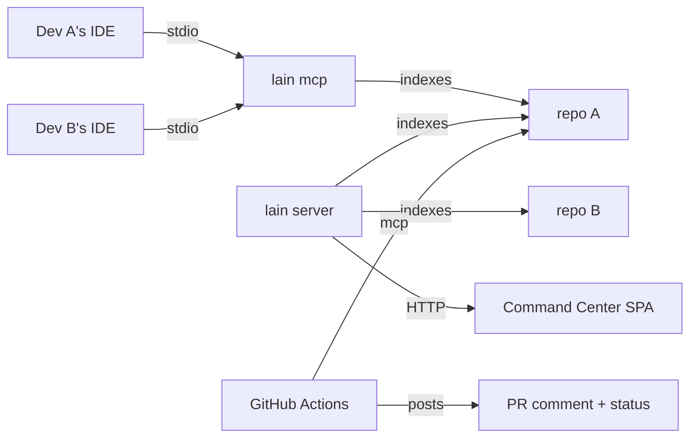

# Lain Cookbook

> Recipes for every way to deploy lain. Pick a mode, copy the recipe,
> ship it.

This document is *task-shaped*. Each recipe answers one question:
"I want X — what do I type, and what should I see?" Existing reference
docs ([QUICKSTART](QUICKSTART.md), [USER_MANUAL](USER_MANUAL.md),
[ARCHITECTURE](ARCHITECTURE.md)) explain the primitives; this
cookbook explains what to do with them.

## Pick your mode

Lain is one binary. It exposes itself to the world in three ways
that don't compete with each other — most production deployments
use more than one.

| You want to... | Mode | What you run |
|---|---|---|
| Make your AI agent in the IDE codebase-aware | **MCP** | `lain mcp` (stdio) |
| Run a web dashboard, federate repos, coordinate multiple agents | **Server** | `lain server` (HTTP) |
| Catch architectural regressions in pull requests | **CI** | The `lain-health-badge` action, or `lain mcp` in a workflow |

**MCP** is the "agent in the IDE" mode. The agent launches lain as a
stdio subprocess per session, and lain answers 69 read-only tools
against the on-disk graph of whatever repo the agent is in. This is
the most common deployment and the one to start with.

**Server** is the "long-running process" mode. You launch lain once,
it indexes a set of repos registered in `repos.yaml`, and serves
both the Command Center SPA (a web UI) and the federation tool
surface (`list_repos`, `get_cross_repo_blast_radius`, `search_org`).
Agents connect to it over stdio via `lain mcp` with multiple
`--workspace` flags, or over HTTP with curl. Use it when you need a
dashboard, cross-repo queries, or coordination that survives agent
restarts.

**CI** is the "ephemeral run" mode. Lain boots in a workflow,
indexes the PR's workspace, posts results as a status check and a
comment, and exits. Use it when you want lain's signals to gate a
merge or to give reviewers context they wouldn't otherwise have.

The three modes are not exclusive. A typical team runs all three:
MCP in each developer's IDE, a Server for the team dashboard, and
the CI badge on every PR.



## Mode 1 — MCP server (your AI agent in the IDE)

**What.** `lain mcp` is a stdio MCP server. Your agent launches it
per session, it walks up from the agent's cwd for `.git`, indexes
the repo, and answers tools.

**Why.** Without lain, an agent either re-reads files every time
(slow) or relies on a grep/RAG system that doesn't know about
calls, anchors, or co-change. With lain, the agent gets 69
read-only tools that answer structural questions in milliseconds:
"what calls `validate_token`?", "what is the blast radius of
changing `parse_input`?", "what are the top 10 foundational
symbols in this codebase?"

**Benefits.**

- 69 read-only tools over MCP — the same ones documented in
  `docs/tool-schema.json`. None of them mutate the workspace.
- Persistent on-disk index at `.lain/graph.bin`. The first call on
  a fresh checkout pays the index cost (seconds to minutes, bounded
  by `LAIN_REINDEX_TIMEOUT`); every later call is sub-second.
- Multiplayer occupancy, so two agents editing the same file see
  each other's claims (`docs/multiplayer.md`).
- The MCP entry is **zero-config**: `{"command":"lain","args":["mcp"]}`
  is the whole thing. No `repos.yaml`, no `workspaces.yaml`, no
  flags. The binary walks up for `.git` and serves.

### Recipe: add lain to Claude Code

Add to `.mcp.json` in your repo (or your global `~/.claude.json`):

```json
{
  "mcpServers": {
    "lain": {
      "command": "lain",
      "args": ["mcp"]
    }
  }
}
```

Restart Claude Code. On the first turn it indexes; on the second
turn, ask "what calls `parse_input`?" and you should see a
`mcp__lain__get_blast_radius` call in the tool trace.

**Verification:** `lain --version` reports a version, the agent
sees `mcp__lain__*` tools, and the first call to any tool returns
in under a second after the first index completes.

**Pitfalls:** first call after install is the re-index — wait it
out, then query. If `get_health` says `Status: Degraded`, raise
`LAIN_REINDEX_TIMEOUT` (default 300s) and restart.

### Recipe: add lain to Kimi Code

The Kimi plugin shim under `npm-shim/` wraps the same `lain mcp`
binary. Install:

```bash
npm install -g @spuentesp/lain-mcp
```

Then add to your Kimi MCP config:

```json
{ "mcpServers": { "lain": { "command": "lain", "args": ["mcp"] } } }
```

The npm package exists for hosts that prefer to install via npm;
it downloads the same prebuilt binary that `install.sh` does.

**Verification:** `lain --version` works, Kimi sees the tools.

**Pitfalls:** if `npm install` warns about `postinstall`, that is
the binary download — it is expected. Allow it.

### Recipe: add lain to Cursor / VS Code Copilot / Continue.dev

The MCP config schema is the same across these hosts. For each,
locate the MCP servers setting and add:

```json
{
  "lain": {
    "command": "lain",
    "args": ["mcp"]
  }
}
```

**Cursor:** `Settings` → `Cursor Settings` → `MCP` → `Add new
global MCP server`. Paste the JSON.

**VS Code Copilot:** `.vscode/mcp.json` in the workspace, or the
Copilot Chat MCP settings UI.

**Continue.dev:** `~/.continue/config.json` under
`"experimental.modelContextProtocolServers"`.

**Verification:** each host lists `lain` (or `mcp__lain__*`)
tools in its tool picker.

**Pitfalls:** some hosts cache the tool list per workspace; if
you change the binary version, restart the host to force a refresh.

### Recipe: first useful query after install

Once the agent is connected, two queries prove the integration
end-to-end:

1. **"What are the top 10 foundational symbols in this codebase?"**
   — exercises `find_anchors`. Expect a numbered list with anchor
   scores in the 0.5-1.0 range for a real codebase.
2. **"What would break if I changed `parse_input`?"** — exercises
   `get_blast_radius`. Expect a list of callers with paths and
   their own callers, transitively.

If both return in under a second, the integration is working.

## Mode 2 — Long-running server (Command Center, federation, multi-agent)

**What.** `lain server` is an HTTP MCP server plus a Command
Center SPA. It runs as a single long-lived process that owns the
index, the workspaces, and the federation tool surface.

**Why.** Single-repo MCP mode scales to "the agent and the repo
it's looking at." Federation mode scales to "the team and the
whole org's repos." When you want to ask questions that span
multiple repos, when you want a web UI to look at the graph, or
when you want occupancy / claims to survive agent restarts, you
need a server.

**Benefits.**

- One pane of glass for an org's repos. Open
  `http://localhost:9999`, see the architecture overview, the
  anchor map, the coupling matrix.
- Cross-repo queries that no other tool produces:
  `get_cross_repo_blast_radius` traces a symbol across every
  registered repo, and `search_org` does semantic search across
  them. These tools do not exist in single-repo mode.
- Multi-agent coordination persists. Two agents in different IDEs
  see each other's claims because they share
  `~/.local/lain/state/`.
- The HTTP transport is a real JSON-RPC endpoint. Anything that
  can `curl` can query lain.

### Recipe: run the Command Center locally (single repo)

For a single-repo local dashboard:

```bash
cd /path/to/your/repo
lain server --transport http --port 9999
# Open http://localhost:9999
```

The Command Center SPA shows anchor maps, call graphs, coupling
matrices, and a file explorer over the index.

**Verification:** the SPA loads, the architecture overview shows
your repo's modules, and the agent you connect to the server can
answer structural queries.

**Pitfalls:** the default port 9999 may be taken; override with
`--port`. The server is HTTP, not HTTPS — don't expose it to the
open internet without a reverse proxy.

### Recipe: federate multiple repos

```bash
mkdir -p ~/projects/myorg && cd ~/projects/myorg
lain repos add repo-a https://github.com/myorg/repo-a.git
lain repos add repo-b https://github.com/myorg/repo-b.git
lain workspaces create myorg --members repo-a,repo-b
lain server --config ./repos.yaml --transport http --port 9999
```

The `repos add` commands clone each repo into the workspace. The
`workspaces create` command groups them. The server indexes all
of them and serves the federation tool surface alongside the
per-repo tools.

**Verification:** `curl -X POST http://localhost:9999/mcp -d
'{"jsonrpc":"2.0","method":"tools/call","params":{"name":"list_repos","arguments":{}},"id":1}'`
returns both repos.

**Pitfalls:** `repos.yaml` is per-server, not per-repo. If you
move the server, the config moves with it; the repos themselves
stay where you cloned them.

### Recipe: install behind a reverse proxy / Tailscale / SSH tunnel

The HTTP transport is unauthenticated. For any deployment
beyond localhost, put it behind a proxy:

```nginx
# nginx snippet
location /lain/ {
  proxy_pass http://127.0.0.1:9999/;
  proxy_set_header Host $host;
  proxy_set_header X-Real-IP $remote_addr;
}
```

For a homelab, Tailscale or an SSH tunnel is the simplest path:

```bash
# On the server host
lain server --transport http --port 9999
# In another terminal
ssh -L 9999:127.0.0.1:9999 your-server
# Open http://localhost:9999 locally
```

**Verification:** the SPA loads through the proxy, the MCP
endpoint answers `tools/list`.

**Pitfalls:** the server has no auth — anything that can reach
port 9999 can read the graph. The reverse proxy is the auth.

### Recipe: drop the Command Center into a homelab / team k8s

A systemd unit is the lightest-weight deployment:

```ini
# ~/.config/systemd/user/lain.service
[Unit]
Description=Lain server
After=network.target

[Service]
Type=simple
ExecStart=/usr/local/bin/lain server --config /srv/lain/repos.yaml --transport http --port 9999
Restart=on-failure

[Install]
WantedBy=default.target
```

```bash
systemctl --user enable --now lain
```

For k8s, the same binary runs as a Deployment. The stateful
piece is `~/.local/lain/state/` — mount a PersistentVolume there
or the claims / occupancy do not survive pod restarts.

**Verification:** the SPA loads, queries return, the server
survives a restart without losing the index (the graph is
persisted at `~/.local/lain/state/`).

**Pitfalls:** the index files are large for big repos (hundreds
of MB). The PV must have room to grow.

## Mode 3 — CI tool (architecture health badge and friends)

**What.** Lain runs as a transient subprocess in a CI job, calls
a small set of read-only tools, and posts the result as a status
check and a comment. The whole integration is one `uses:` line.

**Why.** Plain CI tools tell you what changed. The lain CI
integration tells you whether your *graph* is still trustworthy
and surfaces workspace-level signals no other tool produces:
high-fan-out modules, cross-boundary patterns, freshness of the
index.

**Benefits.**

- Workspace-level signal, not file-level. Catches architectural
  regressions that a diff cannot see.
- Same primitives agents use, so CI reasoning and agent reasoning
  stay consistent.
- Cached index keeps the per-PR cost in the seconds range after
  the first run.
- Outputs are visible in the PR list (status check) and in the
  conversation (sticky comment).

### Recipe: architecture health badge

The `lain-health-badge` action in
`.github/actions/lain-health-badge/` does this end-to-end. To
enable it on your repo:

```yaml
# .github/workflows/ci.yml
name: CI
on:
  pull_request:
    branches: [main]
jobs:
  lain-health:
    runs-on: ubuntu-latest
    steps:
      - uses: actions/checkout@v4
      - uses: spuentesp/lain/.github/actions/lain-health-badge@v0.7.2
        with:
          github-token: ${{ secrets.GITHUB_TOKEN }}
```

That's the whole integration. See the action's
[README](../.github/actions/lain-health-badge/README.md) for
the full reference.

**Verification:** open a PR. A `lain/health-badge` status check
appears in the PR list, and a sticky comment appears in the PR
conversation with the architecture health summary.

**Pitfalls:** first run on a new repo pays the full re-index
cost (1-3 minutes for a 10k-LOC codebase). The cache key is the
git tree hash, so rebases invalidate the cache — expected.

### Recipe: run lain in a sidecar container for custom queries

For queries the action does not cover, run `lain server` as a
service container in your job:

```yaml
jobs:
  custom-query:
    runs-on: ubuntu-latest
    services:
      lain:
        image: ghcr.io/spuentesp/lain:latest
        ports: ['9999:9999']
    steps:
      - uses: actions/checkout@v4
      - run: |
          curl -fsS -X POST http://lain:9999/mcp \
            -H 'Content-Type: application/json' \
            -d '{"jsonrpc":"2.0","method":"tools/call",
                 "params":{"name":"find_dead_code","arguments":{}},
                 "id":1}' | jq -r '.result.content[0].text'
```

The `ghcr.io/spuentesp/lain:latest` image is published alongside
the release; pin to a tag for reproducibility.

**Verification:** the curl response is non-empty and the result
content has the dead-code report.

**Pitfalls:** the service container runs as a different user
than the job, so the on-disk index it builds is in its own
home. Mount a volume or accept the per-job cost.

### Recipe: schedule a nightly anchor-map refresh and post as an artifact

```yaml
name: Nightly anchors
on:
  schedule: [{ cron: '17 3 * * *' }]  # 03:17 UTC
jobs:
  refresh:
    runs-on: ubuntu-latest
    steps:
      - uses: actions/checkout@v4
      - run: |
          lain server --transport http --port 9999 --workspace . &
          sleep 5
          curl -fsS -X POST http://127.0.0.1:9999/mcp \
            -H 'Content-Type: application/json' \
            -d '{"jsonrpc":"2.0","method":"tools/call",
                 "params":{"name":"find_anchors","arguments":{"limit":50}},
                 "id":1}' | jq -r '.result.content[0].text' > anchors.md
      - uses: actions/upload-artifact@v4
        with:
          name: anchors
          path: anchors.md
```

**Verification:** the artifact appears in the workflow run
and `anchors.md` is a ranked list of foundational symbols.

**Pitfalls:** the cron schedule can be delayed by GitHub during
high load — the 17-minute offset (instead of `:00`) avoids the
thundering herd.

## Cross-cutting recipes

### Migrating from "no knowledge" to lain

The order matters. Add MCP mode first — it is the lowest-risk
integration (one config line, no infra). When the team is
comfortable, add the Server for the team dashboard. When the
team is comfortable with the dashboard, add the CI badge. Each
mode is a no-op if the previous one isn't there.

### Custom tool registry subset

The inert-tool list at `src/server/tools.rs:580` is the contract
for which tools are loaded by default. To publish a custom
subset, fork `src/server/tools/registry.rs` and rebuild. Most
teams will not need this; the default 69-tool surface is what
the agents are tested against.

### Self-hosting the embedder model

Semantic search is opt-in and lazy: lain runs in stub mode (no
semantic results) until you point it at a model directory. To
self-host:

1. Download the model files (the same ONNX bi-encoder lain
   uses, ~120 MB).
2. Place them at a path the server can read.
3. Pass `--embedding-model <path>` to `lain server` /
   `lain mcp`, or set `LAIN_EMBEDDING_MODEL=<path>`.

The install script's `--download-model` flag does the first two
steps for you; `install.sh --download-model --yes` is the
shortest path.

### Combining modes

The three modes do not fight. The same `~/.local/lain/state/`
directory is read by MCP and Server mode; the same tool surface
is used by MCP agents and CI workflows. A typical setup:

- Each developer runs `lain mcp` from their IDE.
- The team runs one `lain server` in a homelab, k8s, or a
  dedicated box.
- Every PR runs `lain-health-badge` in CI.

The MCP mode reads from `.lain/graph.bin` in the workspace. The
Server mode reads from `~/.local/lain/state/`. They do not share
on-disk state, which is the right default — a developer's local
index should not be invalidated by the server's. The shared
piece is the tool surface, not the data.

## When NOT to use lain

A cookbook that does not say when to walk away is marketing
copy. Use a different tool if:

- **Your codebase is under ~1k LOC.** The graph is overkill; a
  reader and a good outline beat a query language.
- **Your monorepo has no dominant language and you need uniform
  coverage.** Lain's extractor coverage is uneven across
  languages. Rust and TypeScript are first-class; everything
  else is best-effort.
- **You need a verifier, not a navigator.** Lain answers "what
  does this code do, and what depends on it?" It does not
  answer "is this code correct?" Use a type-checker, a
  property test, or a human reviewer for that.
- **You only need file-level diffs.** A plain `git diff` plus a
  linter is cheaper than a full graph index. The CI badge
  becomes worth it when you want *workspace-level* signal,
  not file-level.

## See also

- [QUICKSTART.md](QUICKSTART.md) — five minutes from install to
  first answer.
- [USER_MANUAL.md](USER_MANUAL.md) — operator reference.
- [ARCHITECTURE.md](ARCHITECTURE.md) — design choices.
- [FEDERATION.md](FEDERATION.md) — multi-repo operating.
- [multiplayer.md](multiplayer.md) — agent coordination.
- [CI.md](CI.md) — operator-facing CI contract lain itself
  enforces.
- [`.github/actions/lain-health-badge/README.md`](../.github/actions/lain-health-badge/README.md) —
  the health-badge action reference.
