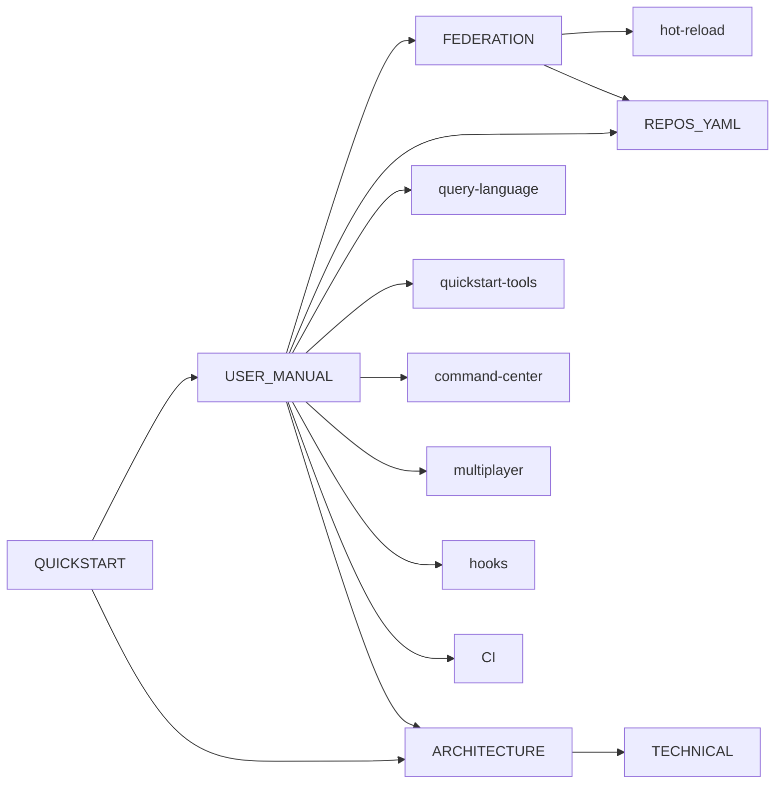

# Docs Index

| Want | Read |
|------|------|
| Get running in five minutes | [QUICKSTART.md](QUICKSTART.md) |
| Operate / troubleshoot | [USER_MANUAL.md](USER_MANUAL.md) |
| Understand design choices | [ARCHITECTURE.md](ARCHITECTURE.md) |
| Read the source | [TECHNICAL.md](TECHNICAL.md) |
| Multi-repo operating | [FEDERATION.md](FEDERATION.md) |
| `repos.yaml` schema | [REPOS_YAML.md](REPOS_YAML.md) |
| `query_graph` ops-array | [query-language.md](query-language.md) |
| All MCP tools | [quickstart-tools.md](quickstart-tools.md) |
| Command Center SPA | [command-center.md](command-center.md) |
| Hot-reload internals | [hot-reload.md](hot-reload.md) |
| Multi-agent presence | [multiplayer.md](multiplayer.md) |
| Pre-edit hooks | [hooks.md](hooks.md) |
| CI pipeline notes | [CI.md](CI.md) |
| Use-case proving tests & inventory | [use_cases_inventory.md](use_cases_inventory.md) |

## In one sentence

`lain` is a persistent code-intelligence MCP server that builds a
structural map of your code (calls, dependencies, co-change) and
answers structural questions about it through any MCP-aware agent.

## Conventions

- Federation tools in two places: [FEDERATION.md](FEDERATION.md)
  (operator view) and [TECHNICAL.md §"Cross-repo blast-radius
  semantics"](TECHNICAL.md#cross-repo-blast-radius-semantics)
  (internals).
- "Single-repo" = `lain mcp`. "Federation" = `lain server --config
  repos.yaml`. They share every lower layer except the orchestrator.
- `get_health.Build:` and `get_health.Status:` exist so an agent
  can tell whether to trust the rest of the answer. See
  [TECHNICAL.md](TECHNICAL.md#reading-get_health).

## License

MIT — Copyright (c) 2026 spuentesp
