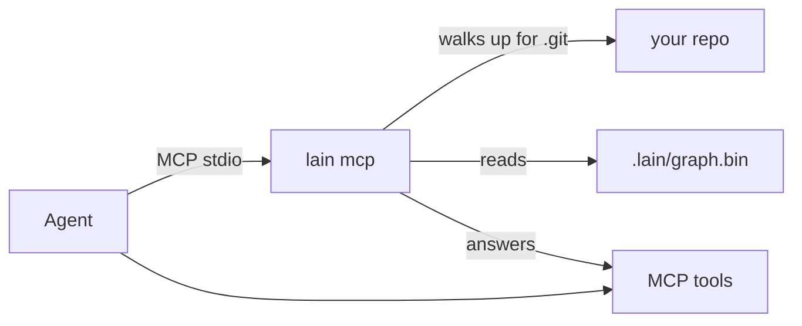
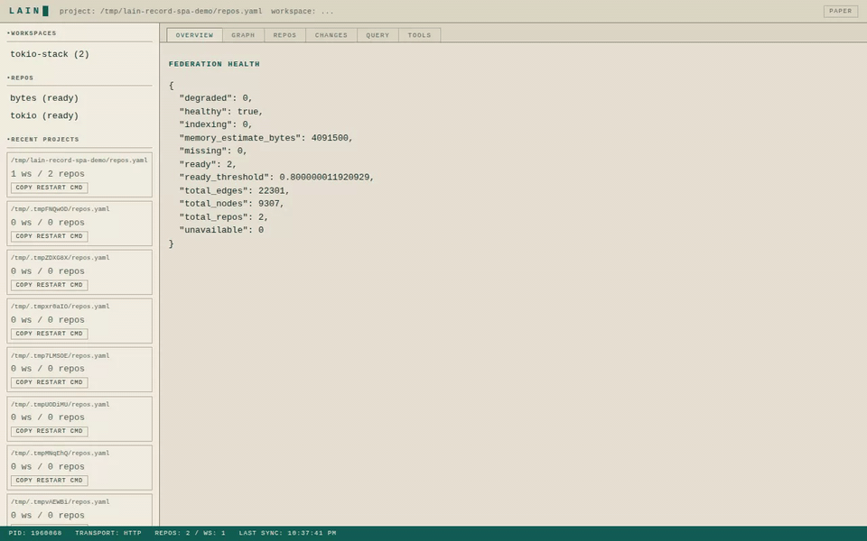

# Quickstart

> Five minutes from install to first answer.

## Install

```bash
curl -fsSL https://raw.githubusercontent.com/spuentesp/lain/main/install.sh | bash
source ~/.zshrc   # or ~/.bashrc
lain --version
```

Optional — semantic search model (~120 MB):

```bash
curl -fsSL https://raw.githubusercontent.com/spuentesp/lain/main/install.sh | \
  bash /dev/stdin --download-model --yes
```

After installation:

```bash
source ~/.zshrc   # or ~/.bashrc
lain --version
lain --help
```

## Pick a mode

| Mode | When | MCP config |
|------|------|------------|
| **Single-repo** (`lain mcp`) | One repo, "just works" | `{"command":"lain","args":["mcp"]}` |
| **Federation** (`lain server --config repos.yaml`) | N repos, org-wide questions | `{"command":"lain","args":["server","--config","./repos.yaml","--transport","stdio"]}` |



## Single-repo (recommended default)

Add to your agent's MCP config:

```json
{ "mcpServers": { "lain": { "command": "lain", "args": ["mcp"] } } }
```

Start your agent inside your repo. On the first turn it indexes in
the background; on the next turn it can ask *"if I change
`validate_token`, what else breaks?"* via `get_blast_radius`.

**First query**

```bash
# After your agent has indexed once, drop into a terminal:
curl -s -X POST http://localhost:9999/mcp -H 'Content-Type: application/json' \
  -d '{"jsonrpc":"2.0","method":"tools/call","params":{"name":"get_blast_radius","arguments":{"symbol":"validate_token","depth":"1..3"}},"id":1}'
```

Expected: a JSON `result.content[0].text` listing the callers of `validate_token` plus their paths.

## Federation (multi-repo)

```bash
mkdir -p ~/projects/biller && cd ~/projects/biller
lain repos add auth-svc    https://github.com/acme/auth-svc.git
lain repos add billing-svc https://github.com/acme/billing-svc.git
lain workspaces create biller-core --members auth-svc,billing-svc
lain server --config ./repos.yaml --transport http --port 9999
# Open http://localhost:9999 — Command Center
```

Add to your agent's MCP config:

```json
{ "mcpServers": { "lain": { "command": "lain", "args": ["server",
    "--config","./repos.yaml","--transport","stdio"] } } }
```

**First query**

```bash
# The same cross-repo blast-radius query the video shows:
curl -s -X POST http://localhost:9999/mcp -H 'Content-Type: application/json' \
  -d '{"jsonrpc":"2.0","method":"tools/call","params":{"name":"get_cross_repo_blast_radius","arguments":{"symbol":"verify_token","depth":"1..3"}},"id":1}'
```

Expected: the response names at least one caller in `billing-svc`.

### Smoke test the federation

```bash
# Server identity
curl -s -X POST http://localhost:9999/mcp -H 'Content-Type: application/json' \
  -d '{"jsonrpc":"2.0","method":"tools/call","params":{"name":"get_health","arguments":{}},"id":1}'

# Federation repos
curl -s -X POST http://localhost:9999/mcp -H 'Content-Type: application/json' \
  -d '{"jsonrpc":"2.0","method":"tools/call","params":{"name":"list_repos","arguments":{}},"id":1}'

# Cross-repo blast radius
curl -s -X POST http://localhost:9999/mcp -H 'Content-Type: application/json' \
  -d '{"jsonrpc":"2.0","method":"tools/call","params":{"name":"get_cross_repo_blast_radius","arguments":{"symbol":"verify_token","depth":"1..3"}},"id":1}'
```

## Watch it in action



**Watch in HD** ([MP4](screenshots/spa-demo.mp4), [WebM](screenshots/spa-demo.webm)).

## First aid

| Symptom | Try |
|---------|-----|
| Agent says "no tools available" | Check MCP config; restart the agent |
| "Symbol not found" where it exists | `lain mcp` awaits its first re-index before answering, so the first call after `initialize` should already see a populated graph. If `get_health` shows `Status: Degraded ⚠ timed out`, raise `LAIN_REINDEX_TIMEOUT` (default 300s) and restart; if it shows `Degraded ⚠ failed`, the indexer hit an error — check the stderr banner for the cause |
| Semantic search "unavailable" | Install the model (top of page) and set `LAIN_EMBEDDING_MODEL` |
| Federation won't start | `lain doctor` |
| Agents not seeing each other's claims | Check `list_active_agents`; they must share `~/.config/lain/state/` |

## Next

| Want | Read |
|------|------|
| Operate `lain` for a team | [USER_MANUAL.md](USER_MANUAL.md) |
| Understand design choices | [ARCHITECTURE.md](ARCHITECTURE.md) |
| Read the source | [TECHNICAL.md](TECHNICAL.md) |
| Federation operating guide | [FEDERATION.md](FEDERATION.md) |
| Edit `repos.yaml` | [REPOS_YAML.md](REPOS_YAML.md) |
| Multi-agent coordination | [multiplayer.md](multiplayer.md) |
| Full tool reference | [quickstart-tools.md](quickstart-tools.md) |
| Command Center | [command-center.md](command-center.md) |
| `query_graph` ops-array | [query-language.md](query-language.md) |
| All docs | [INDEX.md](INDEX.md) |
