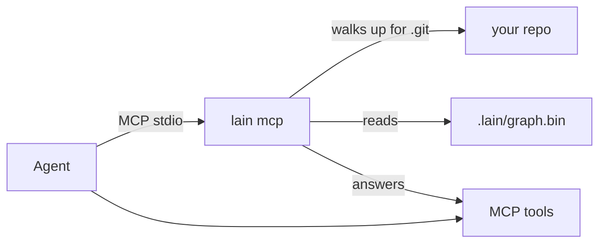

# Quickstart

> Five minutes from install to first answer.

## Install

```bash
curl -fsSL https://raw.githubusercontent.com/spuentesp/lain/main/install.sh | bash
source ~/.zshrc   # or ~/.bashrc
lain --version
```

Optional — semantic search model (~120 MB):

```bash
curl -fsSL https://raw.githubusercontent.com/spuentesp/lain/main/install.sh | \
  bash /dev/stdin --download-model --yes
```

After installation:

```bash
source ~/.zshrc   # or ~/.bashrc
lain --version
lain --help
```

## Pick a mode

| Mode | When | MCP config |
|------|------|------------|
| **Single-repo** (`lain mcp`) | One repo, "just works" | `{"command":"lain","args":["mcp"]}` |
| **Federation** (`lain server --config repos.yaml`) | N repos, org-wide questions | `{"command":"lain","args":["server","--config","./repos.yaml","--transport","stdio"]}` |


```mermaid
flowchart LR
    A["Agent"] -->|MCP stdio| L["lain mcp"]
    L -->|walks up for .git| R["your repo"]
    L -->|reads| G[".lain/graph.bin"]
    L -->|answers| T["MCP tools"]
    A --> T
```

## Single-repo (recommended default)

Add to your agent's MCP config:

```json
{ "mcpServers": { "lain": { "command": "lain", "args": ["mcp"] } } }
```

Start your agent inside your repo. On the first turn it indexes in
the background; on the next turn it can ask *"if I change
`validate_token`, what else breaks?"* via `get_blast_radius`.

**First query**

```bash
# From the repository, in a terminal (no server needed):
lain oneshot get_blast_radius validate_token
```

Expected: `validate_token`'s direct callers with their files, then the
indirect ones with their depth. Use a symbol from your repository.

## Federation (multi-repo)

```bash
mkdir -p ~/projects/tokio-stack && cd ~/projects/tokio-stack
lain repos add bytes    https://github.com/tokio-rs/bytes.git
lain repos add tokio https://github.com/tokio-rs/tokio.git
lain workspaces create tokio-stack --members bytes,tokio
lain server --config ./repos.yaml --transport http --port 9999
# Open http://localhost:9999 — Command Center
```

Add to your agent's MCP config:

```json
{ "mcpServers": { "lain": { "command": "lain", "args": ["server",
    "--config","./repos.yaml","--transport","stdio"] } } }
```

**First query**

```bash
# Pick the top anchor of the bytes repo and trace it across tokio.
curl -s -X POST http://localhost:9999/mcp -H 'Content-Type: application/json' \
  -d '{"jsonrpc":"2.0","method":"tools/call","params":{"name":"find_anchors","arguments":{"repo_id":"bytes","limit":10}},"id":1}'

# Then, with the top result as the symbol, pinned to the repo it came from:
curl -s -X POST http://localhost:9999/mcp -H 'Content-Type: application/json' \
  -d '{"jsonrpc":"2.0","method":"tools/call","params":{"name":"get_cross_repo_blast_radius","arguments":{"repo_id":"bytes","symbol":"<top-anchor>","depth":"1..3"}},"id":1}'
```

Expected: the first call returns a numbered list of `bytes` anchors; replace `<top-anchor>` with the first item (e.g. `put_slice`) and the second response lists that symbol's callers grouped by repo, in both `bytes` and `tokio`. Pinning `repo_id` matters: `put_slice` is also defined in tokio, so without it `get_cross_repo_blast_radius` asks you to choose.

### Smoke test the federation

```bash
# Server identity
curl -s -X POST http://localhost:9999/mcp -H 'Content-Type: application/json' \
  -d '{"jsonrpc":"2.0","method":"tools/call","params":{"name":"get_health","arguments":{}},"id":1}'

# Federation repos
curl -s -X POST http://localhost:9999/mcp -H 'Content-Type: application/json' \
  -d '{"jsonrpc":"2.0","method":"tools/call","params":{"name":"list_repos","arguments":{}},"id":1}'

# Workspace graph (cross-repo)
curl -s -X POST http://localhost:9999/mcp -H 'Content-Type: application/json' \
  -d '{"jsonrpc":"2.0","method":"tools/call","params":{"name":"get_workspace_graph","arguments":{}},"id":1}'
```

## Watch it in action


## First aid

| Symptom | Try |
|---------|-----|
| Agent says "no tools available" | Check MCP config; restart the agent |
| "Symbol not found" where it exists | `lain mcp` awaits its first re-index before answering, so the first call after `initialize` should already see a populated graph. If `get_health` shows `Status: Degraded ⚠ timed out`, raise `LAIN_REINDEX_TIMEOUT` (default 300s) and restart; if it shows `Degraded ⚠ failed`, the indexer hit an error — check the stderr banner for the cause |
| Semantic search "unavailable" | Install the model (top of page) and set `LAIN_EMBEDDING_MODEL` |
| Federation won't start | `lain doctor` |
| Agents not seeing each other's claims | Check `list_active_agents`; they must share `~/.config/lain/state/` |
| `lain oneshot ... \| head -N` killed the indexer | `head` closes the pipe when it exits, sending `SIGPIPE` upstream; on a cold graph the long-running `lain mcp` aborts mid-reindex and leaves a partial `graph.bin`. Either pipe to a file (`> /tmp/lain.log`) or to a tool that reads to EOF (`jq`, `tee`, `wc -l`). The footgun is logged in `DOGFOODING_REPORT.md` (2026-10-04, B7). |
| `get_health` shows **⚠ call graph is empty — `Calls` is 0** | The persistent `graph.bin` was written by a build that didn't extract `Calls` edges, or by a partial reindex that timed out. Every `get_blast_radius` / `get_call_chain` / `assess_change` answer will be empty until this is fixed. **Recipe:** from inside the repo, run `lain reindex` to rebuild the graph from source. The first reindex takes ~5 min for a 41k-LOC repo (LSP prewarm is the dominant cost). See `DOGFOODING_REPORT.md` (2026-10-04, B3). |

## Next

| Want | Read |
|------|------|
| Operate `lain` for a team | [USER_MANUAL.md](USER_MANUAL.md) |
| Understand design choices | [ARCHITECTURE.md](ARCHITECTURE.md) |
| Read the source | [TECHNICAL.md](TECHNICAL.md) |
| Federation operating guide | [FEDERATION.md](FEDERATION.md) |
| Edit `repos.yaml` | [REPOS_YAML.md](REPOS_YAML.md) |
| Multi-agent coordination | [multiplayer.md](multiplayer.md) |
| Full tool reference | [quickstart-tools.md](quickstart-tools.md) |
| Command Center | [command-center.md](command-center.md) |
| `query_graph` ops-array | [query-language.md](query-language.md) |
| All docs | [INDEX.md](INDEX.md) |
