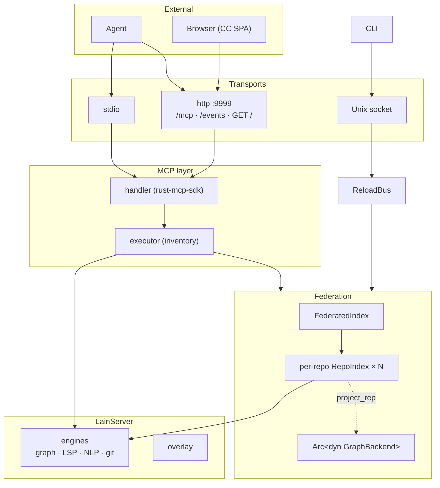
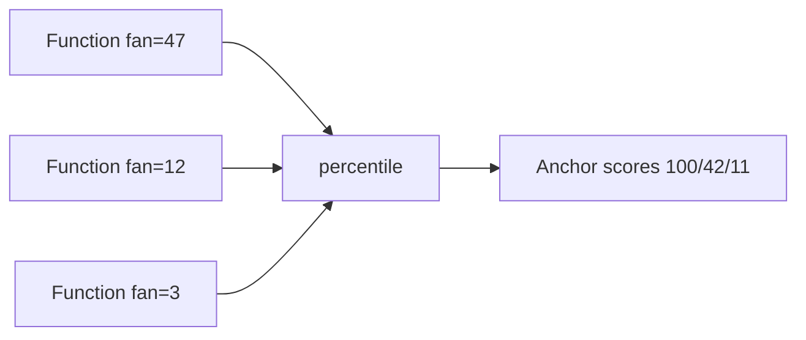
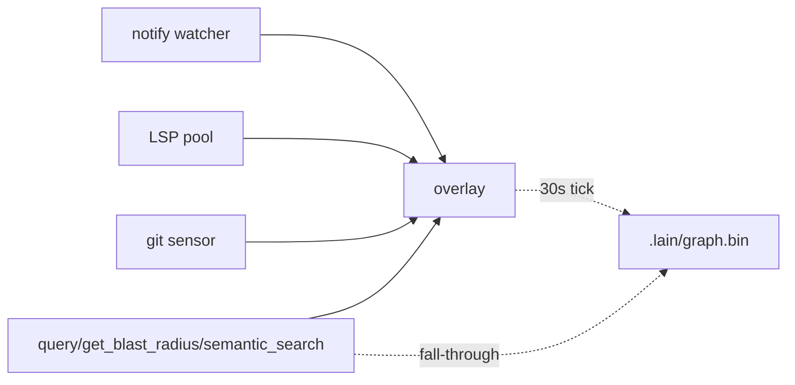
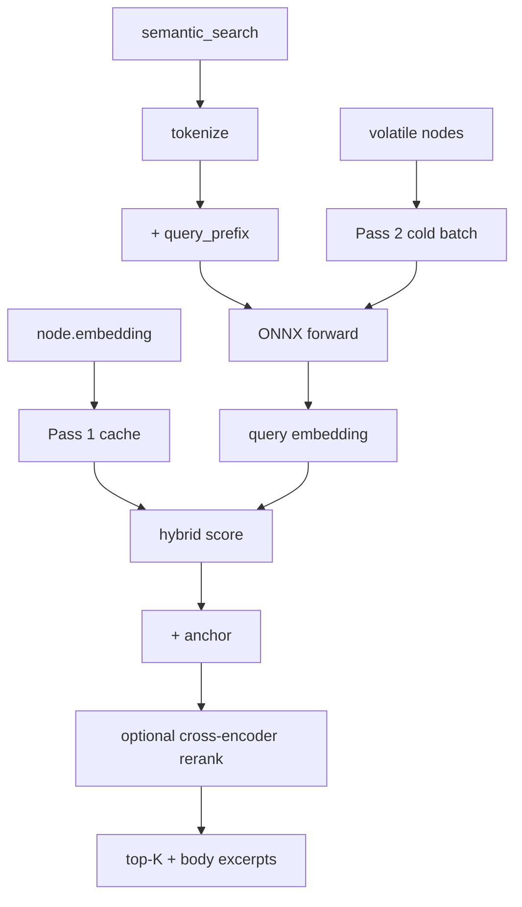
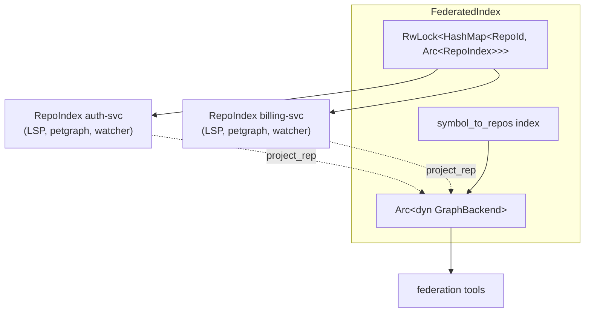
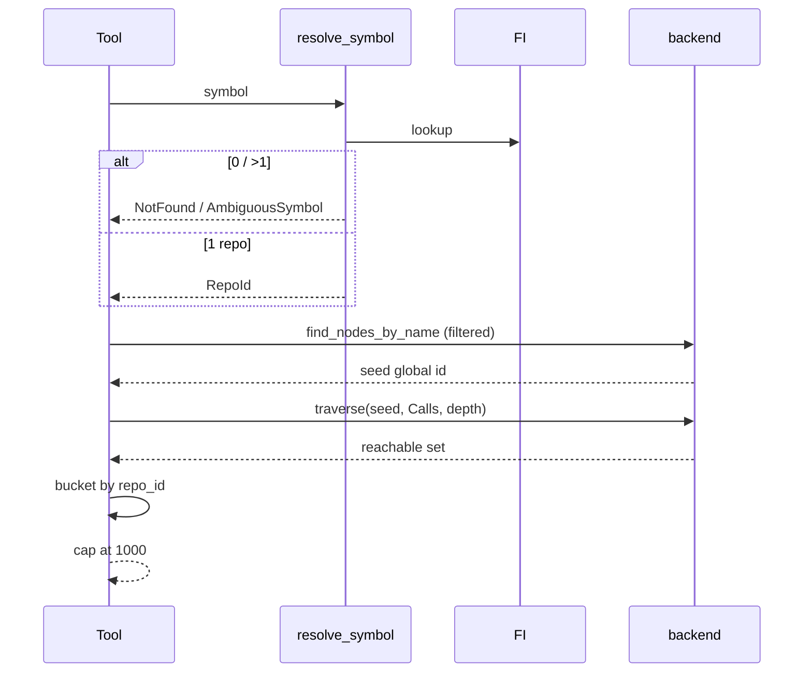
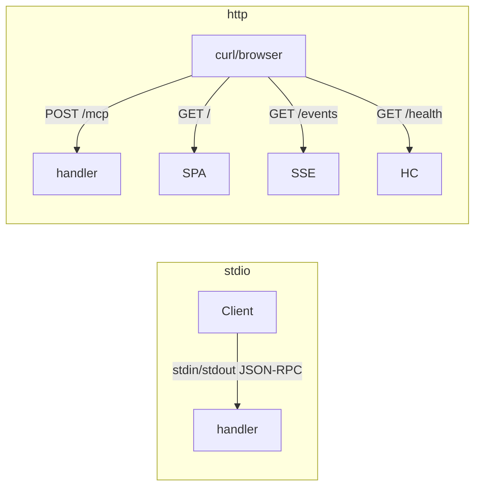
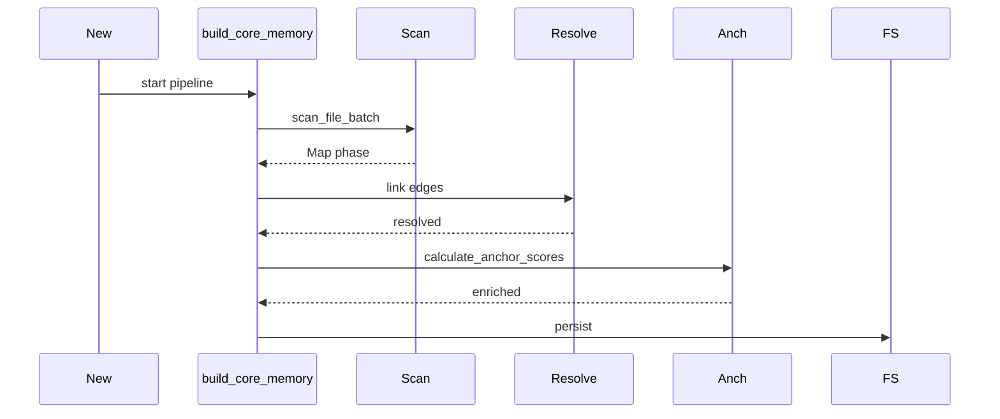

# Technical Reference

Source-level internals. Design rationale in [ARCHITECTURE.md](ARCHITECTURE.md);
operator guide in [USER_MANUAL.md](USER_MANUAL.md); tool reference in
[quickstart-tools.md](quickstart-tools.md).

## System overview



| Component | Owns |
|-----------|------|
| **MCP handler** | `tools/list`, `tools/call` JSON-RPC dispatch |
| **Tool executor** | inventory-collected `ToolHandlerEntry`s, input validation |
| **`LainServer`** | Single-workspace analytical surface (graph, LSP, NLP, git, overlay) |
| **`FederatedIndex`** | `RwLock<HashMap<RepoId, Arc<RepoIndex>>>` + global `Arc<dyn GraphBackend>` |
| **Per-repo worker** | LSP pool, tree-sitter extractor, per-repo petgraph, watcher, bincode |
| **ReloadBus** | `broadcast::Sender<()>` (cap 16) + `Arc<Mutex<ReloadStatus>>` |
| **Command Center SPA** | Operator UI over the same JSON-RPC |

The MCP layer is the only thing the agent sees; everything below
can be reorganized without changing the wire protocol.

### Project resolution (`--config` not given)

1. `--config` flag → 2. `./repos.yaml` → 3. `./.lain/repos.yaml` →
4. `~/.config/lain/repos.yaml` → 5. original path (fails not-found).

### Workspace resolution for `lain mcp`

1. Repeated `--workspace PATH` (one or many, in argv order).
2. `LAIN_WORKSPACE` env var — comma-separated list of paths.
3. Walk up from the agent harness's cwd, read via `/proc/$PPID/cwd`
   on Linux. This is what makes `lain mcp` work under Kimi's
   plugin-security cwd pinning without any wrapper script.
4. Fall back to walking up from the process's own cwd.

Flag > env > /proc > process cwd. Whichever step produces a path
with a `.git` ancestor wins.

Single resolved workspace: `lain mcp` boots `LainServer::new` for
that repo and serves the per-repo MCP tool surface on stdio.

Multiple resolved workspaces: `lain mcp` synthesizes an in-memory
`repos.yaml` (one `workspace_dir` source per workspace) and
delegates to `lain server --transport stdio`. Agents that ask for
two or more repos get the same federation surface
(`list_repos`, `search_org`, `get_federation_health`) as `lain
server`, without having to author a config file themselves.

For federation (`lain server --config repos.yaml`), the workspace
resolution is unchanged: `--workspace <name>` → `--workspace auto`
reads `~/.config/lain/active_workspace` → federation loads all
workspaces; tools that need one fall back to active.

## Knowledge graph (`src/graph.rs`)

petgraph directed graph at `.lain/graph.bin`.

### Node types (18)

`File`, `Namespace`, `Module`, `Package`, `Class`, `Interface`,
`Struct`, `Enum`, `Trait`, `Function`, `Method`, `Property`,
`Variable`, `Constant`, `HttpRoute`, `Topic`, `Resource`, `Schema`.

(Order matches the enum declaration in `src/server/schema.rs`.)

`Function` and `Method` are distinct. In Rust most code is
`Method`, so filtering by `Function` alone misses it. `describe_schema`
builds its node-type list from `NodeType::all()` so the documented
schema cannot drift from the graph.

### Edge types (12)

| Edge | Meaning | Source |
|------|---------|--------|
| `Contains` | File/module contains a symbol | tree-sitter |
| `Calls` | Function invocation | LSP `find_references` (high) or tree-sitter (medium) |
| `Uses` | Code uses a variable or type | tree-sitter |
| `Implements` | Class implements interface | tree-sitter |
| `Imports` | Import statement | tree-sitter |
| `CoChangedWith` | Historical co-change | git history |
| `Pattern` | Cross-boundary pattern | tree-sitter |
| `CallsHttp` / `Produces` / `Consumes` / `DeployedTo` | Cross-runtime | indexers |
| `CrossRepoSameSymbol` | Federation only | `find_cross_repo_matches` |

### `fan_in` vs `calls_in`

`fan_in`/`fan_out` count every edge kind including `Contains` — so
`fan_in == 0` is essentially never true, useless as "no callers".
`calls_in`/`calls_out` count `Calls` only. Anything asking "who calls
this?" must read the latter.

### Node identity

UUID v5 over `(NodeType, FilePath, SymbolName, line_start?)`. Same
input → same id, forever. `line_start` disambiguates two same-named
symbols at different lines.

For federation, re-keyed to `repo_id:NodeType:path:name` before
landing globally (so no `File`/`Module` collisions across repos).
`RepoId::new` rejects empty / colon / slash.

### Anchor scores

Two-pass percentile-normalized to `[0, 100]` per corpus. Top
symbol = 100; everything else scales. Search formula
`sim + anchor_weight × anchor` is consistent across reindexes.



## Volatile overlay (`src/overlay.rs`)

In-memory graph layer *on top of* the persistent graph. Reads see
`(persistent ∪ overlay)` with overlay precedence; writes go to
overlay first; periodic sync flushes in batches.



`get_health`'s `_meta.revision` moves on overlays but not on
presence changes — it counts *what the graph sees*, not *what the
state registry sees*.

## LSP bridge (`src/lsp.rs`)

JSON-RPC over stdio to N child processes (one per language).
Speaks Rust, Go, TS/JS, Python, C/C++, C#, Java, Kotlin, Ruby,
Scala, Svelte.

`Calls` edges use LSP `find_references` on demand — never static
heuristics alone. Heuristics provide the broad shape; LSP provides
precision.

## NLP embedder (`src/nlp.rs`)

Local ONNX via [ORT](https://onnxruntime.ai/). Recommended model:
`bge-small-en-v1.5` (BAAI, 384d, ~120MB). Default: `all-MiniLM-L6-v2`.

**Asymmetric retrieval** — BGE expects queries to carry an
instruction prefix, corpus does not. `embed_query()` applies the
prefix; `embed()` never does. The convention was promoted to an
API invariant after two of three query paths had silently omitted
it.



Two-pass scoring: in-memory cache + persisted `node.embedding`,
then cold batched forward pass for uncached nodes with right-
padding to longest input. Hybrid score:
`(1 − lex_weight) × sim + lex_weight × token_recall`.

`nlp_max_threads` in `tuning.toml` (0 = `min(cores, 4)`). BGE
inference doesn't benefit from more than 4.

## Git sensor (`src/git.rs`)

Walks commit history for `CoChangedWith` edges (Jaccard similarity
on file-change sets). `get_coupling_radar` reports the result.

`GitSensor::get_repo_identity()` parses the git remote URL →
`RepoIdentity { owner, name }`. Used by `get_agent_strategy` to
orient the agent in the repo.

## Background jobs (`src/server/jobs.rs`)

| Job | Trigger | Cadence |
|-----|---------|---------|
| Incremental sync | file change | on-event |
| Sliding Window (overlay flush) | periodic | 30 s |
| Background sync (anchor scores) | periodic | 60 s |
| Lazy NLP (post-sync embed) | post-sync | on-demand |
| Full enrichment | `run_enrichment` | manual |

## Federation (`src/server/federation/`)



Two key traits:

- **`RepoSource`** — how code is obtained.
  `LocalCloneSource` (full clone + fetch + reset),
  `ShallowCloneSource` (depth-1),
  `WorkspaceDirSource` (no-op, back-compat shim).
- **`GraphBackend`** — how the projected graph is stored.
  `PetgraphBackend` is the only impl; `MemgraphBackend` is deferred.

Single-workspace mode (`--workspace` flag) constructs a
`FederatedIndex` scoped to that workspace's members via
`LainServer::with_federation_and_workspaces*`. Single-repo mode
(`lain mcp`) goes through `LainServer::new` and does *not*
construct a `FederatedIndex` — it shares every lower layer except
the multi-repo orchestrator.

`project_repo(id)` re-keys nodes to global ids, upserts them, then
iterates other repos' nodes and runs `find_cross_repo_matches` on
each projected symbol's signature (tokenized to identifier-like
tokens; cosine sim > 0.5; top-5 per symbol). Matches become
`CrossRepoSameSymbol` edges weighted by similarity.

## Cross-repo blast-radius semantics



Traversal is **outgoing-only** along `Calls`. Bucket visited nodes
by `RepoId` (parsed from each node's global id) into a
`BTreeMap<String, Vec<String>>`. Cap at `BLAST_RADIUS_CAP = 1000`;
when hit, `truncated: true`. The seed is excluded by `min_depth=1`.

`_for_repo` variant skips `resolve_symbol` when the caller knows
the owning repo.

## MCP transports



Tools registered via `inventory::collect!(ToolHandlerEntry)` (in
`src/server/tools/registry.rs`), where each entry wraps a
`&'static dyn ToolHandler`.
Handler dispatches by tool name.

## Data flow

### Initial indexing



### Incremental sync

`notify` event → `sync_volatile_overlay` → `process_change(path)` →
overlay nodes/edges updated. Sliding-window job (30 s) flushes
overlay to `.lain/graph.bin`.

### Query flow (`get_blast_radius`)

MCP request → handler → `ToolExecutor::execute` → handler calls
`GraphDatabase` → if `Calls` edges stale, LSP `find_references` to
refresh → traverse → return.

`query_graph` ops: `find`, `connect`, `filter`, `semantic_filter`,
`group`, `sort`, `limit`. Full reference in [query-language.md](query-language.md).

## Edge confidence

| Edge | Source | Confidence |
|------|--------|------------|
| `Calls` (LSP) | `find_references` | High |
| `Calls` (heuristic) | tree-sitter | Medium |
| `Contains` / `Implements` / `Imports` | tree-sitter AST | High |
| `CoChangedWith` | git history | Historical (temporal, not lexical) |

Use `get_health` to see which LSP servers are ready.

### Reading `get_health`

Two fields exist so an agent can tell whether to trust the answer:

- **`Build:`** — version + git SHA + warning if a newer binary is
  on disk. MCP stdio is spawn-once per client session; the binary
  answering your calls can be older than your source tree.
- **`Status:`** — `Operational ✅` or `Degraded ⚠`. A degraded
  server's "not found" means "not in this graph", not "does not
  exist".

## Configuration

### Environment variables

| Variable | Default | Purpose |
|----------|---------|---------|
| `LAIN_GRAPH_DIR` | `.lain` | Graph storage dir |
| `LAIN_EMBEDDING_MODEL` | (none) | ONNX model path |
| `LAIN_HTTP_PORT` | `9999` | HTTP diagnostics port |
| `LAIN_URL` / `LAIN_SERVER_URL` | (none) | Used by hooks |
| `LAIN_PARENT_AGENT_ID` | (none) | Subagent inheritance |
| `LAIN_AGENT_NAME` | (none) | Override agent name |
| `RUST_LOG` | `info` | tracing level |

### `lain server` flags

```
--config <path>            Path to repos.yaml (default: ./repos.yaml)
--transport <mode>          stdio | http (default: stdio)
--port <port>               HTTP port (default: 9999)
--workspace <name>          Workspace or "auto"
--log-level <env-filter>    tracing EnvFilter (default: info)
--embedding-model <path>    ONNX model path
--no-process-attribution    Disable /proc/<pid>/fd
```

## Persistence

| Path | What |
|------|------|
| `.lain/graph.bin` | per-repo petgraph, bincode |
| `.lain/federation/<repo-id>/` | per-repo data (clones, per-repo graphs) |
| `.lain/federation/federated_graph.bin` | global petgraph |
| `~/.local/lain/state/<stem>-<hash>.json` | presence state |
| `~/.local/lain/run/<stem>.sock` | hot-reload socket |
| `~/.config/lain/recent_projects.json` | recent project list |

Inspect: `curl -X POST http://localhost:9999/mcp ... '{"jsonrpc":"2.0","method":"tools/call","params":{"name":"export_graph_json","arguments":{}},"id":99}'`

## Directory layout

```
src/
├── main.rs, lib.rs, state.rs
├── server/
│   ├── mod.rs                       # LainServer, transports
│   ├── federation/                  # config, repo_id, repo_source,
│   │                                # repo_index, federated_index,
│   │                                # graph_backend, matching,
│   │                                # workspace, loader, health,
│   │                                # manifest
│   ├── mcp/                         # handler, federation_tools/,
│   │                                # presence_tools/, definitions,
│   │                                # envelope, overlay_sse,
│   │                                # command_center/ (SPA)
│   ├── tools/                       # executor, registry,
│   │                                # handlers/<category>.rs
│   ├── query/                       # spec, executor, schema
│   ├── ingest/                      # server, ingestion, scan,
│   │                                # resolve, jobs, background,
│   │                                # config, constructors
│   ├── sensors/                     # http_sensor, graphql_sensor,
│   │                                # openapi_sensor, proto_sensor,
│   │                                # websocket_sensor
│   ├── overlay.rs, overlay/stream.rs
│   ├── graph.rs, lsp.rs, nlp.rs, git.rs, treesitter.rs
│   ├── toolchains.rs, watcher.rs, reload.rs
│   ├── schema.rs, tuning.rs
│   ├── presence.rs, presence_lock.rs
│   ├── attribution.rs, audit.rs, auth.rs
│   ├── build_info.rs, sse.rs, events_log.rs
│   ├── state_lock.rs, sync_status.rs, revision_log.rs
│   ├── glob_match.rs, sentinel.rs, time.rs, error.rs
│   └── refresh/
├── cli/                             # subcommands + dispatch
└── config/                          # config types
```

## License

MIT — Copyright (c) 2026 spuentesp
