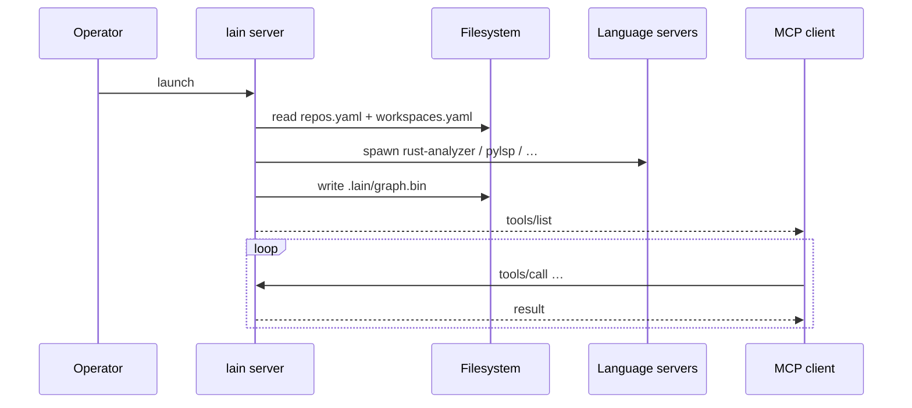
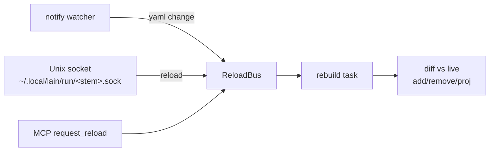

# User Manual

The README covers installation and a first query. This manual holds the CLI
reference, tuning options, and day-to-day operating notes.

## Concepts

| Term | Meaning |
|------|---------|
| **Project** | A directory with `repos.yaml` (and optionally `workspaces.yaml`) |
| **Workspace** | Named subset of repos from `repos.yaml`. Active one is read once at server start via `--workspace auto` (from `~/.config/lain/active_workspace`) |
| **Federation** | `lain server`'s view of N repos. Not a separate mode |
| **Single-repo** | `lain mcp` — walks up for `.git`, no `repos.yaml` needed |
| **Graph** | petgraph at `.lain/graph.bin`. UUID v5 ids so they round-trip across tools |

## CLI reference

| Command | Purpose |
|---|---|
| `lain mcp` | Start a single-repository MCP server on stdio. It walks up from the current directory to find `.git`; no `repos.yaml` is required. |
| `lain setup` | Configure an MCP client and verify the connection. `--dry-run` and `--print-config` don't write files. |
| `lain oneshot` | Start a temporary MCP server, call one tool, print the answer, and exit. Example: `lain oneshot get_blast_radius validate_token`. |
| `lain server` | Start the federation server and, with HTTP transport, the Command Center. |
| `lain repos` | Add, list, or remove entries in `repos.yaml`. |
| `lain workspaces` | Create and switch named groups of repositories. |
| `lain query` | Run a `query_graph` operation array against a saved graph. |
| `lain init` | Create a minimal `repos.yaml` for the current Git repository. |
| `lain hooks` | Claim or release files and check branch overlap from agent hooks. |
| `lain doctor` | Check the binary, graph freshness, install paths, and MCP connection. Exit codes are 0 ready, 1 degraded, and 2 unusable. |
| `lain capabilities` | Print structural, semantic, runtime, and coordination readiness. Add `--json` for scripts. |
| `lain status` | Print repository, index, and MCP readiness. Add `--json` for scripts. |
| `lain schema` | Write the MCP tool schema used by schema-drift CI. |

Run `lain <command> --help` for flags. The generated MCP tool schema lives at
[`tool-schema.json`](tool-schema.json); the human-readable tool guide is
[`quickstart-tools.md`](quickstart-tools.md).

## Server lifecycle



Facts worth knowing:

- **stdio is spawn-once per session.** `cargo build` does not restart
  the agent's `lain`. Use `get_health.Build:` to see what binary your
  calls are reaching.
- **HTTP is long-running.** `lain server` does not daemonize; use
  your usual supervisor.
- **Config is hot-reloaded.** `notify` watcher + Unix socket +
  `request_reload` tool. See [hot-reload.md](hot-reload.md).
- **Presence survives restarts.** Persisted to
  `~/.local/lain/state/<stem>-<hash>.json`.

## Hot reload

Three signal sources fan into one `ReloadBus` (capacity 16):



The CLI writes YAML atomically (temp + rename), then signals the
server. `get_reload_status` reports the state (`idle` /
`rebuilding` / `failed`); Command Center status bar polls every 2 s.

**Not hot-reloaded:** active workspace switch, `--embedding-model`,
`--transport`, `--port`.

## Tuning

`.lain/tuning.toml`. Defaults shown; only set the keys you need.

```toml
semantic_similarity_threshold = 0.3
query_prefix = ""                       # BGE: "Represent this sentence for searching relevant passages: "
lexical_weight = 0.0
anchor_weight = 0.3
cross_encoder_top_k = 20

[ingestion]
lsp_pool_size = 4
files_per_batch = 50
max_files_per_scan = 5000

[presence]
interactive_session_ttl_secs = 600      # agent doing ordinary work
background_session_ttl_secs  = 60       # cron / CI agents
inferred_claim_ttl_secs      = 120      # how long a *guessed* claim lives
state_lock_acquire_timeout_ms = 2000    # then proceed without lock
state_lock_retry_interval_ms  = 20      # tail latency under contention
```

Cold language servers get one `documentSymbol` request before the main scan.
These settings control that warm-up:

```toml
[ingestion]
lsp_prewarm_timeout_secs = 30
lsp_prewarm_max_files = 50
lsp_prewarm_opt_out = false
lsp_prewarm_skip_extensions = ["js", "css"]
```

Set `LAIN_LSP_PREWARM=false` to skip the warm-up without editing the file.
`lain doctor --json` prints the resolved settings and the result for each
language server.

`state_lock_retry_interval_ms` sets the contention tail latency:
with eight agents on one file, p99 on `claim_files` is roughly ten
retries' worth.

## Reading the answers

Tools that are easy to over-trust — what they actually mean:

| Tool | Reports | Does **not** mean |
|------|---------|-------------------|
| `find_dead_code` | No `Calls` edges **and** no textual reference anywhere | "Safe to delete." Excludes tests, unindexed files, any symbol whose name appears elsewhere in the tree. Macro-built identifiers are invisible. |
| `get_blast_radius` | Transitive `Calls`/`Uses` dependents (direct + indirect) | "Everything in these files." Doesn't follow `Contains`. Reach through a central dispatcher is genuinely large — act on the **direct** list. |
| `get_call_sites` | Exact call lines, grouped by calling function | "All callers." Macro arguments may not be indexed. Aliases and trait objects aren't located. |
| `find_anchors` | Orchestration hubs (called by many, calling many, with a body) | "Most important." Leaf nodes score 0 by design. Deduped by name — read the path. |
| `explain_symbol` / `get_call_sites` / `get_blast_radius` by **name** | One node that has that name, with a `⚠` line naming others if not unique | "The only node with that name." Pass a node **id** to pick a different one. |
| `get_coupling_radar` | Files that change together in git history | A static dependency. Temporal correlation, not lexical. |
| `semantic_search` | Nearest neighbours by embedding | Exact matches. Use `query_graph` for those. **Conditional**: filtered from `tools/list` entirely when no NLP model is loaded (no model → no advertised tool), reappears the moment `--embedding-model` is set. The binary prefers dropping the tool over advertising one that always says "unavailable". |
| `get_cross_repo_blast_radius` | Callers across the federation (**incoming** `Calls`) | What the symbol depends on — that's `trace_dependency`. `depth` is a string range (`"1..3"`). |

When the graph is behind HEAD, `get_health` says so and "not
found" answers point at it. Treat `Degraded ⚠` silence as "not in
this graph", not "does not exist".

A "not found" against a graph with **0 nodes** says so explicitly —
usually the workspace hasn't finished indexing; check `get_health`.

In federation mode, per-repo tools bind to the repo the call
resolves to: pass `repo_id`, or a `symbol` that resolves to exactly
one repo. With a single repo nothing to choose. Relative paths
resolve against that repo's checkout.

## Multi-agent coordination

Four-call dance per agent (sequence diagram in [multiplayer.md](multiplayer.md#agent-quickstart)):

```
1. register_agent(name, kind)        → {agent_id, session_token, expires_at_unix}
2. (optional) lain_intent(goal, scopes, status) → {intent_id, coordination: {level, reason, related[]}}
3. claim_files(path, symbols?, intent?) → {granted, conflicts, advisories}
4. edit
5. release_files(path)
6. (optional) unregister_agent() — releases every claim, drops the
   intent and activity entries. The expiry loop handles the
   "agent crashed" case; use this when the agent knows it's done.
```

Any authenticated call refreshes the session — no heartbeat loop
needed. The state file is the cross-process coordination point;
two `lain mcp` processes spawned by two agent consoles see each
other through it.

**Attribution (defensive layer).** If an agent forgets `claim_files`,
lain still infers via inotify + `/proc/<pid>/fd` lookup + single-
agent fallback. Inferred claims carry a short TTL and `inferred:
true`; wrong inferences expire on their own.

Backend selection:

| OS | Backend | Notes |
|----|---------|-------|
| Linux | `ProcFsBackend` | `/proc/<pid>/fd` |
| macOS | `LsofBackend` | `lsof -F p` |
| Windows | `NoopBackend` | Falls back to git polling + single-agent heuristic |

Disable with `--no-process-attribution`.

**Commit-time overlap.** `lain detect_overlap --base HEAD~1 --head HEAD`
finds symbol-level conflicts between two git refs. Pair with
`hooks/claude-code/pre-commit.sh` to refuse conflicting commits.

## Troubleshooting

`lain doctor` is the entry point. It checks binary version + git
SHA, hook script presence, config/hooks dirs (reaping session files
older than 30 days), presence registry, and — when `LAIN_URL` is
set — server reachability **and the live MCP surface** (calling
`tools/list` and failing if it errors or advertises zero tools).
Exit 0 clean, 1 on hard failure.

| Symptom | Fix |
|---------|-----|
| `run_build` / `run_tests` "not found" | Server inherits its launcher env. Add `program_dirs` / `program_resolver` to that toolchain's profile — see [`toolchains/README.md`](../toolchains/README.md) |
| Repo stuck in `indexing` / `degraded` / `unavailable` / `missing` | Read server logs. `degraded` is usually LSP binary not on `PATH`. `unavailable` is `fetch()` failed. `missing` is data dir gone |
| `truncated: true` on blast radius | Hit the 1000-node cap. Narrow `depth`, pick a different seed, or use `search_org` first |
| Hand-edit not picked up | `notify` is non-recursive; saves must stay in the same directory. Force with `request_reload` MCP tool |
| Federation server won't start | `lain doctor`. Common: bad YAML, unknown `source.type`, missing `id`/`source` |

## On-disk layout

```text
~/projects/<project>/
├── repos.yaml
├── workspaces.yaml          # optional
└── .lain/
    ├── graph.bin            # per-repo persistent graph
    └── federation/<repo>/   # per-repo data (clones, per-repo graphs)

~/.local/lain/
├── bin/lain
├── run/<stem>.sock          # hot-reload socket
├── state/<stem>-<hash>.json # presence state (hash of config path)
└── models/                  # ONNX model + tokenizer

~/.config/lain/
├── active_workspace
└── recent_projects.json     # Command Center sidebar
```

## Where next

| Want | Read |
|------|------|
| Design rationale | [ARCHITECTURE.md](ARCHITECTURE.md) |
| Source internals | [TECHNICAL.md](TECHNICAL.md) |
| Federation operating | [FEDERATION.md](FEDERATION.md) |
| All MCP tools | [quickstart-tools.md](quickstart-tools.md) |
| `repos.yaml` schema | [REPOS_YAML.md](REPOS_YAML.md) |
| Command Center | [command-center.md](command-center.md) |

## Intent + activity feed

The intent layer is the second-tier surface above `claim_files`.
Agents declare goals and scopes once; hooks auto-record tool
calls; the evaluator returns GREEN / YELLOW / RED before edits.

### Quick start

```bash
# 1. Install the agent's MCP config + system-prompt snippet.
#    Writes .lain/PROMPT.md with the three-sentence protocol;
#    copy it into your agent's startup-context file (CLAUDE.md,
#    .cursorrules, AGENTS.md, …).
lain setup --agent claude

# 2. (Optional) Preview the install without changing anything.
lain setup --agent claude --print-config

# 3. In the agent's session, declare an intent once:
#    > "Before I edit, run `lain_intent` with goal='...', scopes=[...]"
#    The hook layer does the rest automatically.

# 4. The agent's per-agent activity feed is observable to peers:
curl -X POST http://localhost:9999/mcp \
    -H 'Content-Type: application/json' \
    --data '{"jsonrpc":"2.0","id":1,"method":"tools/call",
             "params":{"name":"list_active_intents","arguments":{}}}'
```

### The three-sentence protocol

The setup command writes this to `.lain/PROMPT.md`:

> You are operating in a Lain-managed workspace. Lain coordinates
> across agents via declared intent and automatic observation.
>
> Before a substantial code change, declare your goal and the
> scopes you intend to modify via `lain_intent`. Update the intent
> when your scope materially changes. Do not report individual
> reads or commands; Lain observes those through hooks.

### Hooks

The hook layer (Claude Code PreToolUse, AGY pre-tool, Kimi pre-tool,
Codex pre-tool, Cursor / Continue equivalents) POSTs observations to
`/hook`. The wire shape and per-agent-kind mapping are documented in
`docs/hooks.md`.

For a synchronous answer before Edit fires (a YES/NO/YELLOW call),
agents POST to `/hook/evaluate` with the target path or symbol; the
server returns the GREEN / YELLOW / RED level + reason + related
peer activity.
