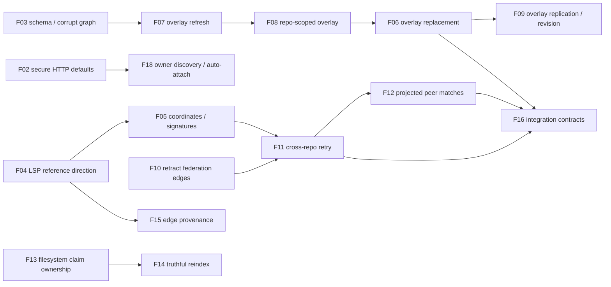

# Agent fix tracker — restored-worktree correctness pass

Status date: 2026-09-08

This is the coordination document for the defects reproduced after restoring
`iteration-stash-wip-2026-09-08`. The evidence and full source analysis are in
[`RESTORED_WORKTREE_REVIEW.md`](../../RESTORED_WORKTREE_REVIEW.md).

## Rules for agents

1. Claim one work item by replacing `Unassigned` with your agent name and
   changing its status to `In progress`. Do this before editing shared files.
2. Change existing code before adding a parallel path. Every new abstraction,
   field, endpoint, or configuration option needs a written reason it is the
   smallest design that removes duplication or makes an existing contract
   explicit.
3. Simplify while fixing: delete superseded branches, helpers, comments, and
   tests; consolidate duplicate logic at its shared boundary. Do not preserve
   a legacy implementation merely to keep the diff small.
4. Add the regression test first or with the production fix. A test that only
   asserts an internal helper is insufficient when the defect crosses an API
   boundary.
5. Do not merge, stash, reset, or revert another agent's changes. Work in an
   isolated worktree when possible.
6. A work item is `Ready for review` only with its focused test command and
   `cargo check --tests` passing. Record both in the item.
7. A coordinator marks an item `Done` after reviewing the diff and running its
   stated acceptance test. Keep the evidence in this file.

Status values: `Unassigned`, `In progress`, `Blocked`, `Ready for review`,
`Done`.

## Definition of done for every work item

A work item is done only when all of these are true:

- The defect is fixed by changing or consolidating the existing path. A second
  implementation, compatibility shim, or feature flag is not acceptable unless
  the item explicitly requires a migration boundary.
- The resulting code is simpler: duplicate code is removed, ownership is clear,
  and obsolete comments/tests/configuration are deleted or updated.
- A behavioral contract test proves the reported failure and the repaired
  outcome at the relevant boundary: graph result, persisted file, CLI response,
  MCP/HTTP wire shape, or lock state.
- An end-to-end test is added when the behavior crosses a process, transport,
  persistence, watcher, or multi-repository boundary. Unit tests support this
  coverage but do not replace it.
- The test is deterministic and isolated: no host-installed language server,
  model, random port collision, pre-existing graph, or process-global
  environment controls the outcome.
- The acceptance criteria in the item pass, `cargo check --tests` passes, and
  the agent records the exact commands and results before review.

## Dependency map

## Topological execution order

Kahn's algorithm on the dependency graph above. Each level is unblocked once
the previous level's items are complete. Within a level, items are
independent and may run in parallel. For a single-agent run, take the
leftmost unblocked item at each step.

| Level | Item | Why it's at this level | Status |
|---|---|---|---|
| 0 | **F01** Remove bearer credentials from public presence events | No incoming deps | `Unassigned` |
| 0 | **F02** Secure HTTP defaults | No incoming deps; gates F18 | `Unassigned` |
| 0 | **F01** Remove bearer credentials from public presence events | No incoming deps | `Done` (commits `e897fd3`) |
| 0 | **F02** Secure HTTP defaults | No incoming deps; gates F18 | `Done` (commits `f07bd0f`, F02 review-fix round 1) |
| 0 | **F03** Make federation persistence versioned and fail closed | No incoming deps; gates F07 | `Done` (commits `22ef882`, `4cb4a3e`) |
| 0 | **F04** Correct LSP reference direction and position fidelity | No incoming deps; gates F05, F15 | `Done` (commits `474bf4d`, deeper `5930839`: real JSON-RPC wire fixture) |
| 0 | **F10** Reconcile federation edge removals | No incoming deps; gates F11 | `Done` (commits `e827b83`, rework `a2544b1`: cross-repo `Calls` survive repeated projection) |
| 0 | **F13** Make zero-daemon claims ownership-safe | No incoming deps; gates F14 | `Done` (commits `5dd8869`, `80637c2`, rework `4fe5ab0`: atomic compare-and-delete + read-first/remove-on-Ok) |
| 1 | **F05** Standardize coordinates and repair signature synthesis | Waits on F04 | `Done` |
| 1 | **F07** Repair overlay refresh lifecycle and watcher fallback | Waits on F03 | `Blocked` |
| 1 | **F11** Retry unresolved cross-repository calls | Waits on F05, F10 | `Blocked` |
| 1 | **F14** Make `lain reindex` recovery truthful | Waits on F13, F03 | `Blocked` |
| 1 | **F18** Discover and attach to an existing Lain owner automatically | Waits on F02 | `Blocked` |
| 2 | **F08** Namespace a shared federation overlay by repository | Waits on F07 | `Blocked` |
| 2 | **F12** Project cross-repository peer matches correctly | Waits on F11 | `Blocked` |
| 2 | **F15** Carry provenance on edges and resolution outcomes | Waits on F04, F05 | `Blocked` |
| 3 | **F06** Give overlay edits replacement semantics | Waits on F08 | `Blocked` |
| 4 | **F09** Make external overlay edges observable and replicable | Waits on F06 | `Blocked` |
| 4 | **F16** Build durable end-to-end contracts | Waits on F06, F11, F12 | `Blocked` |
| 5 | **F17** Publish capability and wishlist truth | Waits on F15, F16 | `Blocked` |

### Parallel-assignment waves (same dependency structure, grouped for multi-agent dispatch)

| Wave | Items | Parallel notes |
|---|---|---|
| 0 | F01, F02, F03, F04, F10, F13 | Six items, no internal dependencies. Different subsystems; safe to dispatch in parallel. |
| 1 | F05, F07, F11, F14, F18 | F11 depends on F05 + F10 — if F10 not yet done, split: dispatch F05, F07, F14, F18 first; queue F11 until F05 + F10 both done. F14 also depends on F03 (already in wave 0). |
| 2 | F08, F12, F15 | F12 needs F05 + F10 + F11 done; F15 needs F04 + F05 done. |
| 3 | F06 | Sequential after F08. |
| 4 | F09, F16 | F09 needs F06; F16 needs F06 + F11 + F12. |
| 5 | F17 | Sequential after F15 + F16. |

## Active dispatch queue

**Ready to claim now (Level 0):**

- F01 — Remove bearer credentials from public presence events — P0
- F02 — Secure HTTP defaults — P0
- F03 — Make federation persistence versioned and fail closed — P1
- F04 — Correct LSP reference direction and position fidelity — P1
- F10 — Reconcile federation edge removals — P1
- F13 — Make zero-daemon claims ownership-safe — P1

**Next unblock** when the level 0 items complete: F05, F07, F11, F14, F18.

## Recommended next action

Single-agent: take F01 + F02 first — both P0 security, no code overlap, smallest blast radius. They unblock F18 (level 1). Then F03 + F04 + F10 + F13 in any order. Then proceed level by level.

Multi-agent: dispatch wave 0 as 6 parallel assignments. Coordinator marks each `Done` as it lands; the next level's items transition from `Blocked` to `Unassigned` automatically (the dependency map determines this — no manual unblocking needed).

## Work items

### F01 — Remove bearer credentials from public presence events

- Status: `Unassigned`
- Owner: `—`
- Priority: P0
- Scope: `src/server/presence.rs`, SSE formatting/transport, presence tests.
- Problem: `PresenceEvent::AgentJoined(AgentSession)` serializes
  `session_token` to every SSE subscriber.
- Required result: public events expose an explicit token-free view; private
  persistence and authentication still retain the token where required.
- Acceptance:
  - An `AgentJoined` SSE payload never contains the session token.
  - Session registration/authentication behavior remains covered.
  - Replace the current leak-confirming ledger assertion with a non-leak
    assertion.
- Focused test: `cargo test --test review_ledger_2026_09_07 joined_event`
- Evidence after implementation: `—`

### F02 — Secure HTTP defaults

- Status: `Unassigned`
- Owner: `—`
- Priority: P0
- Scope: HTTP listener configuration, `src/server/mcp/handler.rs`, auth config,
  CLI help/docs, transport integration tests.
- Problem: HTTP binds `0.0.0.0` while no API keys means no authentication.
- Required result: loopback is the default; non-loopback exposure requires an
  explicit opt-in and configured authentication.
- Acceptance:
  - Default listener is loopback-only.
  - Public binding without configured authentication fails with a clear error.
  - Explicit public binding plus a valid bearer key works.
- Focused test: add a listener/auth configuration test; run `cargo test --test failure_modes`.
- Evidence after implementation: `—`

### F03 — Make federation persistence versioned and fail closed

- Status: `Unassigned`
- Owner: `—`
- Priority: P1
- Depends on: none
- Scope: `src/server/schema.rs`, `src/server/graph.rs`,
  `src/server/federation/graph_backend.rs`, reindex documentation and tests.
- Problem: restored `GraphNode` serialization changed, but federation schema is
  still v2; a valid header plus corrupted payload starts as an empty graph.
- Required result: bump every affected persisted format deliberately. Federation
  rejects a corrupt payload and directs operators to `lain reindex`; do not
  silently accept an empty replacement graph.
- Acceptance:
  - Valid old schema returns `FederationSchemaMismatch`.
  - Current header with truncated/corrupt payload returns an error.
  - `lain reindex` backs up and reconstructs the graph from an isolated fixture.
- Focused test: `cargo test --test federation_integration federation_schema`; `cargo test --test cli_surface lain_reindex`.
- Evidence after implementation: `—`

### F18 — Discover and attach to an existing Lain owner automatically

- Status: `Unassigned`
- Owner: `—`
- Priority: P1
- Depends on: F02
- Scope: owner lifecycle, `lain mcp`, `lain server`, sidecar startup, workspace
  metadata, hooks, MCP configuration docs, integration tests.
- Problem: `lain mcp` is normally a private stdio process. It has no reachable
  endpoint, so another agent cannot detect it or join its presence, claims, or
  overlay. The existing `--owner-url` sidecar path works only when a user knows
  and supplies the URL.
- Required result: a workspace with a reachable Lain owner advertises that fact
  locally, and a later `lain mcp` automatically validates and attaches to it.
  The agent must still be able to force a local owner or specify a URL.
- Proposed protocol:
  1. An HTTP owner atomically writes `.lain/owner.json` after it is ready. It
     contains protocol version, canonical workspace identity, loopback URL,
     process id, start time, and an opaque instance nonce.
  2. On `lain mcp` startup, after workspace discovery and before local indexing,
     read the marker. Validate strict file ownership/permissions, canonical
     workspace identity, protocol version, and a short `/health` handshake.
  3. If valid, start the existing read-only sidecar flow against that owner and
     use the owner's coordination endpoints. If stale/unreachable/invalid,
     ignore or clean up only the matching stale marker, then start locally.
  4. `--owner-url` overrides discovery; `--no-owner-discovery` forces the
     current standalone behavior. A true stdio-only process cannot be attached
     to directly; it needs an HTTP owner/bridge to become discoverable.
  5. On shutdown, remove the marker only when its nonce still belongs to this
     owner. Never overwrite or delete another owner’s marker.
- Acceptance:
  - Starting a second `lain mcp` in the same repository attaches to the first
    reachable owner without an `--owner-url` flag and does not re-index.
  - Both agents see the same claim/presence and overlay revision.
  - A dead or stale marker falls back to local startup within a bounded timeout.
  - A marker for another workspace, a wrong protocol version, or an unauthenticated
    public endpoint is rejected.
  - Explicit `--owner-url` and `--no-owner-discovery` remain deterministic.
- Focused test: owner-marker lifecycle unit tests plus two-process integration
  test covering attachment, stale fallback, workspace mismatch, and claim/overlay
  sharing.
- Evidence after implementation: `—`

### F04 — Correct LSP reference direction and position fidelity

- Status: `In progress`
- Owner: `codex-wave2-agent`
- Priority: P1
- Depends on: none
- Scope: `src/server/lsp.rs`, `src/server/ingest/scan.rs`,
  `src/server/ingest/resolve.rs`, deterministic LSP fixture.
- Problem: a reference to `helper` inside `entry` becomes `helper -> entry`.
  The scan uses a symbol start at column zero and loses `selection_range`.
- Required result: preserve a symbol's selection line and column; construct
  `Calls` as caller -> referenced callee. Do not infer calls from references
  whose language-server semantics do not identify a call.
- Acceptance:
  - Fake LSP fixture returns a declaration and a reference in a caller.
  - Produced edge is `caller -> callee` at the expected source position.
  - Reference direction is covered without requiring a locally installed LSP.
- Focused test: new deterministic LSP integration test plus `cargo test --lib`.
- Evidence after implementation: `—`

### F05 — Standardize coordinates and repair signature synthesis

- Status: `Done` (commit `<see report>`)
- Owner: `Kimi Code subagent (F05)`
- Priority: P1
- Depends on: F04
- Scope: `src/server/ingest/scan.rs`, `src/server/ingest/resolve.rs`,
  `src/server/treesitter.rs`, scan/matching tests.
- Problem: both parser paths already emit zero-based rows. The restored
  line-minus-one fallback assigns calls to adjacent functions;
  `derive_signature` subtracts one and can read the wrong line.
- Required result: establish one internal coordinate convention, document it at
  type boundaries, and eliminate guessing. Synthesize Rust/Python/TS signatures
  without truncating type annotations or generic syntax.
- Acceptance:
  - Adjacent function ranges attribute each call to the correct source.
  - A definition after a blank/comment line produces its own signature.
  - Rust `fn f(x: Type) -> Result<T, E>` preserves the parameter/type content.
- Focused test: scan unit tests and cross-repo matching integration test.
- Evidence after implementation: `cargo test --lib` (826 ok),
  `cargo test --test use_cases` (178 ok); see
  `.superpowers/sdd/agent-fix-tracker-2026-09-08/task-F05-report.md`.

### F06 — Give overlay edits replacement semantics

- Status: `Unassigned`
- Owner: `—`
- Priority: P1
- Depends on: F08
- Scope: overlay-aware resolver, impact traversal, overlay data model, graph
  invariants.
- Problem: committed and overlay copies of a target become falsely ambiguous;
  a call deleted from an edited file still appears in blast radius.
- Required result: for an edited path, overlay nodes and outgoing dependency
  edges supersede the committed version. Untouched paths continue using the
  committed graph.
- Acceptance:
  - Overlay/committed duplicate target resolves once.
  - Removing the only call from an edited caller removes that caller from blast
    radius before commit.
  - Overlay node lookup and static resolution agree on path identity.
- Focused test: `cargo test --test graph_invariants blast_radius`.
- Evidence after implementation: `—`

### F07 — Repair overlay refresh lifecycle and watcher fallback

- Status: `Unassigned`
- Owner: `—`
- Priority: P1
- Depends on: F03, F05
- Scope: `src/server/ingest/ingestion.rs`, `src/server/watcher.rs`,
  `src/server/federation/repo_index.rs`, watcher integration tests.
- Problem: removal compares absolute Git paths with relative graph paths, so a
  rename retains old symbols. The direct watcher exits on LSP failure and only
  adds top-level symbols.
- Required result: normalize paths once at the boundary, remove stale entries
  for rename/delete/revert, use Tree-sitter fallback consistently, and insert
  the full symbol hierarchy.
- Acceptance:
  - Real file rename changes overlay names from old to new with no stale node.
  - Deletion and revert clear prior overlay nodes/edges.
  - No-LSP watcher update still produces Tree-sitter nodes marked accordingly.
- Focused test: watcher freshness/reindex tests plus an uncommitted rename fixture.
- Evidence after implementation: `—`

### F08 — Namespace a shared federation overlay by repository

- Status: `Unassigned`
- Owner: `—`
- Priority: P1
- Depends on: F07
- Scope: federation overlay ownership, overlay node/edge IDs and paths,
  `RepoIndex::sync_overlay`, resolver inputs.
- Problem: `repo-a/lib.rs:init@0` and `repo-b/lib.rs:init@0` collide in the
  single shared overlay.
- Required result: every overlay node and edge has a repository-scoped identity
  while user-facing paths retain enough repo context to be unambiguous.
- Acceptance:
  - Two repos with identical relative paths and symbols retain two overlay nodes.
  - Updating repo A cannot remove, replace, or affect repo B's overlay entry.
  - Calls resolve only within the appropriate repository unless intentionally
    cross-repo.
- Focused test: a two-repo overlay integration fixture.
- Evidence after implementation: `—`

### F09 — Make external overlay edges observable and replicable

- Status: `Unassigned`
- Owner: `—`
- Priority: P1
- Depends on: F06
- Scope: `src/server/overlay.rs`, revision log, overlay stream protocol,
  sidecar tests.
- Problem: external-target edges are kept in a side list but do not increment
  revision, merge into sidecars, or appear in complete edge views/statistics.
- Required result: one coherent edge representation or complete handling of the
  external edge store across mutation, revisioning, replication, query, merge,
  removal, and clear.
- Acceptance:
  - An external edge advances `current_revision`.
  - A sidecar merge/stream receives it.
  - Removing its source or path removes it everywhere.
- Focused test: overlay revision/merge regression test.
- Evidence after implementation: `—`

### F10 — Reconcile federation edge removals

- Status: `In progress`
- Owner: `codex-wave2-agent`
- Priority: P1
- Depends on: none
- Scope: federation backend edge ownership/indexing, `project_edges`, graph
  backend APIs, federation tests.
- Problem: projection only upserts; a deleted local call remains in the
  federated graph as long as its nodes still exist.
- Required result: reconciliation replaces the source repo's projected edge set
  atomically or removes stale repo-owned edges before adding live ones.
- Acceptance:
  - Removing a local edge then reconciling removes the corresponding federation
    edge while retaining both nodes.
  - Cross-repo and same-symbol edges have explicit ownership/rebuild rules.
- Focused test: `reconciliation_removes_obsolete_calls_between_live_nodes` moved
  into `tests/federation_integration.rs`.
- Evidence after implementation: `—`

### F11 — Retry unresolved cross-repository calls

- Status: `Unassigned`
- Owner: `—`
- Priority: P1
- Depends on: F05, F10
- Scope: ingestion resolve phases, unresolved-reference persistence or a second
  federation-wide resolution phase, startup/watcher orchestration.
- Problem: when the consumer indexes before the provider, the resolver returns
  no target and the reference is discarded. Later node/edge projection cannot
  recreate it.
- Required result: separate symbol indexing from cross-repo reference resolution
  or persist unresolved references and retry after all repositories refresh.
- Acceptance:
  - Consumer-first real indexing produces its cross-repo `Calls` edge after
    reconciliation, without manually re-indexing the consumer.
  - Ambiguous provider names remain unresolved rather than fanning out.
- Focused test: consumer-first two-repo integration fixture.
- Evidence after implementation: `—`

### F12 — Project cross-repository peer matches correctly

- Status: `Unassigned`
- Owner: `—`
- Priority: P1
- Depends on: F11
- Scope: `FederatedIndex::project_edges`, matching input model, global-ID
  rewriting, federation integration tests.
- Problem: matcher receives local UUIDs and rejects candidate IDs that are not
  GlobalIds, so matching signatures produce no `CrossRepoSameSymbol` edge.
- Required result: match using repo-aware/globalized node identities, then write
  exactly one canonical peer edge per eligible pair.
- Acceptance:
  - Two different repos with compatible non-empty signatures yield a peer edge.
  - Empty signatures and same-repo nodes do not yield an edge.
  - Reconciliation remains idempotent.
- Focused test: projected-peer-edge integration test, not a matcher-only test.
- Evidence after implementation: `—`

### F13 — Make zero-daemon claims ownership-safe

- Status: `Unassigned`
- Owner: `—`
- Priority: P1
- Depends on: none
- Scope: `src/server/presence_lock.rs`, hook claim/release CLI, lock tests,
  documentation.
- Problem: stale owner Alice can release replacement owner Bob's file. Path
  sanitization maps `src/a.b` and `src/a_b` to one lock file.
- Required result: generate a random ownership nonce on acquire and require it
  on refresh/release; use a collision-resistant encoded/hash path key while
  retaining readable metadata in the file.
- Acceptance:
  - Old owner cannot refresh or release replacement owner’s claim.
  - Colliding-looking paths create separate lock files.
  - TTL remains configurable through `LAIN_CLAIM_LOCK_TTL_SECS`.
- Focused test: `cargo test --test presence_lock`.
- Evidence after implementation: `—`

### F14 — Make `lain reindex` recovery truthful

- Status: `Unassigned`
- Owner: `—`
- Priority: P1
- Depends on: F03
- Scope: `src/cli/reindex.rs`, recovery/CLI tests, CHANGELOG/operator docs.
- Problem: reindex renames the only graph copy before all validation and logs
  projection failures while returning success.
- Required result: validate requested workspace/configuration first; retain a
  recoverable backup; return failure if projection is incomplete; print a clear
  recovery state.
- Acceptance:
  - Invalid workspace leaves the prior graph untouched.
  - Injected projection failure exits nonzero and preserves the backup.
  - Successful reindex reports actual completion.
- Focused test: CLI fixture tests for invalid workspace, injected projection
  failure, and successful rebuild.
- Evidence after implementation: `—`

### F15 — Carry provenance on edges and resolution outcomes

- Status: `Unassigned`
- Owner: `—`
- Priority: P2
- Depends on: F04, F05
- Scope: edge schema/persistence, tools and output formatting, migration,
  contract tests.
- Problem: node-level LSP provenance is used as blast-radius confidence even
  when the dependency edge was a heuristic Tree-sitter name match.
- Required result: expose source and confidence for nodes, edges, and unresolved
  gaps. Tool output must describe incomplete coverage honestly.
- Acceptance:
  - A Tree-sitter edge to an LSP node is labeled Tree-sitter confidence.
  - Unknown/fallback results do not present as verified LSP calls.
- Focused test: serialized graph contract plus impact-output test.
- Evidence after implementation: `—`

### F16 — Build durable end-to-end contracts

- Status: `Unassigned`
- Owner: `—`
- Priority: P2
- Depends on: F04, F06, F09, F11, F12, F13
- Scope: test harnesses only, except narrowly required test seams.
- Required result: move the reproduced contracts from the temporary diagnostic
  harness into repository tests. Add a deterministic fake LSP JSON-RPC server
  and contract coverage for watcher refresh, federation reconciliation,
  reindex, sidecar replication, and wire errors.
- Acceptance:
  - No test depends on a host-installed `rust-analyzer` or process-global env.
  - Each F04–F13 regression has a durable test at the public boundary.
  - Failure-mode tests assert response wire shape, not only survival.
- Focused test: relevant targeted tests plus `cargo test --tests`.
- Evidence after implementation: `—`

### F17 — Publish capability and wishlist truth

- Status: `Unassigned`
- Owner: `—`
- Priority: P2
- Depends on: F15, F16
- Scope: docs, MCP tool surface, capability model, release notes.
- Required result: describe features as supported, degraded, unavailable, or
  unverified based on behavior-backed checks. Implement the planned capability
  and provenance surface if retained as product commitments.
- Acceptance:
  - Wish-list status entries link to an executable regression test or a clear
    limitation.
  - Agent-facing tools can report capability/coverage without implying a false
    guarantee.
- Focused test: MCP tool schema and documentation link checks.
- Evidence after implementation: `—`

## Coordinator checklist before merging a wave

- [ ] Every completed item lists an owner, commit, and focused test output.
- [ ] `cargo check --tests` passes on the combined branch.
- [ ] Tests use isolated temporary directories and do not depend on local LSP,
      model, socket, or environment state.
- [ ] Schema changes include the required version bump, recovery path, and
      changelog entry.
- [ ] Cross-repo tests cover both consumer-first and provider-first ordering.
- [ ] Security items have a negative test proving secrets never reach public
      transport output.
