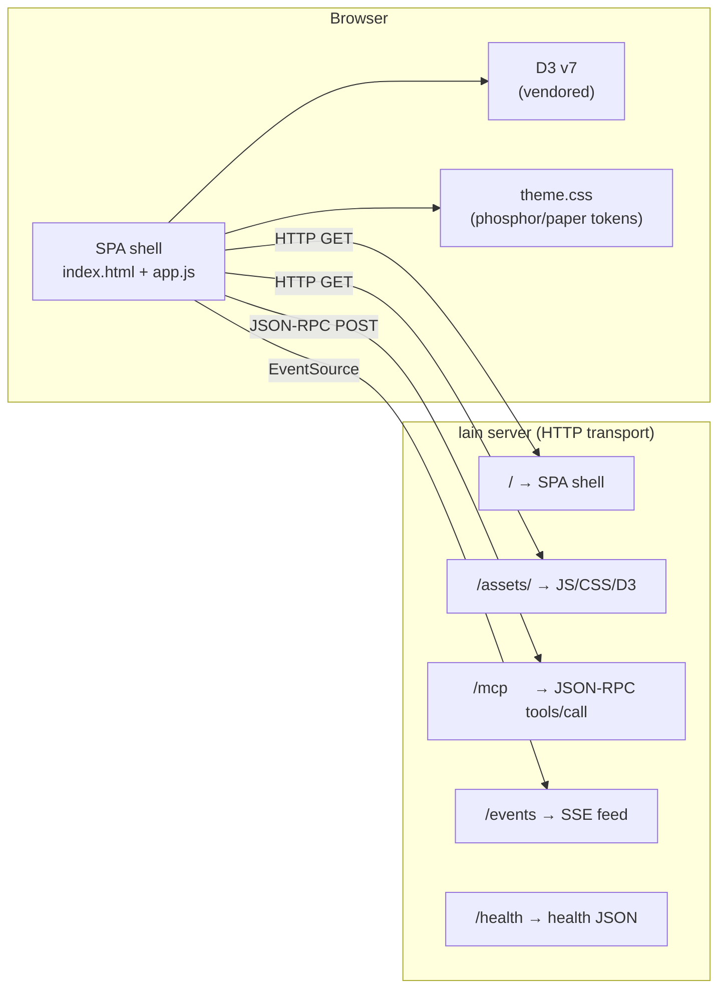
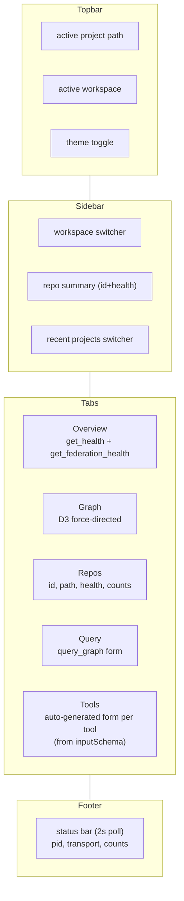

# Command Center

The Command Center is the operator's primary surface for inspecting and steering
`lain server`. It is a self-contained vanilla-JS SPA served from `GET /` by the
MCP HTTP transport. Every panel talks to the running server via the JSON-RPC
`tools/call` endpoint at `POST /mcp` — no separate API, no auth portal.



Every panel talks to the running server over the same JSON-RPC
endpoint — there is no separate API. The SPA is the *only* consumer;
every state mutation is a tool call.

## Launch

```bash
lain server --config ./repos.yaml --transport http --port 9999
open http://localhost:9999
```

The Command Center shell is served at `/` and pulls `app.js`, `theme.css`,
`styles.css`, and the vendored D3 v7 bundle from `/assets/d3.v7.min.js`.
Everything else is fetched from the running server over MCP.

## Sections



- **Topbar** — active project path and active workspace name. The active
  workspace is highlighted in the sidebar list.
- **Workspace switcher** (sidebar) — lists `workspaces.yaml`. The active
  workspace is highlighted. Refreshed on page load.
- **Repo summary** (sidebar) — compact `id (health)` list of every repo known
  to the federation.
- **Recent projects switcher** (sidebar) — projects the operator has used
  recently, with workspace and repo counts pulled live from each project's
  `repos.yaml` / `workspaces.yaml`. Each entry has a *Copy restart cmd* button
  that copies the right `lain server --config <path> --workspace <name>` line
  to the clipboard. The active workspace name is shown when the operator's
  `~/.config/lain/active_workspace` pointer matches that project's path.
- **Overview tab** — server health (`get_health`) and federation health
  (`get_federation_health`) in a single view.
- **Graph tab** — D3 force-directed graph of the active workspace (placeholder
  for the future deeper rendering work; the shell tab is wired in Tasks 4.3 +
  4.4 so the layout doesn't break).
- **Repos tab** — per-repo table with id, path, health, node count, edge
  count. Each row uses `get_repo_info` for the live numbers.
- **Query tab** — runs a `query_graph` call against the federation. Pick a
  repo, an op (currently `find`), a node type, and a limit. The JSON result
  is dumped below the form.
- **Tools tab** — auto-generated MCP tool tester. Calls `tools/list` on load,
  then renders a form for the selected tool by introspecting its
  `inputSchema`. Buttons: *Call* (executes the tool) and *Copy as cURL* (copies
  a `curl -X POST http://localhost:9999/mcp ...` snippet to the clipboard).
- **Status bar** (footer) — pid, transport, repo / workspace counts, and the
  last-sync timestamp. Polled every 2 s via `get_server_status`. Rendered in
  reverse video, like a terminal status line.
- **Theme toggle** (topbar, right) — flips between *phosphor* (dark) and
  *paper* (light). See [Theme](#theme).

## Theme

The palette is an 80s console look ported from the pre-SPA UI
(`src/mcp/front_end_monitor.html`, dropped in 49f5f82). Both themes are
monospace throughout, square-cornered, with hairline borders and letterspaced
uppercase panel labels.

| | Surface | Ink |
|---|---|---|
| **phosphor** (dark) | near-black `#05080f` | cyan `#00e5cc` |
| **paper** (light) | warm paper `#e6e1d3` | teal ink `#14322e` |

Dark is the default — it is lain's identity — and light applies when the
system asks for it. Three states, in precedence order:

1. an explicit `[data-theme]` on `<html>`, set by the topbar toggle and
   persisted to `localStorage` under `lain-theme`
2. otherwise `prefers-color-scheme: light` → paper
3. otherwise → phosphor

Two knobs carry the CRT treatment, both neutralised in the light theme:
`--glow` (phosphor bloom on accent text) and `--scanlines` (the overlay
opacity behind `.crt-scanlines`). The blinking block cursor after the wordmark
respects `prefers-reduced-motion`.

Every colour lives in `theme.css` as a custom property; no other stylesheet
hardcodes one, so both themes come from a single rule set and only the token
values swap. The standalone `/ui/*` detail views load the same `theme.css` and
read the same `localStorage` key, so a choice made in the Command Center
carries over to them. `command_center_assets_tests.rs` fails the build if a
consumer hardcodes a colour or if the two light-theme declaration blocks
drift apart.

## Wire format

Tool calls are JSON-RPC 2.0:

```json
{
  "jsonrpc": "2.0",
  "method": "tools/call",
  "params": {
    "name": "list_workspaces",
    "arguments": {}
  },
  "id": 1
}
```

Tool responses are wrapped in `result.content[0].text` (with the JSON payload
inside as a string). The `unwrapText` helper in `app.js` extracts the inner
text and `parseJson` decodes it. The status bar also pings the same endpoint
every 2 s so manual YAML changes show up without a refresh.

## Compatibility

The Command Center compiles its tool form from the same `inputSchema` the
MCP `tools/list` returns. Adding a new tool with a `Tool::inputSchema`
automatically makes it available in the Tools tab — no JS changes required.
Scalar fields render as `<input type="text">` (default), `number`, or
`<select>` for booleans. Required fields are marked with `*`.

## Source layout

```
src/server/mcp/command_center/
├── index.html      # SPA shell (topbar, sidebar, tabs, status bar)
├── app.js          # Vanilla JS — MCP helpers + every render fn
├── theme.css       # 80s console palette (phosphor + paper), shared
├── styles.css      # Layout and components; reads tokens from theme.css
└── assets/
    └── d3.v7.min.js  # Vendored D3 v7 (for the future Graph tab)
```

`theme.css` is also served to the standalone detail views under `src/ui/`
(`blast-radius.html`, `call-chain.html`, `coupling.html`), which is why it is a
separate file rather than a block at the top of `styles.css`.
