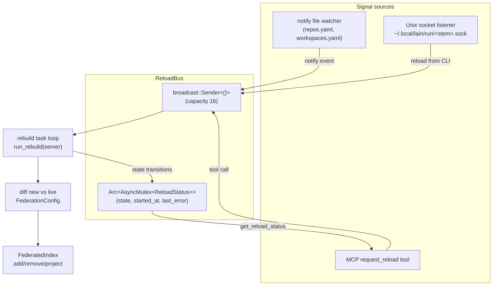

# Hot Reload

`lain server` watches `repos.yaml` and `workspaces.yaml` and rebuilds
its federation state when they change. No restart needed.

## What is hot-reloaded

- Adding a repo to `repos.yaml` (via `lain repos add` or by
  hand-editing) and adding it to a workspace: visible in `list_repos`
  within seconds.
- Removing a repo from `repos.yaml` or from a workspace's `members`
  list: disappears from `list_repos`, `get_cross_repo_blast_radius`,
  and the rest of the federation tool surface.
- Hand-editing `workspaces.yaml`: the new workspace is picked up by
  the `list_workspaces` / `get_workspace` tools.

## What is NOT hot-reloaded

- Switching the active workspace via `lain workspaces use <name>`.
  The new workspace name is recorded in
  `~/.config/lain/active_workspace`; the server picks it up on the
  next start.
- Changing `--embedding-model`. The bi-encoder + cross-encoder are
  loaded once at startup.
- Changing `--transport` or `--port`. Restart with the new flags.

## How it works



1. **Signal sources** fire `bus.request_reload()`:
   - `notify` watcher on `repos.yaml` and `workspaces.yaml`
     (`src/server/watcher.rs::spawn_config_watcher`).
   - Unix socket listener at
     `~/.local/lain/run/<repos-stem>.sock`. The CLI writes
     `"reload\n"` after a successful atomic YAML write
     (`src/cli/signal.rs::signal_reload`).
   - The MCP `request_reload` tool
     (`src/server/mcp/federation_tools.rs::request_reload`).
2. The bus fans the signal out to subscribers.
3. The rebuild task loop (spawned by
   `cli::server::spawn_hot_reload`) calls `run_rebuild`, which
   diffs `repos.yaml` against the live federation and applies
   add/remove operations against `FederatedIndex`.
4. `set_workspace` updates the workspaces slot that
   `workspace_count` reads.

The diff is conservative: anything present in the federation but
absent from `repos.yaml` is removed; anything in `repos.yaml` but
absent from the federation is fetched (for `local_clone` /
`shallow_clone` sources) or attached (for `workspace_dir`). The
`data_dir` is read from `repos.yaml`'s top-level field.

## Observability

- `get_reload_status` MCP tool returns:
  ```json
  {
    "state": "idle" | "rebuilding" | "failed",
    "started_at_unix": 1731000000,
    "last_reload_at_unix": 1731000060,
    "last_error": null,
    "pending_changes": []
  }
  ```
- `request_reload` MCP tool returns `{"accepted": true, "queued_at_unix": ...}`
  after queueing a signal.
- The Command Center status bar polls `get_reload_status` every
  second; when the server is mid-rebuild it shows `reload:
  rebuilding`, otherwise `reload: idle` (or `reload: failed
  <message>` on the last error).
- `tracing` logs emit `FileWatcher (config): reload requested for
  <path>` from the watcher, `signal listener: bus.request_reload()`
  from the socket, and `hot reload: rebuild failed: <e>` from the
  rebuild task.

## Failure modes

- **YAML parse error**: `run_rebuild` records `Failed(<msg>)` on
  the bus and returns the error. The live federation is unchanged;
  fix the YAML and trigger another reload.
- **Network / clone failure during add**: the same — `Failed` is
  recorded, no partial state is committed.
- **Missing socket at CLI time**: `signal_reload` is a silent
  no-op. The YAML file was already saved atomically by the CLI, so a
  later server start picks up the new contents naturally.

## Caveats

None — workspace edits propagate live; the federation's repo
membership is hot-reloaded correctly; the build / embedding model
flags are restart-only as listed at the top of this document.
- The `notify` watcher uses non-recursive directory watches, so
  hand-edits that move the file across directories may be missed.
  All CLI writes go through atomic rename so the watcher sees the
  old or new contents, never a partial write.
- Workspace edits propagate live: `set_workspace`
  (`src/server/ingest/server.rs`) writes through the same
  `Arc<RwLock<WorkspacesFile>>` the running `LainMcpServer` holds,
  so the next `list_workspaces` / `get_workspace` dispatch
  observes the new contents without a restart. Verified by
  `rebuild_replaces_workspaces_yaml_when_present` in
  `src/server/reload.rs`.