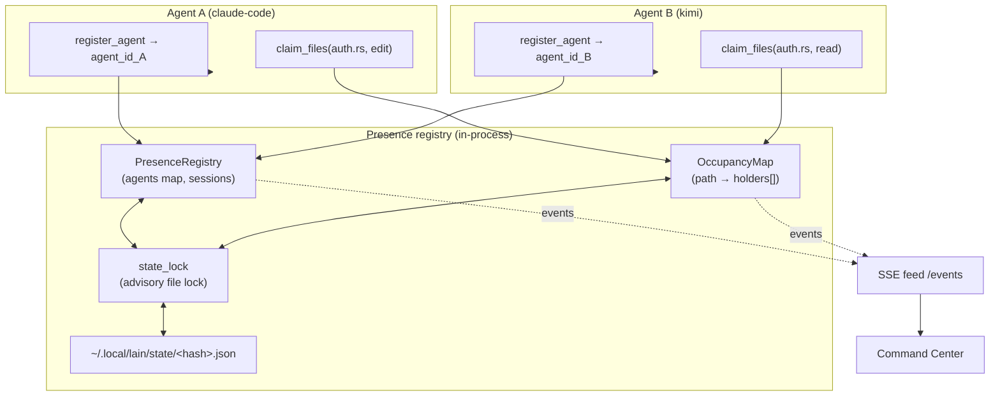
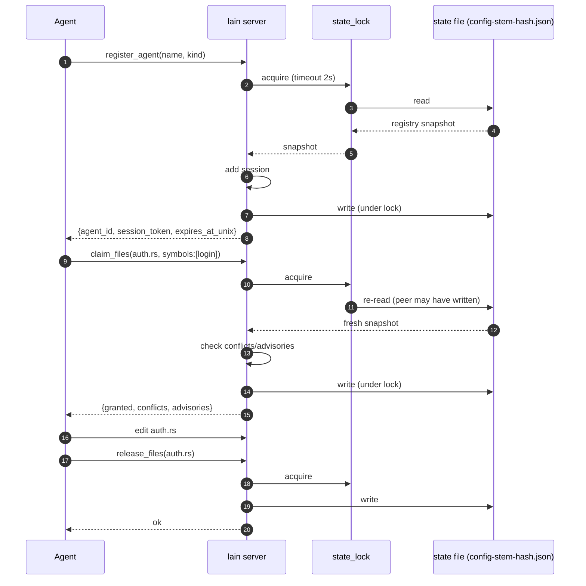
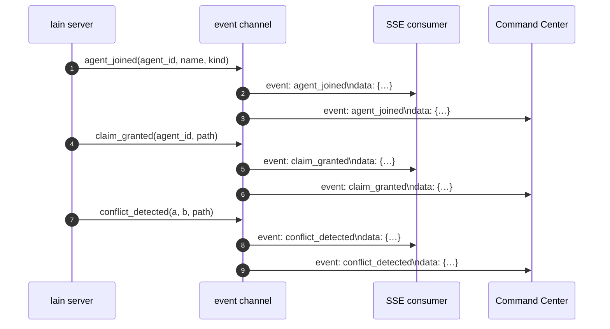
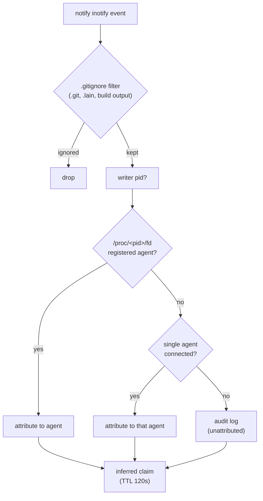

# Multiplayer Awareness

> lain 0.5+ ships an always-on multiplayer layer so multiple agents (Claude,
> Kimi, Cursor, OpenCode, humans) can edit the same workspace without
> stomping on each other. This page is the operator + agent quickstart.



Two agents register, both want to look at the same file. The
registry holds their sessions; the occupancy map holds the per-path
claims; the state file is the cross-process coordination point (so
two `lain mcp` processes spawned by two agent consoles see each
other). Every mutation pushes an event into the SSE feed the
Command Center consumes.

## Operator quickstart

Multiplayer is always on. Start `lain server` like you already do — the
extra surface is 8 MCP tools and an SSE feed that the existing Command
Center picks up automatically:

```bash
# Start lain with the multiplayer features enabled (always-on in v0.5+)
lain server --config ./repos.yaml --transport http --port 9999
```

What's new on the wire:

| Surface | Purpose |
|---|---|
| 8 new MCP tools | `register_agent`, `heartbeat`, `list_active_agents`, `who_am_i`, `claim_files`, `release_files`, `list_occupancy`, `my_claims` |
| `GET /events` | Server-Sent Events stream. Fires whenever an agent joins, claims, releases, or a conflict is detected. The Command Center subscribes here for its live panels. |
| Command Center panels | `GET /` now shows the **Agents online** and **Rooms** (file occupancy) panels, updated live. |
| Existing tools | `query_graph`, `get_repo_info`, `explain_symbol`, and `get_cross_repo_blast_radius` now include attribution hints (active editors) and surfaces occupancy where it's relevant. |

No new flags. No new dependencies. If your existing `repos.yaml` works,
multiplayer works.

## Agent quickstart

Every agent that wants to participate goes through this 4-call dance:



```js
const { agent_id, session_token, expires_at_unix } = await mcp.call("register_agent", {name: "claude", kind: "claude-code", pid: process.pid});

// Before editing auth.rs, claim it.
const { granted, conflicts, advisories } = await mcp.call("claim_files", {agent_id, session_token, files: [{path: "auth.rs", symbols: ["login"], intent: "edit"}]});
if (conflicts.length > 0) {
  // Refused: someone else holds a competing edit claim. Pick another scope.
  for (const c of conflicts) console.warn(`agent ${c.agent_id} holds this scope`);
}
for (const a of advisories ?? []) {
  // Granted anyway — a read over someone's live edit. Re-read before patching.
  console.warn(a.note);
}

// After editing:
await mcp.call("release_files", {agent_id, session_token, files: [{path: "auth.rs"}]});
```

No heartbeat loop: **any authenticated call counts as proof of life**.
An explicit `heartbeat` exists for an agent that goes quiet for a long
time, but an agent doing ordinary work never needs to schedule one.

The four calls in plain English:

1. **`register_agent`** — once at startup. lain assigns an
   `agent_id` (UUID) and a `session_token` (opaque hex string). The
   token is the agent's bearer credential for every subsequent call;
   keep it secret.
2. **`heartbeat`** — optional. Any authenticated call already refreshes
   the session, so this is only for an agent that will be idle a long
   time. Interactive sessions expire after 10 minutes without a call,
   background (cron/CI) ones after 60 seconds; both are configurable
   under `presence` in the tuning config. The TTL was 60s for everyone
   and refreshed only by an explicit heartbeat, which is shorter than a
   single LLM turn — agents lost their claims mid-task.
3. **`claim_files`** — before editing. Pass an array of
   `{path, symbols?, intent?}` entries. `intent` is `edit` or `read`;
   `symbols` is an optional list of symbol names to scope the claim
   finer than the file. lain returns `{granted, conflicts, advisories}`:
   - `conflicts` — your claim was **refused**; another agent holds a
     competing edit claim. Each entry names the holder, their intent,
     when they were last seen, and whether the claim was `inferred`
     (guessed by the attribution watcher) rather than declared.
   - `advisories` — your claim was **granted**, but somebody else is
     editing that file. A read never blocks on a writer; this is how
     you find out anyway. Re-read before you patch.

   Conflicts and advisories carry the holder's `name` alongside its
   `agent_id`, so you do not need a second call to learn who. `name` is
   `null` when that session has since ended — never a fabricated
   placeholder.

   Paths are canonicalized, so `/abs/auth.rs`, `auth.rs` and
   `./auth.rs` are the same claim. They used to be three.
4. **`release_files`** — after editing. Frees the claim so the next
   agent can pick it up.

You can also poll without claiming — `list_occupancy` (optionally
scoped with `path`) reports who currently holds claims on a file, and
`list_active_agents` enumerates every connected session.

Each occupancy entry carries `holders`:

```json
{ "path": "/repo/src/auth.rs",
  "holders": [ { "agent_id": "…", "name": "alice", "intent": "edit", "inferred": false },
               { "agent_id": "…", "name": "bob",   "intent": "read", "inferred": false } ] }
```

Read `intent` before concluding anything: `edit` blocks other edits,
`read` never blocks. Without it a surveying agent cannot tell a
blocking hold from a harmless one — two agents on a live server drew
exactly the wrong conclusion from a bare list of ids.

### Listening for events (push)

Connect to the SSE stream and lain will keep you in the loop — no
polling required:

```bash
curl -N http://localhost:9999/events
# event: ready
# data: {}
#
# event: agent_joined
# data: {"agent_id":"5f74f...", "name":"claude", "kind":"claude-code"}
#
# event: claim_granted
# data: {"agent_id":"5f74f...", "path":"auth.rs"}
```



Event types: `ready` (initial sync), `agent_joined`, `agent_left`,
`heartbeat_expired`, `claim_granted`, `claim_released`, `claim_revoked`,
`conflict_detected`, `edit_landed`. The Command Center consumes this
stream verbatim.

`claim_released` and `claim_revoked` are deliberately distinct.
*Released* means the holder gave the claim up. *Revoked* means it was
taken away — its session expired, or its own `ttl_seconds` ran out —
and carries a `reason` of `session_expired` or `ttl_expired`. The
holder may still believe it owns the file, so a subscriber seeing a
revocation should treat that agent's in-flight edit as unprotected.

## How attribution works (defensive layer)

If an agent forgets to call `claim_files`, lain still knows:



1. **Inotify** watches the workspace. Events are filtered first: the
   repo's own `.gitignore` decides what is build output, plus `.git/`
   and `.lain/` (which git cannot report as ignored) and editor scratch
   files. Without that filter every write under the checkout became a
   claim — an agent that never ran git was once found holding
   `.git/index.lock` for its entire session.
2. **`/proc/<pid>/fd`** looks for the writer's PID. If a registered agent has that PID, lain auto-claims on their behalf.
3. **Single-agent fallback**: if only one agent is connected, edits are attributed to them. This carries most attributions, because a write usually closes its file descriptor before the inotify event is handled.
4. **Audit log**: unattributed edits are logged to stderr so the operator can investigate.

Claims created this way are marked **`inferred: true`** and carry a
short TTL. They are a guess: they say so on every surface that reports
them, and a wrong one expires on its own rather than sticking until the
session dies. A claim the agent later declares itself is upgraded to a
declared claim; an inference never downgrades a declaration.

## Tuning

Everything with a clock in this layer lives under `presence` in
`.lain/tuning.toml`, alongside the ingestion and runtime knobs. The
defaults are shown; you only need the keys you want to change.

```toml
[presence]
interactive_session_ttl_secs   = 600  # an agent doing ordinary work
background_session_ttl_secs    = 60   # cron / CI agents, reaped fast
inferred_claim_ttl_secs        = 120  # how long a *guessed* claim lives
state_lock_acquire_timeout_ms  = 2000 # then proceed without the lock
state_lock_retry_interval_ms   = 20   # gap between lock attempts
state_lock_stale_after_secs    = 10   # assume the holder died
```

The retry interval sets the tail latency under contention: with eight
agents on one file, p99 on a contended `claim_files` is roughly ten
retries' worth. Shorten it to trade CPU for latency.

## Stability & persistence

Symbol IDs include a BLAKE3 content hash. Claims carry an optional `ttl_seconds` that bounds them even with active heartbeats. State (`PresenceRegistry` + `OccupancyMap`) is persisted to `~/.local/lain/state/<config-stem>-<hash>.json` (hash of the absolute config path, so two configs that share a filename stem don't collide) on every mutation and restored on `lain server` startup, so claims survive restarts.

**That file is also how presence is shared between processes.** The MCP
stdio transport spawns one server per client, so two agent consoles on
one repo run two server processes. Each presence call takes a lock on
the state file, re-reads it if a peer has written since, acts, and lets
the persist callback write back — so a claim taken in one console is
visible in the other. Before this, the file was only ever written and
never re-read: every claim was granted, no conflict was ever reported,
and nothing indicated the coordination layer was inert.

The locking is advisory throughout. If the lock cannot be taken within
its timeout the call proceeds without it, and a failed load or save is
logged rather than surfaced. A presence registry that occasionally
loses a concurrent write is a nuisance; one that can wedge an agent's
tool call is a much worse failure.

For attribution portability, lain selects the backend at startup:

| OS | Backend | Notes |
|---|---|---|
| Linux | `ProcFsBackend` | Walks `/proc/<pid>/fd` for the writer's pid. |
| macOS | `LsofBackend` | Shells out to `lsof -F p`. Falls back to `NoopBackend` if `lsof` is missing. |
| Windows | `NoopBackend` | Always returns `None`. lain falls back to git polling + single-agent heuristic. |

Disable process attribution entirely with `--no-process-attribution`:

```bash
lain server --config ./repos.yaml --transport http --port 9999 --no-process-attribution
```

## Subagents

When an agent spawns subagents (e.g., Claude Code's Task tool), each
subagent should appear in `lain` as a distinct session whose
`parent_session_id` points to the spawning session. To wire this:

1. The parent registers first (no `parent_session_id`); capture its `agent_id`.
2. Spawn the subagent with the environment variable `LAIN_PARENT_AGENT_ID=<parent.agent_id>` set.
3. The subagent's `PreToolUse` hook passes that through `lain hooks claim --parent-session-id "$LAIN_PARENT_AGENT_ID"`.

The subagent can introspect its parent via `who_am_i` (which now
includes `parent_session_id`). The parent can enumerate its subagents
via `list_subagents` (passing its own session token).

## Commit-time overlap detection

The MCP tool `detect_overlap` finds symbol-level conflicts between two git refs in the active workspace:

```bash
lain detect_overlap --base HEAD~1 --head HEAD --workspace backend
```

Returns:

```json
{
  "base": "abc123",
  "head": "def456",
  "files": [
    {
      "path": "src/auth.rs",
      "symbols_base": ["login", "validate"],
      "symbols_head": ["login", "logout"],
      "overlap": ["login"],
      "severity": "medium"
    }
  ],
  "total_overlaps": 1
}
```

Pair with `hooks/claude-code/pre-commit.sh` (configured as Claude Code's `PreToolUse` on `Bash` for `git commit`) to refuse commits that would conflict with the previous ref. Catches the real damage — merge conflicts — at the right moment.

## Revision surface

Every tool response carries a `revision: u64` under **`_meta`** — not at
the top level. The counter is per-process and monotonic, and it counts
**overlay diffs**: changes to files the watcher has picked up.

It is not a global state counter, and in particular **claims do not move
it**. A session that registers agents and takes and releases claims,
without touching a file, will see `"revision": 0` on every response.
That is the counter working, not a broken field — an agent watching for
*presence* changes wants `list_occupancy` / `list_active_agents`, which
are poll-only. (Observed live: an agent read `_meta.revision: 0` across
eight state-changing presence calls and reasonably concluded the field
was dead.)

Tools that don't return JSON (streaming-only) are unchanged.

Claim-aware tools (`claim_files` is the only one today) additionally
accept `plan_revision: u64` on request and may return `world_state` on
response.

## world_state.changed_symbols

`world_state` is the agent's signal that the world may have moved since
it queried. Each entry is `{ name, change_kind, at_revision }` where
`change_kind` is one of:
- `Edited` — changed via overlay diff.
- `Retracted` — it was in the graph and is not any more. Something you
  were working on disappeared under you.
- `NotIndexed` — the graph has no record of it at all. It may never
  have been indexed, or it may be a name that is not a definition.
  Distinct from `Retracted`, which used to cover both: asking about a
  symbol the graph had simply never seen answered "deleted", and
  "I have never seen this" and "this was removed" call for opposite
  reactions.

If `world_state.note` is set, the agent must resync:
- `"plan_revision beyond current — server may have restarted"` →
  the server reloaded and lost the revision counter; re-query.
- `"plan_revision too old for delta; resync required"` →
  the agent's plan is too far in the past; re-query.
