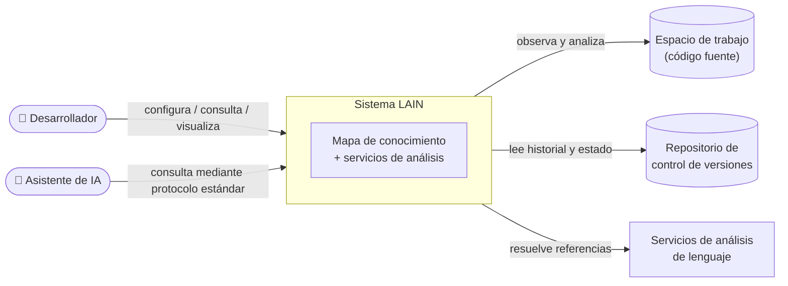
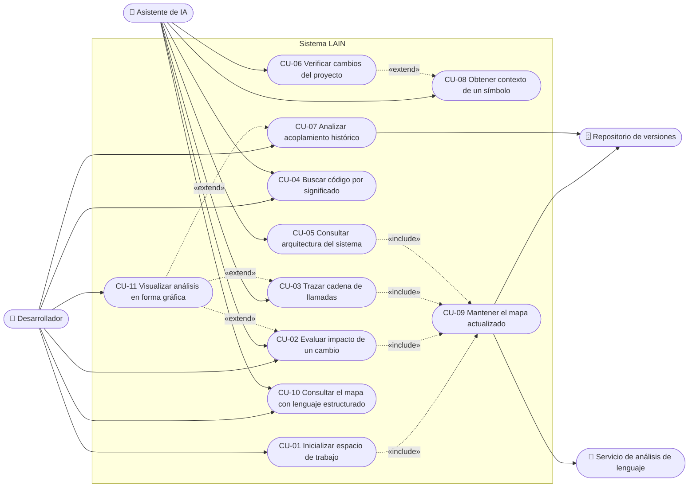
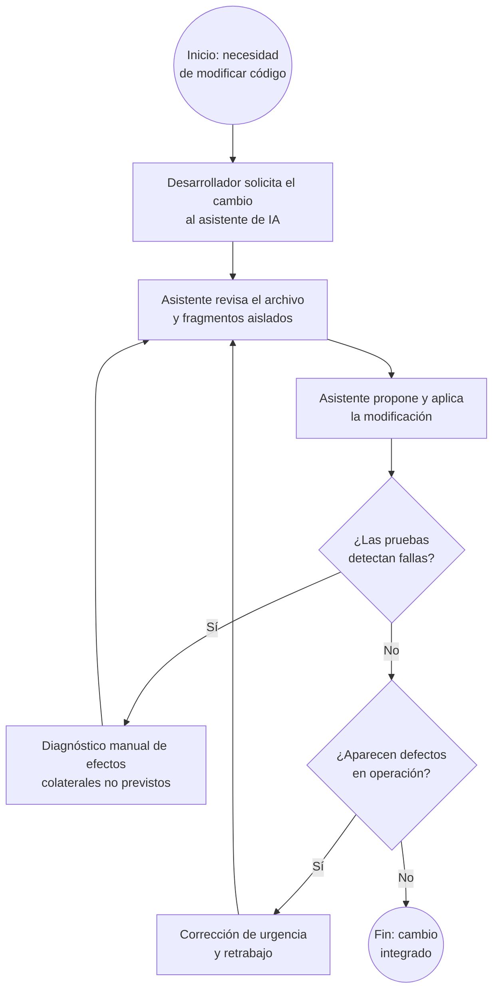
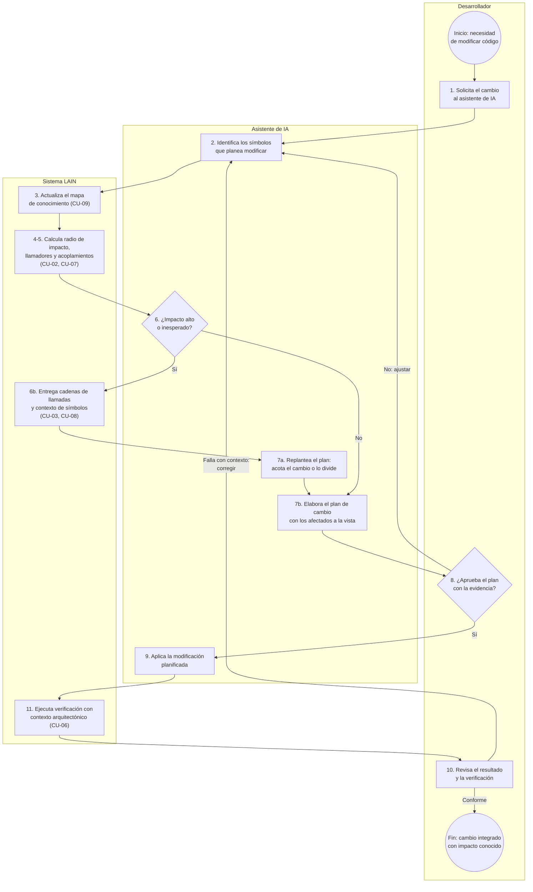

# Especificación de Requisitos de Software

## Proyecto: LAIN — Plataforma de Inteligencia de Código para Asistentes de Desarrollo

| Campo | Valor |
|---|---|
| **Proyecto** | LAIN — Plataforma de inteligencia de código |
| **Estándar aplicado** | IEEE 830-1998 |
| **Revisión del documento** | 1.0 |
| **Fecha** | 12 de julio de 2026 |
| **Autor** | Sebastián Puentes |
| **Curso** | EMI307-1 — Especificación de Requerimientos · Módulo 03: Inteligencia Artificial aplicada a Ingeniería de Requerimientos |

## Ficha del documento

| Fecha | Revisión | Autor | Cambios |
|---|---|---|---|
| 2026-07-06 | 0.1 | Sebastián Puentes | Documento principal IEEE 830-1998 del sistema LAIN. |
| 2026-07-06 | 0.2 | Sebastián Puentes | Anexos A–F de la entrega final. |
| 2026-07-06 | 0.3 | Sebastián Puentes | Índice de la entrega y matriz de trazabilidad. |
| 2026-07-06 | 0.4 | Sebastián Puentes | Autoría, decisión de CU-03 y evidencia visual del prototipo. |
| 2026-07-06 | 0.5 | Sebastián Puentes | Cierre de todos los pendientes de la entrega. |
| 2026-07-07 | 0.9 | Sebastián Puentes | Revisión de calidad final. |
| 2026-07-12 | 1.0 | Sebastián Puentes | Consolidación: introducción de génesis del proyecto y documento único con anexos integrados (formato presentable). |

---

## 1. Introducción

Los asistentes de programación basados en Inteligencia Artificial se han incorporado con rapidez al trabajo cotidiano de desarrollo de software. Sin embargo, su forma de operar presenta una limitación estructural: razonan sobre fragmentos aislados de código —el archivo abierto en el editor o el resultado de una búsqueda textual— sin una visión del conjunto del proyecto. Cuando el desarrollador necesita que el asistente comprenda cómo se relacionan las distintas partes del sistema, la vía disponible suele ser volcar grandes volúmenes de código fuente dentro de la conversación, con un alto costo en consumo de contexto (tokens) y, a la vez, con baja precisión: el asistente recibe abundante información irrelevante y, aun así, carece de la estructura que realmente necesita. La consecuencia es conocida: propone cambios que rompen código en otras partes del sistema, duplica funcionalidad ya existente e ignora acoplamientos históricos entre archivos.

**El origen de LAIN.** El proyecto nace de esa experiencia directa. Al trabajar de forma continua sobre una base de código de gran tamaño, el desarrollador —stakeholder principal del proyecto (Sección 2.3)— constató que obtener respuestas útiles del asistente exigía entregarle el código casi completo, una y otra vez, sin que ello evitara los defectos anteriores. De esa constatación surge la idea que da forma al sistema: en lugar de entregar el código al asistente, entregarle un **mapa de conocimiento** consultable del proyecto, de modo que pueda pedir exactamente la información estructural que necesita —«si modifico esta función, ¿qué más se ve afectado?»— en vez de recibir el volcado completo del código.

**Qué es LAIN.** LAIN es un sistema de inteligencia de código que construye y mantiene automáticamente ese mapa de conocimiento —los símbolos del código y las relaciones entre ellos: qué llama a qué, qué depende de qué y qué archivos tienden a cambiar en conjunto— y lo pone a disposición tanto de los asistentes de IA como del propio desarrollador. El sistema no reemplaza al asistente ni edita el código: lo complementa entregándole contexto estructural preciso y acotado, y responde con evidencia las preguntas del desarrollador sobre el impacto de un cambio, las cadenas de llamadas, las dependencias y los acoplamientos ocultos de su proyecto. El resto de esta sección formaliza el propósito, el alcance y el vocabulario de esa propuesta.

### 1.1 Propósito del documento

El presente documento constituye la Especificación de Requerimientos de Software (SRS, por su sigla en inglés) del sistema **LAIN**, elaborada conforme a la estructura definida por el estándar IEEE 830-1998. Su propósito es describir de manera completa, consistente y verificable los requerimientos funcionales, los requerimientos no funcionales y las restricciones del sistema propuesto, de modo que sirva como base de acuerdo entre los stakeholders del proyecto y como insumo para las etapas posteriores de diseño, construcción y validación.

El documento está dirigido a los siguientes destinatarios:

- el equipo de desarrollo del proyecto, como referencia normativa de lo que el sistema debe hacer;
- el cuerpo docente del módulo de Ingeniería de Requerimientos, como evidencia del proceso de especificación;
- los stakeholders identificados durante la etapa de educción, como instrumento de validación de sus necesidades;
- futuros mantenedores y evaluadores del sistema, como línea base de comparación entre lo especificado y lo construido.

### 1.2 Alcance del producto

El producto a especificar se denomina **LAIN**. LAIN es un sistema de inteligencia de código que construye y mantiene un **mapa de conocimiento** del código fuente de un proyecto de software —los símbolos que lo componen y las relaciones entre ellos: qué llama a qué, qué depende de qué y qué archivos tienden a cambiar en conjunto— y que pone dicho mapa a disposición de asistentes de programación basados en Inteligencia Artificial y de los propios desarrolladores.

**El problema que aborda:** los asistentes de programación basados en IA razonan habitualmente sobre fragmentos aislados de código (el archivo abierto, el resultado de una búsqueda textual), sin visibilidad de la estructura global del proyecto. Esto los lleva a proponer cambios que rompen código en otras partes del sistema, a duplicar funcionalidad existente y a ignorar acoplamientos históricos entre archivos. El desarrollador, a su vez, carece de una herramienta que responda con evidencia preguntas como «si modifico esta función, ¿qué más se ve afectado?».

**Lo que el sistema hará:**

- construir automáticamente un mapa de conocimiento del código de un proyecto y mantenerlo actualizado mientras el desarrollador trabaja;
- responder consultas estructurales sobre dicho mapa: radio de impacto de un cambio, cadenas de llamadas, dependencias transitivas, puntos de entrada, componentes fundamentales y código sin uso;
- detectar acoplamientos ocultos entre archivos a partir del historial del repositorio de versiones;
- permitir la búsqueda de código por intención o significado, además de por nombre;
- entregar a los asistentes de IA contexto curado y optimizado sobre los símbolos del proyecto;
- ejecutar verificaciones del proyecto (compilación, pruebas, análisis estático) enriqueciendo las fallas con contexto arquitectónico;
- ofrecer visualizaciones gráficas de los análisis para el desarrollador.

**Lo que el sistema no hará:**

- no es un editor de código ni un entorno de desarrollo integrado;
- no genera ni modifica código fuente por sí mismo;
- no reemplaza al asistente de IA: lo complementa entregándole información estructural;
- no envía el código fuente del proyecto a servicios externos;
- no gestiona el ciclo de vida del repositorio (no realiza confirmaciones ni fusiones de cambios).

**Beneficios esperados:** reducción de defectos introducidos por cambios con efectos colaterales no previstos, disminución del tiempo de comprensión de código ajeno, mejores respuestas de los asistentes de IA al disponer de contexto estructural real, y apoyo objetivo a decisiones de refactorización.

### 1.3 Definiciones, acrónimos y abreviaturas

| Término | Definición |
|---|---|
| **SRS** | *Software Requirements Specification*; documento de especificación de requerimientos de software. |
| **Stakeholder** | Persona, grupo u organización con interés o influencia en el sistema o en el documento de especificación. |
| **Asistente de IA / Agente de IA** | Programa basado en modelos de Inteligencia Artificial que asiste al desarrollador en tareas de programación y que puede invocar herramientas externas. |
| **Símbolo** | Unidad nombrada del código fuente: función, método, clase, interfaz, módulo, variable o constante. |
| **Mapa de conocimiento (del código)** | Representación en forma de grafo del código de un proyecto, donde los nodos son símbolos y archivos, y las aristas son relaciones entre ellos (llama a, define, contiene, importa, hereda de, co-cambia con). |
| **Radio de impacto** | Conjunto de símbolos que se verían afectados, directa o transitivamente, por la modificación de un símbolo dado. |
| **Cadena de llamadas** | Secuencia de invocaciones de funciones que conecta un símbolo de origen con uno de destino. |
| **Co-cambio** | Fenómeno por el cual dos archivos tienden a ser modificados en las mismas confirmaciones del repositorio, evidenciando un acoplamiento no necesariamente visible en el código. |
| **Acoplamiento oculto** | Dependencia entre archivos que no se manifiesta en relaciones explícitas del código, pero sí en su historial de co-cambio. |
| **Componente ancla** | Símbolo o módulo altamente estable y fundamental, del cual depende una parte significativa del sistema. |
| **Código muerto** | Símbolos alcanzables en el mapa que no registran llamadores ni usos. |
| **Punto de entrada** | Símbolo desde el cual inicia la ejecución del sistema analizado. |
| **Búsqueda semántica** | Búsqueda de código por intención o significado, en lugar de coincidencia textual exacta. |
| **Contexto para el agente** | Paquete de información curada sobre un símbolo (firma, documentación, relaciones) preparado para ser consumido por un asistente de IA. |
| **Frescura (del mapa)** | Grado de actualidad del mapa de conocimiento respecto del estado real del código y del repositorio. |
| **Espacio de trabajo** | Carpeta raíz del proyecto de software que el sistema analiza. |
| **RF / RNF** | Requerimiento funcional / Requerimiento no funcional. |
| **CU** | Caso de uso. |

### 1.4 Referencias

1. IEEE Std 830-1998, *IEEE Recommended Practice for Software Requirements Specifications*. IEEE, 1998.
2. Pauta «Entrega Final — Proyecto de Ingeniería de Requerimientos», curso EMI307-1 Especificación de Requerimientos, Módulo 03: Inteligencia Artificial aplicada a Ingeniería de Requerimientos, 2026.
3. Anexos A–F del presente documento (`docs/srs/anexos/`).

### 1.5 Visión general del documento

El resto del documento se organiza de la siguiente manera. La **Sección 2** entrega una descripción general del producto: su perspectiva dentro del entorno en que operará, sus funciones principales, las características de sus usuarios, las restricciones generales y los supuestos y dependencias considerados. La **Sección 3** contiene los requisitos específicos: requerimientos funcionales, requerimientos no funcionales y restricciones del sistema, redactados de forma verificable, junto con la matriz de trazabilidad que los vincula con los casos de uso, el proceso de negocio, las interfaces y el prototipo. Los **Anexos A–G** complementan la especificación con el diagrama de casos de uso, la especificación textual de los casos de uso, el modelado del proceso de negocio, el diseño preliminar de interfaces, el mini prototipo apoyado con IA, la declaración de uso de Inteligencia Artificial y el estado real del sistema LAIN.

---

## 2. Descripción general del producto

### 2.1 Perspectiva del producto

LAIN es un sistema **intermediario** que se sitúa entre el entorno de trabajo del desarrollador y los asistentes de programación basados en IA. No opera de manera aislada: se ejecuta como un servicio en segundo plano en la máquina del desarrollador, observa el espacio de trabajo del proyecto y expone sus capacidades de análisis a los asistentes mediante un protocolo estándar de comunicación entre asistentes de IA y herramientas.

El sistema se relaciona con los siguientes elementos de su entorno:

- **Desarrollador:** configura el sistema, lo consulta directamente y revisa sus visualizaciones.
- **Asistente de IA:** consume las capacidades de análisis del sistema durante las sesiones de asistencia al desarrollador; es un usuario de tipo máquina.
- **Espacio de trabajo (código fuente):** carpeta del proyecto que el sistema observa y analiza en forma continua.
- **Repositorio de control de versiones:** fuente del historial de cambios utilizado para el análisis de co-cambio y del estado de ramas y diferencias.
- **Servicios de análisis de lenguaje:** componentes externos, propios de cada lenguaje de programación del código analizado, que el sistema utiliza para resolver con precisión referencias y definiciones de símbolos.

El siguiente diagrama de contexto resume la perspectiva del producto:



### 2.2 Funciones del producto

Las funciones del producto se agrupan en ocho áreas funcionales. El detalle verificable de cada una se encuentra en la Sección 3.1.

1. **Gestión del mapa de conocimiento:** inicialización del espacio de trabajo, construcción del mapa de símbolos y relaciones, actualización automática ante cambios en los archivos, sincronización con el repositorio e informes de frescura.
2. **Análisis de impacto de cambios:** cálculo del radio de impacto de un símbolo, trazado de cadenas de llamadas, identificación de llamadores y rastreo de dependencias transitivas, incluyendo llamadores a nivel de protocolo entre componentes que se ejecutan por separado.
3. **Comprensión de la arquitectura:** exploración de la estructura por niveles, identificación de puntos de entrada y componentes ancla, detección de código muerto, comparación de módulos, detección de candidatos a refactorización y explicación de símbolos en lenguaje comprensible.
4. **Análisis histórico de la evolución:** detección de acoplamientos ocultos por co-cambio y consulta del historial de confirmaciones, del estado de la rama de trabajo y de los cambios no confirmados.
5. **Búsqueda semántica:** localización de código por intención o significado expresado en lenguaje natural.
6. **Provisión de contexto a asistentes de IA:** construcción de paquetes de contexto curado sobre símbolos, entrega de fragmentos de código con su entorno y publicación del esquema del mapa para la inicialización de sesiones de los asistentes.
7. **Verificación asistida:** ejecución de la compilación, las pruebas y el análisis estático del proyecto, enriqueciendo las fallas con contexto arquitectónico; identificación de funciones sin pruebas, generación de plantillas de prueba y estimación estructural de cobertura.
8. **Consulta estructurada y visualización:** consulta del mapa mediante un lenguaje de consulta estructurado, respuesta a preguntas en lenguaje natural sobre el código y generación de visualizaciones interactivas de los análisis.

### 2.3 Características de los usuarios

| Usuario | Descripción | Nivel técnico | Frecuencia de uso |
|---|---|---|---|
| **Desarrollador de software** | Usuario principal humano. Instala y configura el sistema sobre su proyecto, formula consultas directas y revisa visualizaciones para tomar decisiones de diseño y refactorización. | Alto: domina programación y control de versiones. | Diaria, durante la jornada de desarrollo. |
| **Asistente de IA** | Usuario principal de tipo máquina. Invoca las capacidades del sistema durante las sesiones de asistencia para fundamentar sus respuestas y propuestas de cambio. | No aplica (programa); requiere que las capacidades estén descritas de forma auto-explicativa. | Continua, en cada sesión de asistencia. |
| **Líder técnico / arquitecto** | Usuario humano secundario. Utiliza los análisis de arquitectura, acoplamiento y deuda técnica para planificar el trabajo del equipo. | Alto. | Semanal u ocasional. |
| **Docente / evaluador** | **Stakeholder del documento** (no del producto): evalúa la especificación y el proceso de ingeniería de requerimientos. Su incorporación como stakeholder fue una decisión del autor (ver Anexo F, Sección F.6). | Medio-alto. | Puntual. |

**Stakeholders identificados en la etapa de educción:**

| Stakeholder | Rol | Interés / necesidad | Influencia |
|---|---|---|---|
| Sebastián Puentes | Desarrollador y propietario del producto (stakeholder principal; cumple además el rol de usuario «Desarrollador de software») | Necesidad de origen del proyecto: en el trabajo diario sobre una base de código de gran tamaño, obtener respuestas del asistente de IA exigía volcar volúmenes inmensos de código al contexto de la conversación, con alto costo en tokens y baja precisión. Requiere que el asistente pueda pedir exactamente la información estructural que necesita, en vez de recibir el código completo. | Alta: define alcance y prioridades. |
| Docente del curso EMI307-1 | Evaluador del proceso de Ingeniería de Requerimientos; **stakeholder del documento** (la especificación), no del producto | Que la especificación sea coherente, trazable y conforme al estándar IEEE 830-1998 y a la pauta de la entrega. | Media: define los criterios de aceptación del documento. |
| Comunidad de desarrolladores usuarios de asistentes de IA | Usuarios potenciales del producto | Disponer de la herramienta y de su documentación para integrarla en sus propios proyectos. | Baja en esta etapa: sus necesidades se recogen indirectamente a través del stakeholder principal. |

**Nota sobre los tipos de stakeholder.** El primer y el tercer stakeholder de la tabla lo son del *producto* LAIN; el **docente** es un **stakeholder del documento** (la especificación como entregable del módulo), no del sistema. Su inclusión en esta tabla fue una **decisión deliberada del autor**, por su influencia sobre los criterios de aceptación de la entrega; esta decisión queda registrada en el Anexo F, Sección F.6.

La necesidad de origen del stakeholder principal —**reducir el consumo de tokens al entregar contexto al asistente**— se refleja en los requerimientos de provisión de contexto curado y acotado (RF-21, RF-22), en la consulta selectiva del mapa (RF-25) y en la observación de tamaño acotado del paquete de contexto registrada en CU-08.

### 2.4 Restricciones generales

- **RG-1. Ejecución local:** el sistema debe ejecutarse íntegramente en la máquina del desarrollador; el código fuente analizado no debe abandonar dicho entorno.
- **RG-2. Operación no intrusiva:** el sistema debe operar en segundo plano sin interrumpir el flujo de trabajo del desarrollador ni degradar perceptiblemente el rendimiento de su equipo.
- **RG-3. Interoperabilidad con asistentes:** la comunicación con los asistentes de IA debe realizarse mediante un protocolo estándar y abierto de comunicación entre asistentes y herramientas, de modo de no quedar ligado a un asistente en particular.
- **RG-4. Solo lectura sobre el código:** el sistema no debe modificar el código fuente del proyecto analizado; sus capacidades de escritura se limitan a sus propios datos internos.
- **RG-5. Independencia tecnológica de la especificación:** conforme a la pauta de la entrega, esta especificación no define lenguajes de programación, marcos de trabajo, bases de datos ni arquitecturas tecnológicas concretas para la implementación del sistema.

### 2.5 Supuestos y dependencias

**Supuestos:**

- S-1. El proyecto analizado se encuentra bajo un sistema de control de versiones; sin él, las funciones de análisis histórico operarán de forma degradada.
- S-2. El desarrollador utiliza al menos un asistente de IA compatible con el protocolo estándar de comunicación entre asistentes y herramientas.
- S-3. El equipo del desarrollador dispone de recursos suficientes (procesador, memoria y almacenamiento) para mantener el mapa de conocimiento del proyecto analizado.
- S-4. El código del proyecto está escrito en uno o más de los lenguajes de programación soportados por los servicios de análisis de lenguaje disponibles.

**Dependencias:**

- D-1. Disponibilidad de servicios de análisis de lenguaje para los lenguajes del proyecto; su ausencia reduce la precisión del mapa (el sistema debe degradarse a mecanismos de análisis propios de menor confianza).
- D-2. Acceso de lectura al historial del repositorio de versiones para el análisis de co-cambio.
- D-3. Disponibilidad opcional de un modelo local de representación semántica para la búsqueda por significado; sin él, dicha función queda deshabilitada sin afectar al resto del sistema.

---

## 3. Requisitos específicos

Convenciones de redacción: cada requerimiento posee un identificador único y estable (RF-nn, RNF-nn, RS-nn), se redacta con la forma «El sistema deberá…» y declara su prioridad según la escala **Esencial / Deseable / Opcional**. Todos los requerimientos son verificables mediante el criterio indicado.

### 3.1 Requerimientos funcionales

#### Grupo A — Gestión del mapa de conocimiento

**RF-01 — Inicializar el espacio de trabajo**
- **Descripción:** El sistema deberá permitir al desarrollador inicializar un espacio de trabajo indicando la carpeta raíz del proyecto, el modo de comunicación con los asistentes y las opciones de análisis, generando la configuración necesaria y el mapa de conocimiento inicial.
- **Entradas:** ruta del proyecto; opciones de configuración. **Salidas:** configuración persistida; mapa inicial construido; confirmación al usuario.
- **Prioridad:** Esencial. **Verificación:** tras la inicialización sobre un proyecto de ejemplo, el sistema responde consultas básicas sobre sus símbolos.

**RF-02 — Construir el mapa de conocimiento**
- **Descripción:** El sistema deberá extraer del código fuente los símbolos del proyecto (archivos, módulos, funciones, métodos, clases, interfaces, variables y constantes) y las relaciones entre ellos (contiene, define, llama a, importa, hereda de), y registrarlos en un mapa de conocimiento persistente con identidad estable de nodos entre ejecuciones.
- **Entradas:** código fuente del espacio de trabajo. **Salidas:** mapa de conocimiento persistido.
- **Prioridad:** Esencial. **Verificación:** para un proyecto de prueba con símbolos y relaciones conocidos, el mapa contiene los nodos y aristas esperados.

**RF-03 — Actualizar el mapa ante cambios en los archivos**
- **Descripción:** El sistema deberá detectar automáticamente la creación, modificación o eliminación de archivos del espacio de trabajo mientras el desarrollador trabaja, y reflejar dichos cambios en el mapa mediante una capa volátil que se consolida periódicamente sobre el mapa persistente.
- **Entradas:** eventos del sistema de archivos. **Salidas:** mapa actualizado.
- **Prioridad:** Esencial. **Verificación:** al modificar una función y consultar el mapa dentro del intervalo comprometido (RNF-02), la consulta refleja el cambio.

**RF-04 — Sincronizar el mapa con el repositorio**
- **Descripción:** El sistema deberá permitir forzar, bajo demanda, la re-sincronización del mapa con el estado actual del repositorio de versiones, consolidando la capa volátil en el mapa persistente.
- **Prioridad:** Esencial. **Verificación:** tras un cambio de rama y la sincronización, el mapa refleja el contenido de la nueva rama.

**RF-05 — Ejecutar enriquecimiento completo bajo demanda**
- **Descripción:** El sistema deberá permitir ejecutar, bajo demanda, una pasada completa de análisis y enriquecimiento del mapa (resolución de referencias, métricas de estabilidad, análisis histórico y representaciones semánticas).
- **Prioridad:** Deseable. **Verificación:** al finalizar la pasada, las métricas de los símbolos quedan pobladas y fechadas.

**RF-06 — Informar la frescura del mapa**
- **Descripción:** El sistema deberá informar, por módulo, cuándo fue la última sincronización de cada fuente de análisis (código y repositorio), permitiendo al usuario evaluar la vigencia del mapa.
- **Prioridad:** Deseable. **Verificación:** el informe de frescura muestra marcas de tiempo coherentes con las sincronizaciones realizadas.

#### Grupo B — Análisis de impacto de cambios

**RF-07 — Calcular el radio de impacto de un símbolo**
- **Descripción:** El sistema deberá calcular, para un símbolo indicado, el conjunto de símbolos afectados directa y transitivamente por su eventual modificación (efecto dominó), indicando la profundidad y el grado de confianza de cada relación.
- **Entradas:** nombre o identificador del símbolo; profundidad máxima opcional. **Salidas:** lista jerarquizada de símbolos afectados.
- **Prioridad:** Esencial. **Verificación:** en un proyecto de prueba con dependencias conocidas, el resultado incluye todos los afectados esperados y ninguno ajeno.

**RF-08 — Trazar la cadena de llamadas entre dos símbolos**
- **Descripción:** El sistema deberá encontrar y presentar la ruta exacta de invocaciones de funciones que conecta un símbolo de origen con uno de destino, cuando dicha ruta exista.
- **Prioridad:** Esencial. **Verificación:** para pares origen-destino conocidos, la cadena reportada coincide con la real; para pares no conectados, el sistema lo informa explícitamente.

**RF-09 — Identificar los llamadores de un símbolo**
- **Descripción:** El sistema deberá listar todos los sitios del código que invocan a un símbolo dado, con su ubicación (archivo y posición).
- **Prioridad:** Esencial. **Verificación:** la lista coincide con las invocaciones reales presentes en un proyecto de prueba.

**RF-10 — Rastrear dependencias transitivas**
- **Descripción:** El sistema deberá encontrar, en forma recursiva, todo aquello de lo que depende un símbolo dado (símbolos, módulos y archivos), presentándolo de manera jerárquica.
- **Prioridad:** Esencial. **Verificación:** el rastreo sobre un símbolo de prueba retorna el cierre transitivo esperado.

**RF-11 — Identificar llamadores a nivel de protocolo**
- **Descripción:** El sistema deberá identificar los llamadores de un símbolo a través de fronteras de ejecución, tales como rutas de servicios web, servicios de invocación remota o resolutores de consultas, cuando el proyecto exponga interfaces de ese tipo.
- **Prioridad:** Deseable. **Verificación:** para un servicio de prueba con rutas declaradas, el sistema vincula la ruta con la función que la atiende.

#### Grupo C — Comprensión de la arquitectura

**RF-12 — Explorar la estructura del proyecto por niveles**
- **Descripción:** El sistema deberá presentar la estructura de archivos y módulos del proyecto en forma de árbol hasta una profundidad indicada, y permitir obtener «cortes» de la arquitectura a una distancia dada desde los puntos de entrada.
- **Prioridad:** Esencial. **Verificación:** el árbol coincide con la estructura real del proyecto de prueba a la profundidad solicitada.

**RF-13 — Identificar los puntos de entrada**
- **Descripción:** El sistema deberá identificar los puntos de entrada del sistema analizado, es decir, los símbolos desde los cuales inicia su ejecución.
- **Prioridad:** Esencial. **Verificación:** en proyectos de prueba, los puntos de entrada reportados corresponden a los reales.

**RF-14 — Identificar componentes ancla y su estabilidad**
- **Descripción:** El sistema deberá identificar los componentes más fundamentales y estables del proyecto, calcular un puntaje de estabilidad arquitectónica para cualquier símbolo, determinar el ancla que gobierna a una función dada y calcular la distancia de un símbolo respecto del punto de entrada.
- **Prioridad:** Deseable. **Verificación:** los puntajes son reproducibles y ordenan a los símbolos de forma consistente con sus dependencias.

**RF-15 — Detectar código sin uso**
- **Descripción:** El sistema deberá identificar los símbolos que no registran llamadores ni usos en el mapa, reportándolos como candidatos a código muerto, junto con la advertencia de posibles falsos positivos (por ejemplo, puntos de entrada o usos externos).
- **Prioridad:** Deseable. **Verificación:** en un proyecto de prueba con funciones deliberadamente sin uso, estas aparecen en el reporte.

**RF-16 — Detectar candidatos a refactorización y observaciones arquitectónicas**
- **Descripción:** El sistema deberá analizar el proyecto para detectar patrones arquitectónicos, acoplamientos que cruzan fronteras de módulos, módulos con dependencias excesivas y componentes con alta deuda técnica, y deberá permitir comparar métricas de estabilidad y acoplamiento entre dos módulos.
- **Prioridad:** Deseable. **Verificación:** las observaciones reportadas referencian módulos y métricas existentes en el mapa.

**RF-17 — Explicar un símbolo**
- **Descripción:** El sistema deberá producir, para un símbolo dado, un resumen comprensible que combine su firma, su documentación y sus métricas arquitectónicas.
- **Prioridad:** Deseable. **Verificación:** el resumen contiene firma, documentación (si existe) y métricas del símbolo consultado.

#### Grupo D — Análisis histórico de la evolución

**RF-18 — Detectar acoplamiento oculto por co-cambio**
- **Descripción:** El sistema deberá analizar el historial del repositorio para identificar pares de archivos que tienden a cambiar en las mismas confirmaciones, calcular su grado de acoplamiento histórico y reportar los acoplamientos ocultos relevantes para un símbolo o archivo dado.
- **Prioridad:** Esencial. **Verificación:** en un repositorio de prueba con co-cambios inducidos, los pares esperados aparecen con puntaje mayor que los pares no relacionados.

**RF-19 — Consultar historial y estado del repositorio**
- **Descripción:** El sistema deberá permitir consultar el historial reciente de confirmaciones (autor y mensaje), el estado de la rama de trabajo actual y los cambios aún no confirmados del espacio de trabajo.
- **Prioridad:** Deseable. **Verificación:** las respuestas coinciden con el estado real del repositorio de prueba.

#### Grupo E — Búsqueda semántica

**RF-20 — Buscar código por intención o significado**
- **Descripción:** El sistema deberá permitir localizar símbolos del proyecto a partir de una consulta en lenguaje natural que exprese una intención (por ejemplo, «¿dónde se maneja la autenticación?»), utilizando representaciones semánticas calculadas localmente, y retornar los resultados ordenados por afinidad.
- **Prioridad:** Deseable. **Verificación:** para consultas de prueba sobre un proyecto conocido, los símbolos pertinentes aparecen entre los primeros resultados.

#### Grupo F — Provisión de contexto a asistentes de IA

**RF-21 — Construir contexto optimizado sobre un símbolo**
- **Descripción:** El sistema deberá construir, para un símbolo dado, un paquete de contexto apto para ser consumido por un asistente de IA, que incluya su firma, su documentación y sus relaciones relevantes, y deberá permitir obtener el fragmento de código de un archivo con las líneas circundantes a una posición dada.
- **Prioridad:** Esencial. **Verificación:** el paquete contiene los elementos declarados y el fragmento corresponde a la posición solicitada.

**RF-22 — Publicar el esquema del mapa**
- **Descripción:** El sistema deberá exponer el esquema de su mapa de conocimiento (tipos de nodos, tipos de relaciones y ejemplos de consulta) para que los asistentes de IA inicialicen sus sesiones conociendo las capacidades disponibles.
- **Prioridad:** Esencial. **Verificación:** el esquema publicado enumera todos los tipos de nodos y relaciones vigentes.

#### Grupo G — Verificación asistida

**RF-23 — Ejecutar verificaciones con contexto arquitectónico**
- **Descripción:** El sistema deberá permitir ejecutar la compilación del proyecto, sus pruebas (con filtro opcional) y su análisis estático, retornando el resultado y, ante fallas, decorándolas con contexto arquitectónico (por ejemplo, los llamadores del símbolo que falla) para facilitar el diagnóstico.
- **Prioridad:** Deseable. **Verificación:** ante una falla inducida, el reporte incluye la falla y el contexto de sus llamadores.

**RF-24 — Apoyar la cobertura de pruebas**
- **Descripción:** El sistema deberá identificar funciones que probablemente carecen de pruebas a partir del análisis del grafo de llamadas, generar plantillas de prueba para una función o tipo dado y entregar una estimación estructural del nivel de cobertura del proyecto.
- **Prioridad:** Opcional. **Verificación:** las funciones sin pruebas inducidas en un proyecto de prueba aparecen en el reporte; la plantilla generada referencia a la función solicitada.

#### Grupo H — Consulta estructurada y visualización

**RF-25 — Consultar el mapa mediante lenguaje estructurado**
- **Descripción:** El sistema deberá ofrecer un lenguaje de consulta estructurado que permita localizar nodos por tipo, nombre, etiqueta o ruta, recorrer relaciones, filtrar, ordenar y limitar resultados, y componer operaciones, tanto para el desarrollador como para los asistentes.
- **Prioridad:** Esencial. **Verificación:** un conjunto de consultas de referencia produce los resultados esperados sobre el proyecto de prueba.

**RF-26 — Responder preguntas en lenguaje natural sobre el código**
- **Descripción:** El sistema deberá permitir al desarrollador formular preguntas en lenguaje natural sobre el proyecto y responderlas apoyándose en el mapa de conocimiento y sus capacidades de análisis.
- **Prioridad:** Opcional. **Verificación:** para preguntas de referencia, la respuesta cita símbolos y relaciones existentes en el mapa.

**RF-27 — Generar visualizaciones interactivas de los análisis**
- **Descripción:** El sistema deberá generar visualizaciones gráficas interactivas de, al menos, el radio de impacto de un símbolo, la cadena de llamadas entre dos símbolos y el mapa de calor de acoplamiento histórico, además de una consola de estado y consultas.
- **Prioridad:** Deseable. **Verificación:** cada visualización se genera a partir de datos reales del mapa y es navegable por el usuario.

### 3.2 Requerimientos no funcionales

**RNF-01 — Rendimiento de consulta.** Las consultas de lectura sobre el mapa (RF-07 a RF-22, RF-25) deberán responder en menos de 2 segundos en el percentil 90, medido sobre un proyecto de referencia de tamaño mediano (≈ 100.000 líneas de código). *Prioridad: Esencial. Verificación: medición instrumentada sobre el proyecto de referencia.*

**RNF-02 — Frescura del mapa.** Los cambios guardados en archivos del espacio de trabajo deberán reflejarse en las consultas en un plazo máximo de 60 segundos, sin intervención del usuario. *Prioridad: Esencial. Verificación: prueba de modificación y consulta cronometrada.*

**RNF-03 — Persistencia entre sesiones.** El mapa de conocimiento deberá persistir entre reinicios del sistema y de la máquina, de modo que no sea necesario reconstruirlo íntegramente en cada sesión; los identificadores de los nodos deberán ser estables entre ejecuciones. *Prioridad: Esencial. Verificación: reinicio del servicio y comparación de identificadores y contenidos.*

**RNF-04 — Privacidad y confidencialidad.** Todo el análisis, incluida la búsqueda semántica, deberá ejecutarse localmente; el sistema no deberá transmitir código fuente ni derivados de este a servicios externos. *Prioridad: Esencial. Verificación: inspección de tráfico de red durante la operación.*

**RNF-05 — Portabilidad multi-lenguaje.** El sistema deberá ser capaz de analizar proyectos escritos en, al menos, diez lenguajes de programación de uso general, y deberá poder incorporarse soporte para nuevos lenguajes sin rediseñar el sistema. *Prioridad: Deseable. Verificación: análisis exitoso de proyectos de prueba en los lenguajes declarados.*

**RNF-06 — Usabilidad de la instalación.** Un desarrollador sin conocimiento previo del sistema deberá poder instalarlo y dejarlo operativo sobre su proyecto en menos de 10 minutos, mediante un proceso guiado que detecte su asistente de IA y configure la integración. *Prioridad: Deseable. Verificación: prueba de usabilidad cronometrada con usuarios representativos.*

**RNF-07 — Confiabilidad y degradación elegante.** Ante la ausencia o falla de dependencias externas (servicios de análisis de lenguaje, repositorio de versiones, modelo semántico), el sistema deberá continuar operando con las capacidades restantes, informando la degradación en lugar de fallar. *Prioridad: Esencial. Verificación: pruebas con dependencias deshabilitadas.*

**RNF-08 — Escalabilidad.** El sistema deberá mantener los compromisos de RNF-01 y RNF-02 en proyectos de hasta 1.000.000 de líneas de código, admitiendo tiempos de construcción inicial del mapa proporcionalmente mayores. *Prioridad: Deseable. Verificación: medición sobre un proyecto de gran tamaño.*

**RNF-09 — Interoperabilidad.** El sistema deberá poder integrarse con, al menos, cuatro asistentes de IA distintos que soporten el protocolo estándar de comunicación entre asistentes y herramientas, sin cambios en su núcleo. *Prioridad: Esencial. Verificación: integración demostrada con los asistentes declarados.*

**RNF-10 — Consumo de recursos.** En operación de fondo (sin consultas activas), el sistema no deberá utilizar más del 10 % de un núcleo de procesamiento en promedio ni degradar perceptiblemente la capacidad de respuesta del equipo del desarrollador. *Prioridad: Deseable. Verificación: monitoreo de recursos durante una jornada de trabajo simulada.*

### 3.3 Restricciones del sistema

**RS-01 — Ejecución local obligatoria.** El sistema deberá ejecutarse en la máquina del desarrollador; no se admite una arquitectura que requiera enviar el código a servidores de terceros. (Origen: RG-1, RNF-04.)

**RS-02 — Protocolo estándar de integración.** La integración con los asistentes de IA deberá realizarse exclusivamente a través de un protocolo estándar y abierto de comunicación entre asistentes y herramientas, en sus modalidades de comunicación local y de servicio de red local. (Origen: RG-3, RNF-09.)

**RS-03 — Dependencia del control de versiones.** Las funciones de análisis histórico (RF-18, RF-19) requieren que el proyecto esté bajo un sistema de control de versiones; en su ausencia, dichas funciones quedan deshabilitadas y el resto del sistema debe operar con normalidad. (Origen: S-1, D-2.)

**RS-04 — No modificación del código analizado.** El sistema no deberá crear, modificar ni eliminar archivos del proyecto analizado, con la única excepción de su propia carpeta de datos internos dentro del espacio de trabajo. (Origen: RG-4.)

**RS-05 — Independencia tecnológica de esta especificación.** En conformidad con la pauta de la entrega, esta especificación no prescribe lenguajes de programación, marcos de trabajo, motores de base de datos ni arquitecturas tecnológicas concretas; tales decisiones corresponden a la etapa de diseño.

### 3.4 Matriz de trazabilidad

La matriz vincula los requerimientos funcionales con los casos de uso (Anexos A y B), el proceso de negocio (Anexo C), las pantallas (Anexo D) y el mini prototipo (Anexo E).

| RF | Caso(s) de uso | Proceso de negocio | Pantalla(s) | Prototipo |
|---|---|---|---|---|
| RF-01 | CU-01 | — | P-01 | — |
| RF-02 | CU-01, CU-09 | PN-01 (act. 3) | P-01 | — |
| RF-03 | CU-09 | PN-01 (act. 3) | P-02 | ✔ |
| RF-04 | CU-09 | PN-01 (act. 3) | P-02 | ✔ |
| RF-05 | CU-09 | — | P-02 | ✔ |
| RF-06 | CU-09 | — | P-02 | ✔ |
| RF-07 | CU-02 | PN-01 (act. 4-5) | P-03 | ✔ |
| RF-08 | CU-03 | PN-01 (act. 6b) | P-04 | ✔ |
| RF-09 | CU-02, CU-03 | PN-01 (act. 4-5) | P-03, P-04 | ✔ |
| RF-10 | CU-02 | PN-01 (act. 4-5) | P-03 | — |
| RF-11 | CU-02 | — | P-03 | — |
| RF-12 | CU-05 | — | P-02 | ✔ |
| RF-13 | CU-05 | — | P-02 | ✔ |
| RF-14 | CU-05 | — | P-02 | — |
| RF-15 | CU-05 | — | P-02 | — |
| RF-16 | CU-05, CU-07 | — | P-02, P-05 | — |
| RF-17 | CU-05, CU-08 | — | P-02 | — |
| RF-18 | CU-07 | PN-01 (act. 4-5) | P-05 | ✔ |
| RF-19 | CU-07 | — | P-02 | — |
| RF-20 | CU-04 | — | P-02 | ✔ |
| RF-21 | CU-08, CU-06 | PN-01 (act. 6b) | — | — |
| RF-22 | CU-08 | — | P-02 | ✔ |
| RF-23 | CU-06 | PN-01 (act. 11) | P-02 | — |
| RF-24 | CU-06 | — | P-02 | — |
| RF-25 | CU-10 | — | P-02 | ✔ |
| RF-26 | CU-10 | — | P-02 | — |
| RF-27 | CU-02, CU-03, CU-07 | PN-01 (act. 6/8) | P-03, P-04, P-05 | ✔ |

---

# Anexos

## Anexo A — Diagrama de casos de uso

Este anexo presenta el diagrama de casos de uso del sistema LAIN. Es coherente con los requerimientos funcionales de la Sección 3.1 del SRS; la correspondencia exacta se encuentra en la matriz de trazabilidad (SRS, Sección 3.4) y en la especificación textual del Anexo B.

### A.1 Actores

| Actor | Tipo | Descripción |
|---|---|---|
| **Desarrollador** | Principal (humano) | Configura el sistema, formula consultas directas, revisa visualizaciones y toma decisiones sobre el código. |
| **Asistente de IA** | Principal (sistema) | Programa de asistencia a la programación que consume las capacidades del sistema durante sus sesiones de trabajo. |
| **Repositorio de versiones** | Secundario (sistema) | Provee el historial de confirmaciones y el estado de la rama para los análisis históricos y la sincronización. |
| **Servicio de análisis de lenguaje** | Secundario (sistema) | Resuelve referencias y definiciones de símbolos con precisión para el lenguaje del proyecto. |

### A.2 Diagrama

El límite del sistema está representado por el recuadro «Sistema LAIN». Las relaciones «include» indican comportamiento obligatorio incorporado; las relaciones «extend» indican comportamiento opcional que amplía un caso base.



### A.3 Lectura del diagrama

- El **Desarrollador** y el **Asistente de IA** son actores principales: ambos inician casos de uso. Varios casos son compartidos (CU-02, CU-04, CU-10), reflejando que el sistema atiende consultas tanto humanas como de máquina por los mismos servicios.
- **CU-09 «Mantener el mapa actualizado»** es un caso incluido por los casos de consulta: antes de responder, el sistema garantiza que el mapa esté razonablemente fresco (RF-03, RF-04). También se dispara de forma autónoma ante cambios en los archivos, interactuando con los actores secundarios.
- **CU-11 «Visualizar análisis en forma gráfica»** extiende los casos de análisis: cuando el Desarrollador lo solicita, el resultado se presenta además como visualización interactiva (RF-27).
- **CU-06 «Verificar cambios del proyecto»** puede extenderse con **CU-08**: ante una falla, el sistema adjunta contexto arquitectónico del símbolo que falla (RF-23 + RF-21).
- Los actores secundarios (**Repositorio de versiones** y **Servicio de análisis de lenguaje**) no inician casos de uso: son consultados por el sistema para cumplirlos.

## Anexo B — Especificación de casos de uso

Este anexo especifica textualmente los casos de uso principales del diagrama del Anexo A, utilizando una plantilla única. Los casos CU-09, CU-10 y CU-11, de carácter incluido/extensor o utilitario, se describen en forma abreviada al final.

---

### CU-01 — Inicializar espacio de trabajo

| Campo | Contenido |
|---|---|
| **Identificador** | CU-01 |
| **Nombre** | Inicializar espacio de trabajo |
| **Actor principal** | Desarrollador |
| **Actores secundarios** | Repositorio de versiones, Servicio de análisis de lenguaje |
| **Objetivo** | Dejar el sistema operativo sobre un proyecto: configuración creada, integración con el asistente establecida y mapa de conocimiento inicial construido. |
| **Precondiciones** | El sistema está instalado en la máquina del desarrollador. Existe una carpeta de proyecto con código fuente. |

**Flujo principal:**

1. El Desarrollador solicita la inicialización indicando la carpeta raíz del proyecto.
2. El sistema solicita las opciones de configuración: modo de comunicación con los asistentes, asistente de IA a integrar y habilitación de la búsqueda semántica.
3. El Desarrollador confirma las opciones.
4. El sistema persiste la configuración en el espacio de trabajo.
5. El sistema explora el código fuente y construye el mapa de conocimiento inicial (símbolos y relaciones).
6. El sistema registra la integración en la configuración del asistente de IA detectado.
7. El sistema informa al Desarrollador que el espacio de trabajo quedó operativo, con un resumen del mapa construido.

**Flujos alternativos / excepciones:**

- **3a. El Desarrollador opta por la configuración no interactiva:** el sistema aplica los valores indicados por parámetros u omisión y continúa en el paso 4.
- **5a. El proyecto no está bajo control de versiones:** el sistema construye el mapa sin información histórica, advierte la limitación (RS-03) y continúa.
- **5b. No hay servicio de análisis de lenguaje disponible para el lenguaje del proyecto:** el sistema construye el mapa con sus mecanismos propios de menor confianza y lo advierte (RNF-07).
- **6a. No se detecta ningún asistente compatible:** el sistema completa la inicialización y entrega instrucciones de integración manual.

| Campo | Contenido |
|---|---|
| **Postcondiciones** | Existe configuración persistida y un mapa de conocimiento consultable para el proyecto. La integración con el asistente queda registrada cuando fue posible. |
| **RF asociados** | RF-01, RF-02 |
| **Observaciones / supuestos** | Se asume que el desarrollador tiene permisos de escritura sobre la carpeta del proyecto (para los datos internos del sistema) y sobre la configuración de su asistente. |

---

### CU-02 — Evaluar impacto de un cambio

| Campo | Contenido |
|---|---|
| **Identificador** | CU-02 |
| **Nombre** | Evaluar impacto de un cambio |
| **Actor principal** | Asistente de IA (también iniciable por el Desarrollador) |
| **Actores secundarios** | Servicio de análisis de lenguaje |
| **Objetivo** | Conocer, antes de modificar un símbolo, el conjunto de símbolos que se verían afectados directa o transitivamente, para decidir cómo proceder. |
| **Precondiciones** | El espacio de trabajo está inicializado (CU-01) y el símbolo consultado existe en el mapa. |

**Flujo principal:**

1. El actor solicita el radio de impacto de un símbolo, indicando opcionalmente la profundidad máxima.
2. El sistema verifica la frescura del mapa y lo actualiza si corresponde (include CU-09).
3. El sistema resuelve las referencias reales del símbolo con el servicio de análisis de lenguaje, para asegurar relaciones de alta confianza.
4. El sistema calcula el cierre transitivo de los afectados y lo organiza por profundidad y grado de confianza.
5. El sistema retorna la lista jerarquizada de símbolos afectados, con sus ubicaciones.
6. El actor utiliza el resultado para decidir si procede con el cambio, ajusta su plan o consulta análisis complementarios.

**Flujos alternativos / excepciones:**

- **1a. El símbolo indicado no existe o es ambiguo:** el sistema informa las coincidencias aproximadas y solicita precisar la consulta.
- **3a. El servicio de análisis de lenguaje no responde:** el sistema calcula el radio con las relaciones disponibles en el mapa, marcándolas con confianza media (RNF-07).
- **5a. El Desarrollador solicita visualización:** el sistema genera la visualización interactiva del radio de impacto (extend CU-11, pantalla P-03).

| Campo | Contenido |
|---|---|
| **Postcondiciones** | El actor dispone del conjunto de afectados con su profundidad y confianza. El mapa queda actualizado como efecto del paso 2. |
| **RF asociados** | RF-07, RF-09, RF-10, RF-11, RF-27 |
| **Observaciones / supuestos** | Este caso de uso materializa el proceso de negocio PN-01 (Anexo C). El grado de confianza distingue relaciones verificadas por el servicio de análisis de aquellas inferidas heurísticamente. |

---

### CU-03 — Trazar cadena de llamadas

| Campo | Contenido |
|---|---|
| **Identificador** | CU-03 |
| **Nombre** | Trazar cadena de llamadas |
| **Actor principal** | Asistente de IA |
| **Actores secundarios** | Servicio de análisis de lenguaje |
| **Objetivo** | Conocer la ruta exacta de invocaciones que conecta un símbolo de origen con uno de destino, para comprender cómo fluye la ejecución. |
| **Precondiciones** | Espacio de trabajo inicializado; ambos símbolos existen en el mapa. |

**Flujo principal:**

1. El actor indica el símbolo de origen y el símbolo de destino.
2. El sistema verifica la frescura del mapa (include CU-09).
3. El sistema busca la ruta de invocaciones entre origen y destino.
4. El sistema retorna la cadena encontrada, paso a paso, con la ubicación de cada invocación.

**Flujos alternativos / excepciones:**

- **3a. No existe ruta entre los símbolos:** el sistema lo informa explícitamente, distinguiendo «no hay ruta» de «símbolo inexistente».
- **4a. El Desarrollador solicita visualización:** el sistema genera la vista interactiva de la cadena (extend CU-11, pantalla P-04).

| Campo | Contenido |
|---|---|
| **Postcondiciones** | El actor conoce la cadena de llamadas o la certeza de su inexistencia. |
| **RF asociados** | RF-08, RF-09, RF-27 |
| **Observaciones / supuestos** | Cuando existen múltiples rutas, se retorna la más corta; la entrega de rutas alternativas queda como mejora futura. Decisión validada por el autor (ver Anexo F, Sección F.6). |

---

### CU-04 — Buscar código por significado

| Campo | Contenido |
|---|---|
| **Identificador** | CU-04 |
| **Nombre** | Buscar código por significado |
| **Actor principal** | Asistente de IA o Desarrollador |
| **Actores secundarios** | — |
| **Objetivo** | Localizar los símbolos del proyecto relacionados con una intención expresada en lenguaje natural, sin conocer sus nombres. |
| **Precondiciones** | Espacio de trabajo inicializado con la búsqueda semántica habilitada y las representaciones semánticas calculadas. |

**Flujo principal:**

1. El actor formula la consulta en lenguaje natural (por ejemplo, «¿dónde se maneja la autenticación?»).
2. El sistema transforma la consulta en una representación semántica local.
3. El sistema compara la representación contra las de los símbolos del mapa.
4. El sistema retorna los símbolos más afines, ordenados por grado de afinidad, con su ubicación.

**Flujos alternativos / excepciones:**

- **2a. La búsqueda semántica no está habilitada:** el sistema informa la limitación y sugiere la consulta estructurada por nombre (CU-10).
- **4a. Ningún resultado supera el umbral de afinidad:** el sistema lo informa y sugiere reformular la consulta.

| Campo | Contenido |
|---|---|
| **Postcondiciones** | El actor dispone de una lista ordenada de símbolos pertinentes a su intención. |
| **RF asociados** | RF-20 |
| **Observaciones / supuestos** | Todo el procesamiento semántico ocurre localmente (RNF-04). El umbral de afinidad es un parámetro de configuración. |

---

### CU-05 — Consultar arquitectura del sistema

| Campo | Contenido |
|---|---|
| **Identificador** | CU-05 |
| **Nombre** | Consultar arquitectura del sistema |
| **Actor principal** | Asistente de IA |
| **Actores secundarios** | — |
| **Objetivo** | Obtener una comprensión estructural del proyecto: su organización por niveles, sus puntos de entrada, sus componentes fundamentales, su código sin uso y sus candidatos a refactorización. |
| **Precondiciones** | Espacio de trabajo inicializado. |

**Flujo principal:**

1. El actor solicita una vista arquitectónica, indicando el tipo de análisis (estructura por niveles, puntos de entrada, componentes ancla, código sin uso, observaciones arquitectónicas o explicación de un símbolo) y sus parámetros.
2. El sistema verifica la frescura del mapa (include CU-09).
3. El sistema ejecuta el análisis solicitado sobre el mapa.
4. El sistema retorna el resultado en forma estructurada y comprensible.

**Flujos alternativos / excepciones:**

- **3a. El análisis requiere métricas aún no calculadas:** el sistema dispara el enriquecimiento correspondiente (RF-05) e informa que el resultado puede tardar o entregarse parcial.
- **3b. Reporte de código sin uso:** el sistema adjunta la advertencia de posibles falsos positivos (puntos de entrada, usos externos al proyecto).

| Campo | Contenido |
|---|---|
| **Postcondiciones** | El actor dispone de la vista arquitectónica solicitada, apta para fundamentar decisiones o respuestas. |
| **RF asociados** | RF-12, RF-13, RF-14, RF-15, RF-16, RF-17 |
| **Observaciones / supuestos** | Las métricas de estabilidad son estimaciones estructurales; su interpretación final corresponde al Desarrollador o al líder técnico. |

---

### CU-06 — Verificar cambios del proyecto

| Campo | Contenido |
|---|---|
| **Identificador** | CU-06 |
| **Nombre** | Verificar cambios del proyecto |
| **Actor principal** | Asistente de IA |
| **Actores secundarios** | — |
| **Objetivo** | Ejecutar la compilación, las pruebas o el análisis estático del proyecto y, ante fallas, obtenerlas enriquecidas con contexto arquitectónico para diagnosticarlas con rapidez. |
| **Precondiciones** | Espacio de trabajo inicializado; el proyecto dispone de mecanismos de compilación/pruebas ejecutables localmente. |

**Flujo principal:**

1. El actor solicita una verificación, indicando su tipo (compilación, pruebas con filtro opcional, análisis estático).
2. El sistema ejecuta la verificación sobre el proyecto.
3. El sistema informa el resultado exitoso con su resumen.

**Flujos alternativos / excepciones:**

- **3a. La verificación falla:** el sistema identifica los símbolos involucrados en la falla, adjunta su contexto arquitectónico —llamadores y relaciones (extend CU-08)— y retorna la falla decorada.
- **2a. El proyecto no dispone del mecanismo solicitado:** el sistema informa la imposibilidad sin alterar el estado del proyecto.

| Campo | Contenido |
|---|---|
| **Postcondiciones** | El actor conoce el resultado de la verificación; ante falla, dispone del contexto de los símbolos afectados. El proyecto no sufre modificaciones. |
| **RF asociados** | RF-23, RF-24, RF-21 |
| **Observaciones / supuestos** | La decoración con contexto es lo que distingue este caso de una ejecución directa de las herramientas del proyecto: el asistente puede razonar sobre los llamadores y no solo sobre la línea que falla. |

---

### CU-07 — Analizar acoplamiento histórico

| Campo | Contenido |
|---|---|
| **Identificador** | CU-07 |
| **Nombre** | Analizar acoplamiento histórico |
| **Actor principal** | Desarrollador |
| **Actores secundarios** | Repositorio de versiones |
| **Objetivo** | Descubrir archivos que tienden a cambiar en conjunto con un archivo o símbolo dado, revelando acoplamientos que el código no muestra explícitamente. |
| **Precondiciones** | Espacio de trabajo inicializado; el proyecto está bajo control de versiones con historial suficiente. |

**Flujo principal:**

1. El Desarrollador indica el archivo o símbolo de interés.
2. El sistema consulta la matriz de co-cambio construida a partir del historial del repositorio.
3. El sistema calcula el grado de acoplamiento histórico del elemento con el resto de los archivos.
4. El sistema retorna los pares acoplados relevantes, ordenados por intensidad, con la evidencia (frecuencia de co-cambio).

**Flujos alternativos / excepciones:**

- **2a. Historial insuficiente:** el sistema informa que la evidencia es débil y entrega el resultado con esa advertencia.
- **4a. El Desarrollador solicita visualización:** el sistema genera el mapa de calor de acoplamiento (extend CU-11, pantalla P-05).

| Campo | Contenido |
|---|---|
| **Postcondiciones** | El Desarrollador conoce los acoplamientos ocultos del elemento consultado y su evidencia histórica. |
| **RF asociados** | RF-18, RF-19, RF-27 |
| **Observaciones / supuestos** | El co-cambio es correlación, no causalidad; el anexo lo advierte para evitar decisiones automáticas basadas solo en esta señal. |

---

### CU-08 — Obtener contexto de un símbolo

| Campo | Contenido |
|---|---|
| **Identificador** | CU-08 |
| **Nombre** | Obtener contexto de un símbolo |
| **Actor principal** | Asistente de IA |
| **Actores secundarios** | — |
| **Objetivo** | Recibir un paquete de contexto curado sobre un símbolo (firma, documentación, relaciones, fragmento de código) para fundamentar una respuesta o propuesta de cambio. |
| **Precondiciones** | Espacio de trabajo inicializado; el símbolo existe en el mapa. |

**Flujo principal:**

1. El Asistente de IA solicita el contexto de un símbolo. Al inicio de su sesión, puede además solicitar el esquema del mapa para conocer las capacidades disponibles.
2. El sistema reúne la firma del símbolo, su documentación y sus relaciones relevantes (llamadores, dependencias, módulo contenedor).
3. El sistema adjunta, si se solicita, el fragmento de código con las líneas circundantes.
4. El sistema retorna el paquete en un formato apto para ser incorporado al razonamiento del asistente.

**Flujos alternativos / excepciones:**

- **2a. El símbolo carece de documentación:** el paquete se entrega sin ese elemento, indicándolo.
- **1a. Solicitud de esquema:** el sistema retorna los tipos de nodos, tipos de relaciones y ejemplos de consulta (RF-22).

| Campo | Contenido |
|---|---|
| **Postcondiciones** | El asistente dispone de contexto estructural real del símbolo, en lugar de inferirlo del archivo abierto. |
| **RF asociados** | RF-21, RF-22, RF-17 |
| **Observaciones / supuestos** | El tamaño del paquete debe ser acotado para respetar los límites de contexto de los asistentes; el criterio de curación es parte del diseño posterior. |

---

### Casos de uso abreviados

#### CU-09 — Mantener el mapa actualizado (incluido)

Caso incluido por los casos de consulta y disparado también de forma autónoma. Ante cambios en archivos del espacio de trabajo, el sistema los refleja en una capa volátil del mapa (RF-03); periódicamente o bajo demanda consolida dicha capa y se sincroniza con el estado del repositorio (RF-04), ejecuta pasadas de enriquecimiento (RF-05) e informa la frescura por módulo (RF-06). **Actores secundarios:** Repositorio de versiones, Servicio de análisis de lenguaje. **Postcondición:** el mapa refleja el estado reciente del código dentro del plazo comprometido en RNF-02.

#### CU-10 — Consultar el mapa con lenguaje estructurado

El Desarrollador o el Asistente formula una consulta en el lenguaje estructurado del sistema (localizar nodos por tipo/nombre/etiqueta/ruta, recorrer relaciones, filtrar, ordenar, limitar) y recibe los resultados en forma tabular o estructurada (RF-25). El Desarrollador puede, alternativamente, formular la pregunta en lenguaje natural y recibir una respuesta apoyada en el mapa (RF-26). **Precondición:** espacio de trabajo inicializado. **Excepción:** consulta mal formada → el sistema retorna el error indicando la posición y un ejemplo válido.

#### CU-11 — Visualizar análisis en forma gráfica (extensor)

Extiende CU-02, CU-03 y CU-07 cuando el Desarrollador solicita la presentación gráfica: el sistema genera una visualización interactiva del radio de impacto, la cadena de llamadas o el mapa de calor de acoplamiento (RF-27), navegable en el navegador del usuario (pantallas P-03, P-04, P-05 del Anexo D). **Precondición:** existe un resultado de análisis que visualizar.

## Anexo C — Modelado de procesos de negocio

### C.1 Proceso modelado

**PN-01 — Evaluación de impacto antes de modificar código.**

Se modela el proceso de negocio central del dominio: cómo un equipo de desarrollo decide y ejecuta una modificación sobre un código existente. Es el proceso donde hoy se concentra el problema (cambios con efectos colaterales no previstos) y donde el sistema propuesto aporta su mayor valor, por lo que se presenta en dos variantes: la situación **actual** (sin el sistema) y la situación **propuesta** (con el sistema).

**Participantes / responsables:**

| Participante | Rol en el proceso |
|---|---|
| **Desarrollador** | Solicita el cambio, revisa la evidencia y decide cómo proceder. Responsable del resultado. |
| **Asistente de IA** | Planifica y redacta la modificación; en la variante propuesta, consulta al sistema antes de actuar. |
| **Sistema LAIN** | Provee el radio de impacto, el contexto de los símbolos y la verificación decorada (solo variante propuesta). |

### C.2 Situación actual (sin el sistema)

En la práctica actual, el asistente de IA propone el cambio viendo solo el archivo abierto o resultados de búsqueda textual. Los efectos colaterales se descubren tarde, al ejecutar las pruebas o, peor, en operación.



**Problema evidenciado:** los ciclos de retrabajo (F y H) se originan en que la decisión de modificar se toma **sin conocer el impacto**. Ese es el punto de intervención del sistema propuesto.

### C.3 Situación propuesta (con el sistema LAIN)



### C.4 Elementos del proceso

| Elemento | Descripción |
|---|---|
| **Evento de inicio** | Surge la necesidad de modificar código existente (nueva funcionalidad, corrección o refactorización). |
| **Actividades principales** | (1) solicitud del cambio; (2) identificación de símbolos objetivo; (3) actualización del mapa; (4–5) cálculo del radio de impacto, llamadores y acoplamientos históricos; (6) evaluación del impacto; (7) elaboración o replanteo del plan; (9) aplicación del cambio; (11) verificación decorada. |
| **Decisiones / condiciones** | «¿Impacto alto o inesperado?» (paso 6): determina si el plan se replantea con análisis adicionales. «¿Aprueba el plan?» (paso 8): el Desarrollador conserva la decisión final. «¿Verificación conforme?» (paso 10). |
| **Flujos alternativos** | Impacto alto → análisis profundo (cadenas de llamadas, contexto) y replanteo; plan rechazado → nueva identificación de símbolos; verificación fallida → corrección informada por el contexto de la falla. |
| **Evento de término** | El cambio queda integrado con su impacto conocido y verificado. |

### C.5 Explicación del proceso y apoyo del sistema

El proceso propuesto introduce una **compuerta de evidencia** entre la intención de cambio y su ejecución. Antes de modificar, el asistente consulta al sistema (actividades 3 a 5): el mapa se actualiza para garantizar frescura y se calculan el radio de impacto y los acoplamientos históricos del símbolo objetivo. La decisión del paso 6 se toma con datos: si el conjunto de afectados es amplio o incluye componentes ancla, el plan se replantea con análisis más profundos; si es acotado, se procede. El Desarrollador aprueba el plan viendo la misma evidencia (paso 8), preservando la responsabilidad humana sobre el cambio. Tras aplicar la modificación, la verificación del paso 11 no solo informa si algo falla, sino **quiénes llaman** a lo que falla, cerrando el ciclo con un diagnóstico dirigido en lugar del retrabajo a ciegas de la situación actual.

### C.6 Relación con los requerimientos funcionales

| Actividad del proceso | Caso de uso | RF asociados |
|---|---|---|
| 3. Actualizar el mapa | CU-09 | RF-02, RF-03, RF-04 |
| 4–5. Calcular radio de impacto y llamadores | CU-02 | RF-07, RF-09, RF-10, RF-11 |
| 4–5. Analizar acoplamientos históricos | CU-07 | RF-18 |
| 6b. Análisis profundo (cadenas, contexto) | CU-03, CU-08 | RF-08, RF-21 |
| 6/8. Presentar evidencia al Desarrollador | CU-11 | RF-27 |
| 11. Verificación con contexto | CU-06 | RF-23 |

El proceso es coherente con el diagrama de casos de uso (Anexo A) y con la descripción general del producto (SRS, Sección 2): el sistema no ejecuta el cambio ni decide por el equipo; **informa la decisión** en el punto del proceso donde hoy se genera el retrabajo.

## Anexo D — Diseño de interfaces gráficas

Este anexo presenta el diseño preliminar de las principales interfaces del sistema, como wireframes de baja fidelidad. No se exige implementación funcional en esta etapa; los wireframes representan la interacción esperada y su trazabilidad con casos de uso y actores.

### D.1 Resumen de pantallas

| ID | Pantalla | Actor | Caso(s) de uso | RF asociados |
|---|---|---|---|---|
| P-01 | Asistente de configuración inicial | Desarrollador | CU-01 | RF-01, RF-02 |
| P-02 | Consola de consultas y estado | Desarrollador | CU-10, CU-09 (y acceso a CU-04 a CU-08) | RF-25, RF-03 a RF-06, RF-22 |
| P-03 | Visualización de radio de impacto | Desarrollador | CU-02 + CU-11 | RF-07, RF-27 |
| P-04 | Visualización de cadena de llamadas | Desarrollador | CU-03 + CU-11 | RF-08, RF-27 |
| P-05 | Mapa de calor de acoplamiento | Desarrollador | CU-07 + CU-11 | RF-18, RF-27 |

> Nota: el Asistente de IA, segundo actor principal del sistema, no utiliza pantallas: interactúa por el protocolo estándar de comunicación. Las interfaces gráficas están dirigidas al actor humano.

### D.2 P-01 — Asistente de configuración inicial

**Objetivo:** guiar al Desarrollador en la inicialización del espacio de trabajo (CU-01). Se presenta como diálogo paso a paso en la terminal o instalador.

```
┌────────────────────────────────────────────────────────────┐
│  LAIN — Configuración inicial                     [paso 2/5]│
├────────────────────────────────────────────────────────────┤
│                                                            │
│  Carpeta del proyecto:                                     │
│  [ /ruta/al/proyecto___________________________ ] [Examinar]│
│                                                            │
│  Modo de comunicación con el asistente:                    │
│  (•) Local    ( ) Servicio de red local   ( ) Ambos        │
│                                                            │
│  Asistente de IA detectado:  «Asistente X»  [Cambiar ▾]    │
│                                                            │
│  [✓] Habilitar búsqueda por significado (descarga el       │
│      modelo local, ~120 MB)                                │
│                                                            │
│            [ ← Atrás ]              [ Continuar → ]        │
├────────────────────────────────────────────────────────────┤
│  ℹ El código del proyecto nunca abandona este equipo.      │
└────────────────────────────────────────────────────────────┘
```

- **Campos de entrada:** carpeta del proyecto; modo de comunicación; asistente objetivo; habilitación de búsqueda semántica.
- **Acciones:** continuar/atrás; confirmar al final del asistente, lo que dispara la construcción del mapa inicial con barra de progreso.
- **Mensajes y validaciones:** carpeta inexistente o sin permisos → error bloqueante; proyecto sin control de versiones → advertencia no bloqueante («las funciones históricas quedarán deshabilitadas», RS-03); asistente no detectado → instrucciones de integración manual (flujo 6a de CU-01).

### D.3 P-02 — Consola de consultas y estado

**Objetivo:** punto de acceso del Desarrollador al mapa: consultas estructuradas (CU-10), estado y frescura del mapa (CU-09) y accesos a los análisis arquitectónicos (CU-05).

```
┌──────────────────────────────────────────────────────────────────┐
│ LAIN — Consola de consultas                    ● Servicio activo  │
├───────────────────────────────┬──────────────────────────────────┤
│ CONSULTA                      │ ESTADO DEL MAPA                  │
│ ┌───────────────────────────┐ │  Símbolos: 12.480                │
│ │ find Function             │ │  Relaciones: 48.102              │
│ │  | called_by "guardar"    │ │  Última sincronización: hace 12 s│
│ │  | limit 10               │ │  Frescura por módulo   [Ver ▾]   │
│ └───────────────────────────┘ │                                  │
│ [ Ejecutar ]  [ Limpiar ]     │  ACCIONES                        │
│                               │  [Sincronizar ahora]             │
│ RESULTADOS                    │  [Enriquecer mapa]               │
│ ┌───────────────────────────┐ │  [Esquema del mapa]              │
│ │ 1. validar_datos  módulo…│ │                                  │
│ │ 2. registrar_log  módulo…│ │  ANÁLISIS                        │
│ │ …                        │ │  [Puntos de entrada]             │
│ └───────────────────────────┘ │  [Componentes ancla]             │
│                               │  [Código sin uso]                │
├───────────────────────────────┴──────────────────────────────────┤
│ ✔ Consulta ejecutada en 0,4 s — 10 resultados                     │
└──────────────────────────────────────────────────────────────────┘
```

- **Campos de entrada:** editor de consulta estructurada; parámetros de los análisis (profundidad, símbolo).
- **Acciones:** ejecutar consulta; sincronizar; enriquecer; abrir esquema; lanzar análisis arquitectónicos; abrir un resultado en su visualización (P-03/P-04/P-05).
- **Mensajes y estados:** indicador de servicio activo/detenido; consulta mal formada → error con posición y ejemplo válido (CU-10); mapa desactualizado → aviso con acceso a «Sincronizar ahora»; frescura por módulo con marcas de tiempo (RF-06).

### D.4 P-03 — Visualización de radio de impacto

**Objetivo:** presentar gráficamente el resultado de CU-02: el símbolo consultado al centro y los afectados por anillos de profundidad.

```
┌──────────────────────────────────────────────────────────────────┐
│ Radio de impacto: «procesar_pago»          Profundidad: [2 ▾]     │
├──────────────────────────────────────────────────────────────────┤
│                    ┌────────────┐                                 │
│      ╭─────────────│ notificar()│── nivel 2 ──╮                   │
│      │             └────────────┘             │                   │
│  ┌──────────┐   ┌────────────────┐   ┌──────────────┐             │
│  │ cobrar() │───│ procesar_pago()│───│ registrar()  │  nivel 1    │
│  └──────────┘   └───────●────────┘   └──────────────┘             │
│                    símbolo consultado                             │
│                                                                   │
│  Leyenda: ── confianza alta   ┄┄ confianza media                  │
├──────────────────────────────────────────────────────────────────┤
│ Afectados: 14 símbolos (3 directos, 11 transitivos)               │
│ [Exportar]  [Abrir en consola]  [Ver llamadores del nodo]         │
└──────────────────────────────────────────────────────────────────┘
```

- **Campos de entrada:** símbolo consultado; selector de profundidad.
- **Acciones:** navegar/ampliar el grafo; seleccionar un nodo para ver sus llamadores (RF-09) o su contexto; exportar.
- **Mensajes y estados:** símbolo sin afectados → estado vacío explícito; relaciones heurísticas marcadas como confianza media (flujo 3a de CU-02).

### D.5 P-04 — Visualización de cadena de llamadas

**Objetivo:** presentar la ruta de invocaciones entre dos símbolos (CU-03).

```
┌──────────────────────────────────────────────────────────────────┐
│ Cadena de llamadas: «main» → «guardar_registro»                   │
├──────────────────────────────────────────────────────────────────┤
│  [main]──▶[iniciar_servicio]──▶[atender_solicitud]                │
│                                       │                           │
│                                       ▼                           │
│                          [validar]──▶[guardar_registro]           │
│                                                                   │
│  Pasos: 4 · Cada flecha indica archivo y línea de la invocación   │
├──────────────────────────────────────────────────────────────────┤
│ [Invertir dirección]  [Copiar ruta]  [Abrir paso en consola]      │
└──────────────────────────────────────────────────────────────────┘
```

- **Campos de entrada:** símbolos de origen y destino.
- **Acciones:** invertir dirección; abrir un paso en la consola; copiar la ruta.
- **Mensajes y estados:** «no existe ruta entre los símbolos» como estado explícito, distinto de «símbolo inexistente» (flujo 3a de CU-03).

### D.6 P-05 — Mapa de calor de acoplamiento

**Objetivo:** presentar los acoplamientos históricos de un archivo o símbolo (CU-07).

```
┌──────────────────────────────────────────────────────────────────┐
│ Acoplamiento histórico: «modelo_pedidos»        Ventana: [1 año ▾]│
├──────────────────────────────────────────────────────────────────┤
│  Archivo co-cambiante              Intensidad                     │
│  vista_pedidos          ██████████████████░░  0,91                │
│  pruebas_pedidos        ██████████████░░░░░░  0,74                │
│  configuracion_envios   ████████░░░░░░░░░░░░  0,42                │
│  utilidades_fechas      ███░░░░░░░░░░░░░░░░░  0,15                │
├──────────────────────────────────────────────────────────────────┤
│ ⚠ La intensidad refleja co-cambio histórico (correlación),        │
│   no dependencia verificada en el código.                         │
│ [Ver confirmaciones compartidas]  [Abrir en consola]              │
└──────────────────────────────────────────────────────────────────┘
```

- **Campos de entrada:** archivo o símbolo; ventana temporal del historial.
- **Acciones:** ordenar por intensidad; abrir las confirmaciones que evidencian cada par; saltar a la consola.
- **Mensajes y estados:** historial insuficiente → advertencia de evidencia débil (flujo 2a de CU-07); advertencia permanente de correlación vs. causalidad.

### D.7 Coherencia con el resto de la especificación

Cada pantalla materializa uno o más casos de uso del Anexo A y sus RF asociados (tabla D.1); las validaciones y mensajes descritos corresponden a los flujos alternativos del Anexo B; y las pantallas P-03/P-04/P-05 son la manifestación de la actividad «presentar evidencia al Desarrollador» del proceso PN-01 (Anexo C). El mini prototipo del Anexo E implementa de forma exploratoria las pantallas P-02, P-03, P-04 y P-05.

## Anexo E — Mini prototipo apoyado con IA

### E.1 Objetivo del prototipo

El prototipo tiene por objetivo **explorar y validar de manera temprana** la interacción del Desarrollador con los análisis del sistema, en particular: (a) la consola de consultas y estado del mapa, y (b) las visualizaciones de radio de impacto, cadena de llamadas y acoplamiento histórico. Busca responder preguntas de requerimientos —¿es comprensible el radio de impacto presentado como grafo por niveles?, ¿qué acciones necesita el usuario junto a cada resultado?— antes de comprometer decisiones de diseño definitivas.

El prototipo **no es una implementación definitiva** del sistema: es un apoyo visual y exploratorio para comprender mejor los requerimientos y las posibles interacciones del usuario con la solución.

### E.2 Herramienta de IA utilizada

- **Herramienta:** Claude Code (Anthropic), asistente de programación basado en IA. Fue la herramienta utilizada en la construcción del mini prototipo del presente anexo.
- **Modalidad de uso:** generación asistida de páginas web interactivas y autónomas (sin dependencias externas) a partir de descripciones en lenguaje natural de cada vista, iterando sobre la propuesta generada.
- **Nota sobre el sistema real:** la generación del **código del sistema LAIN** (distinto de este prototipo) se realizó con Claude Code y con **MiniMax (versiones 2.7 y 3.0)**; el estado real del sistema se documenta en el Anexo G, y el detalle del uso de IA en el Anexo F.

### E.3 Funcionalidad y flujo representado

El prototipo consiste en cuatro vistas web interactivas que representan las pantallas P-02 a P-05 del Anexo D:

1. **Consola de consultas** («Query Console»): editor de consultas estructuradas con botón de ejecución, panel de resultados y panel de estado del servicio; representa el flujo de CU-10 y el monitoreo de CU-09.
2. **Radio de impacto** («Blast Radius»): grafo interactivo con el símbolo consultado al centro y los símbolos afectados dispuestos por profundidad; representa el resultado de CU-02.
3. **Cadena de llamadas** («Call Chain»): visualización de la ruta de invocaciones entre un símbolo de origen y uno de destino; representa el resultado de CU-03.
4. **Mapa de calor de acoplamiento** («Coupling Heatmap»): listado de archivos co-cambiantes con la intensidad de su acoplamiento histórico; representa el resultado de CU-07.

**Flujo representado (extremo a extremo):** el usuario formula una consulta o solicita un análisis en la consola → el sistema responde con datos del mapa → el usuario abre la visualización correspondiente y navega el resultado (selección de nodos, profundidad, leyendas de confianza). Es el mismo flujo «consultar → evidenciar → decidir» del proceso PN-01 (Anexo C).

### E.4 Evidencia visual

Las capturas siguientes corresponden a las vistas reales del prototipo, ejecutadas con datos de ejemplo (los mismos símbolos ilustrativos usados en los wireframes del Anexo D, para facilitar la comparación wireframe → prototipo).

**Figura E-1 — Consola de consultas (pantalla P-02).** Estado del servicio y del mapa en la barra superior, editor de consulta estructurada, selector de herramientas de análisis y bitácora de resultados:


**Figura E-2 — Radio de impacto (pantalla P-03).** El símbolo consultado (`procesar_pago`) y sus afectados; en color destacado los afectados directos, en color neutro los transitivos:


**Figura E-3 — Cadena de llamadas (pantalla P-04).** Ruta de invocaciones entre `main` (origen, borde verde) y `guardar_registro` (destino, borde rojo):


**Figura E-4 — Mapa de calor de acoplamiento (pantalla P-05).** Intensidad de co-cambio histórico entre `modelo_pedidos` y los archivos relacionados (celdas más intensas = co-cambio más frecuente):


| Captura | Vista | Pantalla del Anexo D |
|---|---|---|
| Figura E-1 | Consola de consultas | P-02 |
| Figura E-2 | Radio de impacto | P-03 |
| Figura E-3 | Cadena de llamadas | P-04 |
| Figura E-4 | Mapa de calor de acoplamiento | P-05 |

### E.5 Relación con casos de uso y requerimientos

| Vista del prototipo | Caso(s) de uso | RF asociados |
|---|---|---|
| Consola de consultas | CU-10, CU-09, CU-05, CU-04, CU-08 (esquema) | RF-25, RF-03 a RF-06, RF-12, RF-13, RF-20, RF-22 |
| Radio de impacto | CU-02, CU-11 | RF-07, RF-09, RF-27 |
| Cadena de llamadas | CU-03, CU-11 | RF-08, RF-27 |
| Mapa de calor de acoplamiento | CU-07, CU-11 | RF-18, RF-27 |

### E.6 Elementos generados, sugeridos o apoyados por IA

- **Generados por IA:** la estructura de las páginas web, el código de presentación de los grafos y tablas, la disposición inicial de paneles de la consola y los estados visuales (activo/error/vacío).
- **Sugeridos por IA:** la organización del radio de impacto en anillos por profundidad; la distinción visual entre relaciones de confianza alta y media; la inclusión de un panel de estado del servicio junto a la consola.
- **Apoyados por IA:** la redacción de los textos de advertencia (por ejemplo, correlación vs. causalidad en el acoplamiento) y de los estados vacíos.

### E.7 Ajustes realizados por el autor

Sobre la propuesta generada por la IA, el autor realizó los siguientes ajustes:

- **Selección de vistas:** de las visualizaciones exploradas durante el desarrollo se decidió conservar cuatro (consola de consultas, radio de impacto, cadena de llamadas y mapa de calor de acoplamiento), por ser las que mejor representan los casos de uso principales; otras vistas intermedias fueron descartadas.
- **Datos de ejemplo trazables:** para la evidencia visual se fijaron datos de ejemplo idénticos a los de los wireframes del Anexo D (`procesar_pago`, `main → guardar_registro`, `modelo_pedidos`), de modo que la correspondencia wireframe → prototipo sea verificable a simple vista; la propuesta original usaba datos genéricos.
- **Encuadre de la evidencia:** se ajustó el encuadre de las capturas (Figuras E-3 y E-4) para eliminar espacio vacío y mejorar la legibilidad en el documento.
- **Idioma:** se decidió mantener el prototipo en inglés (idioma de la propuesta generada) y documentarlo en español, registrando la diferencia como limitación consciente en E.8 en lugar de retraducir un artefacto exploratorio.

### E.8 Limitaciones del prototipo

- Las vistas operan con **datos de ejemplo o resultados puntuales**; no constituyen la interfaz definitiva ni cubren todos los flujos alternativos especificados en el Anexo B.
- No implementa la pantalla P-01 (configuración inicial) ni la interacción del actor Asistente de IA, que ocurre por protocolo y no por interfaz gráfica.
- No valida requerimientos no funcionales (rendimiento, escalabilidad, consumo de recursos); solo aspectos de comprensión e interacción.
- Las vistas están redactadas en inglés, mientras la especificación está en español; la traducción del prototipo se difirió por tratarse de un artefacto exploratorio (decisión registrada en E.7).
- La accesibilidad y la adaptación a distintos tamaños de pantalla no fueron objetivos de esta exploración.
- Al ser generado con apoyo de IA, el código del prototipo no sigue estándares de calidad de producción y **no debe reutilizarse como base de la implementación**.

## Anexo F — Declaración de uso de Inteligencia Artificial

Conforme a la pauta de la entrega, el autor declara el uso de herramientas de Inteligencia Artificial durante la elaboración de este documento. La IA fue empleada como **herramienta de apoyo** al proceso de Ingeniería de Requerimientos, no como fuente definitiva de requerimientos ni como reemplazo del análisis propio del autor.

> **Declaración de transparencia:** en coherencia con lo aquí expuesto, el presente Anexo F fue **redactado en su totalidad por Claude Opus** (modelo de Anthropic), a partir de los hechos y decisiones aportados por el autor, y revisado por este.

### F.1 Herramientas utilizadas

| Herramienta | Uso principal |
|---|---|
| **Claude Code** (Anthropic) | Estructuración del documento según IEEE 830-1998; redacción asistida de los requerimientos y anexos; generación de los diagramas en notación textual; consolidación de la entrega; y apoyo a la generación del código del sistema LAIN y del mini prototipo (Anexo E). |
| **MiniMax** (modelos 2.7 y 3.0) | Apoyo a la generación de código durante la construcción del sistema LAIN, cuyo estado real se documenta en el Anexo G. |

Ambas herramientas se emplearon como apoyo. La **generación del código del sistema real** (Anexo G) se realizó con Claude Code y MiniMax 2.7/3.0; la **elaboración de este documento SRS** y del mini prototipo se realizó principalmente con Claude Code. Es importante señalar que LAIN **no es un sistema propuesto a futuro, sino un sistema que ya existe y funciona** (Anexo G); por ello, el uso de IA en esta entrega consistió en gran medida en **documentar en forma de especificación un sistema real ya construido**, no en inventar requerimientos.

### F.2 Propósito de uso

- Organizar la información recopilada en las actividades previas del módulo dentro de la estructura del estándar IEEE 830-1998.
- Apoyar la redacción formal, en tercera persona y verificable, de los requerimientos funcionales y no funcionales.
- **Documentar en retrospectiva** (a modo de *especificación inversa*, con fines académicos) las capacidades reales de un sistema que ya existe y funciona —LAIN v0.3.0—, a partir de la información sobre el sistema que el autor aportó en los prompts.
- Generar las versiones iniciales de los diagramas (contexto, casos de uso, proceso de negocio) en notación textual y de los wireframes.
- Construir el mini prototipo del Anexo E y apoyar la generación del código del sistema LAIN (Anexo G).

### F.3 Prompts o instrucciones generales empleadas

Los prompts de esta entrega fueron **guiados**: el autor no pidió inventar un sistema, sino documentar el que ya tenía construido. Las instrucciones generales fueron, entre otras:

- «Elaborar la plantilla del documento de especificación de requerimientos según la estructura de la pauta, usando la plantilla del estándar de ejemplo, para compararla con la versión **actual y funcional** de LAIN.»
- «Recuerda que **LAIN existe y funciona**: no inventes requerimientos; deriva la especificación de las capacidades reales del sistema —mapa de conocimiento del código, radio de impacto, cadenas de llamadas, dependencias transitivas, acoplamiento por co-cambio, búsqueda semántica, provisión de contexto al agente, verificación asistida, lenguaje de consulta y visualizaciones—.»
- Provisión al asistente de la **lista real de capacidades de LAIN v0.3.0** (su conjunto de herramientas MCP y comandos) como insumo para redactar y numerar los RF de forma coherente con lo implementado.
- «Redactar los requerimientos de forma clara, formal, verificable y coherente con el problema, los stakeholders y el alcance, **sin nombrar tecnologías de implementación** en el cuerpo de la especificación (restricción de la pauta).»
- «Generar el diagrama de casos de uso con actores principales y secundarios, límite del sistema y relaciones include/extend, coherente con los requerimientos funcionales.»
- «Agregar una introducción sobre cómo nació LAIN, y un anexo final sobre su estado real, cuándo fue hecho y su repositorio» (sesión de consolidación).
- «Revisar los pendientes del documento» (sesión de cierre: autoría, control de versiones, decisión de CU-03, capturas del prototipo, stakeholders y datos del curso).
- Respuestas del autor a preguntas de decisión formuladas por la herramienta (ubicación y formato de la entrega, nivel de completitud, inclusión de la matriz de comparación interna).

### F.4 Información generada, revisada u organizada con IA

- **Generada con IA (y revisada por el autor):** la redacción base de las secciones del SRS, la formulación individual de los RF/RNF/RS con sus criterios de verificación, los diagramas en notación textual, las plantillas y especificaciones de casos de uso, los wireframes del Anexo D y el mini prototipo.
- **Aportada por el autor (insumo guiado que la IA no podía conocer):** la existencia y el estado real de LAIN, sus capacidades efectivas, su historial de versiones y su repositorio (Anexo G); esta información fue la base para que la IA redactara requerimientos ajustados a un sistema real, no hipotético.
- **Organizada con IA:** la trazabilidad entre requerimientos, casos de uso, proceso de negocio, pantallas y prototipo (matriz de la Sección 3.4).
- **Revisada con IA:** consistencia de identificadores y referencias cruzadas entre el documento principal y los anexos.

### F.5 Elementos modificados por el autor

Sobre el material generado por la IA, el autor realizó las siguientes modificaciones y validaciones:

- **Plan de trabajo:** el plan de estructura y contenido propuesto por la herramienta fue revisado y aprobado con ediciones por el autor antes de redactar documento alguno.
- **Portada y control de versiones:** se reemplazó la autoría grupal propuesta por autoría individual y se simplificó la tabla de control de versiones a la versión final, delegando el historial detallado al control de versiones del repositorio.
- **Stakeholders:** la sección de características de usuarios fue corregida con el stakeholder real del proyecto y su necesidad de origen (reducción del consumo de tokens al entregar contexto al asistente), información aportada por el autor y que la IA no podía conocer.
- **Estado real del sistema:** el autor aportó los datos verificables del Anexo G (fechas de las versiones, repositorio, grado de implementación) a partir del código y del control de versiones; la IA no podía inferirlos.
- **Casos de uso:** la observación abierta de CU-03 (ruta única de llamadas) fue resuelta por decisión del autor y retirada de los aspectos pendientes.
- **Prototipo:** se definieron los datos de ejemplo trazables con el Anexo D, la selección de vistas a evidenciar y el encuadre de las capturas (detalle en E.7).

### F.6 Decisiones tomadas por criterio humano

- La decisión de **especificar en retrospectiva un sistema ya construido** (LAIN v0.3.0) como ejercicio del módulo, y de mantener el cuerpo de la especificación redactado en el tiempo verbal normativo del estándar aunque el sistema ya exista.
- La **inclusión del docente del curso como stakeholder** (Sección 2.3 del SRS) fue una **decisión personal del autor**: se lo consideró un **stakeholder del documento** —la especificación como entregable del módulo—, no del producto, por su influencia sobre los criterios de aceptación de la entrega.
- La selección del problema, el alcance del producto y la lista definitiva de funciones incluidas y excluidas.
- La priorización de los requerimientos (Esencial / Deseable / Opcional) y la aceptación final de cada requerimiento propuesto.
- La elección del proceso de negocio a modelar y del punto de intervención del sistema en dicho proceso.
- La validación con stakeholders de la información educida en actividades previas.
- La decisión de que la cadena de llamadas (CU-03) retorne únicamente la ruta más corta, dejando las rutas alternativas como mejora futura.
- La identificación de la necesidad que origina el proyecto —el costo en tokens de entregar contexto de una base de código de gran tamaño a un asistente de IA—, surgida de la experiencia directa del autor como desarrollador, no de una propuesta de la herramienta.
- La ubicación y el formato de la entrega (carpeta versionada en el repositorio del proyecto, en formato de texto con diagramas en notación textual) y la decisión de mantener un documento interno de comparación entre la especificación y la implementación vigente, separado de la entrega.

### F.7 Aspectos pendientes de validación

- Validación con los stakeholders reales de los umbrales cuantitativos de los RNF (tiempos de respuesta, frescura, escala), que fueron propuestos como metas verificables y no medidos con usuarios.
- Revisión de los falsos positivos aceptables en la detección de código sin uso (RF-15).
- Prueba de usabilidad del proceso de instalación comprometido en RNF-06.
- Validación de las necesidades de la comunidad amplia de desarrolladores (tercer stakeholder de la Sección 2.3 del SRS), recogidas hasta ahora solo a través de la experiencia del stakeholder principal.

## Anexo G — Estado real del sistema LAIN

Este anexo deja constancia de un hecho que enmarca toda la entrega: **LAIN no es un sistema propuesto a futuro, sino un sistema que ya existe y funciona.** Por ello, la presente especificación no describe un producto hipotético, sino que documenta —en el formato del estándar IEEE 830-1998— un sistema real y en uso.

### G.1 LAIN existe y funciona

LAIN es un servidor de inteligencia de código operativo. Construye y mantiene el mapa de conocimiento del código de un proyecto y expone sus capacidades a los asistentes de IA mediante un protocolo estándar, tal como se especifica en el cuerpo de este documento. Las capacidades descritas en la Sección 3 (radio de impacto, cadenas de llamadas, dependencias transitivas, acoplamiento por co-cambio, búsqueda semántica, provisión de contexto al agente, verificación asistida, lenguaje de consulta y visualizaciones) están **implementadas y en funcionamiento** en la versión vigente del sistema.

En consecuencia, el mini prototipo del Anexo E no es una maqueta desechable: sus vistas (consola de consultas y las visualizaciones de radio de impacto, cadena de llamadas y acoplamiento) corresponden a la **interfaz real** del sistema en funcionamiento.

### G.2 Cómo se elaboró esta especificación

Esta entrega es una **especificación en retrospectiva** (*reverse specification*): en lugar de imaginar un sistema y luego construirlo, el equipo partió de un sistema ya construido y lo documentó según el estándar. El procedimiento fue:

1. Se tomó la **plantilla del estándar IEEE 830-1998** (y la estructura exigida por la pauta de la entrega) como esqueleto del documento.
2. Se tomó la **documentación propia de LAIN** (README, documentación técnica, guía del lenguaje de consulta y notas del proyecto).
3. Se **completó cada sección de la especificación** a partir de tres fuentes de material real:

    - el **código fuente** del sistema y sus capacidades efectivas;
    - la **documentación** existente del proyecto;
    - la **experiencia directa de haber construido LAIN**, que aportó el problema de origen, las decisiones de alcance y los criterios de prioridad.

Es decir, cada requerimiento funcional, cada caso de uso y cada proceso del documento tiene como respaldo una capacidad que el sistema **ya ejecuta**, no una intención de diseño. Esto explica la coherencia y trazabilidad del documento: no fue necesario inventar, sino describir.

### G.3 Repositorio y disponibilidad

| Dato | Valor |
|---|---|
| **Repositorio** | https://github.com/spuentesp/lain (público) |
| **Versión vigente** | v0.3.0 (rama `main`) |
| **Instalación** | Instalador de una línea, interactivo o no interactivo (ver README del repositorio). |
| **Integración** | Se conecta a asistentes de IA que soportan el protocolo estándar de comunicación entre asistentes y herramientas. |

El repositorio contiene el código, la documentación técnica y el historial de versiones que evidencian el desarrollo del sistema durante los meses previos a esta entrega.

### G.4 Estado de implementación

La versión vigente implementa la práctica totalidad de los requerimientos funcionales especificados en la Sección 3.1. Un pequeño número de aspectos permanece como parcial o pendiente de medición —principalmente algunos requerimientos no funcionales cuantitativos (rendimiento, escala y consumo de recursos), que están declarados como metas verificables y aún no medidos con instrumentación—, en línea con lo indicado en el Anexo F, Sección F.7. El grupo mantiene, además, un documento interno de comparación requerimiento a requerimiento entre esta especificación y el código, con evidencia por archivo; dicho documento no forma parte de la entrega por nombrar tecnologías concretas.

### G.5 Relación con la restricción de la pauta

La pauta pide no indicar en la especificación las tecnologías concretas de implementación. Este anexo respeta esa restricción: el **cuerpo del documento se mantiene independiente de tecnologías**, y los detalles técnicos del sistema real (lenguaje, bibliotecas, formatos de persistencia y mecanismos internos) **no se enuncian aquí**, sino que quedan disponibles públicamente en el repositorio para quien desee contrastarlos. Este anexo se limita a dejar constancia de que el sistema existe, funciona y fue la fuente real de la que se derivó la especificación.
