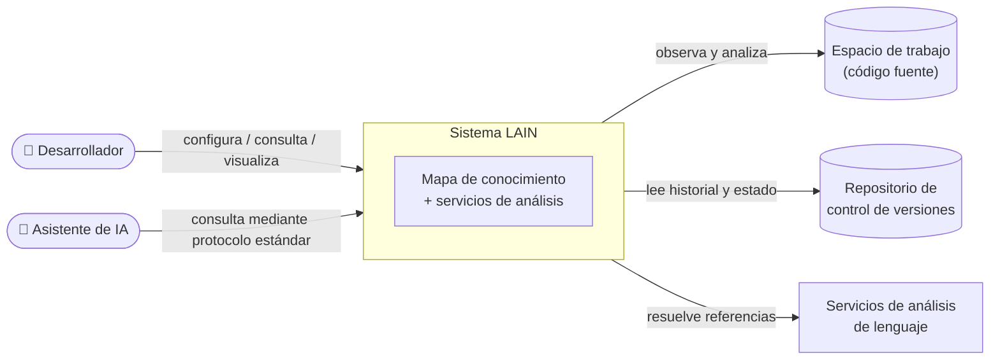

# Especificación de Requerimientos de Software (SRS)

## Sistema LAIN — Plataforma de Inteligencia de Código para Asistentes de Desarrollo

| Campo | Valor |
|---|---|
| **Proyecto** | LAIN — Plataforma de inteligencia de código |
| **Estándar aplicado** | IEEE 830-1998 |
| **Versión del documento** | 1.0 |
| **Fecha** | 06 de julio de 2026 |
| **Autores** | Sebastián Puentes |
| **Curso** | EMI307-1 — Especificación de Requerimientos, Módulo 03: Inteligencia Artificial aplicada a Ingeniería de Requerimientos |

### Control de versiones del documento

| Versión | Fecha | Autor | Descripción del cambio |
|---|---|---|---|
| 1.0 | 06-07-2026 | Sebastián Puentes | Versión final integrada según IEEE 830-1998. El historial detallado de elaboración queda registrado en el control de versiones del repositorio (`git log -- docs/srs/`). |

---

## 1. Introducción

### 1.1 Propósito del documento

El presente documento constituye la Especificación de Requerimientos de Software (SRS, por su sigla en inglés) del sistema **LAIN**, elaborada conforme a la estructura definida por el estándar IEEE 830-1998. Su propósito es describir de manera completa, consistente y verificable los requerimientos funcionales, los requerimientos no funcionales y las restricciones del sistema propuesto, de modo que sirva como base de acuerdo entre los stakeholders del proyecto y como insumo para las etapas posteriores de diseño, construcción y validación.

El documento está dirigido a los siguientes destinatarios:

- el equipo de desarrollo del proyecto, como referencia normativa de lo que el sistema debe hacer;
- el cuerpo docente del módulo de Ingeniería de Requerimientos, como evidencia del proceso de especificación;
- los stakeholders identificados durante la etapa de educción, como instrumento de validación de sus necesidades;
- futuros mantenedores y evaluadores del sistema, como línea base de comparación entre lo especificado y lo construido.

### 1.2 Alcance del producto

El producto a especificar se denomina **LAIN**. LAIN es un sistema de inteligencia de código que construye y mantiene un **mapa de conocimiento** del código fuente de un proyecto de software —los símbolos que lo componen y las relaciones entre ellos: qué llama a qué, qué depende de qué y qué archivos tienden a cambiar en conjunto— y que pone dicho mapa a disposición de asistentes de programación basados en Inteligencia Artificial y de los propios desarrolladores.

**El problema que aborda:** los asistentes de programación basados en IA razonan habitualmente sobre fragmentos aislados de código (el archivo abierto, el resultado de una búsqueda textual), sin visibilidad de la estructura global del proyecto. Esto los lleva a proponer cambios que rompen código en otras partes del sistema, a duplicar funcionalidad existente y a ignorar acoplamientos históricos entre archivos. El desarrollador, a su vez, carece de una herramienta que responda con evidencia preguntas como «si modifico esta función, ¿qué más se ve afectado?».

**Lo que el sistema hará:**

- construir automáticamente un mapa de conocimiento del código de un proyecto y mantenerlo actualizado mientras el desarrollador trabaja;
- responder consultas estructurales sobre dicho mapa: radio de impacto de un cambio, cadenas de llamadas, dependencias transitivas, puntos de entrada, componentes fundamentales y código sin uso;
- detectar acoplamientos ocultos entre archivos a partir del historial del repositorio de versiones;
- permitir la búsqueda de código por intención o significado, además de por nombre;
- entregar a los asistentes de IA contexto curado y optimizado sobre los símbolos del proyecto;
- ejecutar verificaciones del proyecto (compilación, pruebas, análisis estático) enriqueciendo las fallas con contexto arquitectónico;
- ofrecer visualizaciones gráficas de los análisis para el desarrollador.

**Lo que el sistema no hará:**

- no es un editor de código ni un entorno de desarrollo integrado;
- no genera ni modifica código fuente por sí mismo;
- no reemplaza al asistente de IA: lo complementa entregándole información estructural;
- no envía el código fuente del proyecto a servicios externos;
- no gestiona el ciclo de vida del repositorio (no realiza confirmaciones ni fusiones de cambios).

**Beneficios esperados:** reducción de defectos introducidos por cambios con efectos colaterales no previstos, disminución del tiempo de comprensión de código ajeno, mejores respuestas de los asistentes de IA al disponer de contexto estructural real, y apoyo objetivo a decisiones de refactorización.

### 1.3 Definiciones, acrónimos y abreviaturas

| Término | Definición |
|---|---|
| **SRS** | *Software Requirements Specification*; documento de especificación de requerimientos de software. |
| **Stakeholder** | Persona, grupo u organización con interés o influencia en el sistema. |
| **Asistente de IA / Agente de IA** | Programa basado en modelos de Inteligencia Artificial que asiste al desarrollador en tareas de programación y que puede invocar herramientas externas. |
| **Símbolo** | Unidad nombrada del código fuente: función, método, clase, interfaz, módulo, variable o constante. |
| **Mapa de conocimiento (del código)** | Representación en forma de grafo del código de un proyecto, donde los nodos son símbolos y archivos, y las aristas son relaciones entre ellos (llama a, define, contiene, importa, hereda de, co-cambia con). |
| **Radio de impacto** | Conjunto de símbolos que se verían afectados, directa o transitivamente, por la modificación de un símbolo dado. |
| **Cadena de llamadas** | Secuencia de invocaciones de funciones que conecta un símbolo de origen con uno de destino. |
| **Co-cambio** | Fenómeno por el cual dos archivos tienden a ser modificados en las mismas confirmaciones del repositorio, evidenciando un acoplamiento no necesariamente visible en el código. |
| **Acoplamiento oculto** | Dependencia entre archivos que no se manifiesta en relaciones explícitas del código, pero sí en su historial de co-cambio. |
| **Componente ancla** | Símbolo o módulo altamente estable y fundamental, del cual depende una parte significativa del sistema. |
| **Código muerto** | Símbolos alcanzables en el mapa que no registran llamadores ni usos. |
| **Punto de entrada** | Símbolo desde el cual inicia la ejecución del sistema analizado. |
| **Búsqueda semántica** | Búsqueda de código por intención o significado, en lugar de coincidencia textual exacta. |
| **Contexto para el agente** | Paquete de información curada sobre un símbolo (firma, documentación, relaciones) preparado para ser consumido por un asistente de IA. |
| **Frescura (del mapa)** | Grado de actualidad del mapa de conocimiento respecto del estado real del código y del repositorio. |
| **Espacio de trabajo** | Carpeta raíz del proyecto de software que el sistema analiza. |
| **RF / RNF** | Requerimiento funcional / Requerimiento no funcional. |
| **CU** | Caso de uso. |

### 1.4 Referencias

1. IEEE Std 830-1998, *IEEE Recommended Practice for Software Requirements Specifications*. IEEE, 1998.
2. Pauta «Entrega Final — Proyecto de Ingeniería de Requerimientos», curso EMI307-1 Especificación de Requerimientos, Módulo 03: Inteligencia Artificial aplicada a Ingeniería de Requerimientos, 2026.
3. Anexos A–F del presente documento (`docs/srs/anexos/`).

### 1.5 Visión general del documento

El resto del documento se organiza de la siguiente manera. La **Sección 2** entrega una descripción general del producto: su perspectiva dentro del entorno en que operará, sus funciones principales, las características de sus usuarios, las restricciones generales y los supuestos y dependencias considerados. La **Sección 3** contiene los requisitos específicos: requerimientos funcionales, requerimientos no funcionales y restricciones del sistema, redactados de forma verificable, junto con la matriz de trazabilidad que los vincula con los casos de uso, el proceso de negocio, las interfaces y el prototipo. Los **Anexos A–F** complementan la especificación con el diagrama de casos de uso, la especificación textual de los casos de uso, el modelado del proceso de negocio, el diseño preliminar de interfaces, el mini prototipo apoyado con IA y la declaración de uso de Inteligencia Artificial.

---

## 2. Descripción general del producto

### 2.1 Perspectiva del producto

LAIN es un sistema **intermediario** que se sitúa entre el entorno de trabajo del desarrollador y los asistentes de programación basados en IA. No opera de manera aislada: se ejecuta como un servicio en segundo plano en la máquina del desarrollador, observa el espacio de trabajo del proyecto y expone sus capacidades de análisis a los asistentes mediante un protocolo estándar de comunicación entre asistentes de IA y herramientas.

El sistema se relaciona con los siguientes elementos de su entorno:

- **Desarrollador:** configura el sistema, lo consulta directamente y revisa sus visualizaciones.
- **Asistente de IA:** consume las capacidades de análisis del sistema durante las sesiones de asistencia al desarrollador; es un usuario de tipo máquina.
- **Espacio de trabajo (código fuente):** carpeta del proyecto que el sistema observa y analiza en forma continua.
- **Repositorio de control de versiones:** fuente del historial de cambios utilizado para el análisis de co-cambio y del estado de ramas y diferencias.
- **Servicios de análisis de lenguaje:** componentes externos, propios de cada lenguaje de programación del código analizado, que el sistema utiliza para resolver con precisión referencias y definiciones de símbolos.

El siguiente diagrama de contexto resume la perspectiva del producto:

### 2.2 Funciones del producto

Las funciones del producto se agrupan en ocho áreas funcionales. El detalle verificable de cada una se encuentra en la Sección 3.1.

1. **Gestión del mapa de conocimiento:** inicialización del espacio de trabajo, construcción del mapa de símbolos y relaciones, actualización automática ante cambios en los archivos, sincronización con el repositorio e informes de frescura.
2. **Análisis de impacto de cambios:** cálculo del radio de impacto de un símbolo, trazado de cadenas de llamadas, identificación de llamadores y rastreo de dependencias transitivas, incluyendo llamadores a nivel de protocolo entre componentes que se ejecutan por separado.
3. **Comprensión de la arquitectura:** exploración de la estructura por niveles, identificación de puntos de entrada y componentes ancla, detección de código muerto, comparación de módulos, detección de candidatos a refactorización y explicación de símbolos en lenguaje comprensible.
4. **Análisis histórico de la evolución:** detección de acoplamientos ocultos por co-cambio y consulta del historial de confirmaciones, del estado de la rama de trabajo y de los cambios no confirmados.
5. **Búsqueda semántica:** localización de código por intención o significado expresado en lenguaje natural.
6. **Provisión de contexto a asistentes de IA:** construcción de paquetes de contexto curado sobre símbolos, entrega de fragmentos de código con su entorno y publicación del esquema del mapa para la inicialización de sesiones de los asistentes.
7. **Verificación asistida:** ejecución de la compilación, las pruebas y el análisis estático del proyecto, enriqueciendo las fallas con contexto arquitectónico; identificación de funciones sin pruebas, generación de plantillas de prueba y estimación estructural de cobertura.
8. **Consulta estructurada y visualización:** consulta del mapa mediante un lenguaje de consulta estructurado, respuesta a preguntas en lenguaje natural sobre el código y generación de visualizaciones interactivas de los análisis.

### 2.3 Características de los usuarios

| Usuario | Descripción | Nivel técnico | Frecuencia de uso |
|---|---|---|---|
| **Desarrollador de software** | Usuario principal humano. Instala y configura el sistema sobre su proyecto, formula consultas directas y revisa visualizaciones para tomar decisiones de diseño y refactorización. | Alto: domina programación y control de versiones. | Diaria, durante la jornada de desarrollo. |
| **Asistente de IA** | Usuario principal de tipo máquina. Invoca las capacidades del sistema durante las sesiones de asistencia para fundamentar sus respuestas y propuestas de cambio. | No aplica (programa); requiere que las capacidades estén descritas de forma auto-explicativa. | Continua, en cada sesión de asistencia. |
| **Líder técnico / arquitecto** | Usuario humano secundario. Utiliza los análisis de arquitectura, acoplamiento y deuda técnica para planificar el trabajo del equipo. | Alto. | Semanal u ocasional. |
| **Docente / evaluador** | Stakeholder no usuario. Evalúa la especificación y el proceso de ingeniería de requerimientos. | Medio-alto. | Puntual. |

**Stakeholders identificados en la etapa de educción:**

| Stakeholder | Rol | Interés / necesidad | Influencia |
|---|---|---|---|
| Sebastián Puentes | Desarrollador y propietario del producto (stakeholder principal; cumple además el rol de usuario «Desarrollador de software») | Necesidad de origen del proyecto: en el trabajo diario sobre una base de código de gran tamaño, obtener respuestas del asistente de IA exigía volcar volúmenes inmensos de código al contexto de la conversación, con alto costo en tokens y baja precisión. Requiere que el asistente pueda pedir exactamente la información estructural que necesita, en vez de recibir el código completo. | Alta: define alcance y prioridades. |
| Docente del curso EMI307-1 | Evaluador del proceso de Ingeniería de Requerimientos | Que la especificación sea coherente, trazable y conforme al estándar IEEE 830-1998 y a la pauta de la entrega. | Media: define los criterios de aceptación del documento. |
| Comunidad de desarrolladores usuarios de asistentes de IA | Usuarios potenciales del producto | Disponer de la herramienta y de su documentación para integrarla en sus propios proyectos. | Baja en esta etapa: sus necesidades se recogen indirectamente a través del stakeholder principal. |

La necesidad de origen del stakeholder principal —**reducir el consumo de tokens al entregar contexto al asistente**— se refleja en los requerimientos de provisión de contexto curado y acotado (RF-21, RF-22), en la consulta selectiva del mapa (RF-25) y en la observación de tamaño acotado del paquete de contexto registrada en CU-08.

### 2.4 Restricciones generales

- **RG-1. Ejecución local:** el sistema debe ejecutarse íntegramente en la máquina del desarrollador; el código fuente analizado no debe abandonar dicho entorno.
- **RG-2. Operación no intrusiva:** el sistema debe operar en segundo plano sin interrumpir el flujo de trabajo del desarrollador ni degradar perceptiblemente el rendimiento de su equipo.
- **RG-3. Interoperabilidad con asistentes:** la comunicación con los asistentes de IA debe realizarse mediante un protocolo estándar y abierto de comunicación entre asistentes y herramientas, de modo de no quedar ligado a un asistente en particular.
- **RG-4. Solo lectura sobre el código:** el sistema no debe modificar el código fuente del proyecto analizado; sus capacidades de escritura se limitan a sus propios datos internos.
- **RG-5. Independencia tecnológica de la especificación:** conforme a la pauta de la entrega, esta especificación no define lenguajes de programación, marcos de trabajo, bases de datos ni arquitecturas tecnológicas concretas para la implementación del sistema.

### 2.5 Supuestos y dependencias

**Supuestos:**

- S-1. El proyecto analizado se encuentra bajo un sistema de control de versiones; sin él, las funciones de análisis histórico operarán de forma degradada.
- S-2. El desarrollador utiliza al menos un asistente de IA compatible con el protocolo estándar de comunicación entre asistentes y herramientas.
- S-3. El equipo del desarrollador dispone de recursos suficientes (procesador, memoria y almacenamiento) para mantener el mapa de conocimiento del proyecto analizado.
- S-4. El código del proyecto está escrito en uno o más de los lenguajes de programación soportados por los servicios de análisis de lenguaje disponibles.

**Dependencias:**

- D-1. Disponibilidad de servicios de análisis de lenguaje para los lenguajes del proyecto; su ausencia reduce la precisión del mapa (el sistema debe degradarse a mecanismos de análisis propios de menor confianza).
- D-2. Acceso de lectura al historial del repositorio de versiones para el análisis de co-cambio.
- D-3. Disponibilidad opcional de un modelo local de representación semántica para la búsqueda por significado; sin él, dicha función queda deshabilitada sin afectar al resto del sistema.

---

## 3. Requisitos específicos

Convenciones de redacción: cada requerimiento posee un identificador único y estable (RF-nn, RNF-nn, RS-nn), se redacta con la forma «El sistema deberá…» y declara su prioridad según la escala **Esencial / Deseable / Opcional**. Todos los requerimientos son verificables mediante el criterio indicado.

### 3.1 Requerimientos funcionales

#### Grupo A — Gestión del mapa de conocimiento

**RF-01 — Inicializar el espacio de trabajo**
- **Descripción:** El sistema deberá permitir al desarrollador inicializar un espacio de trabajo indicando la carpeta raíz del proyecto, el modo de comunicación con los asistentes y las opciones de análisis, generando la configuración necesaria y el mapa de conocimiento inicial.
- **Entradas:** ruta del proyecto; opciones de configuración. **Salidas:** configuración persistida; mapa inicial construido; confirmación al usuario.
- **Prioridad:** Esencial. **Verificación:** tras la inicialización sobre un proyecto de ejemplo, el sistema responde consultas básicas sobre sus símbolos.

**RF-02 — Construir el mapa de conocimiento**
- **Descripción:** El sistema deberá extraer del código fuente los símbolos del proyecto (archivos, módulos, funciones, métodos, clases, interfaces, variables y constantes) y las relaciones entre ellos (contiene, define, llama a, importa, hereda de), y registrarlos en un mapa de conocimiento persistente con identidad estable de nodos entre ejecuciones.
- **Entradas:** código fuente del espacio de trabajo. **Salidas:** mapa de conocimiento persistido.
- **Prioridad:** Esencial. **Verificación:** para un proyecto de prueba con símbolos y relaciones conocidos, el mapa contiene los nodos y aristas esperados.

**RF-03 — Actualizar el mapa ante cambios en los archivos**
- **Descripción:** El sistema deberá detectar automáticamente la creación, modificación o eliminación de archivos del espacio de trabajo mientras el desarrollador trabaja, y reflejar dichos cambios en el mapa mediante una capa volátil que se consolida periódicamente sobre el mapa persistente.
- **Entradas:** eventos del sistema de archivos. **Salidas:** mapa actualizado.
- **Prioridad:** Esencial. **Verificación:** al modificar una función y consultar el mapa dentro del intervalo comprometido (RNF-02), la consulta refleja el cambio.

**RF-04 — Sincronizar el mapa con el repositorio**
- **Descripción:** El sistema deberá permitir forzar, bajo demanda, la re-sincronización del mapa con el estado actual del repositorio de versiones, consolidando la capa volátil en el mapa persistente.
- **Prioridad:** Esencial. **Verificación:** tras un cambio de rama y la sincronización, el mapa refleja el contenido de la nueva rama.

**RF-05 — Ejecutar enriquecimiento completo bajo demanda**
- **Descripción:** El sistema deberá permitir ejecutar, bajo demanda, una pasada completa de análisis y enriquecimiento del mapa (resolución de referencias, métricas de estabilidad, análisis histórico y representaciones semánticas).
- **Prioridad:** Deseable. **Verificación:** al finalizar la pasada, las métricas de los símbolos quedan pobladas y fechadas.

**RF-06 — Informar la frescura del mapa**
- **Descripción:** El sistema deberá informar, por módulo, cuándo fue la última sincronización de cada fuente de análisis (código y repositorio), permitiendo al usuario evaluar la vigencia del mapa.
- **Prioridad:** Deseable. **Verificación:** el informe de frescura muestra marcas de tiempo coherentes con las sincronizaciones realizadas.

#### Grupo B — Análisis de impacto de cambios

**RF-07 — Calcular el radio de impacto de un símbolo**
- **Descripción:** El sistema deberá calcular, para un símbolo indicado, el conjunto de símbolos afectados directa y transitivamente por su eventual modificación (efecto dominó), indicando la profundidad y el grado de confianza de cada relación.
- **Entradas:** nombre o identificador del símbolo; profundidad máxima opcional. **Salidas:** lista jerarquizada de símbolos afectados.
- **Prioridad:** Esencial. **Verificación:** en un proyecto de prueba con dependencias conocidas, el resultado incluye todos los afectados esperados y ninguno ajeno.

**RF-08 — Trazar la cadena de llamadas entre dos símbolos**
- **Descripción:** El sistema deberá encontrar y presentar la ruta exacta de invocaciones de funciones que conecta un símbolo de origen con uno de destino, cuando dicha ruta exista.
- **Prioridad:** Esencial. **Verificación:** para pares origen-destino conocidos, la cadena reportada coincide con la real; para pares no conectados, el sistema lo informa explícitamente.

**RF-09 — Identificar los llamadores de un símbolo**
- **Descripción:** El sistema deberá listar todos los sitios del código que invocan a un símbolo dado, con su ubicación (archivo y posición).
- **Prioridad:** Esencial. **Verificación:** la lista coincide con las invocaciones reales presentes en un proyecto de prueba.

**RF-10 — Rastrear dependencias transitivas**
- **Descripción:** El sistema deberá encontrar, en forma recursiva, todo aquello de lo que depende un símbolo dado (símbolos, módulos y archivos), presentándolo de manera jerárquica.
- **Prioridad:** Esencial. **Verificación:** el rastreo sobre un símbolo de prueba retorna el cierre transitivo esperado.

**RF-11 — Identificar llamadores a nivel de protocolo**
- **Descripción:** El sistema deberá identificar los llamadores de un símbolo a través de fronteras de ejecución, tales como rutas de servicios web, servicios de invocación remota o resolutores de consultas, cuando el proyecto exponga interfaces de ese tipo.
- **Prioridad:** Deseable. **Verificación:** para un servicio de prueba con rutas declaradas, el sistema vincula la ruta con la función que la atiende.

#### Grupo C — Comprensión de la arquitectura

**RF-12 — Explorar la estructura del proyecto por niveles**
- **Descripción:** El sistema deberá presentar la estructura de archivos y módulos del proyecto en forma de árbol hasta una profundidad indicada, y permitir obtener «cortes» de la arquitectura a una distancia dada desde los puntos de entrada.
- **Prioridad:** Esencial. **Verificación:** el árbol coincide con la estructura real del proyecto de prueba a la profundidad solicitada.

**RF-13 — Identificar los puntos de entrada**
- **Descripción:** El sistema deberá identificar los puntos de entrada del sistema analizado, es decir, los símbolos desde los cuales inicia su ejecución.
- **Prioridad:** Esencial. **Verificación:** en proyectos de prueba, los puntos de entrada reportados corresponden a los reales.

**RF-14 — Identificar componentes ancla y su estabilidad**
- **Descripción:** El sistema deberá identificar los componentes más fundamentales y estables del proyecto, calcular un puntaje de estabilidad arquitectónica para cualquier símbolo, determinar el ancla que gobierna a una función dada y calcular la distancia de un símbolo respecto del punto de entrada.
- **Prioridad:** Deseable. **Verificación:** los puntajes son reproducibles y ordenan a los símbolos de forma consistente con sus dependencias.

**RF-15 — Detectar código sin uso**
- **Descripción:** El sistema deberá identificar los símbolos que no registran llamadores ni usos en el mapa, reportándolos como candidatos a código muerto, junto con la advertencia de posibles falsos positivos (por ejemplo, puntos de entrada o usos externos).
- **Prioridad:** Deseable. **Verificación:** en un proyecto de prueba con funciones deliberadamente sin uso, estas aparecen en el reporte.

**RF-16 — Detectar candidatos a refactorización y observaciones arquitectónicas**
- **Descripción:** El sistema deberá analizar el proyecto para detectar patrones arquitectónicos, acoplamientos que cruzan fronteras de módulos, módulos con dependencias excesivas y componentes con alta deuda técnica, y deberá permitir comparar métricas de estabilidad y acoplamiento entre dos módulos.
- **Prioridad:** Deseable. **Verificación:** las observaciones reportadas referencian módulos y métricas existentes en el mapa.

**RF-17 — Explicar un símbolo**
- **Descripción:** El sistema deberá producir, para un símbolo dado, un resumen comprensible que combine su firma, su documentación y sus métricas arquitectónicas.
- **Prioridad:** Deseable. **Verificación:** el resumen contiene firma, documentación (si existe) y métricas del símbolo consultado.

#### Grupo D — Análisis histórico de la evolución

**RF-18 — Detectar acoplamiento oculto por co-cambio**
- **Descripción:** El sistema deberá analizar el historial del repositorio para identificar pares de archivos que tienden a cambiar en las mismas confirmaciones, calcular su grado de acoplamiento histórico y reportar los acoplamientos ocultos relevantes para un símbolo o archivo dado.
- **Prioridad:** Esencial. **Verificación:** en un repositorio de prueba con co-cambios inducidos, los pares esperados aparecen con puntaje mayor que los pares no relacionados.

**RF-19 — Consultar historial y estado del repositorio**
- **Descripción:** El sistema deberá permitir consultar el historial reciente de confirmaciones (autor y mensaje), el estado de la rama de trabajo actual y los cambios aún no confirmados del espacio de trabajo.
- **Prioridad:** Deseable. **Verificación:** las respuestas coinciden con el estado real del repositorio de prueba.

#### Grupo E — Búsqueda semántica

**RF-20 — Buscar código por intención o significado**
- **Descripción:** El sistema deberá permitir localizar símbolos del proyecto a partir de una consulta en lenguaje natural que exprese una intención (por ejemplo, «¿dónde se maneja la autenticación?»), utilizando representaciones semánticas calculadas localmente, y retornar los resultados ordenados por afinidad.
- **Prioridad:** Deseable. **Verificación:** para consultas de prueba sobre un proyecto conocido, los símbolos pertinentes aparecen entre los primeros resultados.

#### Grupo F — Provisión de contexto a asistentes de IA

**RF-21 — Construir contexto optimizado sobre un símbolo**
- **Descripción:** El sistema deberá construir, para un símbolo dado, un paquete de contexto apto para ser consumido por un asistente de IA, que incluya su firma, su documentación y sus relaciones relevantes, y deberá permitir obtener el fragmento de código de un archivo con las líneas circundantes a una posición dada.
- **Prioridad:** Esencial. **Verificación:** el paquete contiene los elementos declarados y el fragmento corresponde a la posición solicitada.

**RF-22 — Publicar el esquema del mapa**
- **Descripción:** El sistema deberá exponer el esquema de su mapa de conocimiento (tipos de nodos, tipos de relaciones y ejemplos de consulta) para que los asistentes de IA inicialicen sus sesiones conociendo las capacidades disponibles.
- **Prioridad:** Esencial. **Verificación:** el esquema publicado enumera todos los tipos de nodos y relaciones vigentes.

#### Grupo G — Verificación asistida

**RF-23 — Ejecutar verificaciones con contexto arquitectónico**
- **Descripción:** El sistema deberá permitir ejecutar la compilación del proyecto, sus pruebas (con filtro opcional) y su análisis estático, retornando el resultado y, ante fallas, decorándolas con contexto arquitectónico (por ejemplo, los llamadores del símbolo que falla) para facilitar el diagnóstico.
- **Prioridad:** Deseable. **Verificación:** ante una falla inducida, el reporte incluye la falla y el contexto de sus llamadores.

**RF-24 — Apoyar la cobertura de pruebas**
- **Descripción:** El sistema deberá identificar funciones que probablemente carecen de pruebas a partir del análisis del grafo de llamadas, generar plantillas de prueba para una función o tipo dado y entregar una estimación estructural del nivel de cobertura del proyecto.
- **Prioridad:** Opcional. **Verificación:** las funciones sin pruebas inducidas en un proyecto de prueba aparecen en el reporte; la plantilla generada referencia a la función solicitada.

#### Grupo H — Consulta estructurada y visualización

**RF-25 — Consultar el mapa mediante lenguaje estructurado**
- **Descripción:** El sistema deberá ofrecer un lenguaje de consulta estructurado que permita localizar nodos por tipo, nombre, etiqueta o ruta, recorrer relaciones, filtrar, ordenar y limitar resultados, y componer operaciones, tanto para el desarrollador como para los asistentes.
- **Prioridad:** Esencial. **Verificación:** un conjunto de consultas de referencia produce los resultados esperados sobre el proyecto de prueba.

**RF-26 — Responder preguntas en lenguaje natural sobre el código**
- **Descripción:** El sistema deberá permitir al desarrollador formular preguntas en lenguaje natural sobre el proyecto y responderlas apoyándose en el mapa de conocimiento y sus capacidades de análisis.
- **Prioridad:** Opcional. **Verificación:** para preguntas de referencia, la respuesta cita símbolos y relaciones existentes en el mapa.

**RF-27 — Generar visualizaciones interactivas de los análisis**
- **Descripción:** El sistema deberá generar visualizaciones gráficas interactivas de, al menos, el radio de impacto de un símbolo, la cadena de llamadas entre dos símbolos y el mapa de calor de acoplamiento histórico, además de una consola de estado y consultas.
- **Prioridad:** Deseable. **Verificación:** cada visualización se genera a partir de datos reales del mapa y es navegable por el usuario.

### 3.2 Requerimientos no funcionales

**RNF-01 — Rendimiento de consulta.** Las consultas de lectura sobre el mapa (RF-07 a RF-22, RF-25) deberán responder en menos de 2 segundos en el percentil 90, medido sobre un proyecto de referencia de tamaño mediano (≈ 100.000 líneas de código). *Prioridad: Esencial. Verificación: medición instrumentada sobre el proyecto de referencia.*

**RNF-02 — Frescura del mapa.** Los cambios guardados en archivos del espacio de trabajo deberán reflejarse en las consultas en un plazo máximo de 60 segundos, sin intervención del usuario. *Prioridad: Esencial. Verificación: prueba de modificación y consulta cronometrada.*

**RNF-03 — Persistencia entre sesiones.** El mapa de conocimiento deberá persistir entre reinicios del sistema y de la máquina, de modo que no sea necesario reconstruirlo íntegramente en cada sesión; los identificadores de los nodos deberán ser estables entre ejecuciones. *Prioridad: Esencial. Verificación: reinicio del servicio y comparación de identificadores y contenidos.*

**RNF-04 — Privacidad y confidencialidad.** Todo el análisis, incluida la búsqueda semántica, deberá ejecutarse localmente; el sistema no deberá transmitir código fuente ni derivados de este a servicios externos. *Prioridad: Esencial. Verificación: inspección de tráfico de red durante la operación.*

**RNF-05 — Portabilidad multi-lenguaje.** El sistema deberá ser capaz de analizar proyectos escritos en, al menos, diez lenguajes de programación de uso general, y deberá poder incorporarse soporte para nuevos lenguajes sin rediseñar el sistema. *Prioridad: Deseable. Verificación: análisis exitoso de proyectos de prueba en los lenguajes declarados.*

**RNF-06 — Usabilidad de la instalación.** Un desarrollador sin conocimiento previo del sistema deberá poder instalarlo y dejarlo operativo sobre su proyecto en menos de 10 minutos, mediante un proceso guiado que detecte su asistente de IA y configure la integración. *Prioridad: Deseable. Verificación: prueba de usabilidad cronometrada con usuarios representativos.*

**RNF-07 — Confiabilidad y degradación elegante.** Ante la ausencia o falla de dependencias externas (servicios de análisis de lenguaje, repositorio de versiones, modelo semántico), el sistema deberá continuar operando con las capacidades restantes, informando la degradación en lugar de fallar. *Prioridad: Esencial. Verificación: pruebas con dependencias deshabilitadas.*

**RNF-08 — Escalabilidad.** El sistema deberá mantener los compromisos de RNF-01 y RNF-02 en proyectos de hasta 1.000.000 de líneas de código, admitiendo tiempos de construcción inicial del mapa proporcionalmente mayores. *Prioridad: Deseable. Verificación: medición sobre un proyecto de gran tamaño.*

**RNF-09 — Interoperabilidad.** El sistema deberá poder integrarse con, al menos, cuatro asistentes de IA distintos que soporten el protocolo estándar de comunicación entre asistentes y herramientas, sin cambios en su núcleo. *Prioridad: Esencial. Verificación: integración demostrada con los asistentes declarados.*

**RNF-10 — Consumo de recursos.** En operación de fondo (sin consultas activas), el sistema no deberá utilizar más del 10 % de un núcleo de procesamiento en promedio ni degradar perceptiblemente la capacidad de respuesta del equipo del desarrollador. *Prioridad: Deseable. Verificación: monitoreo de recursos durante una jornada de trabajo simulada.*

### 3.3 Restricciones del sistema

**RS-01 — Ejecución local obligatoria.** El sistema deberá ejecutarse en la máquina del desarrollador; no se admite una arquitectura que requiera enviar el código a servidores de terceros. (Origen: RG-1, RNF-04.)

**RS-02 — Protocolo estándar de integración.** La integración con los asistentes de IA deberá realizarse exclusivamente a través de un protocolo estándar y abierto de comunicación entre asistentes y herramientas, en sus modalidades de comunicación local y de servicio de red local. (Origen: RG-3, RNF-09.)

**RS-03 — Dependencia del control de versiones.** Las funciones de análisis histórico (RF-18, RF-19) requieren que el proyecto esté bajo un sistema de control de versiones; en su ausencia, dichas funciones quedan deshabilitadas y el resto del sistema debe operar con normalidad. (Origen: S-1, D-2.)

**RS-04 — No modificación del código analizado.** El sistema no deberá crear, modificar ni eliminar archivos del proyecto analizado, con la única excepción de su propia carpeta de datos internos dentro del espacio de trabajo. (Origen: RG-4.)

**RS-05 — Independencia tecnológica de esta especificación.** En conformidad con la pauta de la entrega, esta especificación no prescribe lenguajes de programación, marcos de trabajo, motores de base de datos ni arquitecturas tecnológicas concretas; tales decisiones corresponden a la etapa de diseño.

### 3.4 Matriz de trazabilidad

La matriz vincula los requerimientos funcionales con los casos de uso (Anexos A y B), el proceso de negocio (Anexo C), las pantallas (Anexo D) y el mini prototipo (Anexo E).

| RF | Caso(s) de uso | Proceso de negocio | Pantalla(s) | Prototipo |
|---|---|---|---|---|
| RF-01 | CU-01 | — | P-01 | — |
| RF-02 | CU-01, CU-09 | PN-01 (act. 4) | P-01 | — |
| RF-03 | CU-09 | PN-01 (act. 4) | P-02 | ✔ |
| RF-04 | CU-09 | PN-01 (act. 4) | P-02 | ✔ |
| RF-05 | CU-09 | — | P-02 | ✔ |
| RF-06 | CU-09 | — | P-02 | ✔ |
| RF-07 | CU-02 | PN-01 (act. 5) | P-03 | ✔ |
| RF-08 | CU-03 | PN-01 (act. 6) | P-04 | ✔ |
| RF-09 | CU-02, CU-03 | PN-01 (act. 5) | P-03, P-04 | ✔ |
| RF-10 | CU-02 | PN-01 (act. 5) | P-03 | — |
| RF-11 | CU-02 | — | P-03 | — |
| RF-12 | CU-05 | — | P-02 | ✔ |
| RF-13 | CU-05 | — | P-02 | ✔ |
| RF-14 | CU-05 | — | P-02 | — |
| RF-15 | CU-05 | — | P-02 | — |
| RF-16 | CU-05, CU-07 | — | P-02, P-05 | — |
| RF-17 | CU-05, CU-08 | — | P-02 | — |
| RF-18 | CU-07 | PN-01 (act. 5) | P-05 | ✔ |
| RF-19 | CU-07 | — | P-02 | — |
| RF-20 | CU-04 | — | P-02 | ✔ |
| RF-21 | CU-08 | PN-01 (act. 7) | — | — |
| RF-22 | CU-08 | — | P-02 | ✔ |
| RF-23 | CU-06 | PN-01 (act. 9) | P-02 | — |
| RF-24 | CU-06 | — | P-02 | — |
| RF-25 | CU-10 | — | P-02 | ✔ |
| RF-26 | CU-10 | — | P-02 | — |
| RF-27 | CU-02, CU-03, CU-07 | PN-01 (act. 6) | P-03, P-04, P-05 | ✔ |

---

## Anexos

- **Anexo A.** Diagrama de casos de uso — `anexos/A-diagrama-casos-de-uso.md`
- **Anexo B.** Especificación de casos de uso — `anexos/B-especificacion-casos-de-uso.md`
- **Anexo C.** Modelado de procesos de negocio — `anexos/C-proceso-de-negocio.md`
- **Anexo D.** Diseño de interfaces gráficas — `anexos/D-interfaces.md`
- **Anexo E.** Mini prototipo apoyado con IA — `anexos/E-prototipo-ia.md`
- **Anexo F.** Declaración de uso de Inteligencia Artificial — `anexos/F-declaracion-uso-ia.md`
