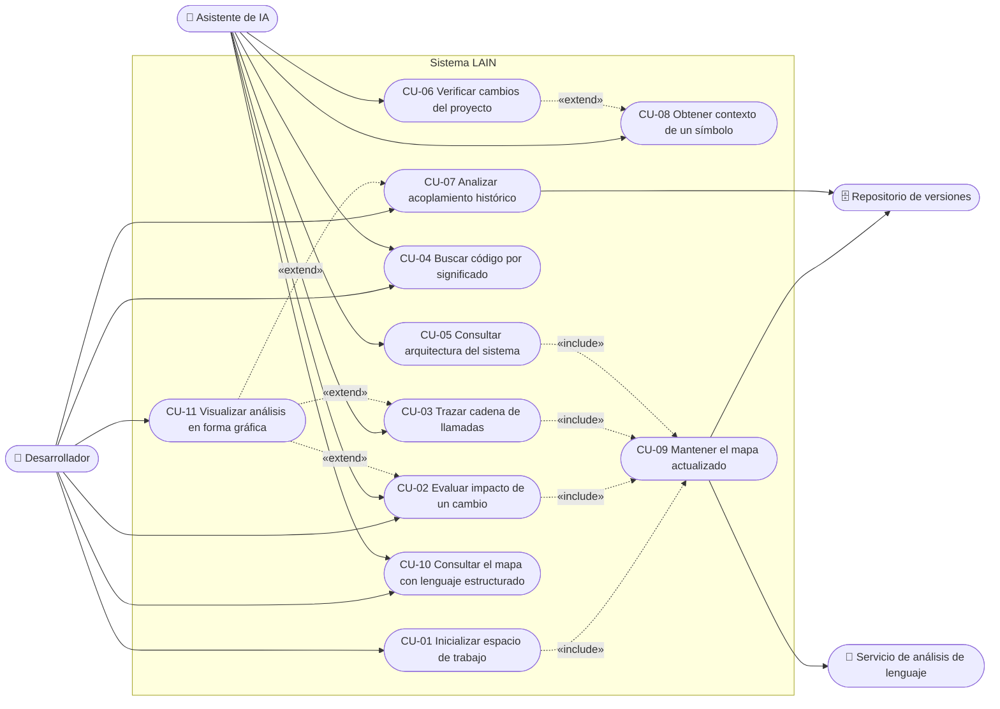

# Anexo A — Diagrama de casos de uso

Este anexo presenta el diagrama de casos de uso del sistema LAIN. Es coherente con los requerimientos funcionales de la Sección 3.1 del SRS; la correspondencia exacta se encuentra en la matriz de trazabilidad (SRS, Sección 3.4) y en la especificación textual del Anexo B.

## A.1 Actores

| Actor | Tipo | Descripción |
|---|---|---|
| **Desarrollador** | Principal (humano) | Configura el sistema, formula consultas directas, revisa visualizaciones y toma decisiones sobre el código. |
| **Asistente de IA** | Principal (sistema) | Programa de asistencia a la programación que consume las capacidades del sistema durante sus sesiones de trabajo. |
| **Repositorio de versiones** | Secundario (sistema) | Provee el historial de confirmaciones y el estado de la rama para los análisis históricos y la sincronización. |
| **Servicio de análisis de lenguaje** | Secundario (sistema) | Resuelve referencias y definiciones de símbolos con precisión para el lenguaje del proyecto. |

## A.2 Diagrama

El límite del sistema está representado por el recuadro «Sistema LAIN». Las relaciones «include» indican comportamiento obligatorio incorporado; las relaciones «extend» indican comportamiento opcional que amplía un caso base.

## A.3 Lectura del diagrama

- El **Desarrollador** y el **Asistente de IA** son actores principales: ambos inician casos de uso. Varios casos son compartidos (CU-02, CU-04, CU-10), reflejando que el sistema atiende consultas tanto humanas como de máquina por los mismos servicios.
- **CU-09 «Mantener el mapa actualizado»** es un caso incluido por los casos de consulta: antes de responder, el sistema garantiza que el mapa esté razonablemente fresco (RF-03, RF-04). También se dispara de forma autónoma ante cambios en los archivos, interactuando con los actores secundarios.
- **CU-11 «Visualizar análisis en forma gráfica»** extiende los casos de análisis: cuando el Desarrollador lo solicita, el resultado se presenta además como visualización interactiva (RF-27).
- **CU-06 «Verificar cambios del proyecto»** puede extenderse con **CU-08**: ante una falla, el sistema adjunta contexto arquitectónico del símbolo que falla (RF-23 + RF-21).
- Los actores secundarios (**Repositorio de versiones** y **Servicio de análisis de lenguaje**) no inician casos de uso: son consultados por el sistema para cumplirlos.
