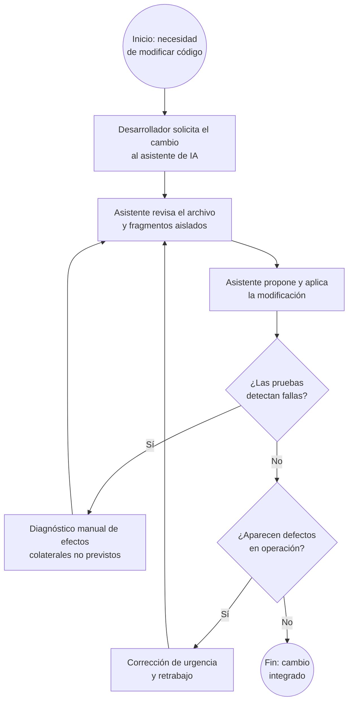
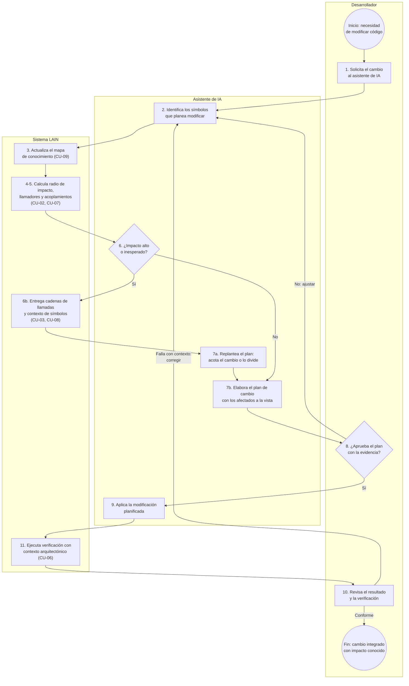

# Anexo C — Modelado de procesos de negocio

## C.1 Proceso modelado

**PN-01 — Evaluación de impacto antes de modificar código.**

Se modela el proceso de negocio central del dominio: cómo un equipo de desarrollo decide y ejecuta una modificación sobre un código existente. Es el proceso donde hoy se concentra el problema (cambios con efectos colaterales no previstos) y donde el sistema propuesto aporta su mayor valor, por lo que se presenta en dos variantes: la situación **actual** (sin el sistema) y la situación **propuesta** (con el sistema).

**Participantes / responsables:**

| Participante | Rol en el proceso |
|---|---|
| **Desarrollador** | Solicita el cambio, revisa la evidencia y decide cómo proceder. Responsable del resultado. |
| **Asistente de IA** | Planifica y redacta la modificación; en la variante propuesta, consulta al sistema antes de actuar. |
| **Sistema LAIN** | Provee el radio de impacto, el contexto de los símbolos y la verificación decorada (solo variante propuesta). |

## C.2 Situación actual (sin el sistema)

En la práctica actual, el asistente de IA propone el cambio viendo solo el archivo abierto o resultados de búsqueda textual. Los efectos colaterales se descubren tarde, al ejecutar las pruebas o, peor, en operación.

**Problema evidenciado:** los ciclos de retrabajo (F y H) se originan en que la decisión de modificar se toma **sin conocer el impacto**. Ese es el punto de intervención del sistema propuesto.

## C.3 Situación propuesta (con el sistema LAIN)

## C.4 Elementos del proceso

| Elemento | Descripción |
|---|---|
| **Evento de inicio** | Surge la necesidad de modificar código existente (nueva funcionalidad, corrección o refactorización). |
| **Actividades principales** | (1) solicitud del cambio; (2) identificación de símbolos objetivo; (3–4) actualización del mapa y cálculo del radio de impacto; (5) análisis de acoplamientos históricos; (6) evaluación del impacto; (7) elaboración o replanteo del plan; (9) aplicación del cambio; (11) verificación decorada. |
| **Decisiones / condiciones** | «¿Impacto alto o inesperado?» (paso 6): determina si el plan se replantea con análisis adicionales. «¿Aprueba el plan?» (paso 8): el Desarrollador conserva la decisión final. «¿Verificación conforme?» (paso 10). |
| **Flujos alternativos** | Impacto alto → análisis profundo (cadenas de llamadas, contexto) y replanteo; plan rechazado → nueva identificación de símbolos; verificación fallida → corrección informada por el contexto de la falla. |
| **Evento de término** | El cambio queda integrado con su impacto conocido y verificado. |

## C.5 Explicación del proceso y apoyo del sistema

El proceso propuesto introduce una **compuerta de evidencia** entre la intención de cambio y su ejecución. Antes de modificar, el asistente consulta al sistema (actividades 3–5): el mapa se actualiza para garantizar frescura y se calculan el radio de impacto y los acoplamientos históricos del símbolo objetivo. La decisión del paso 6 se toma con datos: si el conjunto de afectados es amplio o incluye componentes ancla, el plan se replantea con análisis más profundos; si es acotado, se procede. El Desarrollador aprueba el plan viendo la misma evidencia (paso 8), preservando la responsabilidad humana sobre el cambio. Tras aplicar la modificación, la verificación del paso 11 no solo informa si algo falla, sino **quiénes llaman** a lo que falla, cerrando el ciclo con un diagnóstico dirigido en lugar del retrabajo a ciegas de la situación actual.

## C.6 Relación con los requerimientos funcionales

| Actividad del proceso | Caso de uso | RF asociados |
|---|---|---|
| 3. Actualizar el mapa | CU-09 | RF-02, RF-03, RF-04 |
| 4. Calcular radio de impacto y llamadores | CU-02 | RF-07, RF-09, RF-10, RF-11 |
| 5. Analizar acoplamientos históricos | CU-07 | RF-18 |
| 6b. Análisis profundo (cadenas, contexto) | CU-03, CU-08 | RF-08, RF-21 |
| 6/8. Presentar evidencia al Desarrollador | CU-11 | RF-27 |
| 11. Verificación con contexto | CU-06 | RF-23 |

El proceso es coherente con el diagrama de casos de uso (Anexo A) y con la descripción general del producto (SRS, Sección 2): el sistema no ejecuta el cambio ni decide por el equipo; **informa la decisión** en el punto del proceso donde hoy se genera el retrabajo.
