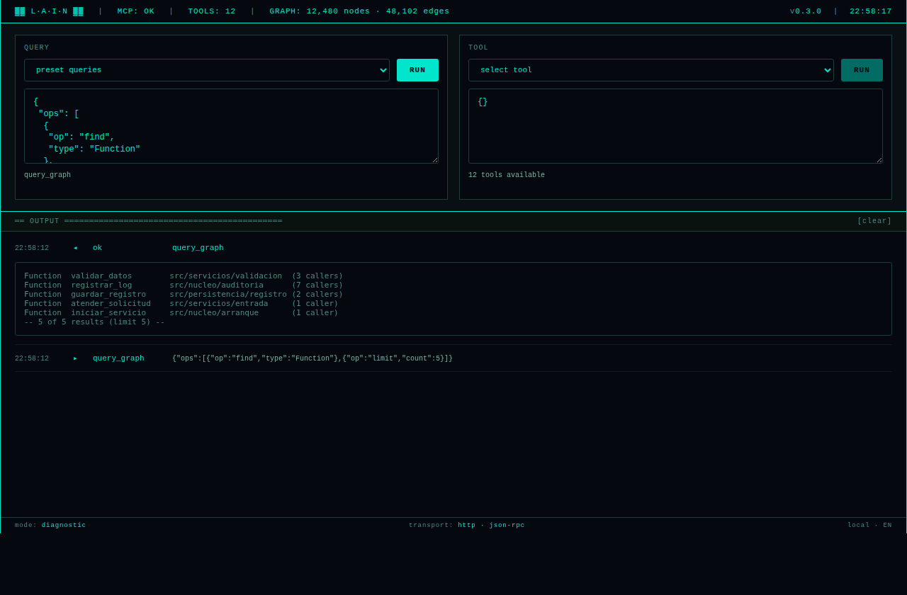
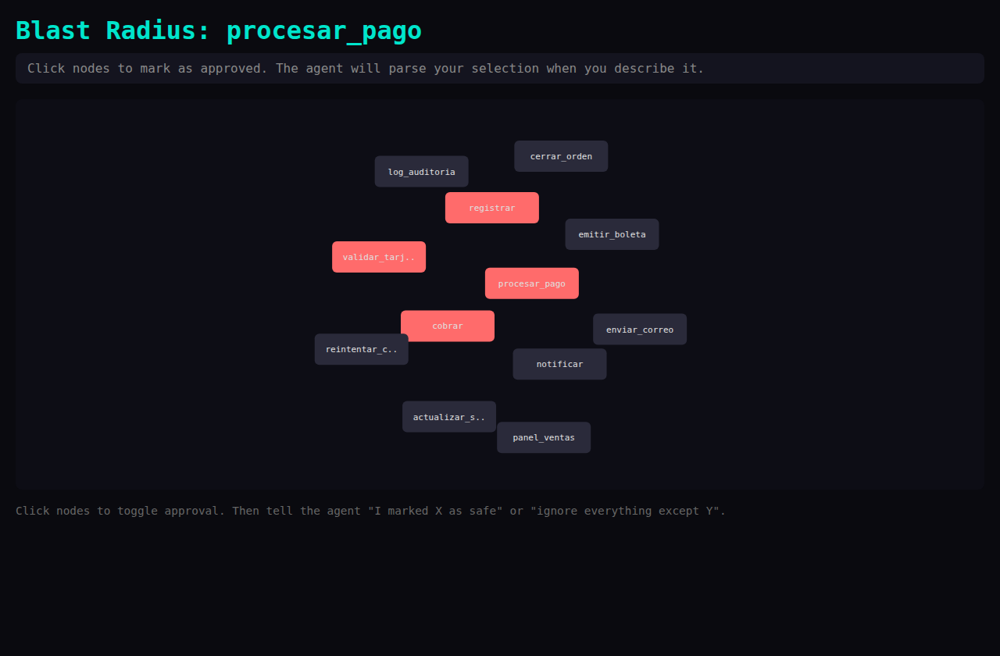
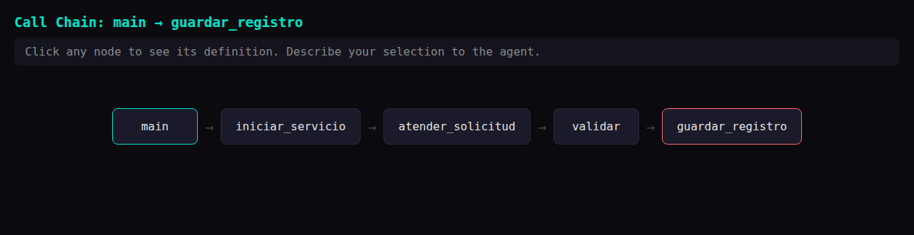
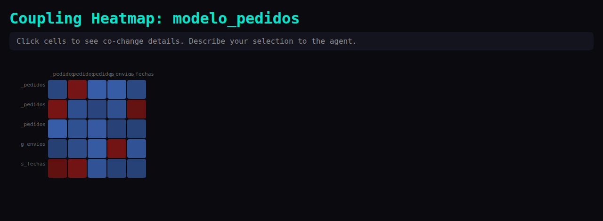

# Anexo E — Mini prototipo apoyado con IA

## E.1 Objetivo del prototipo

El prototipo tiene por objetivo **explorar y validar de manera temprana** la interacción del Desarrollador con los análisis del sistema, en particular: (a) la consola de consultas y estado del mapa, y (b) las visualizaciones de radio de impacto, cadena de llamadas y acoplamiento histórico. Busca responder preguntas de requerimientos —¿es comprensible el radio de impacto presentado como grafo por niveles?, ¿qué acciones necesita el usuario junto a cada resultado?— antes de comprometer decisiones de diseño definitivas.

El prototipo **no es una implementación definitiva** del sistema: es un apoyo visual y exploratorio para comprender mejor los requerimientos y las posibles interacciones del usuario con la solución.

## E.2 Herramienta de IA utilizada

- **Herramienta:** Claude Code (Anthropic), asistente de programación basado en IA. Fue la única herramienta de IA utilizada en la construcción del prototipo y de la entrega.
- **Modalidad de uso:** generación asistida de páginas web interactivas y autónomas (sin dependencias externas) a partir de descripciones en lenguaje natural de cada vista, iterando sobre la propuesta generada.

## E.3 Funcionalidad y flujo representado

El prototipo consiste en cuatro vistas web interactivas que representan las pantallas P-02 a P-05 del Anexo D:

1. **Consola de consultas** («Query Console»): editor de consultas estructuradas con botón de ejecución, panel de resultados y panel de estado del servicio; representa el flujo de CU-10 y el monitoreo de CU-09.
2. **Radio de impacto** («Blast Radius»): grafo interactivo con el símbolo consultado al centro y los símbolos afectados dispuestos por profundidad; representa el resultado de CU-02.
3. **Cadena de llamadas** («Call Chain»): visualización de la ruta de invocaciones entre un símbolo de origen y uno de destino; representa el resultado de CU-03.
4. **Mapa de calor de acoplamiento** («Coupling Heatmap»): listado de archivos co-cambiantes con la intensidad de su acoplamiento histórico; representa el resultado de CU-07.

**Flujo representado (extremo a extremo):** el usuario formula una consulta o solicita un análisis en la consola → el sistema responde con datos del mapa → el usuario abre la visualización correspondiente y navega el resultado (selección de nodos, profundidad, leyendas de confianza). Es el mismo flujo «consultar → evidenciar → decidir» del proceso PN-01 (Anexo C).

## E.4 Evidencia visual

Las capturas siguientes corresponden a las vistas reales del prototipo, ejecutadas con datos de ejemplo (los mismos símbolos ilustrativos usados en los wireframes del Anexo D, para facilitar la comparación wireframe → prototipo).

**Figura E-1 — Consola de consultas (pantalla P-02).** Estado del servicio y del mapa en la barra superior, editor de consulta estructurada, selector de herramientas de análisis y bitácora de resultados:

**Figura E-2 — Radio de impacto (pantalla P-03).** El símbolo consultado (`procesar_pago`) y sus afectados; en color destacado los afectados directos, en color neutro los transitivos:

**Figura E-3 — Cadena de llamadas (pantalla P-04).** Ruta de invocaciones entre `main` (origen, borde verde) y `guardar_registro` (destino, borde rojo):

**Figura E-4 — Mapa de calor de acoplamiento (pantalla P-05).** Intensidad de co-cambio histórico entre `modelo_pedidos` y los archivos relacionados (celdas más intensas = co-cambio más frecuente):

| Captura | Vista | Pantalla del Anexo D |
|---|---|---|
| Figura E-1 | Consola de consultas | P-02 |
| Figura E-2 | Radio de impacto | P-03 |
| Figura E-3 | Cadena de llamadas | P-04 |
| Figura E-4 | Mapa de calor de acoplamiento | P-05 |

## E.5 Relación con casos de uso y requerimientos

| Vista del prototipo | Caso(s) de uso | RF asociados |
|---|---|---|
| Consola de consultas | CU-10, CU-09, CU-05, CU-04, CU-08 (esquema) | RF-25, RF-03 a RF-06, RF-12, RF-13, RF-20, RF-22 |
| Radio de impacto | CU-02, CU-11 | RF-07, RF-09, RF-27 |
| Cadena de llamadas | CU-03, CU-11 | RF-08, RF-27 |
| Mapa de calor de acoplamiento | CU-07, CU-11 | RF-18, RF-27 |

## E.6 Elementos generados, sugeridos o apoyados por IA

- **Generados por IA:** la estructura de las páginas web, el código de presentación de los grafos y tablas, la disposición inicial de paneles de la consola y los estados visuales (activo/error/vacío).
- **Sugeridos por IA:** la organización del radio de impacto en anillos por profundidad; la distinción visual entre relaciones de confianza alta y media; la inclusión de un panel de estado del servicio junto a la consola.
- **Apoyados por IA:** la redacción de los textos de advertencia (por ejemplo, correlación vs. causalidad en el acoplamiento) y de los estados vacíos.

## E.7 Ajustes realizados por el autor

Sobre la propuesta generada por la IA, el autor realizó los siguientes ajustes:

- **Selección de vistas:** de las visualizaciones exploradas durante el desarrollo se decidió conservar cuatro (consola de consultas, radio de impacto, cadena de llamadas y mapa de calor de acoplamiento), por ser las que mejor representan los casos de uso principales; otras vistas intermedias fueron descartadas.
- **Datos de ejemplo trazables:** para la evidencia visual se fijaron datos de ejemplo idénticos a los de los wireframes del Anexo D (`procesar_pago`, `main → guardar_registro`, `modelo_pedidos`), de modo que la correspondencia wireframe → prototipo sea verificable a simple vista; la propuesta original usaba datos genéricos.
- **Encuadre de la evidencia:** se ajustó el encuadre de las capturas (Figuras E-3 y E-4) para eliminar espacio vacío y mejorar la legibilidad en el documento.
- **Idioma:** se decidió mantener el prototipo en inglés (idioma de la propuesta generada) y documentarlo en español, registrando la diferencia como limitación consciente en E.8 en lugar de retraducir un artefacto exploratorio.

## E.8 Limitaciones del prototipo

- Las vistas operan con **datos de ejemplo o resultados puntuales**; no constituyen la interfaz definitiva ni cubren todos los flujos alternativos especificados en el Anexo B.
- No implementa la pantalla P-01 (configuración inicial) ni la interacción del actor Asistente de IA, que ocurre por protocolo y no por interfaz gráfica.
- No valida requerimientos no funcionales (rendimiento, escalabilidad, consumo de recursos); solo aspectos de comprensión e interacción.
- Las vistas están redactadas en inglés, mientras la especificación está en español; la traducción del prototipo se difirió por tratarse de un artefacto exploratorio (decisión registrada en E.7).
- La accesibilidad y la adaptación a distintos tamaños de pantalla no fueron objetivos de esta exploración.
- Al ser generado con apoyo de IA, el código del prototipo no sigue estándares de calidad de producción y **no debe reutilizarse como base de la implementación**.
